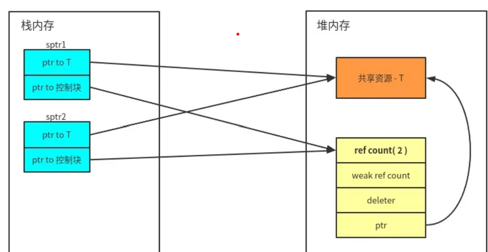
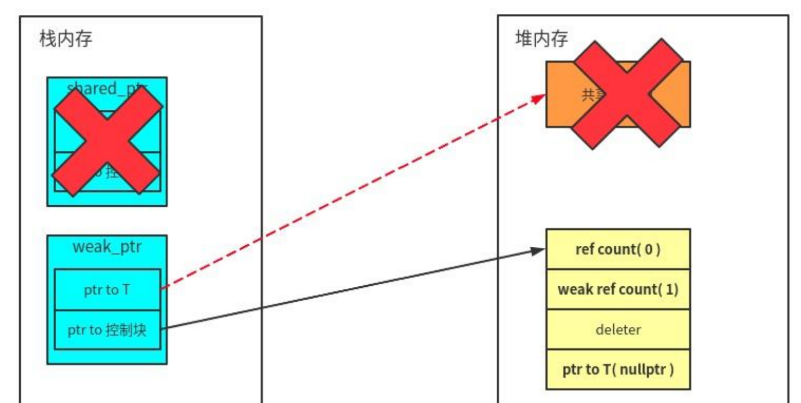

## 智能指针

C++11 引入了 3 个智能指针类型：

1. `std::unique_ptr<T>` ：独占资源所有权的指针。
2. `std::shared_ptr<T>` ：共享资源所有权的指针。
3. `std::weak_ptr<T>` ：共享资源的观察者，需要和 std::shared_ptr 一起使用，不影响资源的生命周期。


## std::unique_ptr

简单说，当我们独占资源的所有权的时候，可以使用 std::unique_ptr 对资源进行管理——离开 unique_ptr 对象的作用域时，会自动释放资源。这是很基本的 RAII 思想。

**std::unique_ptr 是 move-only 的**。

```c++
{
    std::unique_ptr<int> uptr = std::make_unique<int>(200);
    std::unique_ptr<int> uptr1 = uptr;  // 编译错误，std::unique_ptr<T> 是 move-only 的

    std::unique_ptr<int> uptr2 = std::move(uptr);
    assert(uptr == nullptr);
}
```

std::unique_ptr 可以指向一个数组

```c++
{
    std::unique_ptr<int[]> uptr = std::make_unique<int[]>(10);
    for (int i = 0; i < 10; i++) {
        uptr[i] = i * i;
    }   
    for (int i = 0; i < 10; i++) {
        std::cout << uptr[i] << std::endl;
    }   
}
```

可以自定义deleter，需要一个函数对象，如下面的`FileCloser`。

```c++
{
    struct FileCloser {
        void operator()(FILE* fp) const {
            if (fp != nullptr) {
                fclose(fp);
            }
        }   
    };  
    std::unique_ptr<FILE, FileCloser> uptr(fopen("test_file.txt", "w"));
}
```


## std::shared_ptr

std::shared_ptr 其实就是对资源做引用计数——当引用计数为 0 的时候，自动释放资源。和 unique_ptr 一样，shared_ptr 也可以指向数组和自定义 deleter。下面着重介绍一下其实现原理。

一个 shared_ptr 对象的内存开销要比裸指针和无自定义 deleter 的 unique_ptr 对象略大。无自定义 deleter 的 unique_ptr 只需要将裸指针用 RAII 的手法封装好就行，无需保存其它信息，所以它的开销和裸指针是一样的。如果有自定义 deleter，还需要保存 deleter 的信息。

shared_ptr 需要维护的信息有两部分：

1. 指向共享资源的指针。
2. 引用计数等共享资源的控制信息——实现上是维护一个指向控制信息的指针。



`std::make_shared` 与直接使用 `std::shared_ptr` 构造对象的主要区别在于内存分配和效率。让我们具体分析它们的不同之处：

- `std::shared_ptr<T> ptr(new T(...));`会有两次独立的内存分配：
  1. 一次为对象 `T` 分配内存。
  2. 一次为 `std::shared_ptr` 的控制块分配内存（包含引用计数等信息）。
- `std::make_shared<T>(...)`一次内存分配
  - `make_shared` 只进行一次内存分配。它将对象 `T` 和控制块一起分配在一块连续的内存中，因此可以减少一次内存分配操作，提高性能。


## std::weak_ptr

std::weak_ptr 要与 std::shared_ptr 一起使用。 一个 std::weak_ptr 对象看做是 std::shared_ptr 对象管理的资源的观察者，它不影响共享资源的生命周期：

1. 如果需要使用 weak_ptr 正在观察的资源，可以将 weak_ptr 提升为 shared_ptr。
2. 当 shared_ptr 管理的资源被释放时，weak_ptr 会自动变成 nullptr。

`std::weak_ptr::lock` 函数的作用是尝试将 `std::weak_ptr` 升级为 `std::shared_ptr`。如果原来的对象仍然存在（即其引用计数不为零），`lock` 将返回一个指向该对象的 `std::shared_ptr`。否则，它会返回一个空的 `std::shared_ptr`。如下:

```c++
void Observe(std::weak_ptr<int> wptr) {
    if (auto sptr = wptr.lock()) {
        std::cout << "value: " << *sptr << std::endl;
    } else {
        std::cout << "wptr lock fail" << std::endl;
    }
}

std::weak_ptr<int> wptr;
{
    auto sptr = std::make_shared<int>(111);
    wptr = sptr;
    Observe(wptr);  // sptr 指向的资源没被释放，wptr 可以成功提升为 shared_ptr
}
Observe(wptr);  // sptr 指向的资源已被释放，wptr 无法提升为 shared_ptr
```


当 shared_ptr 析构并释放共享资源的时候，只要 weak_ptr 对象还存在，控制块就会保留，weak_ptr 可以通过控制块观察到对象是否存活。



weak_ptr还可以解决shared_ptr的循环引用问题。循环引用发生在两个或多个 `std::shared_ptr` 相互引用的情况下，形成一个闭环，导致它们的引用计数永远不会归零，因此所管理的对象无法被释放，造成内存泄漏。例如：

```c++
#include <memory>

class B;  // Forward declaration

class A {
public:
    std::shared_ptr<B> ptrB;
    ~A() { std::cout << "A destroyed" << std::endl; }
};

class B {
public:
    std::shared_ptr<A> ptrA;
    ~B() { std::cout << "B destroyed" << std::endl; }
};

int main() {
    auto a = std::make_shared<A>();
    auto b = std::make_shared<B>();

    a->ptrB = b;
    b->ptrA = a;

    // 到此处，a 和 b 的引用计数都不会归零，A 和 B 的对象永远不会被释放
    return 0;
}
```

为了解决循环引用问题，可以使用 `std::weak_ptr` 替代其中一个 `std::shared_ptr`。`std::weak_ptr` 不会增加引用计数，从而打破了循环引用的链条。

```c++
class A {
public:
    std::shared_ptr<B> ptrB;
    ~A() { std::cout << "A destroyed" << std::endl; }
};

class B {
public:
    std::weak_ptr<A> ptrA;  // 使用 weak_ptr 代替 shared_ptr
    ~B() { std::cout << "B destroyed" << std::endl; }
};
```

