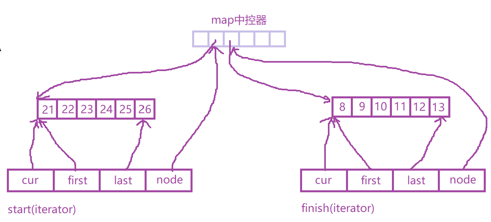

## 序列式容器

所谓序列式容器，其中的元素**都可序，但未必有序**，C++语言本身提供了一个序列式容器array，STL另外再提供vector、list、deque、stack、queue、priority-queue等序列容器。其中stack和queue由于只是将deque改头换面而成，技术上被归类为一种配接器。


## vector

vector是动态空间，实现技术，关键在于其对大小的控制以及重新配置时的数据移动效率。

### **vector的定义**

```C++
template<class T, class Alloc = alloc> 
class vector {
public:
    typedef T             value_type;
    typedef value_type*   pointer;
    typedef value_type*   iterator;
    typedef value_type&   reference;
    typedef size_t        size_type;
    typedef ptrdiff_t     difference_type;
    
protected:
    typedef simple_alloc<value_type, Alloc> data_allocator;
    iterator start;                // 可使用空间的头
    iterator finish;               // 目前使用空间的尾
    iterator end_of_storage;       // 可用空间的尾
} 
```

### **vector的迭代器**

由于vector使用的是连续线性的空间，所以不论其元素型别为何，普通指针能满足所有vector迭代器的所需的操作行为，所以其迭代器实际就是原生指针，支持随机存取，为Random Access Iterator。

所以当客户端写出如下代码:

```c++
vector<int>::iterator ivec;
vector<Shape>::iterator svec;
```

实际的型别就是`int*`和`Shape*`。

### **元素操作**

vector的空间配置策略为：

- 当插入元素的时候，如果配置的空间不足，则扩充空间至当前的两倍，如果仍然不足则扩充至所需空间。
- 容量的扩张必须经历“重新配置、元素移动、释放原空间”等过程

所谓动态增加，并不是在原空间之后接续新空间，而是以**原大小的两倍配置一块较大的新空间**，然后再把原内容拷贝过去，并释放原空间。因此，对于vector的任何操作，**一旦引起空间的重新配置**，**指向原vector的所有迭代器就会全部失效**。如果我们有一个vector需要进行连续的`push_back`操作，为了**减少动态扩容带来的内存拷贝和申请上的开销**，更推荐一开始就先预估容器大小，然后**调用`resize()`**来进行空间的预分配。

而删除操作的时候，如果容器大小(size)远小于容器容量(capacity)的时候，通常也不会进行自动地缩容，也就是说`end_of_storage`不会改变，如果想手动减小容量，可以调用函数`shrink_to_fit`。


## **list**

基本定义如下：

```C++
template<class T>
struct __list_node {
    typedef void*  void_pointer;
    void_pointer   prev;
    void_pointer   next;
    T              data;
}

template <class T, class Alloc = alloc>
class list {
protected: 
	typedef __list_node<T>  list_node;
public:
    typedef list_node*  link_type;
protected:
    link_type  node;
}
```

### **list的迭代器**

list迭代器正确的递增、递减、取值、成员取用操作是指，递增指向下一个节点，递减指向上一个节点，取值取的是节点的数据值，成员取用时取用的是节点的成员。list不能再以原生指针作为迭代器，而需要定义特定的iterator类。**list迭代器是一种Bidirectional Iterator**，支持单步的前进或后退操作。

list迭代器有一个重要性质：**插入和结合操作都不会有list迭代器失效**，这在vector是不成立的，因为vector的插入操作可能造成原来的重新配置，导致原有的迭代器全部失效。**list的元素删除操作也只有指向删除元素的那个迭代器失效，其他迭代器不受影响**。

```C++
template<class T, class Ref, class Ptr> 
struct __list_iterator {
    typedef __list_iterator<T, T&, T*>      iterator;
    typedef __list_iterator<T, Ref&, Ptr>   self;
    
    typedef bidirectional_iterator_tag      iterator_category;
    typedef T    value_type;
    typedef Ptr  pointer;
    typedef Ref  reference;
    typedef __list_node<T>*  link_type;
    typedef size_t size_type;
    typedef ptrdiff_t diffrence_type;
    
    link_type node;        // 迭代器里面的普通指针，指向list节点
    ....
}
```

> list不能使用stl提供的通用sort算法，因为sort算法只接受Random Access Iterator，所以提供了自己的sort方法,可以直接调用，其内部使用快速排序。


## **deque**

deque则是一种双向开口的连续线性空间。

deque和vector的差异：

- 一在于deque允许常数时间内对头端进行元素的插入或移除操作
- 二在于deque没有所谓容量观念，因为它是动态地以**分段连续空间组合而成**，随时可以增加一段新的空间并链接起来。deque没有必要提供所谓的空间保留功能。vector只能向尾端“生长”，而deque可以在前端或者尾端增加新空间。**不存在像vector那样“因空间不足而分配一块更大的空间然后复制元素”问题**。

### **deque数据结构**



deque采用一块所谓的map(并不是STL中的map容器)作为主控器，这个map就是一小块连续的空间，其中每一个元素指向另一块较大的连续的空间，称为缓冲区，这个缓冲区才是deque存储空间的主体。

```C++
template<class T, class Alloc = alloc>
class deque {
public:
    typedef  T  value_type;
    typedef  value_type*  pointer;
    ...
protected:
    typedef pointer*  map_pointer;   // 元素指针的指针
    map_pointer  map;                // 这就是主控器 map, 每一个元素都是一个指针指向一块缓冲区
    size_type    map_size;           // map 可容纳的指针
}
```

### **deque迭代器**

deque是分段连续空间，维持其“整体连续”假象的任务，落在了迭代器身上。

它必须知道分段连续空间在哪里，判断自己是否处于缓冲区的末尾(否则++需要跳转到下一个缓冲区)，所以设计如下:

```C++
template<class T, class Ref, class Ptr, size_t BufSiz>
struct __deque_iterator {
    // 没有继承，自行撰写5个必要迭代器的相应型别
    ....
    T* cur;   // 当前迭代器所在缓冲区的位置
    T* first; // 当前迭代器所在的缓冲区的头
    T* last;  // 当前迭代器所在的缓冲区的头
    map_pointer node;  // 指向管控中心
}
```


## **stack**

stack是一种**先进后出**的数据结构，它只有一个出口,stack允许新增元素、移除元素、取得最顶端元素。但除了最顶端元素外，没有任何其他方式可以存取stack的其他元素，换言之，**stack不允许有遍历行为**。

stack不支持对元素的遍历，因此**没有迭代器**。

stack是一种**配接器**，STL以deque作为缺省情况下的stack底部结构，是以底部容器完成其所有工作，而这种具有"修改某物接口，形成另一种风貌"的性质的，称为adapter(配接器)，因此，STL stack一般不称之为容器，而称之为配接器。

为什么使用deque而不使用vector作为stack的底层容器呢?应该是push_back会有额外内存申请和拷贝上的开销，而deque可以动态扩缩容。

我们也可以指定vector或者list作为stack的底层容器:

```C++
std::stack<int, std::vector<int>> vStack;
std::stack<int, std::list<int>> lStack;
```

因为stack的实现如下:

```C++
tempalte<class T, class Sequence = deque<T>>
class stack {
protected:
    Sequence c;
    // 直接使用 c 的 API 就行， c.push_back()  c.pop_back()  c.back()
}
```


## **queue**

queue是一种先进先出的数据结构，它有两个出口。queue允许新增元素、移除元素、从底端加入元素、取得最顶端元素（queue不允许有遍历行为）。

与stack一样，queue也不允许有遍历行为，queue没有迭代器。

与stack类似，SGI STL默认情况下以deque作为queue的底部结构。也是一种container adapter。


## **heap**

heap并不归属于STL容器组件，它是个幕后英雄，扮演priority queue的助手,它分为 max heap 和min heap，在缺省情况下，**max-heap是priority queue的底层实现机制**。

### **heap的数据结构**

以array表达tree的方式，称为**隐式表述法**,这样就可以使用一个array表示出一颗完全二叉树。array的缺点是无法动态的改变大小，所以实际实现机制中的**max-heap实际上是以一个vector表现的完全二叉树**。

### **heap的迭代器**

heap本身并不是一个容器，它更多的是依靠vector容器底层，并在上面实现算法从而实现对tree的表达。heap不提供遍历功能，也没有对应的迭代器。


## **prioprity_queue**

priority_queue带有权值概念，其内的元素并非依照被推入的次序排列，而是自动依照元素的权值排列。**priority_queue缺省情况下是以vector为底层容器，并加上heap处理规则实现**，因此，STL priority_queue往往不被归类为container(容器)，而被归类为container adapter。

与queue一样，priority_queue也没有迭代器。