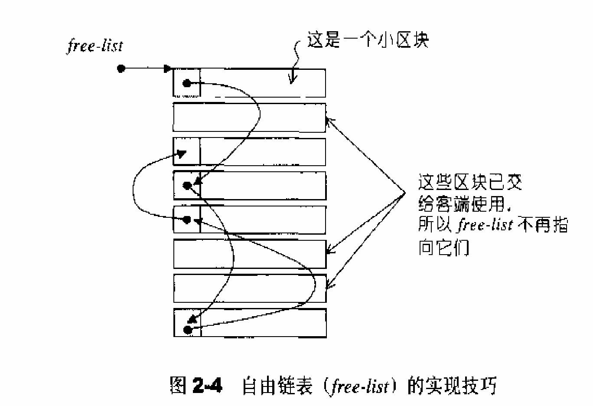
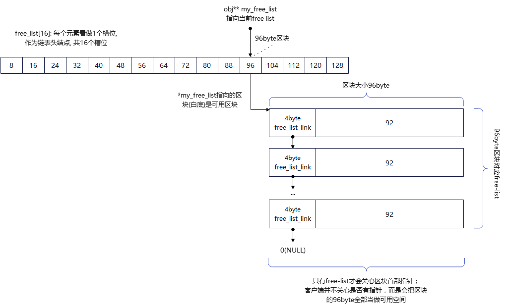

## 空间配置器
SGI STL有2个种空间配置器：
1. `std::allocator`，符合STL标准，但很少使用，也不建议使用。因为只是把`::operator new`和`::operator delete`做了一层薄薄封装，效率差。
2. `std::alloc`，SGI特殊空间配置器，将配置器分为两级，兼顾了效率与内存碎片问题，效率高。推荐使用。

下面主要讲的也是`std::alloc`。


一般而言，我们所习惯的C++内存配置操作和释放是这样的：
```c++
class Foo { ... };
Foo* f = new Foo();
delete f;
```
其中`new`算式内涵两阶段操作：
1. 调用`::operator new`配置内存
2. 调用`Foo::Foo()`构造对象内容

delete也有两阶段操作
1. 调用`Foo::~Foo()`将对象析构
2. 调用`::operator delete`释放内存


为了精密分工，STL allocator决定将这两阶段操作区分开来。
1. 内存配置由`alloc::allocate()`负责，内存释放由`alloc::deallocate()`负责。(头文件<stl_alloc.h>)
2. 对象构造由`::construct()`负责，对象析构由`::destroy()`负责。(头文件<stl_construct.h>)


## 头文件说明
STL标准规定，配置器定义于<memory>，而SGI <memory> 内含3个与配置器相关的文件：
1. <stl_construct.h> 定义了全局函数construct(), destroy(), 负责对象的构造和析构。隶属于STL标准规范。
2. <stl_alloc.h> 定义了一、二级配置器，彼此合作。配置器名为alloc。
3. <stl_uninitialized.h> 定义一些全局函数，用来填充（fill）或复制（copy）大块内存数据。比如函数`un_initialized_copy()`、`un_initialized_fill()`、`un_initialized_fill_n()`。


## 构造和析构工具：construct, destroy
全局函数construct(), destroy()在**已配置内存的基础上**，用于对象的构造和析构。
```c++
// <stl_construct.h>
template <class T>
inline void _Construct(T1* p) {
  new ((void*) p) T(); // placement new; 调用T::T()
}

template<class T1, class T2>
inline void construct(T1* p, const T2& value) {
       new (p) T1(value); // placement new; 调用T1::T1(value)
}

// destroy()第一个版本, 接受一个指针
template<class T>
inline void destroy(T* pointer) {
       pointer->~T(); // 调用dtor ~T()
}

// 如果元素的数值型别(value type)有non-trivial destructor, 则派送(dispatch)到这里
template<class ForwardIterator>
inline void __destroy_aux(ForwardIterator first, ForwardIterator last,  __false_type) {
       for (; first < last; ++first)
              destroy(&*first);
}

// 如果元素的数值型别(value type)有trivial destructor, 则派送(dispatch)到这里
template<class ForwardIterator>
inline void __destroy_aux(ForwardIterator first, ForwardIterator last,  __true_type) {
    // 什么都没干
}

```
代码中一组`__destroy()`是辅助实现`destroy()`的，编译器会在编译期根据萃取出参数的类型（value type）。接着萃取出trivial_destructor特性，判断是否支持`trivial_destructor`（**平凡的析构函数，说明没有申请动态内存**），如果支持（特性为__true_type），就不需要专门调用析构函数；如果不支持（特性为__false_type），就需要针对迭代器区间每个元素，逐个调用析构函数。如果迭代器区间包含元素较多，这能节省不少时间。
>当一个类的析构函数不需要做任何额外的工作时，我们称这个类的析构函数为trivial destructor,STL中有一个 has_trivial_destructor函数，这是编译器内置的，用来检测类型是否拥有用户自定义的析构函数。


## 空间的配置与释放
std::alloc 负责内存的配置和释放。对象构造前的空间配置和对象析构后的空间释放，由<stl_alloc.h>负责
C++的内存配置基本操作`::operator new()`，内存释放基本操作`::operator delete()`。这2全局函数相当于C的`malloc()`和`free()`。SGI正是以`malloc()`和`free()`完成内存的配置与释放的，但SGI STL的`std::alloc`不能使用new/delete，因为new/delete会直接构造/析构对象，而这不符合`std::alloc`职责。

>operator new只分配所要求的空间，不调用相关对象的构造函数。

### std::alloc设计的基本思想
为避免小型区块可能造成的内存碎片问题，SGI STL设计了双层级配置器：
1. 第一级配置器，直接使用`malloc()`, `free()`；
2. 第二级配置器，视情况采用不同策略：

当配置区块 > 128bytes时，视为“足够大”，便调用第一级配置器；
当配置区块 <= 128bytes时，视为“过小”，交给memory pool（内存池）来管理，不再求助于第一级配置器。
设计可以只开放第一级配置器，可以同时开启。
SGI STL的两级配置器：`__malloc_alloc_template`是第一级配置器，`__default_alloc_template`是第二级配置器。

SGI STL容器全部使用这个simple_alloc接口。例如，vector的专属空间配置器data_allocator，就是simple_alloc<value_type, Alloc>
```c++
// <stl_alloc.h>

// 内部4个成员函数都是单纯的转发调用
template<class T, class Alloc>
class simple_alloc { // simple_alloc包装第一级配置器和第二级配置器, 用户传入模板参数给Alloc即可
public:
       static T* allocate(size_t n) { // 配置n个单位T类型对象的原始空间
              return 0 == n ? 0 : (T*)Alloc::allocate(n * sizeof(T));
       }
       static T* allocate(void) {     // 配置1个单位T类型对象的原始空间
              return (T*)Alloc::allocate(sizeof(T));
       }
       static void deallocate(T* p, size_t n) { // 释放n个单位T类型对象的原始空间
              if (0 != n) Alloc::deallocate(p, n * sizeof(T));
       }
       static void deallocate(T* p) { // 释放1个单位T类型对象的原始空间
              Alloc::deallocate(p, sizeof(T));
       }
};
```

## 第一级配置器：__malloc_alloc_template
1. allocate() 直接使用malloc(), deallocate() 直接使用free()；
2. 模拟C++的set_new_handler()以处理内存不足的状况。


### 如何选择使用哪个配置器
定义或取消宏__USE_MALLOC，就能决定alloc的实际类型（一级配置器 or 二级配置器）。SGI STL并未定义__USE_MALLOC，因此SGI默认使用的二级配置器。
```c++
# ifdef __USE_MALLOC

typedef malloc_alloc alloc;
typedef malloc_alloc single_client_alloc;

# else
...
typedef __default_alloc_template<__NODE_ALLOCATOR_THREADS, 0> alloc;
typedef __default_alloc_template<false, 0> single_client_alloc;
...
#endif
```


### 一级配置器实现
用`malloc()`, `free()`, `realloc()`等C函数执行实际的内存配置、释放、重新配置，并模拟实现类似于C++ new-handler异常处理机制。
```c++
// <stl_alloc.h>

// 以下是第一级配置
// 注意， 无"template型别参数". 至于"非型别参数"inst, 则完全没派上用场
template<int inst>
class __malloc_alloc_template {

private:
       // 以下都是函数指针, 所代表的函数将用来处理内存不足的情况
       // oom: out of memory.
       static void *oom_malloc(size_t);            // 模拟C++ placement new, 不断尝试配置内存, 调用客户注册的处理例程或抛出异常
       static void *oom_realloc(void*, size_t);    // 模拟C++ placement new, 不断尝试重新配置内存, 调用客户注册的处理例程或抛出异常
       static void(*__malloc_alloc_oom_handler)(); // 保存客户注册的 内存不足处理例程

public:
       static void *allocate(size_t n) {
              void *result = malloc(n); // 第一级配置器直接使用malloc()
              // 以下无法满足需求时, 改用oom_malloc()
              if (0 == result) result = oom_malloc(n);
              return result;
       }

       static void deallocate(void* p, size_t /*n*/) {
              free(p); // 第一级配置器直接使用free()
       }

       static void *reallocate(void* p, size_t /* old_sz */, size_t new_sz) {
              void *result = realloc(p, new_sz); // 第一级配置器直接使用realloc()
              // 以下无法满足需求时, 改用oom_realloc()
              if (0 == result) result = oom_realloc(p, new_sz);
              return result;
       }

       // 以下仿真C++的set_new_handler(). 换句话说， 你可以通过它指定自己的out-of-memory handler
       // 注册 内存不足处理例程
       static void(*set_malloc_handler(void(*f)()))() {
              void(*old)() = __malloc_alloc_oom_handler;
              __malloc_alloc_oom_handler = f;
              return old;
       }
};

// malloc_alloc out-of-memory handling
// 初值0, 有待客户端设定
template<int inst>
void(*__malloc_alloc_template<inst>::__malloc_alloc_oom_handler)() = 0;

template<int inst>
void* __malloc_alloc_template<inst>::oom_malloc(size_t n) {
    void(*my_malloc_handler)();
    void* result;
    for (; ;) { // 循环尝试配置内存
        my_malloc_handler = __malloc_alloc_oom_handler;
        if (0 == my_malloc_handler) {
            __THROW_BAD_ALLOC;
        }
        (*my_malloc_handler)(); // 调用客户注册的处理例程, 企图释放内存
        result = malloc(n);     // 再次尝试配置内存
        if (result) return result;
    }
}

template<int inst>
void* __malloc_alloc_template<inst>::oom_realloc(void* p, size_t n) {
    void(*my_malloc_handler)();
    void* result;
    for (; ;) { // 循环不断尝试释放、配置 ...
        my_malloc_handler = __malloc_alloc_oom_handler;
        if (0 == my_malloc_handler) { // 如果客户没有设置my_malloc_handler, 就抛出异常
            __THROW_BAD_ALLOC;
        }
        (*my_malloc_handler)();    // 调用客户注册的处理例程, 企图释放内存
        result = reallocate(p, n); // 尝试重新配置内存
        if (result) {
            return result;
        }
    }
}

// 注意, 以下直接将参数inst指定为0
typedef __malloc_alloc_template<0> malloc_alloc;
```


## 第二级配置器：__default_alloc_template
与第一级配置器区别：为避免太多小额区块造成内存碎片，多了一些机制。

SGI第二级配置做法：如果区块够大，> 128bytes，移交给第一级配置器处理；当区块 < 128bytes，则以内存池（memory pool）管理。

这种方法称为**次配置**（sub-allocation）：每次配置一大块内存，并维护对应自由链表（free-list）。下次再有相同大小内存需求时，就直接从free-lists中取出。如果客户端归还小额区块，就由配置器**回收到free-lists**中。
简而言之，二级配置器负责内存配置、回收，会根据区块大小，选择自行配置，还是移交给一级配置器处理。

因此，可以知道二级配置器多了**自由链表**和**内存池**两个机制，专门为处理 <= 128bytes的内存申请而生。


### free-lists
二级配置器的核心之一就是free-lists（自由链表），每个free-list代表一类空闲区块，大小从8，16，24，...，到128 （bytes），共16个。16个free-list的头结点，用一个数组`free_list[16]`表示，下文称之为槽位。每个槽位指向的区块是一个链表，而该区块就是链表的第一个空闲块。

free-list的精髓就是联合体obj：
```c++
// free-lists节点结构
union obj {
    union obj* free_list_link;
    char client_data[1]; /* The client sees this. */
};
```
一般情况下，我们用next 和 data的struct来描述链表节点，而obj用obj*的union，这是为什么？*
因为这样可以节省维护链表的指针空间。一个区块，在分配给客户端之前，首部大小为obj那部分可以看作一个指针free_list_link，用来串成链表；而分配给客户端之后，这部分无需当做指针，可以被客户按需使用；待客户归还区块时，首部大小为obj那部分又会被当做指针，用来串成链表，加入free list。
free_list_link所指向的内存区块大小，由链表头结点，即槽位所在free_list[]中的索引决定。而归还时，调用者会记录区块大小。因此，obj不需要额外存储区块大小。如下所示：





### __default_alloc_template 的数据结构

```c++
// 第二级配置器的部分实现内容
enum { __ALIGN = 8 }; // 小型区块上调边界
enum { __MAX_BYTES = 128 }; // 小型区块的上限
enum { __NFREELTISTS = __MAX_BYTES / __ALIGN }; // free-lists个数

// 以下是第二级配置器
// 注意, 无"template型别参数", 且第二参数完全没派上用场
// 第一参数用于多线程环境. 本书不讨论多线程环境
template<bool threads, int inst>
class __default_alloc_template {
private:
       // ROUND_UP() 将bytes上调至8的倍数
       static size_t ROUND_UP(size_t bytes);

private:
       // free-lists节点结构
       union obj {
              union obj* free_list_link;
              char client_data[1]; /* The client sees this. */
       };

private:
       // 16个free-lists
       static obj* volatile free_list[__NFREELTISTS];
       static size_t FREELIST_INDEX(size_t bytes);
       static void *refill(size_t n);
       // 配置一大块空间, 可容纳nobjs个大小为"size"的区块
       // 如果配置nobjs个区块有所不便, nobjs可能会降低
       static char* chunk_alloc(size_t size, int &nobjs);

       // Chunk allocation state
       static char* start_free; // 内存池起始位置. 只在chunk_alloc()中变化
       static char* end_free;   // 内存池结束位置. 只在chunk_alloc()中变化
       static size_t heap_size;

public:
       static void* allocate(size_t n) { /* 详述于后*/ }
       static void  deallocate(void* p , size_t n) { /* 详述于后*/ }
       static void* reallocate(void* p, size_t old_sz, size_t new_sz);
};
```

二级配置器的`allocate()`源码如下:

```c++
// n must be > 0
static void * allocate(size_t n) {
       obj* volatile* my_free_list;
       obj* result;

       // >128, 调用第一级配置器
       if (n > (size_t)__MAX_BYTES) {
              return (malloc_alloc::allocate(n)); // malloc_alloc即一级配置器 __malloc_alloc_template<0>
       }

       // 寻找16个free lists中适当的一个
       my_free_list = free_list + FREELIST_INDEX(n);
       result = *my_free_list;

       if (result == 0) {
              // 没找到可用的free list, 准备重新填充free list
              void *r = refill(ROUND_UP(n)); /* 后面详述 */
              return r;
       }

       // 调整free list
       *my_free_list = result->free_list_link;
       return (result);
}
```

二级配置器额度`deallocate()`源码如下,就是把该`obj`放在相应free list的第一个位置上。

```c++
// p 不可以是0
static void  deallocate(void* p , size_t n) {
       obj* q = (obj*)p;
       obj* volatile *my_free_list;

       // > 128调用第一级配置器
       if (n > (size_t)__MAX_BYTES) {
              malloc_alloc::deallocate(p, n);
              return;
       }

       // 寻找对应free list
       my_free_list = free_list + FREELIST_INDEX(n);
       // 调整free list, 回收区块
       q->free_list_link = *my_free_list;
       *my_free_list = q;
}
```


### refill函数重新填充free list

在`allocate()`中，当发现合适的free list中并没有可用的空闲块时，就会调用`refill()`为free list重新填充空闲空间。新空间由`chunk_alloc()`完成，默认取自内存池。

`refill()` 默认向`chunk_alloc()`申请nobjs=20个大小为n（假定n已经调整为8倍数）的（连续）内存空间，当然实际成功申请到多少个，需要根据实际情况决定，可通过nobjs传出值判断。可以肯定的是，如果有返回值（没有出现异常终止程序），那么至少会有一个大小为n的对象。
`refill()`会得到一个连续空间，而把第一个大小n的对象返回给客户；至于剩余的空间，在按尺寸n找到合适的free list后，将剩余空间按链表形式加入free list。

```c++
// 返回一个大小为n的对象, 并且有时候会为适当的free list增加节点
// 假设n已经适当上调至8的倍数
template<bool threads, int inst>
void* __default_alloc_template<threads, inst>::refill(size_t n) {
       int nobjs = 20;

       // 调用chunk_alloc(), 尝试取得nobjs个区块作为free list的新节点
       // 注意参数nobjs是pass by reference
       char* chunk = chunk_alloc(n, nobjs); 
       obj* volatile *my_free_list; // 2级指针, 指向free list链表头结点, 也位于free_list[]槽位上
       obj* result;
       obj *current_obj, *next_obj;
       int i;

       // 如果只获得一个区块, 这个区块就分配给调用者, free list无新节点
       if (1 == nobjs) return (chunk);

       // 否则准备调整free list, 纳入新节点
       my_free_list = free_list + FREELIST_INDEX(n);

       // 以下在chunk空间内建立free list
       result = (obj*)chunk; // 首部这一块准备返回给客户端

       // 以下引导free list指向新配置的空间(取自内存池)
       *my_free_list = next_obj = (obj*)(chunk + n);

       // 以下在chunk剩余空间(除去返回给客户的首部)上, 将free list的各节点串起来
       for (i = 1; ; ++i) { // 从1开始, 因为第0个将返回给客户端
              current_obj = next_obj;
              next_obj = (obj*)((char*)next_obj + n);
              if (nobjs - 1 == i) {
                     current_obj->free_list_link = 0;
                     break;
              }
              else {
                     current_obj->free_list_link = next_obj;
              }
       }

       return (result);
}
```

我们看到这个`refill()`函数首先调用了`chunk_alloc()`函数，从内存池中申请20个大小为`n`的区块(可能少于20个，因为内存池可能容量不足，但会分配至少1个`obj`)，并把其中第一个区块传给`chunk`，另外的`nobjs - 1`个区块再添加到free-list中。

内存池自身通过两个指针边界管理，`start_free` ~ `end_free`；而`heap_size`，表示总的向OS成功申请到的内存总量。需求的内存总量 total_bytes为`size * nobjs`，内存池剩余空间bytes_left为 `end_free - start_free`。

1. 当内存池剩余空间 >= 需求内存总量时，直接从内存池划扣（移动`start_free` 边界）。

2. 当内存池剩余空间不能完全满足需求量，但足够供应一个（含）以上的区块需求。
   我们知道，客户（`refill()`）通过`chunk_alloc()`申请内存的时候，实际上只需要一个区块，但会默认申请20个区块。也就是说，实际上最少只供应一个也能满足需求。但我们还是让内存池尽量满足客户需求，分配尽量多的区块数`nobjs = bytes_left / size`。这样，实际供应的总量为`size*nobjs`。同样地，从内存池划扣空间需要移动`start_free`边界。

3. 当内存池剩余空间连一个区块都不能满足时，可能需要向OS申请内存（调用`malloc()`）。

会不会出现严重的内存碎片问题?

不会的，因为之前用过的内存释放后会重新加入到free-list中，不会被`free`。也就是说这种小空间(小于128bytes)不会造成内存碎片的问题。

