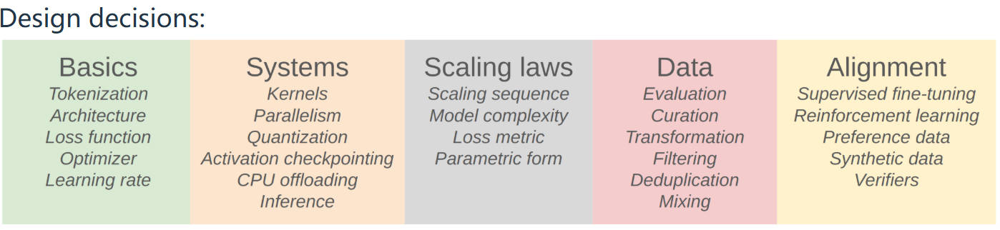

## 关于这门课程

下面是这门课程主要的部分：

* Basics：让一个完整的流程跑通一个基础版本。包含tokenization、model architecture、training。

* Systems：如何进一步进行优化。kernel、parallelism、inference。

* Scaling laws：在这里，目标是小规模地进行实验掌握一些经验知识，然后在更大规模的模型上预测超参数和损失。比如，给定 FLOPs 预算 (C)，使用更大的模型 (N) 还是训练更多token (D)？

* Data：模型的功能大部分是由数据决定的。通常来说，数据集是很多不同部分的集合。

* Alignment：上面我们得到的是一个能够预测下一个token的模型，也叫作base model（基础模型），我们认为它是一个有巨大原始潜力的模型。但它需要以某种方式进行对齐或修改。

## Tokenization分词

分词器就是一种能在字符串和整数序列之间进行转换的东西。下面将讨论字节对编码（Byte Pair Encoding）BPE分词器。其实也存在这“Tokenizer-free”的方法，这种方法直接使用原始字节。这里有一个[分词网站](https://tiktokenizer.vercel.app/?encoder=gpt3)。压缩率是字节数除以token数。

在讲BPE分词前，先介绍几种尝试方法。

1. 基于字符的分词：每一个字符都可以转换成一个整数，也叫做code point。这样做效果不好，因为每个字符它出现的频率是不同的，有些字符出现次数很少，这是对词汇表的低效使用；并且还需要为每一个字符分配一个整数编码，这样也导致词汇表非常大。这种情况下压缩比大概是1.5（一个字符可能是多个字节）。

2. 基于字节的分词：词汇表只有256，非常小。它的压缩比是1，这对于长序列来说是不友好的，注意力机制在序列长度上是朴素的二次方复杂度，所以基于字节的分词在效率方面会很糟糕。
3. 基于word的分词：把字符串拆分成一个片段序列（正则表达式），把这些称为token。但这样词汇表就有一点大，并且有的词汇出现次数很少。

所以如果我们需要设计一个分词器，就不要预先设定好如何分割的概念，我们将在原始文本上训练分词器。因此，自然的，跨越多个字符的常见序列我们会尝试表示为1个token，而罕见的序列则会被表示为多个token。这也就是BPE分词。

首先将文本转换成字节序列，然后将重复地、连续地合并最常见的相邻标记对（压缩率会在重复的过程中减小）。所以直觉上，如果一个标记对频繁出现，那么就把它压缩成一个标记（会分配新的整数标签）。
