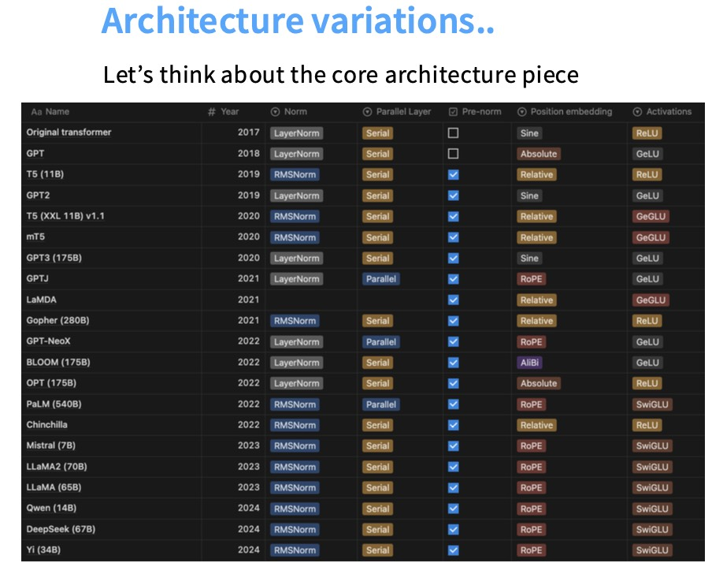
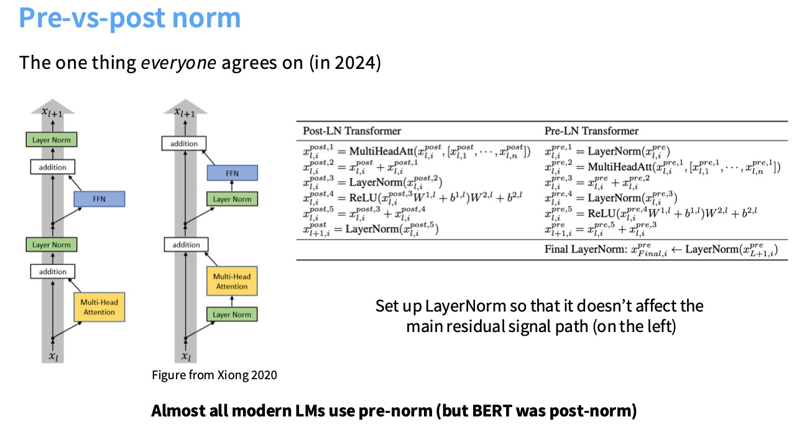
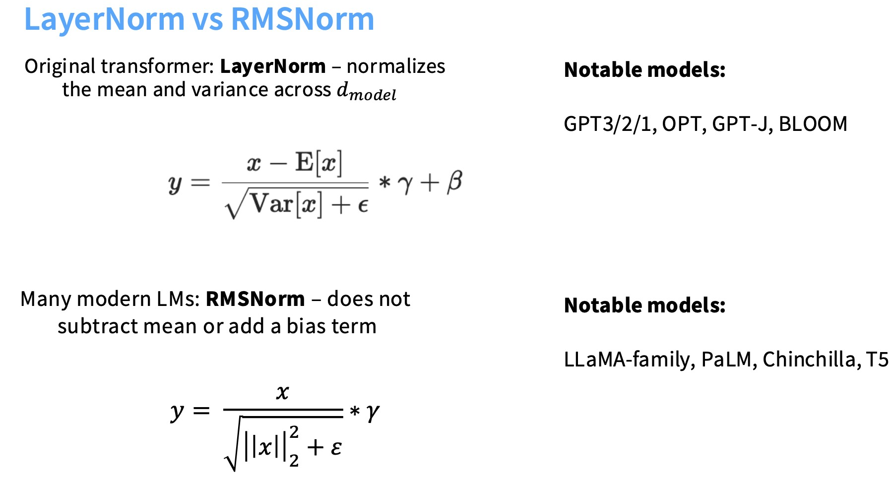

**本节主要内容：**

架构上的变体：

1. 激活函数，前馈网络
2. 注意力变体
3. 位置嵌入

超参数：

1. 把隐藏层设置为多大？MLP内部的投影层设置为多大？
2. 词汇元素的大小等等

## Architecture Variations

### PreNorm VS PostNorm

我们来看下面这幅图，在架构的一些选择上没有太多共识，在过去几年已经有某种收敛，比如在下面最底部的LLaMA类架构。但人们在LayerNorm和RMSNorm之间切换。

Post-LN和Pre-LN的对比

1. Post-LN(Post-Layer Normalization)：原始Transformer（2017）采用的方案，先执行**Attention/FFN计算，再进行层归一化**。Output=LayerNorm(Attention(*x*)+*x*)
2. Pre-LN(Pre-Layer Normalization)：**先对输入归一化，再执行Attention/FFN计算**。Output=Attention(LayerNorm(*x*))+*x*

我们来看左边，这是原始Transformer的架构，其中灰色的部份是残差流，在每个子组件（Attention、FFN）之后都有这些层归一化。人们意识到将这个LN移动到这种非残差部分的前面，在许多不同的方面都做的更好。现在主流模型都会选择使用PreNorm，这是一个更稳定的训练架构。

为什么左边原始的Transformer架构是不太好的（为什么残差中的LN是不好的）？

> 残差网络给了我们一个恒等映射，几乎一路从网络的顶部到底部，这会对我训练很深的网络变得更加容易。如果把LN放在残差流中间（灰色部分），会干扰那种梯度行为。

### LayerNorm VS RMSNorm

现在很多模型都转向了RMSNorm，这也是一个共识性的改变，因为它更快且效果和LN一样好。

* Fewer operations(No mean calculation)
* Fewer parameters(No bias term to store)

其实，大多数现代的Transformer都没有bias terms。

原始Transformer的FFN：
$$
FFN(x)=max(0,xW_1+b_1)W_2+b_2
$$
当前很多模型都舍弃了bias terms：
$$
FFN(x)=\sigma(xW_1)W_2
$$

### Activations(激活函数)

