## 本节主要内容

架构上的变体：

1. 激活函数，前馈网络
2. 注意力变体
3. 位置嵌入

超参数：

1. 把隐藏层设置为多大？MLP内部的投影层设置为多大？
2. 词汇元素的大小等等

## Architecture Variations

下面主要讲架构上的各种变体。比如是选择Pre Norm还是选择PostNorm，是选择LayerNorm还是选择RMSNorm，以及现在的各种主流门控激活函数，是选择串行架构还是并行架构

### PreNorm VS PostNorm

我们来看下面这幅图，在架构的一些选择上没有太多共识，在过去几年已经有某种收敛，比如在下面最底部的LLaMA类架构。但人们在LayerNorm和RMSNorm之间切换。

Post-LN和Pre-LN的对比

1. Post-LN(Post-Layer Normalization)：原始Transformer（2017）采用的方案，先执行**Attention/FFN计算，再进行层归一化**。Output=LayerNorm(Attention(*x*)+*x*)
2. Pre-LN(Pre-Layer Normalization)：**先对输入归一化，再执行Attention/FFN计算**。Output=Attention(LayerNorm(*x*))+*x*

我们来看左边，这是原始Transformer的架构，其中灰色的部份是残差流，在每个子组件（Attention、FFN）之后都有这些层归一化。人们意识到将这个LN移动到这种非残差部分的前面，在许多不同的方面都做的更好。现在主流模型都会选择使用PreNorm，这是一个更稳定的训练架构。

为什么左边原始的Transformer架构是不太好的（为什么残差中的LN是不好的）？

> 残差网络给了我们一个恒等映射，几乎一路从网络的顶部到底部，这会对我训练很深的网络变得更加容易。如果把LN放在残差流中间（灰色部分），会干扰那种梯度行为。

### LayerNorm VS RMSNorm

现在很多模型都转向了RMSNorm，这也是一个共识性的改变，因为它更快且效果和LN一样好。

* Fewer operations(No mean calculation)
* Fewer parameters(No bias term to store)

其实，大多数现代的Transformer都没有bias terms。

原始Transformer的FFN：
$$
FFN(x)=max(0,xW_1+b_1)W_2+b_2
$$
当前很多模型都舍弃了bias terms：
$$
FFN(x)=\sigma(xW_1)W_2
$$

### Activations(激活函数)

一些旧的模型（Original transformer, T5）使用的是ReLU作为激活函数，较新一点的模型（GPT1/2/3）使用GeLU作为激活函数，现在主流的模型（Llama）使用门控的激活函数（SwiGLU, GeGLU）。

**Gated activations（\* GLU）**

传统的前馈层（ReLU）：
$$
FF(x)=max(0, xW_1)W_2
$$
这个过程就像是：筛选信息 → 剔除不重要的信息 → 得到最终结果。

改进后的门控激活（ReGLU）：
$$
FF_{ReGLU}(x) = (max(0,xW_1)⊗xV)W_2
$$
**新增了一个Gate** ($xV$)。除了传统的筛选器 $W_1$ 之外，我们又引入了一个新的筛选器 $V$。现在，我们不再简单地用ReLU函数来“砍掉”信息。相反，我们将第一个筛选器的结果 $(max(0,xW_1))$ 与第二个筛选器的结果 $(xV)$ 进行**逐元素相乘**$(⊗)$。如果 $xV$ 的某个值接近于 0，它就会把对应的第一条信息**挡住**或**减弱**，反之亦然。

GeGLU也是一样的形式：
$$
FF_{GEGLU}(x) = (max(GELU(xW)⊗xV)W_2
$$
SwiGLU:
$$
FF_{SwiGLU}(x,W,V,W_2)=(Swish(xW)⊗xV)W_2 \\
Swish(x)=x*sigmoid(x)
$$
**Note: Gated models use smaller dimensions for the $𝑑_{𝑓𝑓}$ by 2/3**

> 这是一种优化技巧。在 Transformer 模型的每个encoder和decoder模块中，除了注意力机制之外，还有一个非常重要的组件，就是 **前馈神经网络（FFN）**。这个前馈神经网络通常包含两层全连接层：将输入向量的维度从 $d_{model}$ 扩展到一个更大的维度，通常是 $4×d_{model}$，再将维度从 $4×d_{model}$ 变回 $d_{model}$。这个更大的中间维度，就是我们所说的 $d_{ff}$。
>
> **Gated Models** 指的是在模型中引入了**门控机制（gating mechanism）**。这种机制的作用类似于一个“开关”，可以根据输入信号的重要性来决定哪些信息应该被保留，哪些应该被忽略。**门控机制**让模型变得更“聪明”了，它不再需要一个巨大的中间维度来存储所有信息，因为它知道哪些信息是重要的。所以新的$d_{ff}=\frac{2}{3}×(4×d_{model})≈2.67×d_{model}$。

### Serial vs parallel layers

在标准的Transformer模型中，每一层（layer）的计算是**串行**的。

1. 输入先经过**自注意力层**（Self-Attention Layer）。
2. 自注意力层的输出作为输入，再经过一个**前馈网络层**（Feedforward Network Layer）。
3. 这两层的输出通过一个残差连接（residual connection）和归一化（normalization）后，成为下一层的输入。

$$
y=x+MLP(LayerNorm(x+Attention(LayerNorm(x)))
$$

为了提高训练和推理效率，并行层架构将自注意力层和前馈网络层**并行**地进行计算。其核心思想是：

1. **输入同时进入自注意力层和前馈网络层。**

2. **两层的计算同时进行。**

3. **两层的输出被合并（通常是相加），然后通过残差连接和归一化。**

$$
y=x+MLP(LayerNorm(x)) + Attention(LayerNorm(x))
$$

## Position Embeddings Variations

下图是几种位置编码的方法：

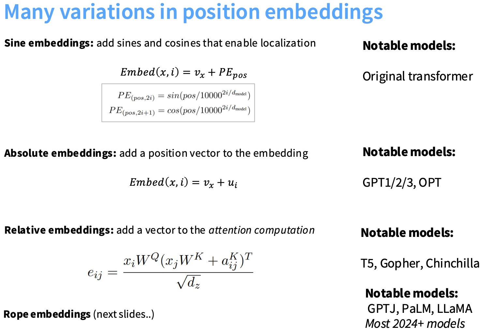

- 正弦位置编码（Sine Embeddings）: 通过添加正弦（sin）和余弦（cos）函数来对位置信息进行编码。这种方法能让模型学习到词语的相对位置关系。

- 绝对位置编码（Absolute Embeddings）:为每个位置添加一个唯一的、可学习的（learnable）位置向量。
- 相对位置编码（Relative Embeddings）:不是直接将位置信息编码到词向量中，而是在注意力计算（attention computation）时，将相对位置信息作为一个偏置项（bias）加入。$e_{ij}$ 表示词语 `i` 对词语 `j` 的注意力分数。

现在大多数模型采用的是RoPE位置编码方法。
$$
<f(x, i), f(y, j)> = g(x, y, i - j)
$$
这个公式的含义是，两个词语的内积（也就是注意力分数）应该是一个只依赖于它们原始词向量和相对位置的函数。这确保了模型只关注词语之间的相对位置关系，而不是它们的绝对位置。

上面的三种位置编码各有不足之处：

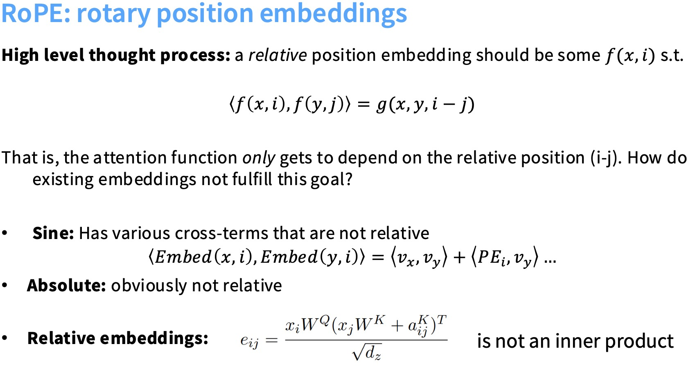

RoPE利用旋转特性设计位置嵌入方法（**内积具有旋转不变性**）。

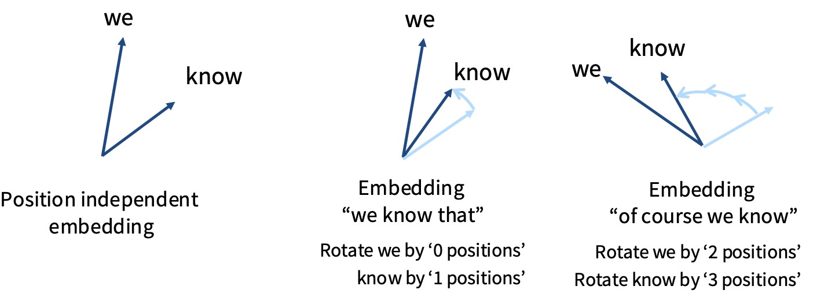

观察上面中间和右边的图中的向量箭头，它们的相对夹角保持一致，因此内积得以保留。

下面的问题是如何旋转高维空间中的向量呢？一个简单的方法是把高维空间向量切成二维的块状，每两个维度将以某个角$\theta$进行旋转。在设计中，会使一些嵌入对快速旋转，而一些旋转慢得多，既能捕捉高频信息，也能获取临近信息。

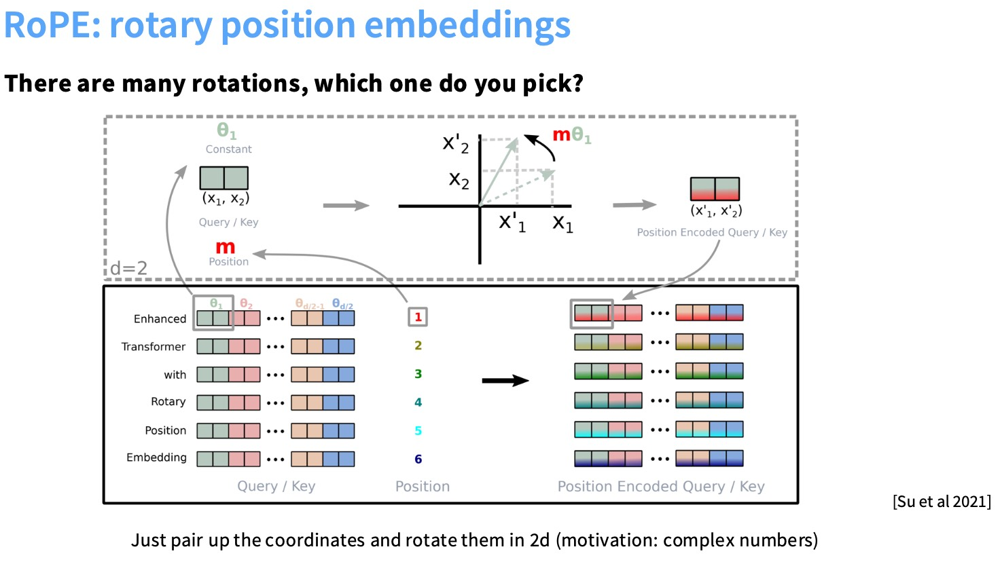

## Hyperparameters

### FFN

实际上，各种成功的模型间真正需要调整的超参数并不多，业界其实已经形成了一些明确的经验法则。

首先从最基础的看起，来看一个简单的前馈神经网络层。
$$
FFN(x)=max(0,xW_1+b_1)W_2+b_2
$$
$d_{model}$表示输入$x$的维度，$d_{ff}$表示前馈网络隐藏层的维度，$W_2$再把$d_{ff}$映射为$d_{model}$
$$
d_{ff}=4 d_{model}
$$
但这不是一定要遵循的规律，也有一些例外（比如GLU的变体，T5等）。

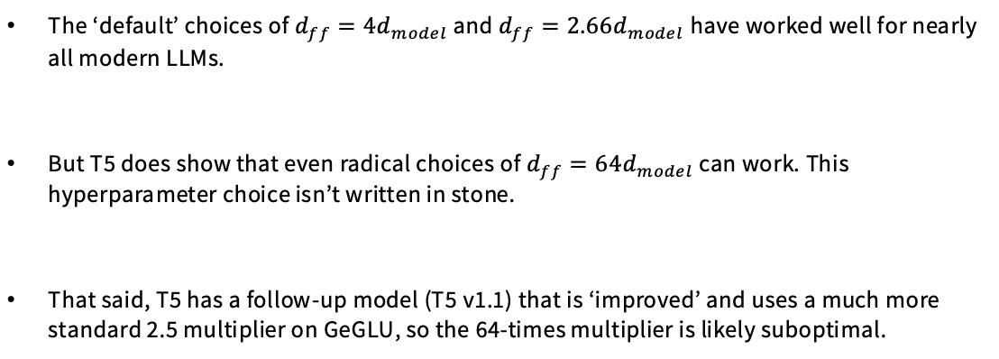

### head-dim * num-heads 与 model-dim 的比例

`head-dim * num-heads` 的乘积通常等于 `model-dim`。这不是一个必须遵守的硬性规则，我们可以设置每个头的维度 `head-dim` 大于 `model-dim / num-heads`。

当`head-dim` 大于 `model-dim / num-heads`时，多头注意力机制拼接后的维度会大于`model-dim`，为了解决这个问题，需要对**最后一步的线性投影层**进行修改，修改投影层 $W_O$ 的维度。在标准设计中，$W_O$ 的维度是 $(D_{model},D_{model})$,我们需要将 $W_O$ 的维度修改为 $(H×D_{head},D_{model})$。

### Aspect ratios（宽高比）

或许可以认为更深的网络更智能，表现力更强，更宽的网络效率更高。但通常有一个黄金比例空间。

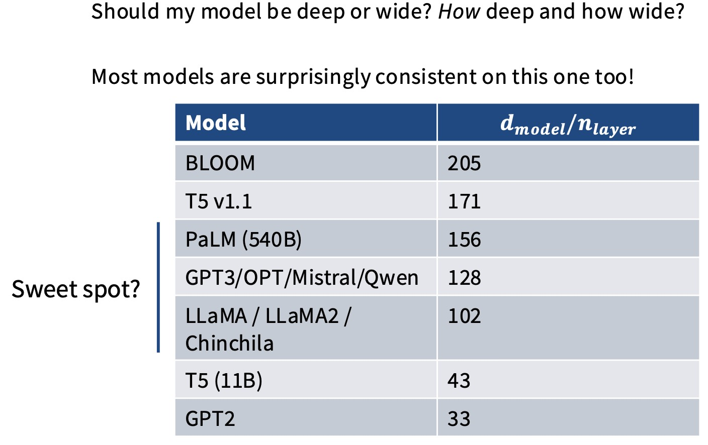

### Vocabulary size

总体来说，词汇表的大小一直在变大。

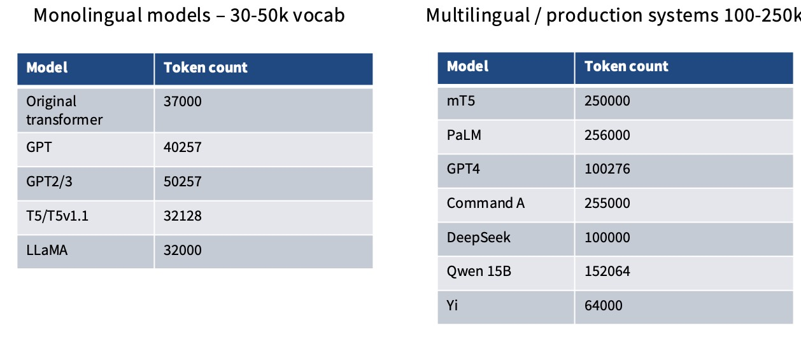

### Dropout and other regularization

考虑到预训练的特性，预训练看似最不需要正则化，因为预训练通常仅需单轮迭代，数据量庞大到无法完整遍历，这种情况下基本不会出现过拟合。但真实情况却不是这样，wieght decay确实是许多人仍在继续使用的方法，但其实这样做并**不是为了防止过拟合**。

> weight decay（权重衰退）通过将大权重的惩罚项加入损失函数，模型在训练时会倾向于使用更小、更分散的权重。这使得模型变得更加“平滑”，对输入数据的微小变化不那么敏感，从而提高了模型的泛化能力。

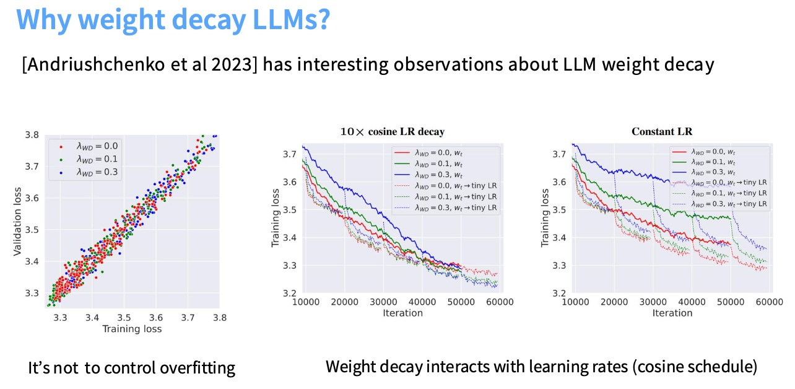

1. 左图：这张图展示了在不同 `λ_WD`（权重衰减系数）下，模型的验证集损失（validation loss）与训练集损失（training loss）之间的关系。所有数据点，无论 `λ_WD` 是多少（0.0, 0.1, 0.3），都大致沿着一条对角线分布。这意味着，当训练损失下降时，验证损失也以几乎相同的比例下降。这表明**模型并没有发生明显的过拟合**。`weight decay`在这个上下文中（LLM训练）的主要目的可能**不是**防止过拟合。
2. 右图：引入weight decay后会出现以下现象：模型在较高学习率时收敛效果不理想，一旦学习率开始衰减，训练损失就会断崖式下跌。

这表明优化器和weight decay存在高度复杂的参数交互，这是优化器与weight decay之间的动态博弈以及**训练末期出现的隐式加速现象**，最终可能得到性能更好的模型。这种精妙而复杂的调节机制，这种看似反直觉的现象，是大语言模型训练中出现的特殊现象。

一种可能的解释是，LLM的损失函数曲面非常复杂。`weight decay`通过对权重进行惩罚，可以帮助优化器在训练过程中更有效地探索这个曲面，避免陷入次优解，并找到一个泛化能力更强的“平坦”最小值区域。在这种情况下，`weight decay`的主要功能从“正则化”转变为“**优化器收敛加速器**”。

## Stability tricks

不要训练出像蓝色曲线那样的模型！蓝色曲线代表了一种**不稳定的训练过程**，其问题体现在两个方面：

1. 损失曲线：蓝色曲线的损失值虽然在总体上呈下降趋势，但其波动非常剧烈。
2. 梯度范数曲线：梯度的巨大波动意味着模型在某些训练步骤中，权重更新的幅度会变得非常大，导致模型参数在参数空间中“跳跃”得很远，这会破坏模型的稳定性和收敛性。

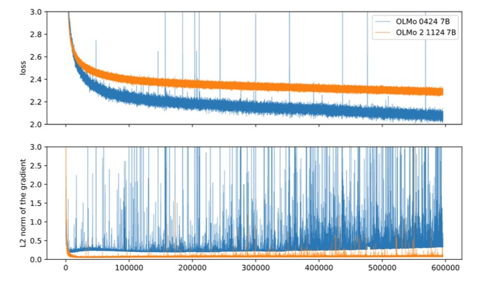

### softmax优化

从常见的优化手段来看，softmax其中的指数运算容易出现数值不稳定，也有可能出现除零错误。在Transformer中，softmax出现在两个地方（模型末端和注意力机制）。针对这两个地方，下面会介绍相应的稳定性优化方法。

### **z-loss**

z-loss的核心思想是**通过引入一个辅助损失项，来约束softmax计算中的归一化因子 Z(x)，使其保持在一个稳定的范围内**。这里的 Z(x) 就是softmax计算中的分母，也就是归一化因子（和原来的softmax一样，只不过是多了一个损失项）。

在右边的损失中，引入了新的一项损失，z-loss 的目标是**让 log(Z(x)) 接近于0**。当 Z(x) 接近于1时，分母的值就稳定在1附近，从而避免了数值过大或过小可能引起的各种数值不稳定问题。

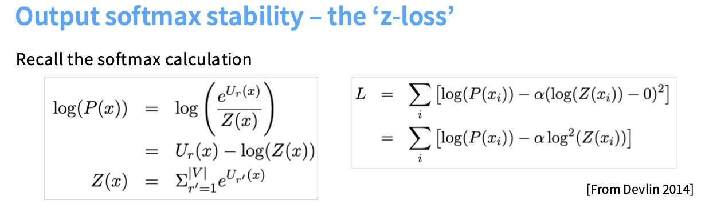

### QK Norm

在 Transformer 的多头自注意力（multi-head self-attention）机制中，注意力分数是通过查询（Query）和键（Key）的点积来计算的。由于 $Q$ 和 $K$ 都是从输入向量经过线性投影得到的，它们的范数（norm）可能会随着网络层数的增加而增大，这会进一步加剧 $QK^T$ 的值过大的问题。

QK norm 的目的正是为了解决这个问题：**通过归一化（normalization）来限制 Q 和 K 的范数，从而稳定 $QK^T$ 的值，确保注意力softmax的计算过程是稳定的。**

### logits-soft capping

过一个特定的函数，将模型的（logits）限制在一个固定的最大值（-soft_cap 到 +soft_cap）之间。
$$
logits←soft\_cap⋅tanh(logits/soft\_cap)
$$

* 当 logits 的值很小时，tanh(x) 约等于 x，所以函数值约等于 logits，没有发生改变。

* 当 logits 的值变得非常大时，tanh(x) 趋近于1，所以函数值会趋近于 soft_cap。

* 当 logits 的值变得非常小时（负数），tanh(x) 趋近于-1，所以函数值会趋近于 -soft_cap。

 

## Attention heads

首先要讲的是分组查询注意力（GQA）和多查询注意力（MQA）。这些改进对模型训练阶段影响不大，但对理解推理成本和性能很关键。

推理是以自回归的方式生成token的，每次只处理一个token，这种方法导致生成过程无法并行处理。这就需要KV Cache机制。

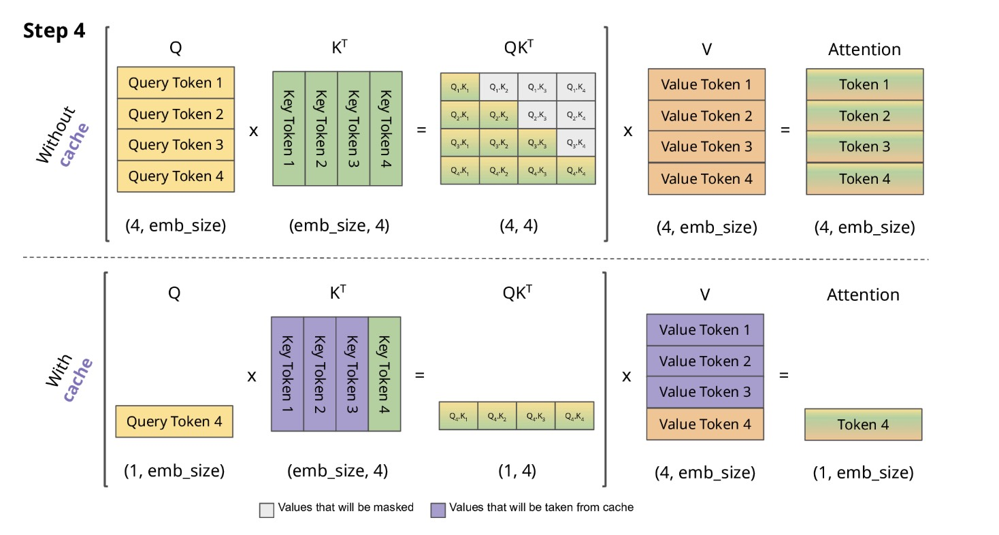

当使用KV Cache的时候，因为需要频繁读写内存，所以算数强度并不理想。因此这推动了MQA技术的诞生。

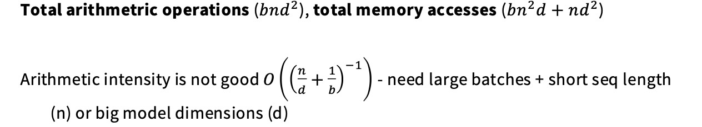

### MQA

MQA 的核心思想是**让所有的注意力头共享同一套键（K）和值（V）投影矩阵**，但每个头仍然保持独立的查询（Q）投影矩阵。

1. **查询（Q）**：

- **保持不变。** 仍然有 H 套独立的查询投影矩阵 $W_Q^{(1)},...,W_Q^{(H)}$。
- 每个注意力头 i 的查询向量 $Q_i$ 仍然是通过 $X⋅W_Q^{(i)}$ 计算得到。

2. **键（K）和值（V）**：

- **共享投影矩阵。** 所有 H 个头只共享**一套**键投影矩阵 $W_K$ 和**一套**值投影矩阵 $W_V$。

在 MQA 中，所有头共享一套 K 和 V，因此只需要**一套**KV Cache。这使得 KV Cache 的内存占用减少了 `H` 倍，从而极大地提高了模型可以处理的最大序列长度，并允许同时处理更多的并发请求。

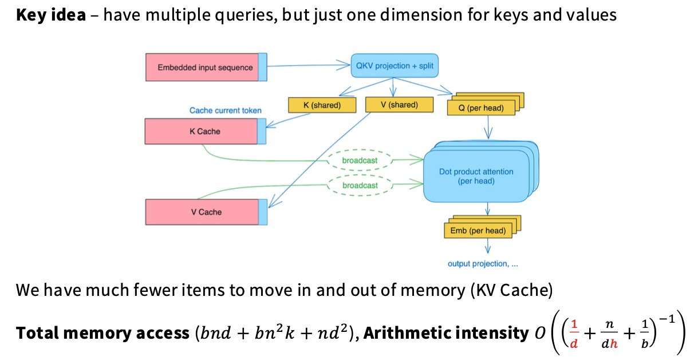

### GQA

 分组查询注意力（Grouped-Query Attention, GQA）可以看作是多头注意力（MHA）和多查询注意力（MQA）之间的一种**折中方案**。它旨在在保持 MHA 的高质量性能和 MQA 的高推理效率之间找到一个平衡点。

GQA 的核心思想是**将注意力头分成多个组（G 组），每组内的所有头共享同一套键（K）和值（V）投影矩阵**。

* 如果 G 等于注意力头数 H，那么 GQA 就退化为 MHA。

* 如果 G 等于1，那么 GQA 就退化为 MQA。

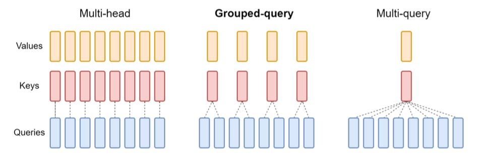

## Sparse / sliding window attention

如何构建更长的注意力模型也是当前的研究热点。有一种方法可以做到这一点：设计某种稀疏注意力机制，与其关注所有的序列，稀疏注意力机制会留意比如说一个本地窗口。

滑动窗口注意力机制是该理念的一种实现方式。在模型的每一层中，系统仅需处理当前位置附近的局部区域。

在LLaMA 4、Gemma等最新论文中提出了创新方法，巧妙设计了Transformer模块的特殊结构：每四个transformer block为一组：最底层模块采用完全自注意力机制，不包含位置编码，而上层的三个模块则采用结合RoPE的滑动窗口机制。

1. 结合了长程和短程依赖的建模能力：局部注意力（Sliding Window Attention）高效地捕捉序列中相邻词元之间的**短程依赖**关系。完整注意力（Full Self-Attention）捕捉**长程依赖**关系。
2. 内存和计算效率的提升：如果所有层都使用“完整注意力”，那么整个模型的开销将是巨大的 $O(N^2)$，支持更长的上下文。
