## MoE的基本概念

混合专家模型非常简单，但是这是一个命名很糟糕的概念。当我们第一次听到专家混合模型时会想，一定是有专门针对不同领域的专家它们在做不同的事情（编程专家、英语专家、数学专家等等）。但其实不是的，混合专家模型是一种高级的架构，它有几个被称为专家的子组件，这些专家是稀疏激活的。并且如果说到MoE，那么它是会与MLP相关的。

MoE架构与非MoE架构在几乎所有的组件上都是相似的，只有一个地方不同，如下图所示：

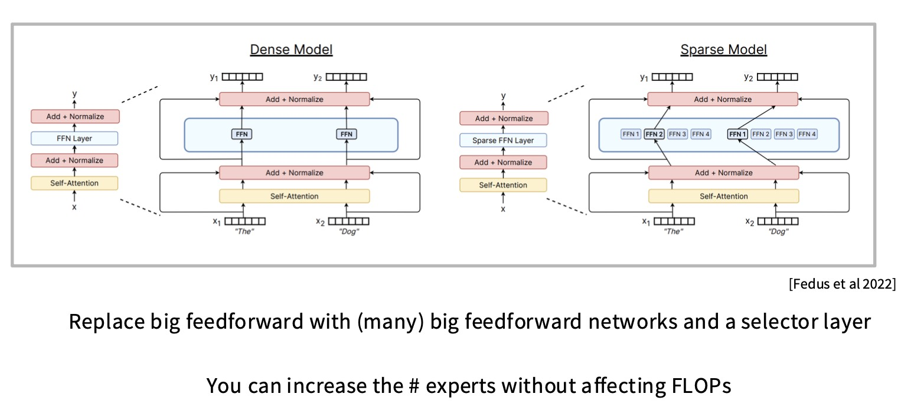

上面是一个标准的Transformer模型。左边就是一个dense model。在sparse model中，MoE需要做的就是取这个FFN然后将其分割或者复制（取决于如何实现）。比如说，你将有FFN的多个副本或者实例。你会有一个路由器在每次前向传播中选择其中一些比较少的FFN数量进行推理。

## MoE的Routing实现

这个过程和注意力机制的计算非常相似。需要先把输入$u \in [seqlen, dim]$与每一个experts `i`的$e_i$向量做内积，这是每个专家学习的一个向量（注意这里的$e$和专家的前向网络FFN是完全不同的），计算专家和输入的亲和性。然后做一次softmax，通过一个top-K函数选择亲和性最好的K个专家，把这个作为门控开关，最后取每个激活专家输出的加权平均，再加上原始输入残差流。

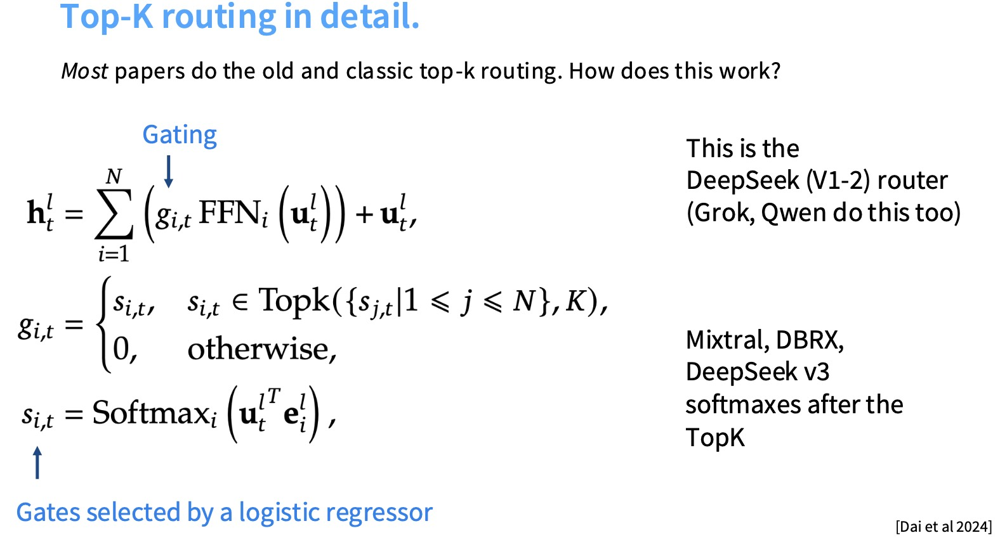

也有使用哈希作为路由算法的实现，有时也能提升一定的性能。可以从两个角度进行解释。在进行哈希的时候，相同的token也会去到相同的专家，因此每个专家仍会获得输入的一个确定子集，这样一来，仍然会发生一些专业化，只不过这种专业化是非语义的。

## MoE的一些变体

人们意识到拥有大量的专家是好的，逻辑的下一步是我们需要大量的专家但不想为拥有大量专家付出参数成本。Deepseek的做法是将专家切分成更小的片段，也就是细粒度专家。

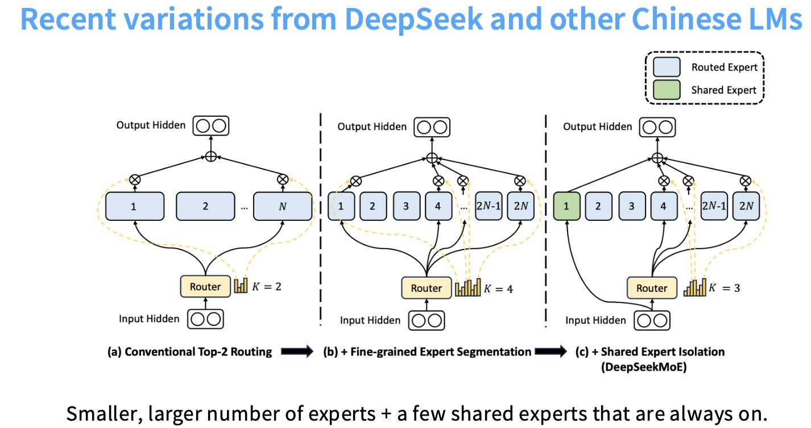

某种意义上的黄金法则是拥有你的隐藏层，然后你将其✖️4，这会给你的投影层。细粒度的专家需要做的就是不是✖️4，可能是✖️2，所以就有一些更小的矩阵，则拥有更多的细粒度专家。

也许拥有至少一些能够捕获共享结构的MLP是有帮助的，比如说无论处理哪一个token总有些计算是需要的。在这种情况下，做所有的这些路由工作似乎有点浪费，这里也就提出了共享专家的概念。

## 如何训练MoE

前面主要是讲MoE的一些前向过程，接下来就是关于MoE是如何训练的。训练的时候我们不能激活所有的专家，这样会有大量的浮点计算，所以我们需要训练时稀疏性，但稀疏门控决策显然是不可微分的。

### 强化学习方法

不可微分的路由决策可以把它看作是一个策略，对它应用强化学习。但其实研究表明，它并没有比使用哈希进行决策好很多。

### 随机近似方法

首先看这个$H(x)$是如何计算的，看下面的公式，为每个专家 `i` 生成原始分数(确定性分数，表示专家 `i` 对输入 `x` 的适配程度)，并添加可学习的高斯噪声。

- **$(x · W_g)_i$**：
  - $W_g$ 是路由权重矩阵。
  - 确定性分数，表示专家 `i` 对输入 `x` 的适配程度。
- **$StandardNormal()$**：
  - 标准正态分布采样（均值为0，方差为1），为每次计算注入随机性。
- **$Softplus((x · W_{noise})_i)$**：
  - $Softplus(z) = log(1 + e^z)$（输出恒为正）。
  - $(x · W_{noise})_i$ 学习噪声的强度：输入 $x$ 不同时，噪声强度自适应调整。

然后通过这个$KeepTopK$函数进行稀疏化操作，选取`k`个得分最高的专家，最后再把这`k`个专家的得分进行softmax，得到最后的$G(x)$作为路由的权重。

噪声鼓励模型在训练时探索更多专家组合，避免陷入局部最优。训练时引入噪声避免模型僵化地绑定某些输入与专家，提升鲁棒性。然后在推理的时候通常移除噪声项，使用确定性的分数。

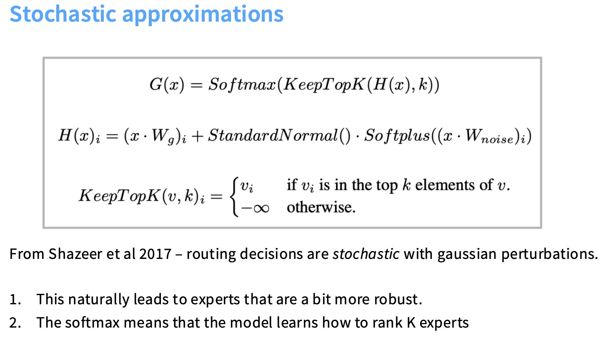

### 启发式平衡损失

MoE模型通常包含大量专家（Expert），但每个输入仅激活少数专家（如Top1或Top2）。若某些专家长期被过度选择（成为"热点"），而其他专家长期闲置就会造成资源的浪费。这个启发式平衡损失就是通过辅助损失函数，**强制路由器（Router）将流量均匀分配给所有专家**。

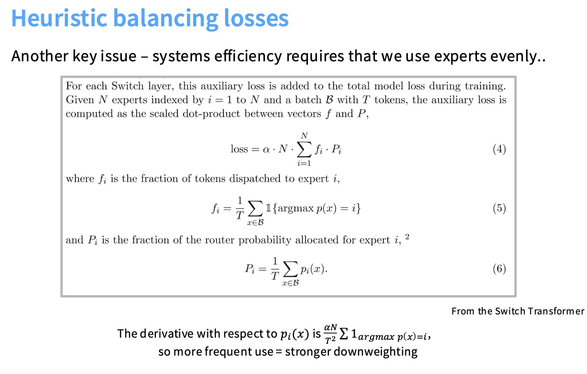

$f_i$表示一个batch里面真正被分配给专家`i`的token的比例。

$P_i$表示Router计划分配给专家`i`的概率总和。

用这两者的点积衡量不平衡程度。

比如说，当激活的专家数量为1时(上面的公式一次只激活一个专家)：

理想情况下，所有专家被均等选择：$f_i=P_i=1/N$，点积值就是1/N。若某些专家 `i` 同时有 高 $f_i$（实际被选多）和高 $P_i$（路由器倾向选它 → 点积值 **增大**，**损失函数会惩罚这种双重不平衡现象**。

**DeepSeek v3在 MoE 负载平衡上的创新设计**，通过**专家偏置（Per-Expert Biases）** 和**轻量级序列平衡损失**实现更高效的负载均衡。

**为什么需要偏置项？**

**直接控制专家竞争力**：

- 若专家 `i` 欠载（被选次数少）→ **增大$b_i$** → 提高其总分 $s_{i,t}$ → 更容易进入 TopK
- 若专家 `i`过载（被选次数多）→  **减小$b_i$** → 降低其竞争力

**避免全局辅助损失**：传统方法（如 Switch Transformer）需添加平衡损失项，可能干扰主任务训练

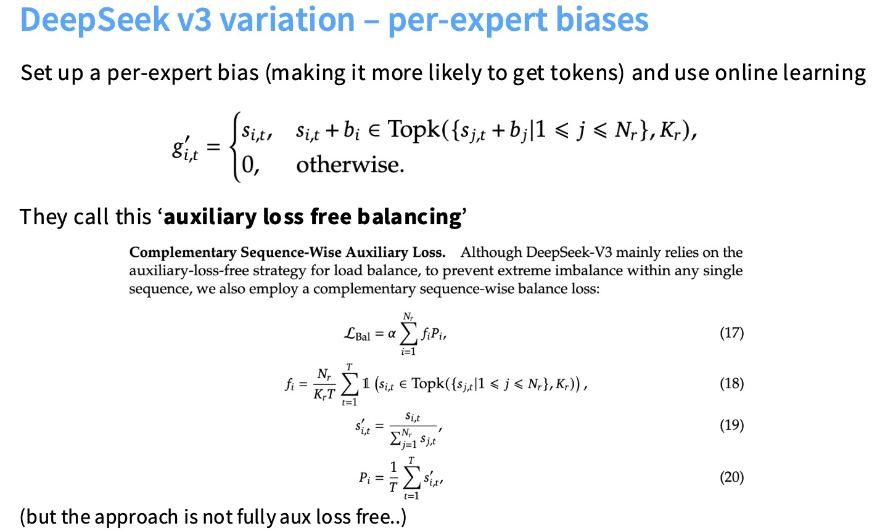

## MoE的稳定性

MoE模型有这样一个特性，当我们尝试微调它的时候，它可能会崩溃。有一个优化方法是在softmax中引入z-loss（具体方法和上一节讲的一样）。

有MoE的架构进行微调通常过拟合现象非常严重（模型很大，但微调数据很小），一个解决方法是在架构MoE的时候，让它不是每一层都是MoE（交替使用）。

### upcycling

upcycling 的基本思想是利用一个已经训练好的传统（稠密）Transformer模型的权重，将其“升级”为一个MoE模型，而不是从头开始训练MoE。避免了从头开始训练一个巨大的MoE模型所需的昂贵成本。通过利用预训练好的稠密模型权重，MoE模型的训练可以更快地收敛。

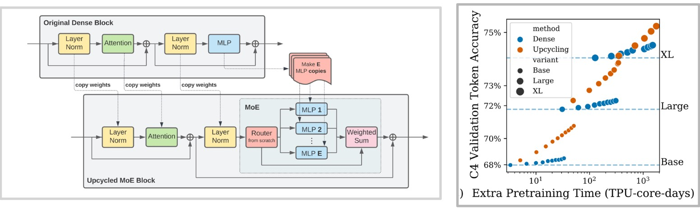

### stochasticity of MoE models

**1.Routing**

**2.Permutation**

* 根据路由结果，token 被分组。例如，"The" 和 "jumped" 都被分配给 Expert-0，"quick" 被分配给 Expert-1，等等。

* 在这一步，引入了一个关键的参数：**`capacity_factor`**。它决定了每个专家可以处理的最大 token 数量。如果分配给某个专家的 token 数量超过了其容量，多余的 token 就会被**丢弃（dropped）**。

**3.Computation**：计算被分配给每个专家的 token。

**4.Un-Permutation**：将专家的计算结果重新排列，并根据路由时的概率进行加权。

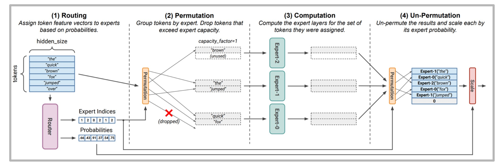

## DeepSeek MoE

这是DeepSeek V3的MoE架构：

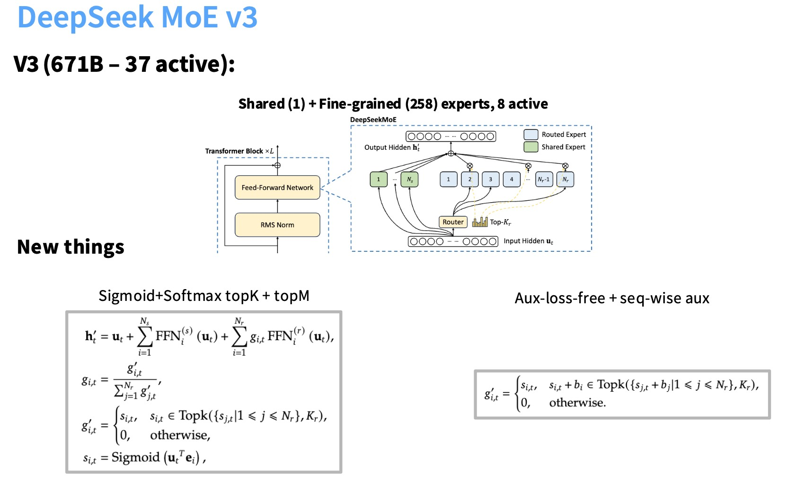

DeepSeek对注意力机制部分有一个巧妙的优化，叫做**MLA**，也就是多头潜在注意力机制。与GQA一样，它也是为了优化KV缓存大小所需要的推理优化。MLA并没有减少头数，而是实际上将这些头投影到一个更低维度的空间。

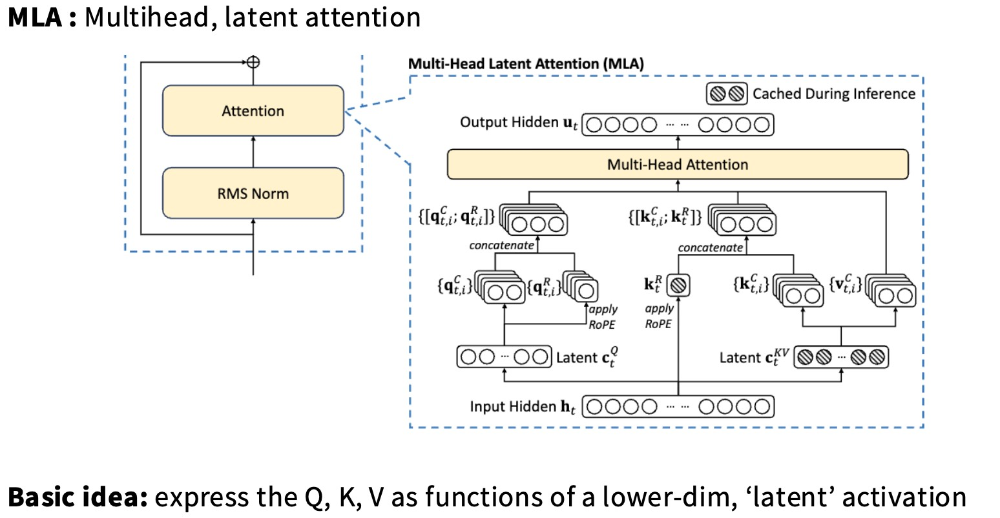

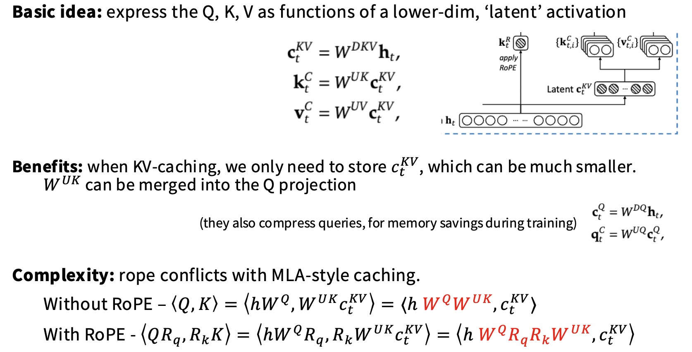

如上图，我们把H(t)投影到一个低维度的C，然后再把它上投影回K和V，我们就只需要缓存C。

但看上图，我们也许会疑惑，这里不是多乘了一个$W^{UK}$吗，这不就需要浪费一些FLOPs吗？

> 巧妙之处在于，对于K我们需要和Q做点乘，Q本身有一个投影矩阵，这里的技巧是，可以把$W^{UK}$和这个$Q$矩阵合并成一个矩阵，我们交给神经网络去学就可以了。$W^{UK}$ can be merged into the Q projection。
