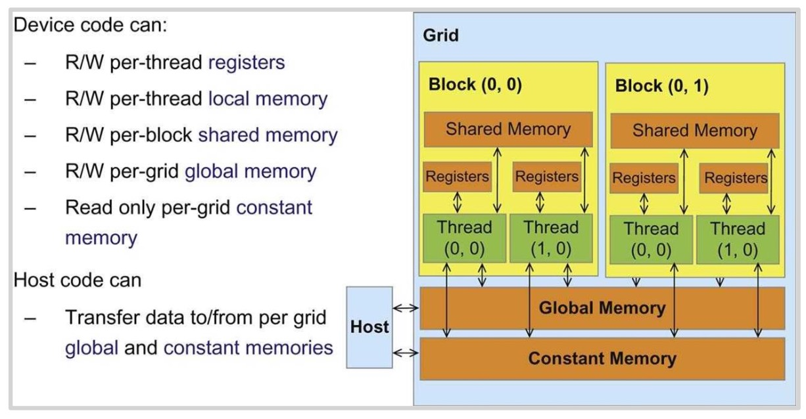
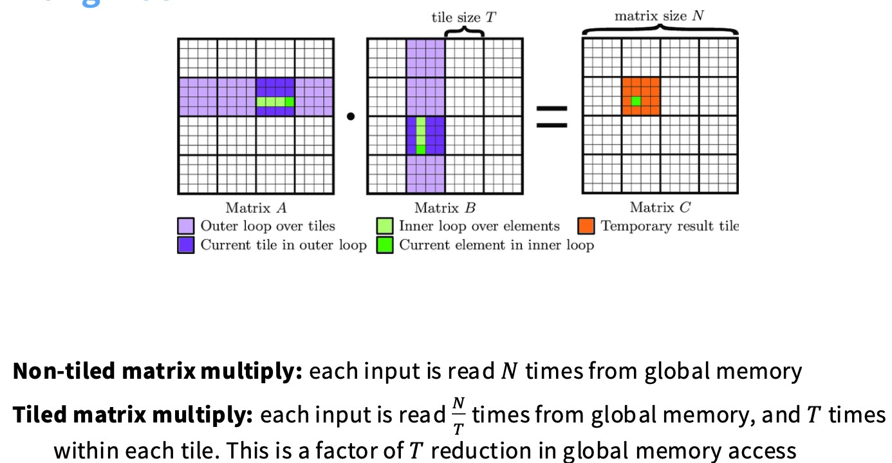
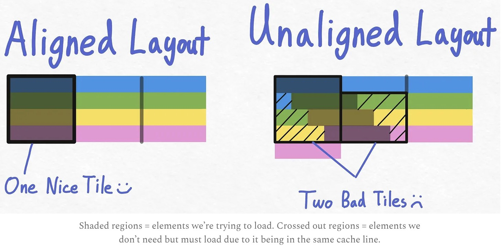
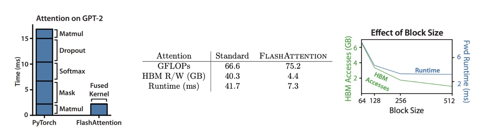
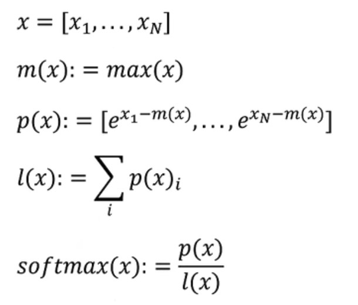
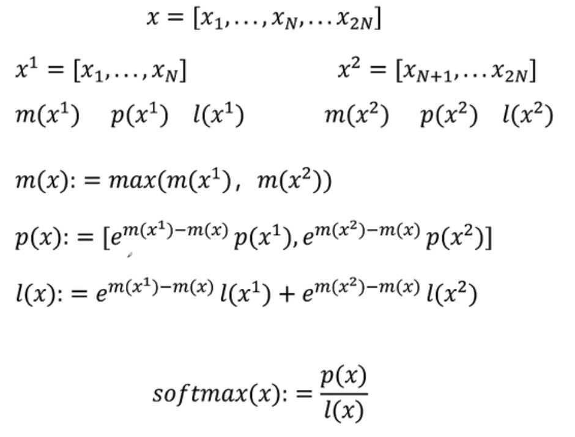
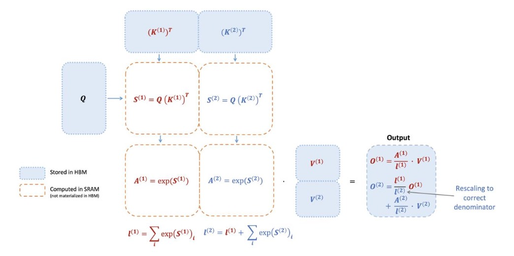

## GPU的计算模型

CPU会把芯片的很大一部分专用于大型控制分支预测。相比之下，GPU有大量大量的计算单元ALUs，用于控制的芯片部分要小很多。CPU和GPU的设计目标是不同的，可以认为CPU是为了优化延迟而设计的（比如说进程调度）；在GPU中，优化的是高吞吐量（只想要所有的任务在总体上尽快完成）。GPU做矩阵乘法的运算速度比做其他运算的速度大概要高一个数量级，并且GPU的计算能力和矩阵乘法已经扩展得非常快，比内存的扩展还要快，所以很多时候内存是GPU进行计算的一个瓶颈。

GPU有很多的SM(streaming multiprocessors)流式多处理器，可以把它看成GPU中的一个原子单元。当我们在像Triton这样的环境中编程时，它们将在SM级别上运行。在每个SM内，包含许多的SP，流式处理器，它会并行执行大量线程。

也就是说，SM有一堆控制逻辑，它可以决定执行什么，SP将采用相同的指令并将其应用到许多不同的数据片段，所以在这个模型下可以做大量的并行计算。右图是A100，它有128个SM。

## GPU的执行模型

有三种粒度：Blocks、Warps、Threads。

* 每一个Block被分配给一个SM，可以理解为一个工作单元，Block里面有很多的Threads，这些线程很轻量。

* Threads是成组执行的，这一个组叫做Warp。一个Warp里面的Threads将在不同的数据上执行相同的指令。

* Warp本质上是一组一起执行的线程，warp之所以存在是为了减少所需要的控制机制（不需要为每一个线程设置一个控制单元），这也是与CPU相比的一个权衡点。

## GPU的内存

在SM内部，会有L1缓存和共享内存。L2缓存在GPU芯片上，紧挨着SMs，再往下是全局内存，它不在GPU芯片内部，有的地方也叫它HBM。

Each thread can access its own register, and shared memory within the block.

下图做的是方阵相乘（x轴表示的是方阵的大小），我们这节课需要完全理解这幅图背后的含义。

## 如何让GPU更快

我们要确保没有不必要的内存访问，对慢速的全局内存访问次数要尽可能少。

### Control divergence

GPU的执行模型是单指令多线程。在下面这幅图中，一个Warp中所有的线程不能同时执行A和X操作。所以在一个Warp内部的条件语句可能具有破坏性。

下面其他考虑的技巧都与内存有关。

### Low precision computation

降低精度可以减少内存访问。

### Operator fusion

算子融合，就是把多个算子操作尽可能在一次内存读取中执行完。

### Recomputation

重计算的思想是牺牲一些计算量来避免进行内存访问。如下图，前向传播s1和s2的值是必须存储的，然后再从内存中读取来计算梯度，但这意味着大量的内存输入输出正在发生。

重计算可以换成下面的计算图，也就是根本不存储这些中间值，在反向传播的时候重新计算它们。

### Memory coalescing and DRAM

全局内存在硬件层面做了一些优化。当读取一块内存区域时，实际上不会只返回那一个值，而会返回一整块内存区域（Burst section）。

在下面这幅图中，A和B以两种方式之一读取矩阵，B的内存访问更加合理。

> 如图右（A图的访问模式），一系列线程试图从左到右访问，比如T0在读取M(0,0)，T1在读取M(1,0)，T2在读取M(2,0)，T3在读取M(3,0)。
>
> **M(0,0),M(1,0),M(2,0),M(3,0)这四个元素不在同一个Burst section中**，所以必须读取整个内存块。而B这样的访问模式就可以节省内存读取。

### Tiling

tiling的思路是将内存访问分组，以最小化我们必须进行的全局内存访问次数。下图是一个矩阵乘法的计算。

我们可以tiling（每个分块都会分配给一个SM），把M拆分为M0和M1，把N拆分为N0和N1。首先load M0和N0，这两个子矩阵做计算，然后load N1，再把M0和N1做计算...这就减少了必须进行的全局内存访问。还有另一个好处，我们在遍历子矩阵的时候可以使用我们想要的顺序进行便利（row major或者column major）。

为什么tiling能work？

传统的非分块矩阵乘法中，为了计算结果矩阵 $C$ 中的一个元素 $C_{ij}$，需要读取矩阵 $A$ 的一整行和矩阵 $B$ 的一整列。因此，$A$和$B$中每个输入元素平均被读取 N 次。

分块（Tiled）矩阵乘法，每次外层循环迭代时，我们只从全局内存中读取矩阵 $A$ 和 $B$ 的一个瓦片（大小为 T×T）。在计算结果瓦片时，这些被读入的瓦片数据在内层循环中被反复使用，而不是每次计算都重新从全局内存中读取。非分块方法的 N 次访问相比，这减少了 N/T 倍的全局内存访问。也就是总共减少T倍内存访问。

因为每个分块都会分配给一个SM，为了不让SM闲置，并且如果是compute bound，那就要优化分块的大小。

**Tiling与Burst Section之间的交互**

如果分块大小（tile）或者矩阵大小不是burst section的倍数，就很容易遇到这种情况：row与burst section不对齐，内存访问量也要翻一倍。

为了确保对齐，我们可能需要在矩阵的边缘进行数据填充，使其维度成为瓦片大小的整数倍。

## Putting it together

回到这幅图，在方阵大小时1536以前，只是没有足够的矩阵乘法工作需要做，一些IO操作成为主要的瓶颈。但我们看到在一些地方，出现了谷底，这也就是tiling的问题。当方阵大小是32或者16的倍数的时候，表现的性能还不错，如果方阵大小只是1或2的倍数，就无法再读取tiles了。

我们看到，在橙色这条线中，有很多地方会有一个巨大的下降，这是为什么呢？

我们看维度从1792->1793的变化，如果我们使用256✖️128的tile size，这里tiles的数量为：
$$
\frac{1792}{256} * \frac{1792}{128}=98 \\
\frac{1793}{256} * \frac{1793}{128}=120
$$
从1792->1793，不仅增加了tiles的数量，而且有些tiles的利用率会很低。一块A100 GPU有108个SM。回顾一下GPU的执行模型，SM可以并行执行，当有98个SM的时候，它们都能运行。一旦有120个tiles，现在tiles数量比SM还要多，所以只有其中108个SM会执行，然后再执行剩下的12个。这叫做**wave quantization**。理想状态下，tiles的数量要么比SM数量大很多，而不是像这种情况，tiles number勉强超过SM的数量。

## Flash Attention

Flash Attention显著加速了attention的计算，这是通过一些CUDA核函数实现的。Flash Attention主要用了两种成熟的技术：**tiling**和**recomputation**。

在进行分块矩阵乘法的时候，因为softmax操作需要计算所有的$e^x$和，只有一行所有的数据都计算完成后才能进行求和计算，而tiling只能计算一个小矩阵，所以这里提出了一种**online softmax**方法，用来解决softmax的分块计算问题。

这是normal softmax，上面除以一个`max(x)`也是为了防止溢出。

当上面的`m(x1)`是最大值时：
$$
p(x)=[p(x^1), e^{m(x^2)-m(x^1)}p(x^2)]
$$
这里我们就可以直接保留我们的`p(x1)`。我们需要一些额外的计算量，但这些计算量对于减少的IO时间都是非常划算的。

所以，我们需要额外保存几个变量，`m(x1)`、`m(x2)`，`l(x1)`、`l(x2)`。

