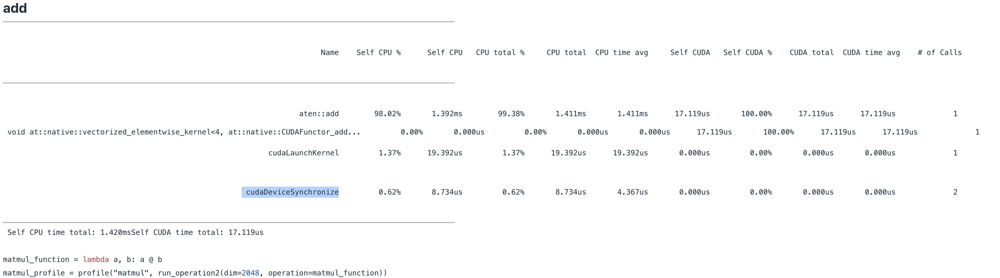
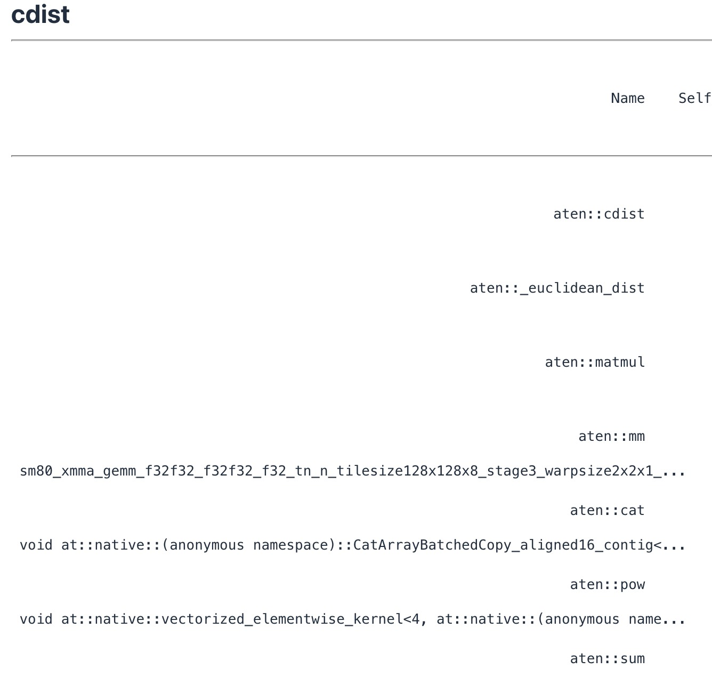

## Benchmarking and Profiling

如果想编写高性能代码，就需要对代码进行基准测试和性能分析。

在进行benchmark的时候，有两个重要的点（具体看课件上的代码）。

1. warmup：在正式计时前，先运行几次`run()`函数。这是非常重要的，因为第一次运行可能会因为GPU内核编译、内存分配或缓存未命中等原因而比后续运行慢。热身阶段可以确保我们测量的是稳定状态下的性能。
2. 调用CUDA同步，`torch.cuda.synchronize()`：GPU和CPU是两个独立的计算单元。执行模型是这里的torch python代码运行在CPU上，然后运行某些东西的时候，它会将一堆CUDA内核分派给GPU，而CPU则会继续执行（不会等待那些CUDA执行停止）。上面的同步代码就是保证CPU和GPU处于相同的状态。

> 1. **翻译指令**：当你用Python编写PyTorch代码时，比如`C=A@ B`，你正在编写的是运行在**CPU**上的指令。
> 2. **生成CUDA内核**：当PyTorch发现`A`和`B`这两个张量（tensors）是在**CUDA设备**（也就是GPU）上时，它并不会在CPU上执行这个操作。相反，它会调用其底层的C++后端，将`A @ B`这个操作**翻译**成一个或多个专门在GPU上运行的函数，这些函数被称为 **CUDA内核（CUDA kernels）**。
> 3. **发送指令队列**：CPU不会亲自去执行这些内核，而是将这些内核的**启动指令**放入一个**指令队列（command queue）**中。这个队列是CPU和GPU之间的“通信桥梁”。
> 4. **GPU异步执行**：一旦指令进入队列，CPU就完成了它的任务，然后会立即回到Python代码的下一行继续执行。**它不会等待GPU完成计算。** 而GPU会从这个队列中取出指令，并行地在其成千上万的CUDA核心上执行这些内核。
>
> 这个“CPU发送指令后立刻继续执行”的机制就是我们之前提到的**异步执行（asynchronous execution）**。它让CPU和GPU能够同时工作，极大地提高了整体效率。当然，张量必须位于CUDA设备上，并且操作有相应的CUDA实现。

Benchmark是一个很粗粒度的工具，只是告诉你代码很慢，但它不会告诉你具体的时间花在哪里，所以我们更想做Profiling。

我们来简单看一下add这个操作的Profiling。



ATen是Pytorch的C语言接口，然后它分派给一个特定的核函数，叫做`vectorized_elementwise_kernel`用于native::CUDAFunctor_add。`native` 表示这是一个由 PyTorch 内部原生实现的、底层的操作。kernel表示这是一个将在 GPU 上执行的 CUDA 内核函数。elementwise表示这是一个逐元素的操作。vectorized：这是一个重要的优化，它表示内核会利用 GPU 硬件的向量化能力。

**`cudaLaunchKernel`**: 这是CUDA运行时API中的一个函数，其作用是**在CPU上启动一个CUDA内核**。当你在PyTorch代码中执行一个需要GPU计算的操作（如`aten::add`）时，PyTorch的后端会调用`cudaLaunchKernel`来把这个计算任务发送给GPU。

**观察结果**

* 可以看到实际调用了哪些CUDA内核，是性能分析器的核心价值之一。
* 根据张量的维度，会调用不同的CUDA内核。
* CUDA内核的名称告诉我们一些关于实现的信息。比如：

sm80_xmma_gemm_f32f32_f32f32_f32_tn_n_tilesize32x32x16_stage3_warpsize2x2x1_ff_main_v1

* **`xmma_gemm`**: 表示这是一个利用Tensor Core（X-MMA, eXtra-fast Matrix-Matrix-multiply-Accumulate）的通用矩阵乘法（GEMM）内核。这说明它使用了GPU的专用硬件来加速矩阵乘法。
* **`f32f32_f32f32_f32`**: 描述了数据类型。
* **`tilesize32x32x16`**: 描述了瓦片大小。

我们来剖析一下更复杂函数的profiling。

**cdist**：点集 A包含 m 个点。点集 B包含 n 个点。`cdist` 会返回一个 m✖️n 的距离矩阵。在这个矩阵中，第 (i,j) 个元素代表点集 A 中的第 i 个点与点集 B 中的第 j 个点之间的距离。


$$
d(x,y)^2=∣∣x−y∣∣^2+∣∣x∣∣^2+∣∣y∣∣^2−2x^Ty
$$
因此，上面有几个ATen的C语言接口：matmul、cat、pow、sum。然后根据GPU时间分配就可以大致确定好需要被优化的方向。

我们可以看到，很多核心的原语，比如Softmax和GeLU，都已经为它们写好了内核，所以GPU并不是执行最简单的原语，而是在执行融合算子，所以CPU和GPU之间不需要来回传输这些数据。

Pytorch的Profile还不是很完善，这里推荐了Nvidia的Insight Systems。


## Kernels

现在我们要实现GeLU，并为其编写一个kernel。
$$
GELU(x)=x⋅Φ(x)
$$
$Φ(x)$ 是高斯分布的累积分布函数（CDF）。因为 $Φ(x)$ 的计算成本较高，通常会使用一些近似形式。tanh近似是其中一种，其数学表达式通常为：
$$
GELU_{approx}(x)=0.5x⋅[1+tanh(\sqrt{2/\pi}(x+0.044715x^3))]
$$
所以GELU的Pytoch实现可以是：

```python
def pytorch_gelu(x: torch.Tensor):
    # Use the tanh approximation to match our implementation
    return torch.nn.functional.gelu(x, approximate="tanh")
```

这是作者的实现：

```python
def manual_gelu(x: torch.Tensor):
    return 0.5 * x * (1 + torch.tanh(0.79788456 * (x + 0.044715 * x * x * x)))
```

可以看到这里有很多的运算，速度会不会变慢呢？使用Profiling工具进行验证。手写的GELU竟然比Pytorch的实现慢了一个数量级。manual_gelu调用了大量的CUDA内核，而pytorch_gelu只启动了一个CUDA内核，Pytorch的开发者肯定使用了尽可能最底层级的语言编写它。我们不会涉及到最低的层面，而是会使用C API编写CUDA内核。
