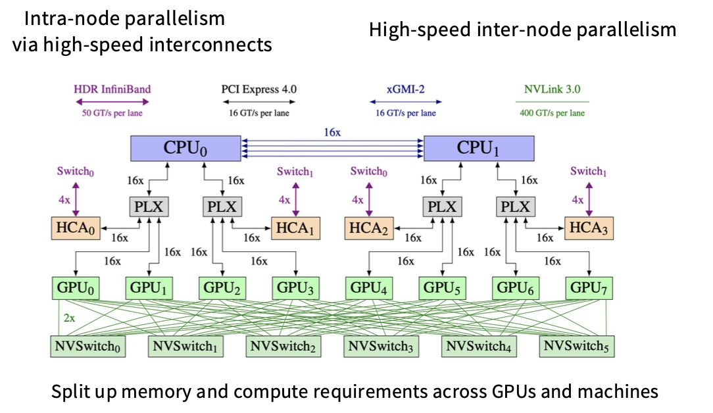
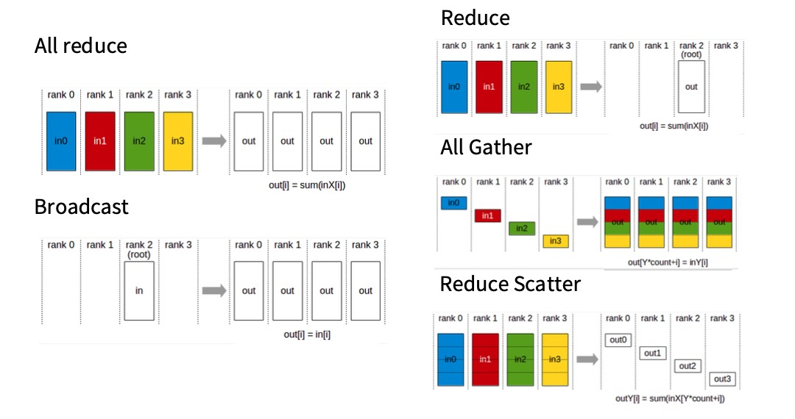
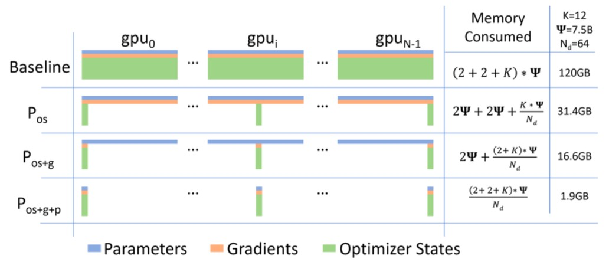

## 本节主要内容

模型变大后，单个GPU装不下，需要把模型分割到不同的机器上。

* Part 1: Basics of networking for LLMs
* Part 2: Different forms of parallel LLM training
* Part 3: Scaling and training big LMs with parallelism

## 网络通信

下面这幅图是一台机器上的8个GPU集群，每个GPU通过快速互联连接到CPU，GPU之间通过NVSwitch建立连接。

如果需要不同机器之间要建立连接，就需要网络交换机，也就是这里的HDR InfiniBand。

下面是对集合通信的简要回顾，这里面有一些等价关系，在并行化算法中需要用到。

在“All Reduce”（全局规约）操作中，开销之所以常被认为是总数据量的两倍，主要是因为它结合了两个主要步骤：**Reduce** 和 **Broadcast**。Reduce: 所有数据需要被传输到某个地方进行合并，然后就是Broadcast (广播) 阶段。

All Gather与Reduce Scatter都相当重要，它们是构建许多并行化算法的基础原语。

下面是一个等价关系：

我们现在考虑的不再是单个GPU，而是一种新的计算单位data center。我们有两个目标：

* linear memory scaling：（GPU⬆️，Model Size⬆️）
* linear compute scaling：（GPU⬆️，Compute⬆️）

我们将用基础原语实现这些算法，也能衡量它们的性能。

* Data Parallelism
* Model Parallelism
* Activation Parallelism

## Data Parallelism

基本思想：将全量参数复制到不同GPU上（不用担心分割参数），将batch进行分割，不同的GPU获取不同的batch切片。

数据并行的起点是SGD，朴素的数据并行就是取批量大小B，将其分割，然后发送到不同的机器，每台机器将计算梯度总和的一部分，然后进行一次同步（**All Reduce**）。通信成本大概是两倍的参数数量，每个GPU也需要复制所有参数，对于内存扩展相当糟糕（不仅是参数，还要在内存中存储梯度、主权重、优化器状态等）。

参数、梯度各2字节，主权重4字节，Adam一阶矩4字节，Adam二阶矩4字节，所以这解释了下面的K=12。

参数和梯度复制在各个设备上是必须的，但是优化器状态并不需要这样。所以提出来了Optimizer State Sharding（优化器状态分片），它通过进行节点间的通信来避免这一切。ZeRO (Zero Redundancy Optimizer) 就是这一解决方案。

比如对于GPU 0，拥有所有的参数和梯度，它有足够的信息计算完整的梯度，但是它不能执行Adam step（它看不到所有的优化器状态）。GPU 0计算梯度后，只负责更新它拥有的分片参数，然后再把参数同步给其他GPU。

### ZeRO Stage 1

## Model Parallelism

不希望所有的GPU都存有模型的全部部分。

## Activation Parallelism

随着模型越来越大，序列长度越来越长，激活内存成为一个非常大的问题。
