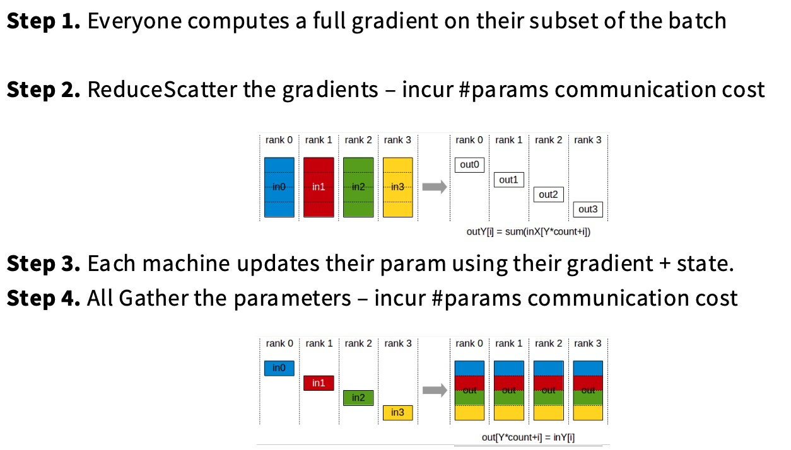
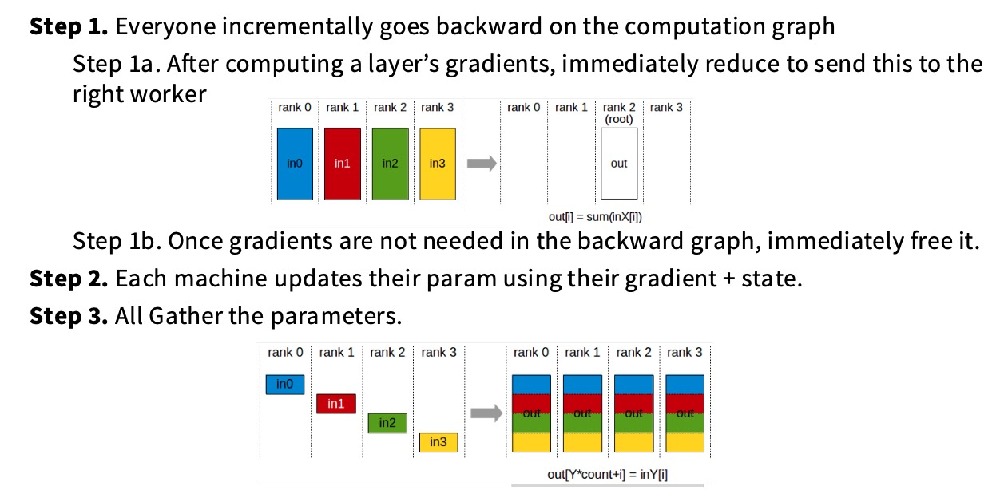
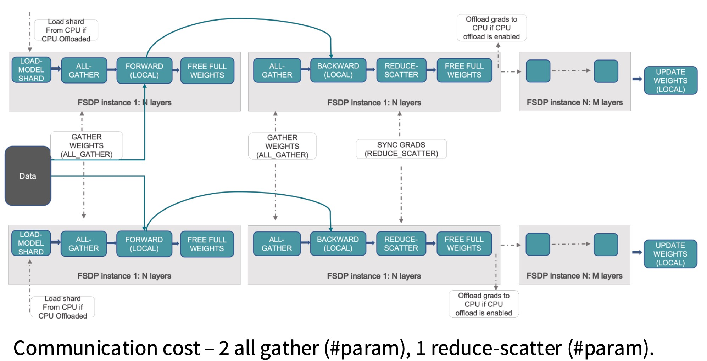
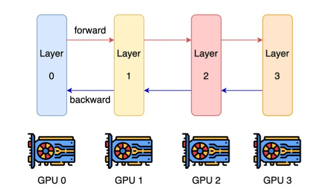
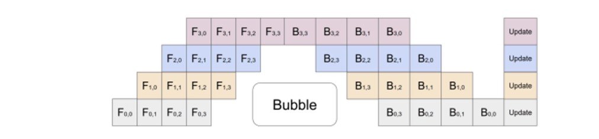
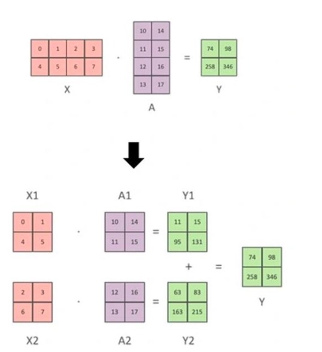
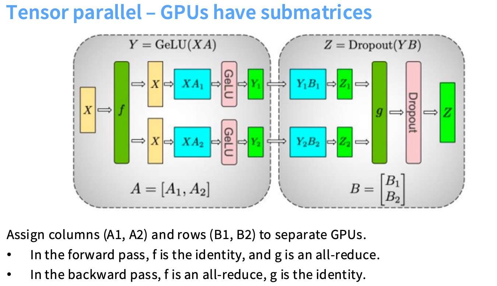
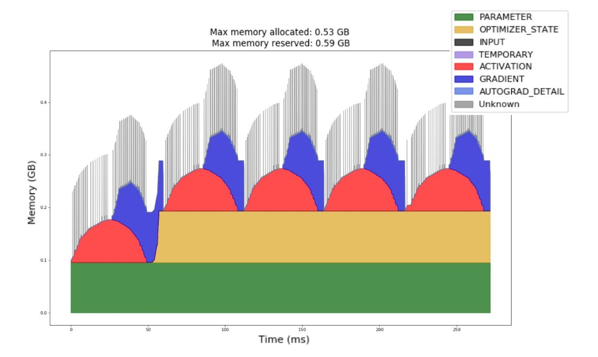
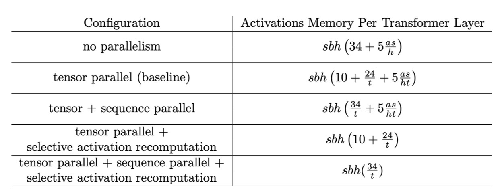

## 本节主要内容

模型变大后，单个GPU装不下，需要把模型分割到不同的机器上。

* Part 1: Basics of networking for LLMs
* Part 2: Different forms of parallel LLM training
* Part 3: Scaling and training big LMs with parallelism

## 网络通信

下面这幅图是一台机器上的8个GPU集群，每个GPU通过快速互联连接到CPU，GPU之间通过NVSwitch建立连接。

如果需要不同机器之间要建立连接，就需要网络交换机，也就是这里的HDR InfiniBand。

下面是对集合通信的简要回顾，这里面有一些等价关系，在并行化算法中需要用到。

在“All Reduce”（全局规约）操作中，开销之所以常被认为是总数据量的两倍，主要是因为它结合了两个主要步骤：**Reduce** 和 **Broadcast**。Reduce: 所有数据需要被传输到某个地方进行合并，然后就是Broadcast (广播) 阶段。

All Gather与Reduce Scatter都相当重要，它们是构建许多并行化算法的基础原语。

下面是一个等价关系：

我们现在考虑的不再是单个GPU，而是一种新的计算单位data center。我们有两个目标：

* linear memory scaling：（GPU⬆️，Model Size⬆️）
* linear compute scaling：（GPU⬆️，Compute⬆️）

我们将用基础原语实现这些算法，也能衡量它们的性能。

* Data Parallelism
* Model Parallelism
* Activation Parallelism

## Data Parallelism

基本思想：将全量参数复制到不同GPU上（不用担心分割参数），将batch进行分割，不同的GPU获取不同的batch切片。

数据并行的起点是SGD，朴素的数据并行就是取批量大小B，将其分割，然后发送到不同的机器，每台机器将计算梯度总和的一部分，然后进行一次同步（**All Reduce**），通信成本大概是两倍的参数数量，每个GPU也需要复制所有参数，对于内存扩展相当糟糕（不仅是参数，还要在内存中存储梯度、主权重、优化器状态等）。

> 参数、梯度各2字节，主权重4字节，Adam一阶矩4字节，Adam二阶矩4字节，所以这解释了下面的K=12。

参数和梯度复制在各个设备上是必须的，但是优化器状态并不需要这样。所以提出来了Optimizer State Sharding（优化器状态分片），它通过进行节点间的通信来避免这一切。ZeRO (Zero Redundancy Optimizer) 就是这一解决方案。

比如对于GPU 0，拥有所有的参数和梯度，它有足够的信息计算完整的梯度，但是它不能执行Adam step（它看不到所有的优化器状态）。GPU 0计算梯度后，只负责更新它拥有的分片参数，然后再把参数同步给其他GPU。这也就引出来了ZeRO。

### ZeRO Stage 1

ZeRO所要做的就是拆分优化器状态，对于一个GPU，它计算梯度，并只更新它所拥有分片的参数。然后对于所有GPU，把参数进行同步。

1. 每个GPU得到不同的数据点，计算这部分数据点的梯度。
2. 将对梯度进行ReduceScatter，将参数全量的梯度发送给负责更新它的GPU，现在每个GPU都拿到了它对应参数的梯度。
3. GPU更新参数和优化器状态。
4. AllGather进行同步，把更新后的参数同步给其他所有的GPU。

### ZeRO Stage 2

在 ZeRO Stage 1 中，我们只对优化器状态进行了分片，每个 GPU 仍然保留了完整的模型参数和梯度。在 ZeRO Stage 2 中，我们在 Stage 1 的基础上更进一步，连梯度也进行分片。这意味着，每个 GPU 不再需要存储所有参数的完整梯度，而只存储它自己负责的那一部分。

因为单个GPU不存储所有参数的梯度，所以GPU在进行反向传播的时候，在计算出每一个层的梯度后，会立即调用一个Reduce的操作，把这一层的参数正确发送到正确的worker节点上（总通信量还是保持不变，额外的开销是必须逐层同步）。

### ZeRO Stage 3

我们将所有东西进行分片（参数、梯度、优化器状态）。FSDP（Fully Sharded Data Parallelism）是 ZeRO Stage 3 的一种实现，它通过将模型的所有状态（包括参数、梯度和优化器状态）在不同的 GPU 上进行完全分片来解决内存瓶颈问题。

主要思想是：随着计算的进行，对模型权重进行All-Gather操作，下面是计算图，它的通信开销是总量的三倍。

但其实FSDP效率很高（通信与计算重叠进行）。

ZeRO Stage 3 的每个 GPU 仍然在独立的 mini-batch 上独立地进行完整的计算，只不过为了节省内存，它不再静态地存储所有参数，而是动态地加载和卸载参数。因此它还是属于Data Parallelism，而不是Model Parallelism。

### Summary

* ZeRO Stage 1基本上是零成本
* ZeRO Stage 2通信成本是2倍的参数量，但在反向传播时，必须逐步释放梯度
* ZeRO Stage 3通信成本是3倍的参数量

数据并行不太依赖于模型架构。

即使是 Zero-2 这样针对内存优化的数据并行方法，也无法从根本上解决模型过大带来的内存限制。虽然 Zero-3 在理论上很好，但在实际应用中可能会很慢，并且无法减少激活内存。并且数据并行是和batch size有比较大的关系的。

理想情况下，我希望完全切分模型，让它们完全独立地运行，这样激活内存也会减少，下面就来讲Model Parrallelism。

## Model Parallelism

我们不希望所有的GPU都存有模型的全部部分，要做的就是把参数分割到各个GPU上。这与ZeRO Stage 3很相似，不同的是，Model Parallelism不会传递参数，它会**传递激活值**。

下面将介绍两种不同类型的Model Parallelism，对应两种不同且分模型的方式。

* Pipeline parallel（流水线并行）
* Tensor parallel（张量并行，更常用）

### Pipeline parallel

首先我们的基本想法就是把模型分层，单个GPU计算模型的某一个部分。但是这样做利用率太低了（首先计算一个batch里面所有的数据，然后才能传给下一层），每个GPU只有在$\frac{1}{n}$的时间才会工作。

为了解决这个问题，就引入了流水线的并行策略。也就是把batch也进行拆分，拆分为micro batch，然后进行流水线作业。

仍有气泡问题，并且效率是和batch size相关的。

 ### Tensor Parallel

在一个大模型中，大部分计算都是矩阵乘法，张量并行的思想就是只并行化矩阵乘法，将一个大的矩阵乘法分解为一组可以相乘的子矩阵。所以pipeline parallel是沿着模型深度的并行，而tensor parallel是沿着模型宽度维度进行切分。

让GPU处理一个不同的子矩阵，然后根据需要进行集体通信来同步计算出来的激活值。

* 前向传播：如下图，把权重矩阵$A$拆分为$[A_1, A_2]$，然后每个GPU都拿到相同的输入$X$，分别得到激活值$Y_1,Y_2$。它们的计算结果需要被“合并”起来，成为下一个模块的输入。这在图中用一个函数 g 表示。下一层计算 $Z=Dropout(YB)$。权重矩阵 B 被分割成了两行子矩阵 $B_1$ 和 $B_2$。$Z_1$ 和 $Z_2$ 通过一个 all-reduce 操作合并，得到最终输出 $Z$。前向传播中，$f$是一个identity，$g$是一个all-reduce。
* 反向传播：计算图是颠倒的。在反向传播中，需要将来自不同 GPU 的梯度信息进行合并（求和），才能正确地更新权重和计算前一层的梯度，所以$f$是一个all-reduce，$g$是一个identity。

基本每一层都需要同步，并且前向传播和反向传播都需要，这需要非常高速的互联。经验法则就是张量并行通常是在设备内部或者单个节点内部的应用（一般来说最多8个GPU）。

## Activation Parallelism

随着模型越来越大，序列长度越来越长，激活内存成为一个非常大的问题。激活内存首先随着前向传播而增长，当进行反向传播的时候，使用完激活值后会释放内存（下面红色的曲线）。

可以使用重计算的方式保持激活值的内存占用率较低。当使用Tensor Parallel时，Activation内存也会有减少。在注意力机制中，一些piont-wise的操作，比如说layer norm，可以在序列上进行拆分。

## Putting it together

如何结合三种主要的并行策略来高效地训练大型深度学习模型。这三种并行策略通常被称为“3D 并行”：张量并行 (Tensor Parallelism)**、**流水线并行 (Pipeline Parallelism)和数据并行 (Data Parallelism)。

1. 解决模型太大，无法被单个 GPU 甚至单个节点（多 GPU 机器）的显存容纳的问题。单个 GPU 的显存无法容纳其权重和激活值时，使用Tensor Parallelism；当即使使用了张量并行，整个模型的所有层加起来仍然太大，无法被单个节点的显存容纳，使用Pipeline Parallelism，将模型的不同层划分到不同的机器，或者使用ZeRO方法。
2. 在解决了模型太大无法放入内存的问题之后（即模型已经被切分并存储在多个 GPU 上），接下来的目标是充分利用所有可用的 GPU，使用Data Parallelism。

