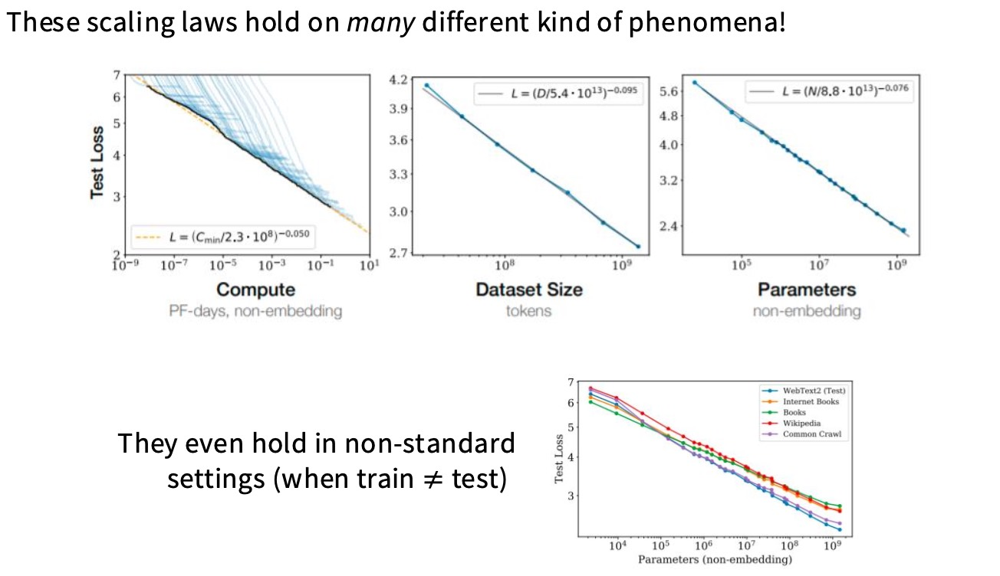
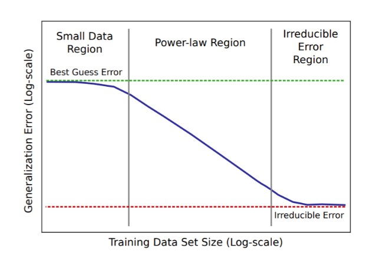
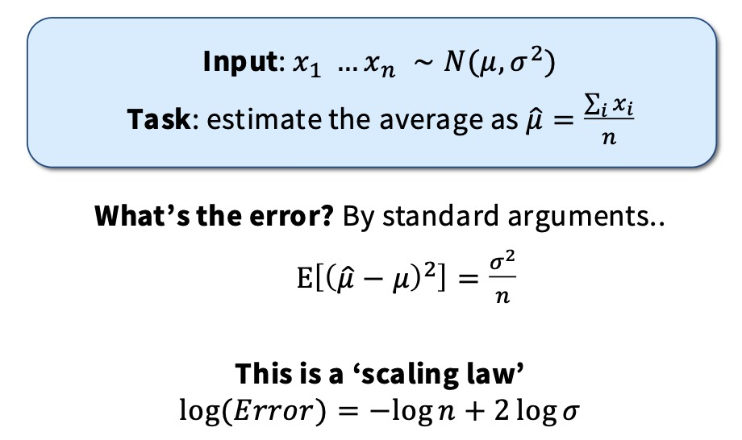
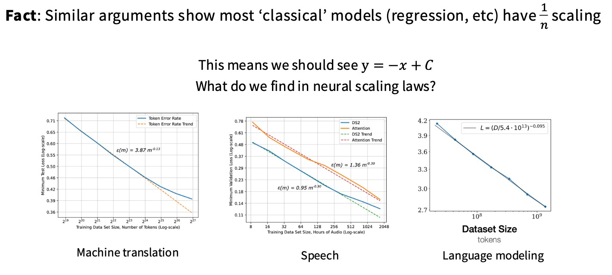
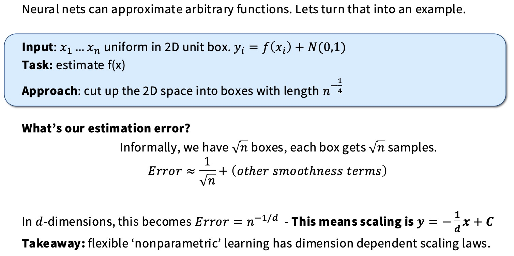
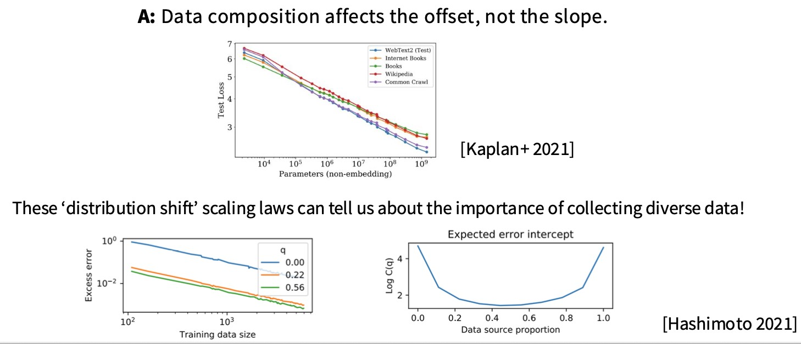
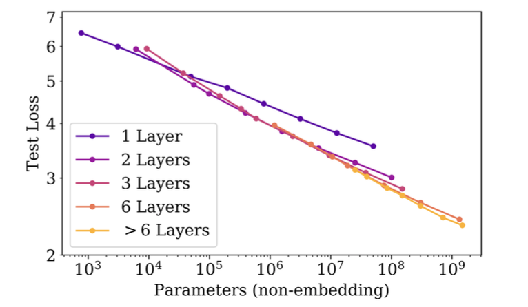
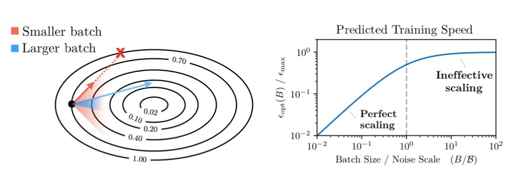
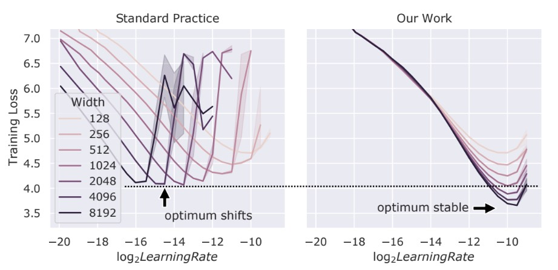

## 什么是scaling laws

Scaling laws是为语言模型的行为建立简单的预测规律，缩放定律的核心思想就是能够从小模型入手，将它们放大，并借此改进工程方法。

> 之前的做法通常是训练一堆大模型（在大模型上调整超参数）让其表现更出色，但这种方法会花费大量的计算资源。在缩放定律中，我们需要训练一堆小模型，从这些小模型中学习很多东西，然后将结果外推到更大的模型，这样当我们构建大模型时，就能一次成功。

在上面的图中，比如说当我们缩放Dataset Size的大小的时候，我们总是假设其他的变量（比如说模型规模）远大于数据集大小所能使之饱和的程度。

看上图中间的Test Loss vs. Dataset Size 

$$L=(D/5.4⋅10^{13})^{−0.095}$$

这个公式表明，损失 L 与数据集大小 D 之间存在幂律关系，幂律指数为 −0.095。实验也表明这些定律甚至在训练集和测试集来自不同来源（非同分布）、下游任务时也成立。

下面将从这几个方面来深入了解Scaling Law：

1. **Data** vs **performance**
2. **Data** vs **model size**
3. **Hyper-parameters** vs **performance**

## Data Scaling

### 什么是Data Scaling

Data Scaling也就是拟合一条简单的公式，将数据集大小映射到我们的误差。

这张图将曲线分为三个区域。

1. Small Data Region(小数据区域)：数据量极少时，模型无法从数据中学习到有用的模式。
2. Power-law Region (幂律区域)：泛化误差开始快速、稳定地下降。在对数坐标系下，这条曲线呈现出一条斜率为负的直线。
3. Irreducible Error Region (不可约误差区域)：模型性能接近于极限。个误差通常由数据本身固有的噪声或模型的表达能力极限所决定。

我们主要关心这里的幂律区域，为什么会呈现这个关系，幂律有什么深层次的含义。我们来看“估计数据集均值”这个简单的任务，看看它的“缩放定律”是什么。输入一个高斯分布，根据统计学知识，采样的样本也遵循一个高斯分布。

估计误差自然地以多项式速度衰减。取对数后，我们对平均值估计拟合出了一个scaling law，斜率为-1。

这个简单的统计学例子，机器学习模型，比如大型语言模型，本质上也是一个复杂的**函数估计器**。尽管机器学习模型要复杂得多，要估计的不是一个简单的均值，而是一个包含数千亿参数的函数，但**信息效率**和**误差衰减**的内在规律似乎是普适的。

大多数“经典”模型（如回归等）都具有$\frac{1}n$的缩放关系。为什么经典模型和现代神经网络模型的缩放定律指数不同？

> $MSE=Bias^2+Variance$。偏差与我们用来近似函数的方格大小有关。在一个小方格内，函数 f(x) 的变化量大约正比于方格的边长 h。

上面这个例子可以看到缩放定律与数据的内在维度密切相关。

* **经典模型**：在简单的回归等任务中，误差的下降速度与数据量成**反比**（n−1）。这意味着，增加数据量可以带来非常显著的性能提升。

* **神经网络**：在更复杂的任务中，比如语音和语言模型，幂律指数通常远小于1（例如 −0.35 或 −0.095）。

**这意味着什么？**幂律指数越接近0（绝对值越小），曲线在对数坐标系下越平缓，这意味着**增加数据量带来的性能提升越小**。例如，语言模型的 −0.095 指数表明，尽管增加数据量依然有效，但需要海量的数据才能获得可观的收益。

### 如何使用Data Scaling

1. 数据集的组成只影响偏移量，不影响斜率。模型的缩放定律指数（即斜率）是相对稳定的，它主要由模型架构和任务的本质决定，与具体的测试数据组成无关。这意味着不一定非得在超大规模下训练模型，可以将模型缩小，在小得多的模型上进行数据选择实验，尝试找出最优的数据混合。

2. 之前我们假设数据是无限的，现在我们必须考虑当数据不再无限时，如何最有效地利用有限的数据。在训练初期，重复数据和新数据带来的性能提升差不多，但随着重复次数的增加，其回报会迅速递减。

## Model Scaling

主要考虑下面这几个选择：Architecture、Optimizer、Aspect ratio / depth、Batch size。

1. Architecture：Transformer架构比LSTM架构更好
2. Optimizer：针对数据集大小做scaling law
3. Aspect ratio / depth：depth 还是 width 影响巨大呢，1 vs 2 layers 看起来差异巨大，增加 layer 后 loss 更低，但其他看起来都比较 stable。

4. Batch size：batch size超过了某个点后会有收益递减。也就是说当batch size小于noise scale时，增加batch size几乎等同于多迈出几步梯度更新（相当于将batch size翻倍，其效果就像迈出两步梯度更新一样好）。临界批量大小（Critical Batch Size）：**Critical batch = min number of examples for target loss / min number of steps for target loss 。**

5. Learning rate：观察左图最优的学习率在不同的点。增大模型规模（width），最优学习率会比较小。也就是学习率应该以宽度的倒数这个速率进行缩放。果我们盲目地增加模型大小，就需要重新调整学习率，而且这个过程非常敏感。muP 是一种参数化方法，它通过重新设计模型的初始化和学习率的缩放规则，使得在扩展模型大小时，最优学习率保持不变。

值得注意的是，训练阶段的 scaling 是可控的，但下游任务的 scaling 常常不确定，比如一些 benchmark 的表现。

还有一个问题是：我们是需要更多的数据还是更大的模型？

* 增加 n 或 m 都能降低 Error，但收益是幂律递减的
* 总误差是两个误差源的加和：数据不足 + 模型容量不足
* 最终误差会收敛到某个不可降低的最低误差 C

## How to use

**Train a few smaller models** (训练一些较小的模型): 首先，你需要用较小规模的模型进行实验。

**Establish a scaling law (e.g. ADAM vs SGD scaling law)** (建立一个缩放法则): 通过分析这些小模型在不同设置下的表现，你可以归纳出性能如何随模型规模、数据量或超参数的变化而变化的规律。比如，你可以发现使用Adam和SGD时，性能随模型规模增加的趋势是不同的，这就是一个“缩放法则”。

**Select optimal hyperparam based on the scaling law prediction.** (根据缩放法则的预测选择最优超参数): 有了这个法则，你就可以预测出在大规模模型上哪种超参数组合会带来最好的结果，而无需进行昂贵的大规模实验。

