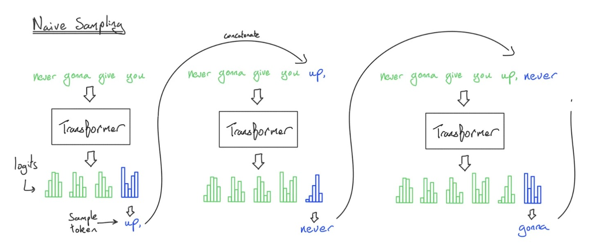
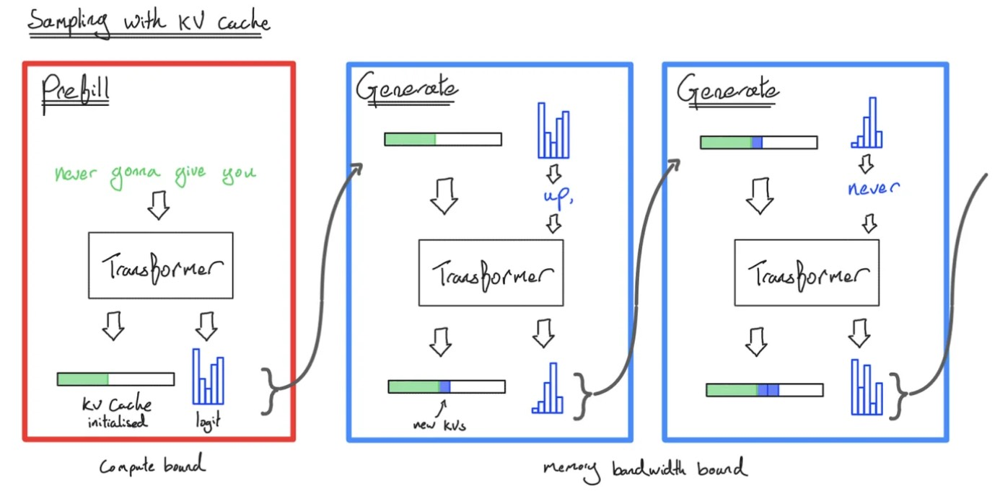
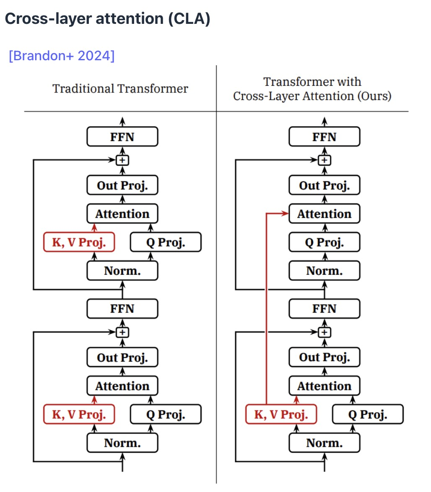
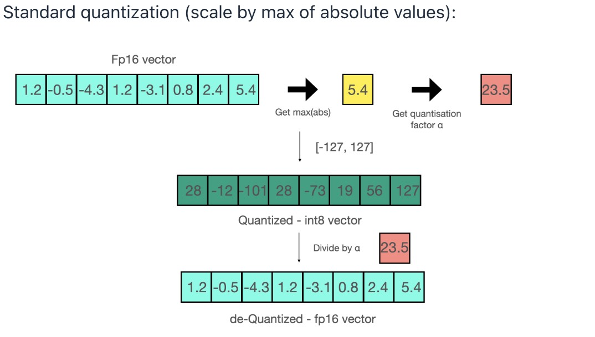
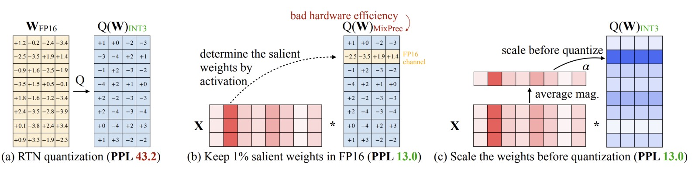
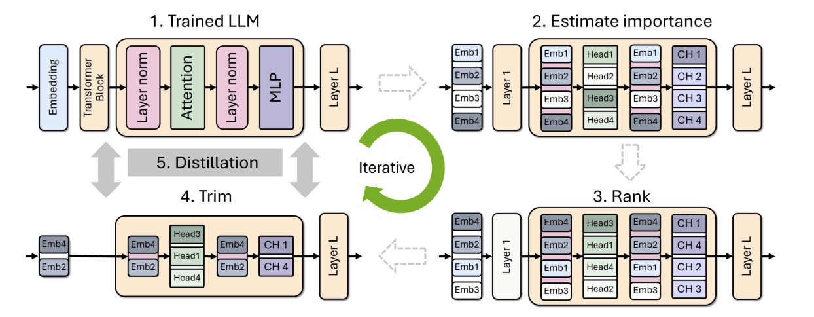
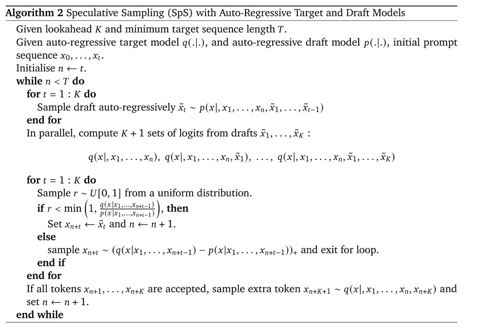
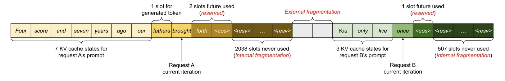
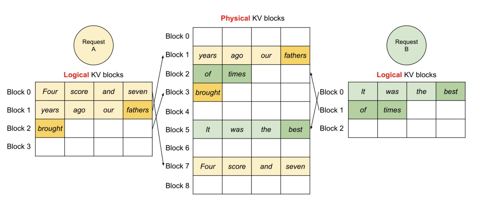
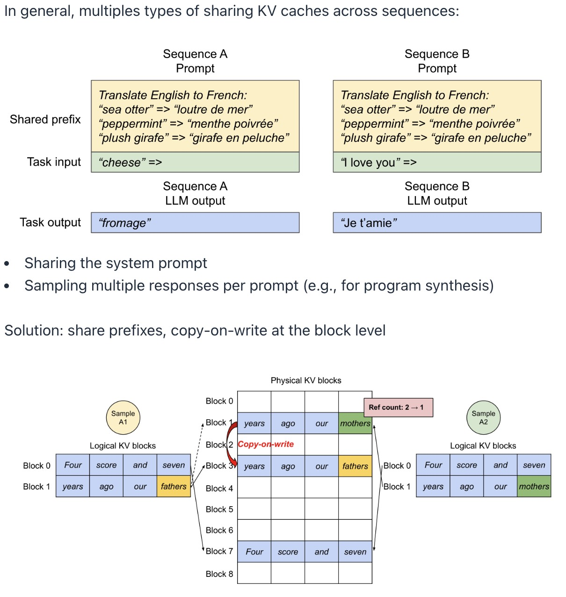

## 大模型推理

推理就是一个简单的问题，给定我们已经训练的固定模型，根据提示输出响应。训练是一次性成本，而推理需要重复很多次。

如何评价推理的好坏，这里有一些常见的metrics：

1. Time-to-first-token(TTFT)
2. Latency(seconds/token)：在第一个token生成之后token到达的速度，针对用户而言。
3. Throughput(tokens/second)：一般是生成多少token，不是针对所有用户。

如何考虑推理的效率：

* Training(supervised)：可以看到所有的token，并行化高。
* Inference：必须按顺序生成，token的生成依赖于所有过去的信息。

推理有两个阶段：

* Prefill（预填充）：给定一个prompt，编码为向量（可以并行）
* Generation（生成）：逐个顺序生成响应token（顺序，在效率上需要被优化）

### 对MLP层和Attention层分别计算FLOPs和memory IO

$$
Arithmetic \: Intensity = \frac{Computation \: FLOPs}{Communication \: Bytes} 
$$

* compute-limited：计算单元被充分利用，理想状态
* memory-limited：计算单元经常空闲，非理想状态

S是prompt中token的个数，T是我们需要生成的token数量。

**MLP层计算分析**，MLP层的arithmetic intensity=B*序列长度。

* 对于Prefill，compute-limited，理想状态
* 对于Generation，序列长度为1，memory-limited，生成阶段需要高并发请求才能缓解瓶颈

**Attention层计算分析，以FlashAttenstion为例**，它的arithmetic intensity=S*序列长度/(S + 序列长度)。

* 对于Prefill，arithmetic intensity=S/2，compute-limited
* 对于Generation，compute-limited<1，memory-limited

为什么Attention层的Arithmetic Intensity不依赖于B？

* 在MLP层中，每一个sequence都命中相同的MLP权重
* 在Attention层中，每个序列都有自己的KV Cache（序列特定的）

**总结**：Prefill是compute-limited，Generation is memory-limited。

## KV Cache

KV Cache是对于batch中的每一个序列，对于序列中的每一个token，对于transfomer的每一层，对于每一个head，都将存储一个h维向量。

有几种方法可以减少KV Cache的大小，其中GQA、MLA在之前讲过，在这里不做介绍，这里介绍一下CLA（Cross-layer attention），主要思想是在不同层之间使用相同的Key Value投影。

Local Attention也可以减小KV Cache，但是这会破坏注意力机制的初衷（处理长距离依赖）。所以可以将局部注意力与完全注意力混合交错使用（减小KV Cache大小但又不想牺牲太多准确性）。

引入架构上的变化也可以从根本上解决KV Cache的问题。

## Quantization

量化的核心思想是降低数值的精度。可以减少内存占用，更高的吞吐量和更低的延迟 (latency)。降低精度的主要挑战是保持模型的准确性。

FP32通常用于模型训练，BF16是推理的默认选择，当然也可以使用更低的精度进行推理。

有两种主要的量化方法。

* **Quantization-aware training (QAT)**：在训练时就引入量化，在模型的训练循环中，模拟量化操作（如舍入），并让模型学习如何适应这种精度的降低。 因为模型在训练时就“意识”到了量化的存在，所以其最终的量化模型通常能保持较高的准确性。
* **Post-training quantization (PTQ)**：在训练完成后进行量化。 用一小部分样本数据来校准模型，PTQ 会统计每一层或每个张量（tensor）的激活值分布，然后计算出最佳的缩放因子和零点 ，从而将浮点数有效地映射到低精度的整数。

传统的量化方法：

传统方法通常采用一个简单的缩放因子，基于向量中的最大绝对值（`max(abs)`）来将所有浮点数映射到 Int8 的范围 `[-127, 127]`。通过把Int8的数除以缩放因子得到原来的FP16，这一步也叫做de-Quantized。所以我们看到，模型量化需要我们存储所有的这个Int8参数和这里的缩放因子，也就大大减少了模型的大小。

但是有一个问题，如果向量中有一个非常大的异常值，比如 `100`，那么缩放因子就会非常小（`127 / 100` 约 `1.27`）。这样一来，大部分“正常”的、较小的值（例如 `1.2`）在量化后会变成一个非常小的整数（`1.2 / 1.27` 约 `0.94`），四舍五入后可能变成 `0` 或 `1`。这会导致**绝大多数信息丢失**，严重影响模型精度。

所以下面给出了一些量化方法。

### LLM int8()

LLM int8的出发点不是推理速度（会有额外的运算），而是把模型装进内存。

**核心思想：** 将异常值**提取出来 (extract outliers)**，并以更高精度（FP16）来处理，而将大部分没有异常值的激活值以低精度（Int8）进行处理。也就是拆分为两个矩阵：

* 异常值矩阵$W_{FP16}$：包含所有异常值，其余位置填充为 0。
* 常规值矩阵$W_{int8}$：包含所有非异常值，其余位置填充为 0。

我们有了两个独立的矩阵乘法任务。

* $Out_{FP16}$：$Out_{FP16} = X @ W_{FP16}$，矩阵非常稀疏（大部分是 0），这个计算非常快。
* $Out_{int8}$：需要先对 $W_{int8}$ 进行 Int8 de-Quantized。然后再与$X$相乘。

最后一步，将两个计算结果相加，得到最终的输出：

$Y = Out_{FP16} + Out_{int8}$

### Activation-aware Quantization

这里的想法是量化基本的权重。根据激活来确定哪些权重需要量化。

在大语言模型（LLM）中，只有一小部分（通常是 0.1% 到 1%）的权重对模型的性能至关重要。这些重要的权重往往是那些与**大激活值（large activations）**相乘的权重。因为即使权重本身数值不大，一旦乘上一个很大的激活值，其对输出的影响就会变得非常显著。

* RTN quantization (Round-to-Nearest)：这是最简单的量化方法。

* Keep 1% salient weights in FP16：通过激活值来**识别出那些重要的、对精度有决定性影响的权重**。`X` 向量中颜色较深的格子代表数值较大的激活值。 将原始矩阵 `W` 分解为两部分，这种**混合精度计算会降低硬件的并行效率**。

*  Scale the weights before quantization (AWQ)：对于每一层，AWQ 都会搜索一组**通道级缩放因子（per-channel scaling factors）**。这些缩放因子的作用是：**缩放权重（Scale down weights）：** 将那些与大激活值对应的权重**放大**，使其在量化时不容易丢失信息。**缩放激活（Scale up activations）：** 在数学上，这种操作是等价的，它通过在激活和权重之间插入一个对角矩阵来实现。

  **优化目标：** 搜索的目标是找到一组缩放因子，使得量化后的权重矩阵与原始浮点数权重矩阵的乘积，在给定激活值下的**量化误差最小**。

### Model Pruning（模型剪枝）

将一个庞大而昂贵的模型中不重要、冗余的部分移除，使其变得更小、更快，然后通过一些方法（如微调）来“修复”由此可能造成的性能损失。

1. 识别重要性 ： 使用一个小的校准数据集来评估模型中不同部分（如 `layer`、`head`、`hidden dimension`）的重要性。
2. 根据上一步的重要性排序结果，移除那些排名靠后的、不重要的部分。图中，原始模型有 4 个注意力头，而裁剪后的模型只保留了 3 个。
3. 蒸馏原始模型到剪枝后的模型：移除部分后，模型的性能通常会下降。使用知识蒸馏 的技术。将裁剪前的原始大模型的输出作为参考，来指导裁剪后的小模型进行微调。

## speculative sampling

上面的方法虽然获得了巨大的加速，但是它们都是有损的。所以推测性解码或者推测性采样（speculative sampling）基本上可以兼得。

推测性采样的想法是：使用一个廉价的草稿模型（draft model）P，让它先跑起来生成一些token，然后使用一个目标模型来评估这些token，因为评估给定token的过程是prefill，这一步非常快。如果看起来没有问题，就接受它。有时大模型也会拒绝草稿模型的生成。

在自回归模型的推理过程中，生成一个 Token 的过程（特别是使用大型、昂贵的模型）是计算密集型的。而检查一个 Token 是否正确的过程则相对简单。

**目标模型 `q`：** 一个大型、准确但缓慢的模型（例如 Llama 70B）。

**草稿模型 `p`：** 一个小型、快速但不太准确的模型（例如 Llama 7B）。

当前已有的序列 `x_0, ..., x_t` 开始。使用**草稿模型 `p`**，以自回归的方式，生成 `K` 个 Token 作为草稿，将**整个序列** `x_0, ..., x_t, x_t+1, ..., x_t+K` 一次性输入到**目标模型 `q`** 中。目标模型 `q` 会**并行地**计算出这 `K` 个 Token 的概率分布（验证评估比生成token要快，可以并行）。对于每一个草稿 Token `x_t+k`，比较草稿模型 `p` 预测的概率 `p(x_t+k)` 和目标模型 `q` 预测的概率 `q(x_t+k)`。如果 `q(x_t+k) / p(x_t+k)` 的值大于一个随机数，则接受这个 Token。只要有一个 Token 被拒绝，那么该 Token 及其后面的所有草稿 Token 都会被丢弃。

如果所有 `K` 个草稿 Token 都被接受，那么将它们全部添加到最终序列中，继续下一次循环。如果在第 `k` 个 Token 被拒绝，那么我们只接受前 `k-1` 个 Token，然后从第 `k` 个 Token 开始，用目标模型 `q` 重新生成一个 Token，并开始下一次循环。

## Continous Batching

 连续批处理主要解决了 LLM **推理服务**中的一个关键性能问题。

传统的批处理（Batching）在训练和推理服务中面临不同的挑战：

* 训练：在训练时，我们通常使用固定大小的批次和固定长度的序列，所有数据都被填充（padding）到相同的长度，形成一个规整的、密集的张量，这使得 GPU 可以高效地并行计算。
* 推理：来自用户的请求是**异步到达**的，并且每个请求的序列长度各不相同。这就形成了一个不规则数组，如果仍使用传统的批处理，我们必须等待所有请求都完成才能开始下一个批次，或者填充（padding）到最长序列的长度。

解决方法：

* **逐步解码（Decode step by step）：** 每个请求的生成过程被拆分为一个个独立的步骤。
* **动态批处理（Dynamic batching）：** **新的请求可以在任何时候加入到当前的批次中**，而不需要等待整个批次完成。

这样新的请求可以立即开始处理，无需排队等待。

## Page Attention

**内部碎片（Internal fragmentation）**：当为某个请求分配 KV Cache（用于存储 Key 和 Value 向量）时，即使分配了足够的连续内存块，也可能因为请求的实际长度小于分配的长度，导致一部分空间被浪费。

**外部碎片（External fragmentation）**：多个请求的 KV Cache 内存块分散在不同的位置，导致大块的连续空闲内存无法被利用。

PageAttention 的解决方案就是借鉴操作系统的分页机制：

传统的方法是为整个序列分配一个大的、连续的 KV Cache 块。PageAttention 的做法是，将 KV Cache 的序列分成许多小的、非连续的块（blocks）。这意味着，一个序列的 KV Cache 可以存储在不连续的物理内存位置上。

在某些场景下，不同的请求或序列可能包含相同的部分，因此这些相同部分的 KV Cache 可以被共享，而不需要重复计算和存储。PageAttention 解决这个问题的方案：**在块（block）级别共享前缀，并使用“写时复制”（copy-on-write）机制**。

