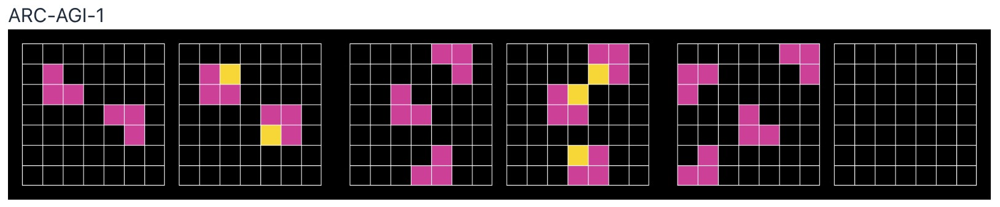
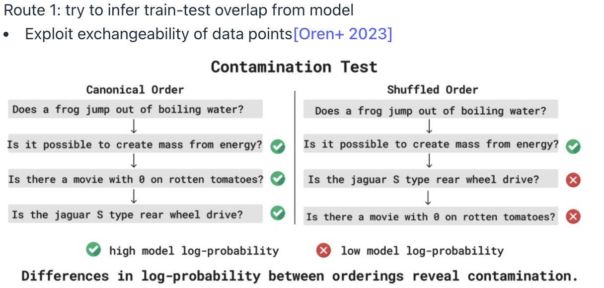

## Evaluation

你选择的具体评估取决于你想要模型具有什么样的功能。关于评估，这里有一个简单的框架：

1. What are the **inputs**?
2. How do **call** the language model?
3. How do you evaluate the **outputs**?
4. How to **interpret** the results?

## Perplexity

困惑度本质上衡量了语言模型对某个数据集赋予高概率的程度。

首先，我们知道一个语言模型可以给一个文本序列赋予一个概率。这个文本序列就是我们的**数据集 D**。假设数据集 D 包含一系列词语（token），比如 w1,w2,…,wN，其中∣D∣= N 是词语的总数。

语言模型会计算这个序列出现的总概率，即 p(D)=p(w1,w2,…,wN)。根据概率论的链式法则，这个总概率可以分解为每个词语在其前面所有词语出现的情况下，出现的**条件概率**的乘积：

p(D)=p(w1)×p(w2∣w1)×p(w3∣w1,w2)×⋯×p(wN∣w1,…,wN−1)

- p(w1) 是第一个词语出现的概率。
- p(w2∣w1) 是在已知第一个词语是 w1 的情况下，第二个词语是 w2 的概率。
- 以此类推，每个项都代表了模型对“下一个词语是什么”的预测。

**一个好的语言模型会给这个真实数据集赋予一个很高的概率值 p(D)。**

#### 困惑度公式的直观含义

现在我们回到困惑度公式：
$$
(\frac{1}{p(D)})^{\frac{1}{|D|}}
$$

- **逆概率$\frac{1}{p(D)}$**：概率 $\frac{1}{p(D)}$越小，$\frac{1}{p(D)}$ 就越大。这可以理解为模型对整个数据集的“不确定性”或“惊讶程度”。
- **平均数$\frac{1}{|D|}$** :这相当于将整个数据集的“不确定性”**平均分配到了每个词语上**。

所以，**困惑度可以被直观地理解为语言模型在预测下一个词时，平均有多少种“备选项”**。

- 如果困惑度是 100，这就像是模型在预测每一个词时，平均有 100 个同样可能的词供它选择。
- 如果困惑度是 10，那么平均只有 10 个可能的词。

很显然，**备选项越少，模型的预测能力越强，也说明模型对这个数据集“越不困惑”**。

过去，研究者们通常在一个标准数据集上进行训练，然后在同一个数据集的测试集上进行评估。这是一种“同分布（in-distribution）”评估。GPT-2在一个非常庞大且多样化的数据集 WebText上进行训练，然后**在标准数据集上进行“零样本（zero-shot）”评估**。这是一种**“分布外（out-of-distribution）”评估**。这种方法验证了大型模型在海量数据上训练后，可以具备强大的泛化能力。

自 **GPT-2 和 GPT-3** 之后，语言模型的研究重心从单纯追求低困惑度**转向了下游任务（downstream task）的准确率**。

尽管风向变了，但困惑度并非过时，它在某些方面仍然非常有用。

* 平滑性（Smoother）： 困惑度的曲线比下游任务的准确率曲线更平滑，这使得它非常适合用来研究模型的**“缩放定律（scaling laws）”**，即模型规模（参数量、数据量）与性能之间的关系。

* 普适性（Universal）：困惑度是一个通用的指标，因为它衡量的是模型对语言本身的理解，而任务准确率可能无法捕捉到所有的细微差别。

* 条件困惑度（Conditional Perplexity）：笔记提到，我们也可以测量特定下游任务的“条件困惑度”，这结合了困惑度的优点和任务导向的评估。

## Knowledge Bechmarks

### **Massive Multitask Language Understanding (MMLU)**

MMLU是一个用于评估大型语言模型（LLMs）能力的基准测试。包含57个不同主题的多任务集合。

### **Graduate-Level Google-Proof Q&A (GPQA)**

GPQA (Graduate-Level Google-Proof Q&A) 是一个用于评估大型语言模型（LLMs）的基准测试，它旨在衡量模型在回答需要深入理解和推理的复杂科学问题方面的能力。些问题是由61位拥有博士学位（或正在攻读博士）的专家撰写的，他们来自生物学、物理学和化学等领域。这确保了问题的专业性和挑战性。

### Humanity's Last Exam

“Humanity's Last Exam” (人类的最后一场考试) 是一个专门为评估大型语言模型（LLMs）而设计的基准测试，被认为是目前最全面、最具挑战性的测试之一。目前，即使是顶尖的AI模型，在这个测试上的得分也相对较低。

## Instruction Following Bechmarks

上面的基本都是多项选择题或者简答题，这是关于指令遵循的基准测试。像ChatGPT这类模型，其核心能力是“指令遵循”，即用户给出什么指令，模型就去执行。

**Chatbot Aren**的评估方法。Chatbot Arena 的运作方式：

1. **随机用户输入：** 互联网上的任何用户可以输入一个提示（prompt）。这些提示是“活的”（live），不是预先设定好的静态数据集。这意味着评估可以反映真实世界中用户的多样化需求。
2. **双模型匿名回复：** 用户输入的提示会被发送给两个随机选择的、但**匿名化**的AI模型。用户不知道这两个模型分别是哪个。
3. **用户评分：** 用户在看到两个模型的回复后，会进行一个**成对比较**，选择其中一个他们认为更好的。
4. **ELO 分数计算：** 类似于国际象棋中的ELO等级分系统，通过大量的成对比较结果，可以计算出每个模型的ELO分数。ELO分数越高，说明该模型在用户眼中表现越好。

Instruction-Following Eval (IFEval)：在简单的指令中加入一些**人工合成的、可以被自动验证的约束条件**。一个指令可能是“写一首关于秋天的诗，要求包含‘落叶’和‘收获’这两个词，并且全诗不能超过四行。”评估系统会检查模型是否满足这些硬性约束，比如是否包含了特定的词语，是否符合字数或行数限制。

AlpacaEval：利用一个强模型（GPT-4 preview）作为**自动评判者**来评估另一个模型的性能。模型的“胜率”（win rate）。这里的“胜率”是指模型在与一个**基准模型（GPT-4 preview）**的对比中，被 GPT-4 preview 评判为“更好”的次数占总次数的比例。缺点是存在**潜在的偏见**（potential bias）。

WildBench：从**一百万个人类与聊天机器人的对话**中筛选出 1024 个真实世界的例子。这使得评估任务更加自然和多样化，而不是像 IFEval 那样的人工合成。

## Agent Benchmark

有些任务需要使用工具，比如运行代码、访问互联网，并在**一段时间内迭代**才能完成任务。Agent基本就是：一个语言模型+某种代理框架（程序化逻辑）。

SWEBench 是一个专门用于评估 AI Agent 在**软件工程任务**中表现的基准测试， 给定github上的codebase和issue description，评估 Agent 提交的 PR 是否能够通过相应的单元测试。

MLEBench包含75个Kaggle竞赛，里面有竞赛描述、数据集，Agent需要编写代码、训练模型、调试、调整超参数然后提交结果。

## Pure Reasoning Benchmarks

如何评估模型**“纯粹”的推理能力**，而不是其语言能力和世界知识。我们之前讨论的所有任务，无论是指令遵循还是 Agent 任务，都需要模型具备大量的**语言能力和世界知识**。模型可以仅仅通过“记忆”大量事实和文本来解决这些问题，而这可能无法真正衡量其“智能”。

寻找一种评估方法，能够测试模型在**没有先验知识**的情况下，从零开始理解和解决新问题的能力。这被认为是衡量一种“更纯粹的智能”（a more pure form of intelligence）的方式，因为它不是简单地依赖于记忆已有的事实，而是需要真正的逻辑推理和抽象能力。

## Safety Benchmark

人们可能会天真地认为安全性就是**“拒绝有害指令”**，并且这与模型能力是**相互对立**的。**但事实并非如此：** 在医疗环境中，减少模型的“幻觉”（hallucinations）会使系统**既更有能力（capable）又更安全（safe）**。

**安全性的两个关键因素：**

1. **能力 (Capabilities)：** 模型**能够**做什么。
2. **倾向 (Propensity)：** 模型**愿意**做什么（即是否会拒绝）。

**不同模型的考量：**

- **API 模型（如 GPT-4）：** 倾向性（是否拒绝）更重要，如果模型拒绝执行恶意指令，即使它知道如何做恶，用户也无法利用。
- **开源模型（Open-weight models）：** 能力更重要，因为即使模型默认会拒绝，用户也很容易通过微调（fine-tuning）来移除其安全防护。

#### **具体评估基准**

* HarmBench： 基于对 510 种违反法律或社会规范的有害行为的分析。试模型在面对这些有害行为指令时的反应。
* Jailbreaking：研究如何自动生成提示语，以绕过模型内置的**安全拒绝机制**。

## Validity

如何通过一种方法从模型本身来**推断训练集和测试集是否存在重叠（train-test overlap）**？

如果一个模型在训练时见过某个数据点，那么它对这个数据点的“记忆”是**独立于其在训练集中出现的顺序**的。也就是说，无论这个数据点是出现在训练集开头还是结尾，模型对它的“回答”或“理解”都应该是稳定的。

相反，如果一个模型在训练时**没有见过**某个数据点，那么它对这个数据点的回答很大程度上依赖于它**之前处理过的、与之相关的上下文**。上下文的改变会显著影响模型对这个新问题的回答。

图片中的测试正是利用了这一原理，通过比较模型在**不同问题顺序（ordering）**下的回答来检测数据污染。

在这个打乱的顺序下，模型对某些问题的回答表现出**低对数概率**（红色的叉），这表明模型对这些问题的信心不足。比如在打乱顺序中，模型对“捷豹S型是后轮驱动吗？”和“有没有一部烂番茄得分为0的电影？”的回答概率显著下降。
