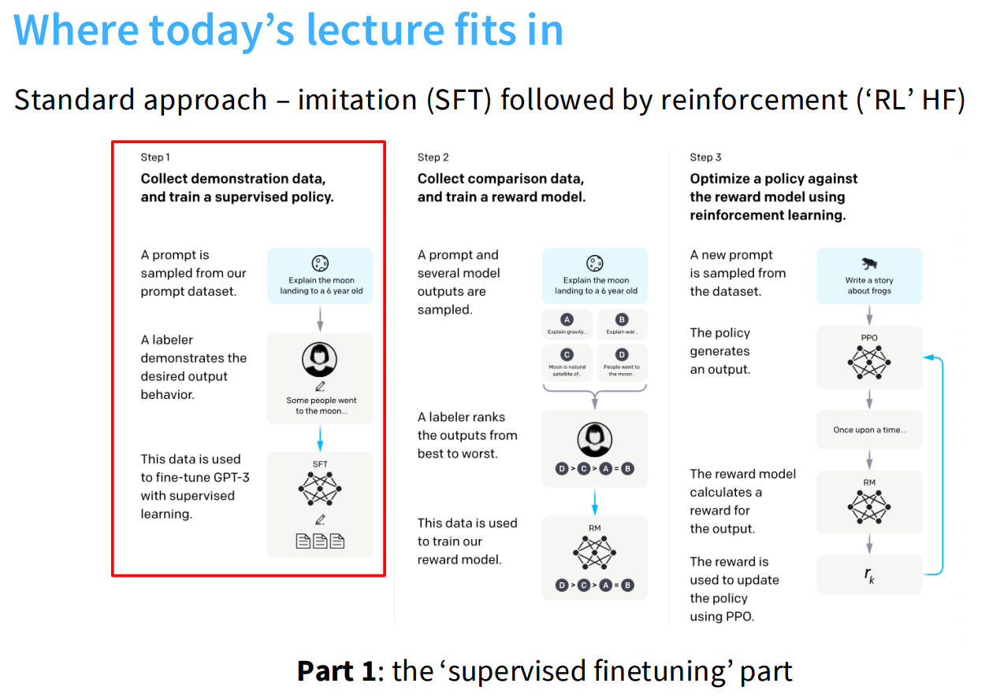

## 为什么要SFT和RLHF

这一讲将从预训练转向后训练。经过pre-training后，我们有一个像GPT-3这样的系统，但这并不是一个真正有用的系统，它并不遵循指令。这篇文章主要基于InstructGPT论文。

## 监督微调（SFT）

下图大致描述了构建一个遵循指令的模型所需要的三步流程。第一步就是监督微调（SFT），就是在专家演示数据上进行监督微调。

我们选取了三种截然不同的方法构建三个不同的数据集，也可以称之为构建指令遵循或者后训练数据的三种不同范式。

