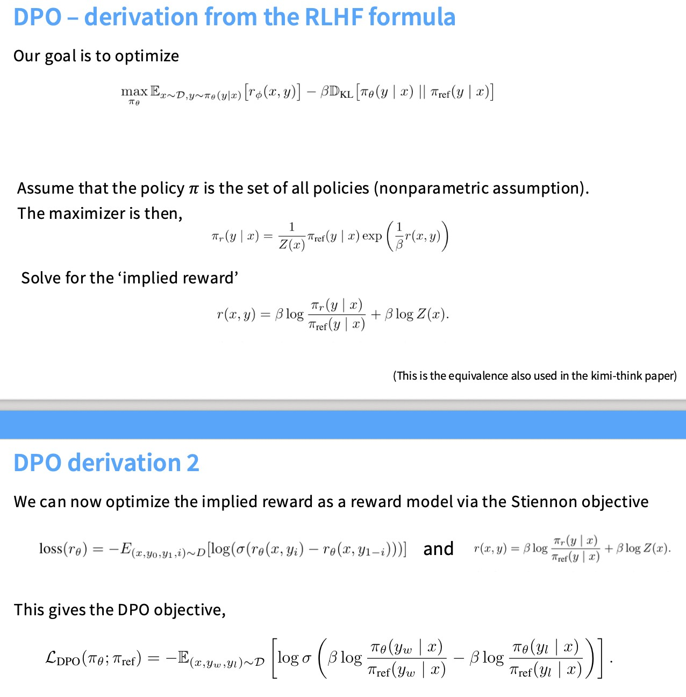

## 监督微调（SFT）

这一讲将从预训练转向后训练。经过pre-training后，我们有一个像GPT-3这样的系统，但这并不是一个真正有用的系统，它并不遵循指令。这篇文章主要基于InstructGPT论文。

下图大致描述了构建一个遵循指令的模型所需要的三步流程。第一步就是监督微调（SFT），就是在专家演示数据上进行监督微调。

课件中展示了FLAN、Alpaca、Oasst这几个数据集，感兴趣可以去看看。

监督微调的“配料”（即数据集）至关重要。不同的数据集赋予模型不同的能力。为了构建一个在各种任务上都表现出色的通用模型，最有效的方法是使用一个由不同类型、不同来源的高质量数据集混合而成的“超级混合物”。

监督微调通过大量的指令-回答对，教模型模仿人类在特定情境下的行为模式。但有时候比如说一个复杂的概念，在回答中涉及到一些引用，虽然说模型在努力学习这个新概念，但这其实也是一个范化的行为，就是在告诉模型如果问我一个复杂的概念，我最好在输出结尾加上参考文献，这可能会触发模型幻觉。

也就是说，当SFT数据远远超过与训练模型的自然能力范围时，就会冒着教会模型走某种捷径的风险，而不是教他们正确的行为。这也解释了为什么像强化学习一类的方法，有一件重要的事情要做，需要了解模型已经掌握了什么知识，并且只教给它那些它能理解的东西以避免出现模型幻觉。每当它遇到它不知道的事实时。应该修改微调数据，让模型学会说不知道这个事实。

* 对于指令微调，存在一个非常反直觉的现象，指令微调数据完全正确且丰富反而对语言模型不利。
* 原则上，使用强化学习风格来追求正确性可能有帮助。

**关于安全性**

通过在指令微调阶段引入特定的安全数据，我们可以有效地训练模型识别并拒绝有害请求，从而改变其安全行为。安全微调的关键挑战在于如何平衡模型的安全性与可用性。过度的安全微调会导致模型在面对无害但包含敏感词汇的请求时，做出不必要的拒绝，从而损害用户体验和模型的实用性。

**如何进行指令调优**

预训练和指令调优之间的界限正在变得越来越模糊，可以把指令调优数据融入到预训练中。比如说下面这个模型就是将指令调优数据融入到预训练，预训练分为stable stage和decay stage，decay stage指令微调（SFT）数据的比例增加，更关注于对齐。

## 强化学习

**SFT**：是一种模仿学习。通过模仿高质量的训练数据来学习，试图学习如何生成与训练数据类似的输出。

**RLHF**：是一种强化学习。它通过优化人类偏好奖励函数来学习，不再把 LLM 看作一个简单的生成器，而是一个**策略**。

首先根据成对的反馈训练一个奖励模型（在内部为每一个输出赋予一个标量值），然后把这个奖励模型用于强化学习，希望模型能够最大化奖励。（课件中展示了用于指导人类标注员进行评分的详细规则和原则，感兴趣的可以去了解一下）

RLHF的数据收集过程很难找到真正高质量、可信赖的标注员，不同地区的标注员的个人背景、价值观和偏好会内在地影响他们对模型回答的评判，从而导致模型学习到某种特定的偏见。因此很多工作使用LLM来生成这些反馈。下面是训练奖励模型的损失函数，其中x是prompt，y是生成的回答，i是评分更高的回答。

**PPO算法**：

**如何进行强化学习优化**，这里主要参考InstructGPT论文。下面这个优化函数描述了我们正在优化的内容：

这个$r_{\theta}(x,y)$是奖励函数，然后计算RL策略与原始SFT模型之间的KL散度（在进行RL时，不要离最初的SFT模型太远）。最后一项是指在进行强化学习的时候也要持续进行预训练，避免灾难性遗忘。

关于PPO算法的其他概念参考强化学习。

**DPO算法**：

PPO很复杂，为了摆脱PPO，提出了一些方法。其中比较主流的方法是DPO，DPO消除了PPO很多的复杂性，效果也不错。

DPO 的出现，成功地将 RLHF 的复杂性大大降低，将原本需要奖励模型和 PPO 训练的两阶段、高成本过程，简化为**一个单阶段、类监督学习的训练过程**（不训练一个独立的奖励模型，摆脱了策略模型）。它直接从人类偏好数据中学习，通过一个巧妙的损失函数，实现了与 RLHF 类似的效果，即让模型学会生成人类更偏好的内容。

* $\pi_{\theta}$是我们正在优化的新策略（语言模型）。

* $\pi_{ref}$ 是固定的参考模型。

这个两个的比值衡量了新策略在生成特定响应上的变化。新策略应该更多地生成偏好响应，更少地生成不偏好响应。

* 对于好的回答，进行正常的梯度更新
* 对于不太好的回答，进行梯度的相反方向更新

DPO就是把强化学习问题转化成了一个最大似然问题，在概念上与预训练非常相似的问题，只不过最大化的是这里成对比较数据的概率。

下面是关于DPO的公式推导（可惜我没看懂）：

