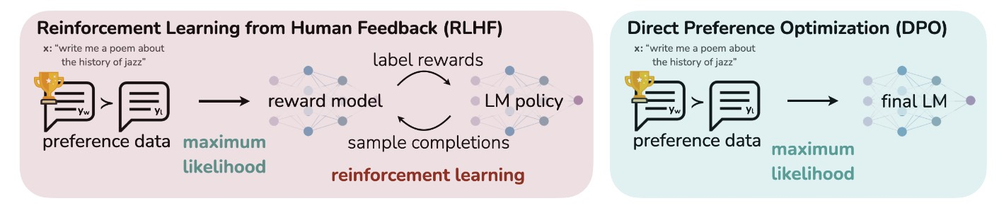
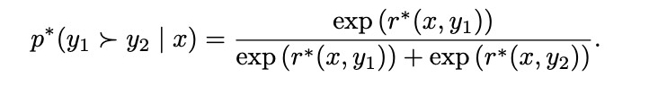
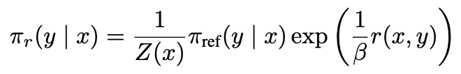
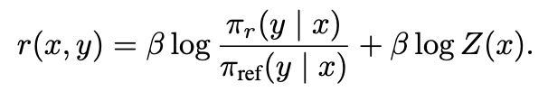
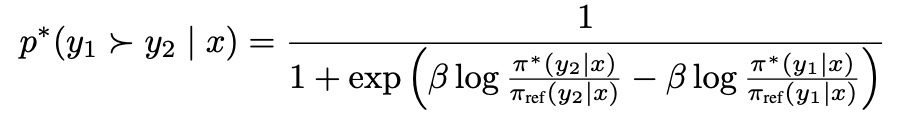
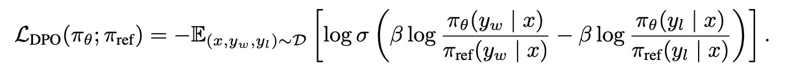
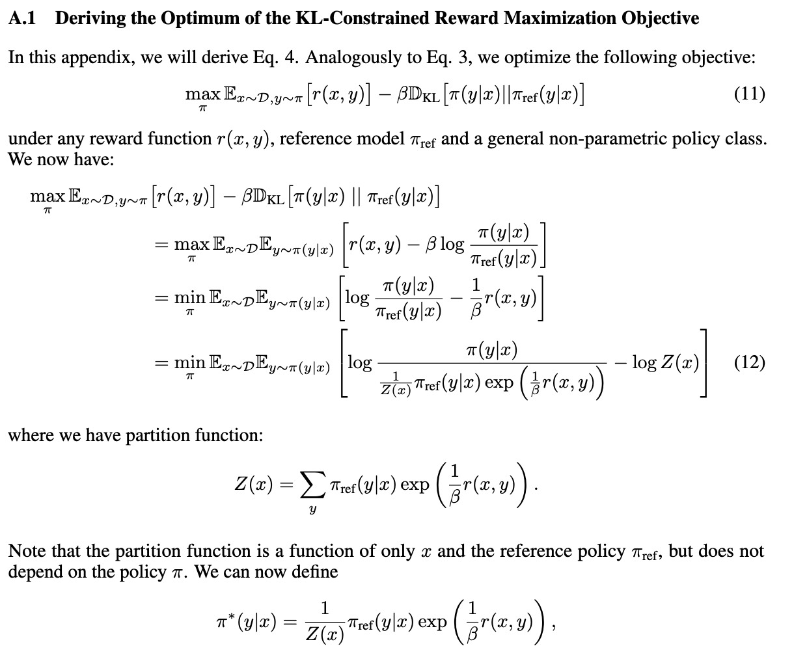
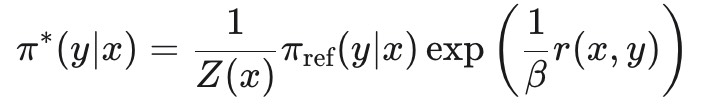
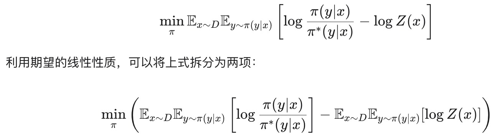
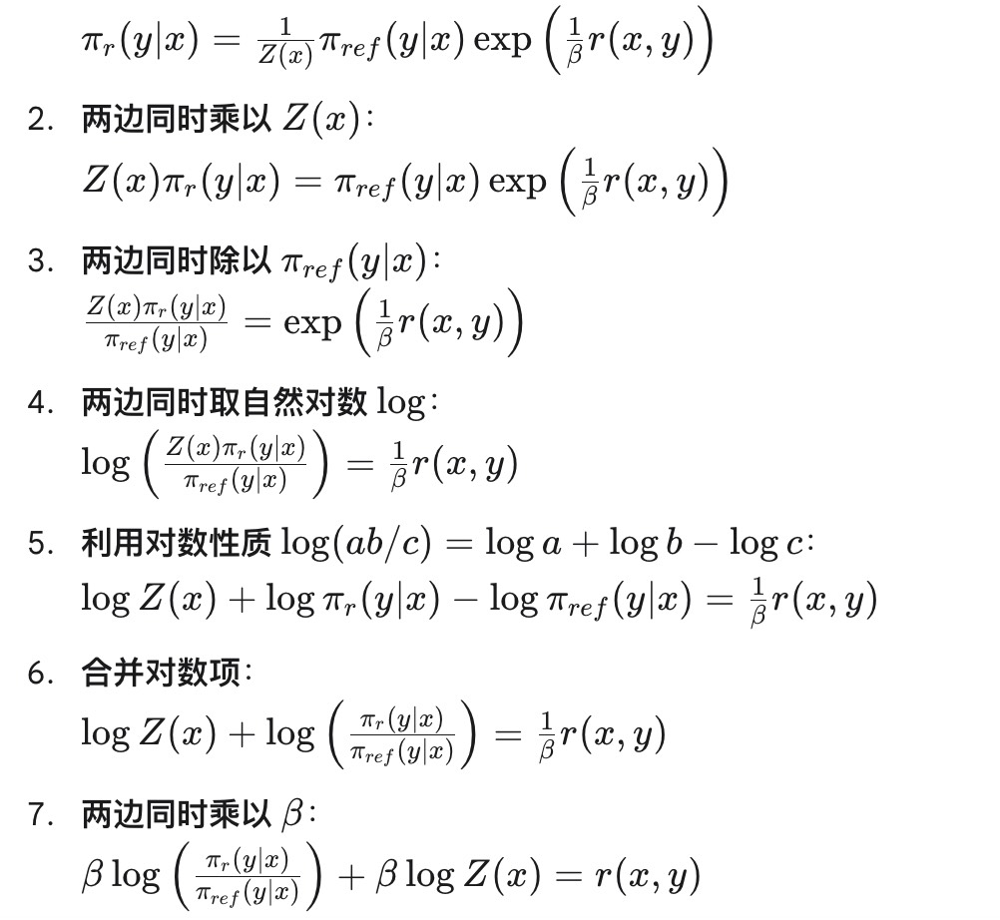

## DPO详解

尽管大型无监督语言模型通过大量数据训练获得了广泛的知识和推理能力，但由于训练的无监督性质，很难对其行为进行精确控制。现有的主要解决方案是人类反馈强化学习。RLHF首先通过人类对模型生成结果的偏好标签来训练一个奖励模型，然后使用强化学习算法（如PPO）来微调语言模型，使其最大化奖励模型的得分 。然而，RLHF是一个复杂且不稳定的过程，需要训练多个模型，并在训练循环中进行采样，导致计算成本高昂。

这篇文章主要介绍DPO算法（Direct Preference Optimization），DPO的核心思想是**跳过显式地训练奖励模型和使用强化学习**这两个步骤，在某些假设下，最优的策略和最优的奖励模型之间存在一个直接的、闭合形式的数学关系。

> 在 DPO 中，语言模型本身就通过其参数，内在地学习并代表了奖励函数。模型生成某个回答的概率越高，就意味着这个回答获得的“隐含奖励”也越高。DPO 的关键在于利用一个分析映射，将奖励函数和最优策略之间的关系用闭合形式表达出来。这个映射使得研究者能够进行一个变数代换：将原本用于优化奖励函数的损失函数，直接转换为一个用于优化策略模型的损失函数。

这里关于奖励模型RM有一个小细节补充：

我们知道RM会为模型的输出进行打分，这里引入了**Bradley-Terry (BT) **模型，这是一个流行且被广泛使用的概率模型，用于描述在配对比较中，一个选项被选为胜者的概率。BT模型认为，$y_1$ 比 $y_2$ 更优的概率，取决于它们各自的奖励分数的指数之比：

首先，我们还是从PPO的目标函数出发，我们想要最大化RM的得分，同时使得RL Policy输出和SFT的输出不要离得太远。对这个目标函数进行推导可以得到最优策略的解析解。这里的推导见“公式推导 part 1”。

这个公式表明，最优策略与一个参考策略 $\pi_{ref}$以及奖励函数 $r$ 有关。但包含一个难以计算的配分函数$Z(x)$。这个 $Z(x)$ 是所有可能的响应 $y$ 的一个加权和，计算起来非常昂贵。我们根据这个公式推导$r(x,y)$，推导见“公式推导 Part 2”。

回顾一下上面的BT模型，核心是根据两个选项 $y_1$ 和 $y_2$ 的奖励差异来计算一个选项优于另一个选项的概率，其中$\sigma$是$sigmoid$函数，其实和上面的形式是一样的（将分子化为1）：
$$
p^*(y_1 \succ y_2 | x) = \sigma(r^*(x, y_1) - r^*(x,y_2))
$$
再把$r(x,y)$的表达式代入：

我们可以把上面的这个公式转换为最大似然估计问题。在机器学习中，最大似然估计的目标是找到一组参数，使得模型在给定训练数据上的**概率**最大化。对于 DPO 而言，这意味着我们要找到一个策略 $\pi_\theta$ 的参数 $\theta$，使得它能够最好地解释人类偏好数据集 $D$ 中的偏好。

**偏好概率表达式**: 前面推导的公式$p^*$已经给出了一个响应 $y_w$（chosen）比 $y_l$（rejected）更受欢迎的概率，这个概率只依赖于最优策略 $\pi^*$ 和参考策略 $\pi_{ref}$，但同时它也将奖励函数用闭合的方式表达了出来。所以最终的目标函数如下：
$$
L_{DPO}(\theta)=-\mathcal{L}_{MLE}(\theta)=-\sum_{(x,y_w,y_l) \in D}logp_{\theta}(y_w \succ y_l |x)
$$
也就是如下：

## 公式推导

### Part 1

下面主要是对公式12的推导：

1. 最大化问题转化为最小化问题（对期望值内部取负，然后除以$\beta$）
2. 将$\frac{1}{\beta}r(x,y)$这一项化为对数$log(exp(\frac{1}{\beta}r(x,y))$：

$$
log(\frac{\pi(y|x)}{\pi_{ref}(y|x) exp(\frac{1}{\beta}r(x,y)) })
$$

3. 引入配分函数$Z(x)$定义如上，$Z(x)$的值只与$x$和给定的参考模型$\pi_{ref}$有关，与我们正在优化的$\pi$无关，所以在这个最小化过程中，给定一个$x$，$Z(x)$是常数。进一步对上面目标函数内部分子分母同时乘以$\frac{1}{Z(x)}$，不会改变式子的值。最终我们得到了上面最终的推导结果。

观察分母，它具有一个非常好的形式，令：

这里的 $Z(x)$ 正是起到了**归一化**的作用（$Z(x)$是一个常数，$\pi_{ref}(y|x)$是一个概率分布的向量），它保证了$\sum_y \pi^*(y|x)=1$，所以$\pi^*(y|x)$也是一个合法的概率分布。我们把这代入到上面式子中：

* 其中第一项正是KL散度，它衡量了这两个概率分布之间的差异
* $logZ(x)$与$y$无关，与我们要优化的策略$\pi$也无关，第二项在最小化过程中是一个常数

这就找到了我们梦寐以求的最优策略$\pi$的解析解。

### Part 2

