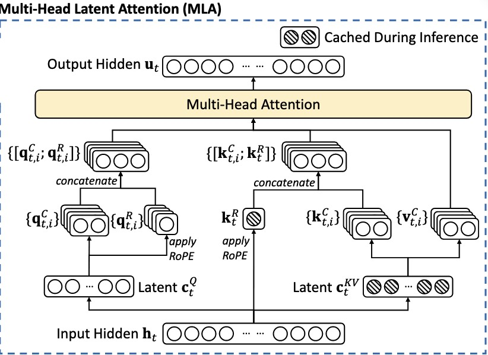
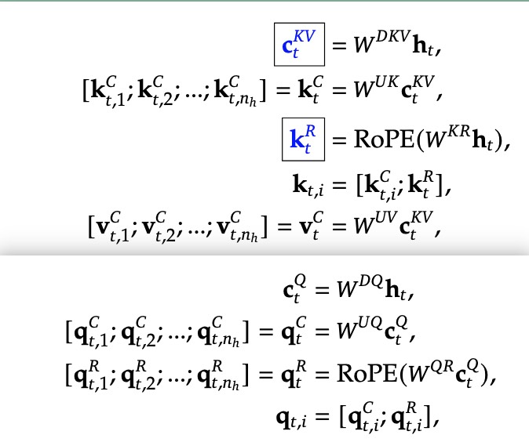
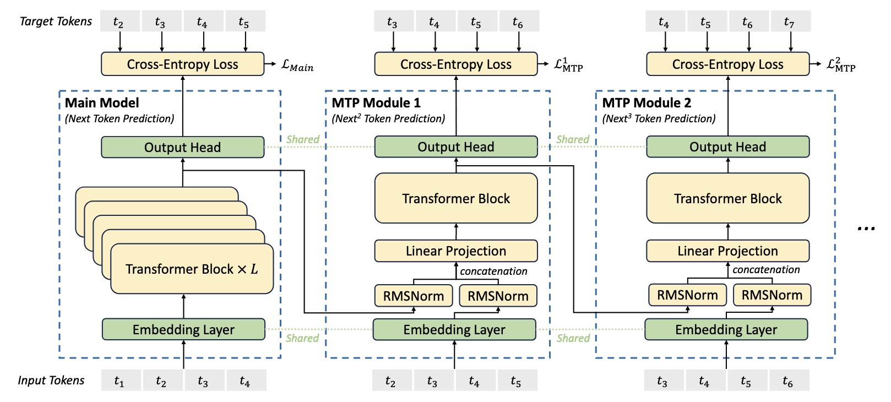
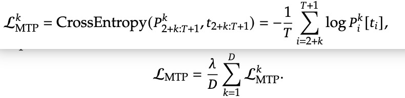
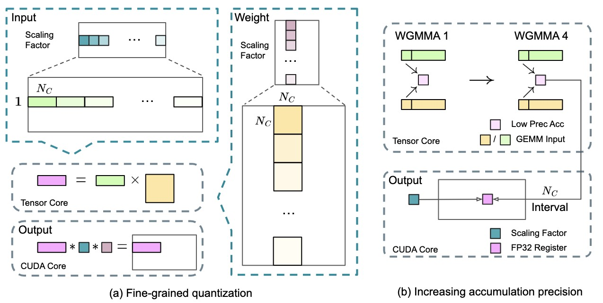
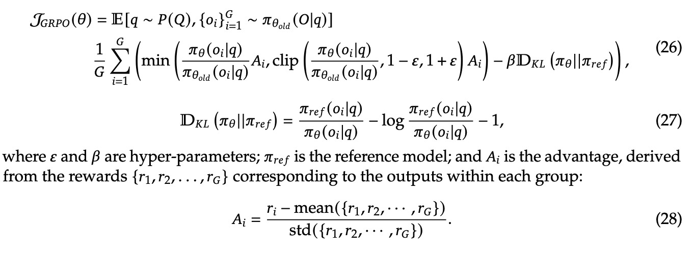

## DeepSeek-V3 Technical Report

## Architecture

### MLA



首先对输入$h_t$做一个低秩压缩，将$d$维的输入经过$W^{DKV}$变换后压缩成$d_c$维度的$c_t^{KV}$。DeepSeek-V3中，$d=7168,d_c=512$。

然后通过两个变化矩阵$W^{UK}，W^{UV}$将维度扩展回$d=d_h \times n_h$，也就是每个Head有一个单独的$k,v$（同MHA一致）。

在我们不考虑位置编码的时候：
$$
q_i k_j^T = h_i W^Q (c_j^{KV} W^{UK})^T = h_i W^Q {W^{UK}}^T {c_j^{KV}}^T
$$
为了减少计算，可以把$W^Q {W^{UK}}^T$合并为$W^{QUK}$。

当我们考虑位置编码的时候：
$$
q_i R_i(k_jR_j)^T  = h_i W^Q  R_iR_j^T {W^{UK}}^T {c_j^{KV}}^T
$$

其中$R_i$表示第$i$个位置的旋转矩阵，但因为这里面$R_i R_j^T$与位置有关，所以这里并不能把$W^Q {W^{UK}}^T$合并为$W^{QUK}$，这一部分不能够提前计算好，也就是说RoPE与低秩变换不兼容。

为了解决这个问题，这里引入了一个新的位置编码矩阵$W^{KR}$和$W^{QR}$，如下面的公式。最终拼接形成$q,k$，并且这样拼接不影响RoPE的内积特性：

$$q_{t,i}^T\times k_{j,i}=[q_{t,i}^C;q_{t,i}^R]^T\times[k_{j,i}^C;k_t^R]=q_{t,i}^Ck_{j,i}^C+q_{t,i}^Rk_t^R$$

所有公式如下：




### Multi-Token Prediction（MTP）

MTP的目标是在训练时让模型不只预测下一个 token，而是能预测未来 **D** 个 token，从而让训练信号更丰富，学习更快。MTP有D个MTP Module，每一个Module接受来自前一层（或者主模型）的表示来预测当前的token。



我们来看，一个MTP Module的组成如下：共享的Embedding层和Output Head层，一个Transformer block $TRM_k$，一个投影矩阵$M_k \in R^{d \times 2d}$。

对于序列中第$i$个token，第$k$个MTK Module只需要用$Emb$编码第$i+k$个token，其他所有token的表示由前一个MTP Module（或者是主模型）的Transformer Decoder的输出来代替，如下：
$$
{h'_i}^k = M_k [RMSNorm(h_i)^{k-1}; RMSNorm(Emb(t_{i+k}))]
$$

MTP的损失函数如下：




### Auxiliary-Loss-Free Load Balancing

关于这部分内容参见CS336课程中的MoE架构这一章笔记，里面对MoE架构和负载均衡策略有很详细的介绍。


## Infrastructures

### FP8 Training

DeepSeek-V3采用 FP8 数据格式训练。为了缓解精度下溢问题，采用了细粒度量化策略：**激活值采用$1 \times N_c$的分组，权重使用$N_c \times N_c$的分组**。该方法的一项重要创新是**在 GEMM 操作的内部维度引入组级缩放因子**。



 低精度 GEMM 运算常见的下溢问题主要通过高精度累积来解决，通常采用 FP32 精度。然而，在 NVIDIA H800 GPU 上，FP8 GEMM 的累积精度仅能保持约 14 位有效数字，远低于 FP32 的累积精度。为解决这一问题，系统采用了 CUDA Cores 提升策略来获得更高的计算精度。如上图（b）所示，在 Tensor Cores 执行 **MMA（矩阵乘法累加）**时，中间结果先使用有限位宽累加。当达到$N_c$间隔时，这些部分结果会转移到 CUDA Cores 的 FP32 寄存器中进行全精度累加。


## Pretraining

DeepSeek-V3 的预训练采用了**填充中间（FIM）**策略，在保持下一个 token 预测能力的同时，还能让模型基于上下文准确预测中间文本。具体实现上，使用**前缀-后缀-中间（PSM）**框架构建如下数据结构：

```text
<|fim_begin|> pre<|fim_hole|> suf<|fim_end|> middle<|eos_token|>。
```

该结构在预打包阶段应用于文档级别，FIM 策略的应用比率为 0.1。

预训练完成后，系统使用 **YaRN** 进行上下文扩展，通过两个各包含 1000 步的额外训练阶段，将上下文窗口从 4K 依次扩展至 32K 和 128K。

> YaRN是一种给 RoPE类模型**高效扩展上下文窗口**的方法。它的目标是在**很少的微调数据与训练步数**下，把模型可用的上下文从几千、几万扩到 **64K/128K** 甚至更长，同时尽量不破坏短文本能力。
>
> RoPE 本身在**训练过的最大长度之外外推会失真**：如果直接把序列拉长，RoPE 的**相对距离编码**会走样，高频（短程）信息被压扁；如果仅靠“统一缩放”的简单做法要么牺牲短程细节，要么需要更多数据/步数。
> YaRN 就是为了解决**长程扩展 vs. 短程保真**的权衡，并**降低微调成本**。


## Post-Training

### 监督微调（SFT）

构建了包含 150 万个多领域实例的指令调优数据集，针对不同领域特点采用了相应的数据创建方法。

**推理数据处理：** 在数学、代码竞赛和逻辑谜题等推理类任务中，系统采用内部 DeepSeek-R1 模型生成数据。虽然 R1 生成的数据具有较高的准确性，但同时存在推理冗长、格式不规范和输出过长等问题。因此，研究的核心目标是在保持 R1 模型高准确性的同时，实现输出的清晰简洁。

具体实施方法如下：首先针对特定领域（如代码、数学或通用推理）开发专家模型，采用 SFT 和 RL 相结合的训练流程。该专家模型随后作为最终模型的数据生成器。

对每个训练实例，系统生成两类 SFT 样本：一类是问题与原始答案的直接配对，另一类则引入系统提示词，将其与问题和 R1 答案组合。系统提示经过优化设计，包含了引导模型生成具有自我反思和验证机制响应的指令。

在RL阶段，模型通过高温采样生成响应，即使在没有明确系统提示的情况下，也能有效融合 R1 生成数据和原始数据的特征。经过数百轮RL迭代，中间模型成功整合了 R1 的响应模式，显著提升了整体性能。随后，研究采用拒绝采样方法，利用专家模型作为数据源，为最终模型筛选高质量的 SFT 数据。这种方法既保持了 DeepSeek-R1 的高准确性，又确保了输出的简洁性和有效性。


### 强化学习（RL）

**奖励模型设计**

在强化学习过程中，系统同时采用**规则型**和**模型型**两种**奖励模型(Reward Model, RM)**。

**规则型奖励模型：**对于可通过明确规则验证的任务，系统采用规则型奖励机制进行反馈评估。例如，在处理具有确定性答案的数学问题时，要求模型在特定格式（如方框内）给出最终答案，从而可以通过规则进行自动验证。同样，在处理 LeetCode 编程题时，系统可通过编译器执行测试用例生成客观反馈。这种基于规则的验证方法具有较高的可靠性，能有效防止模型的投机行为。

**模型型奖励模型：**对于具有标准答案但形式灵活的问题，系统使用奖励模型评估输出与标准答案的匹配程度。而对于创意写作等缺乏标准答案的任务，奖励模型则基于问题和回答的整体性给出评估反馈。该奖励模型基于 DeepSeek-V3 的 SFT checkpoint 进行训练。

**群组相对策略优化(Group Relative Policy Optimization, GRPO)**

这种方法不需要与策略模型规模相当的评论家模型，而是通过群组评分估计基线。具体实现中，对每个问题 $q$，GRPO 从原策略模型$\pi_{\theta_{old}}$采样一组输出$\{ o_1, o_2,...,o_G \}$，并通过最大化以下目标函数优化策略模型$\pi_{\theta}$：




