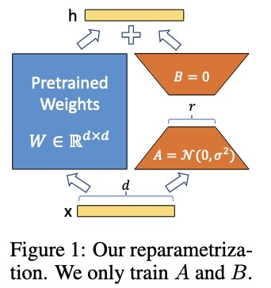

## LoRA

全参数微调 变得越来越不可行，因为每个任务都需要一个庞大且独立的微调模型实例，这会带来高昂的部署成本 。低秩适应（Low-Rank Adaptation），简称 LoRA。冻结预训练模型的权重，并向 Transformer 架构的每一层注入可训练的低秩分解矩阵 。这种方法可以极

研究表明，即使是参数量巨大的过参数化模型，其学到的有效参数实际上只在一个低维度的空间中。可以想象一个高维空间，但所有重要的信息都集中在一个二维平面上，这个平面就是“低维流形”。这意味着，尽管模型有几十亿甚至上千亿个参数，但真正对模型性能起作用的有效参数或“自由度”远没有那么多。

当对一个大型预训练模型进行微调时，模型权重的变化量 $\triangle W$ 也具有一个很低的“内在秩”。LoRA 的方法正是基于这个核心假设。它没有直接去微调原始的巨大权重矩阵 W，而是将权重的变化 $\triangle W$ 分解为两个更小的、低秩的矩阵 $A$ 和 $B$，即 $\triangle W=BA$。

LoRA的主要优点可以概括为以下四点：

1. 存储和部署高效：参数共享， 一个大型的预训练模型可以被多个任务共享。只需要为每个任务存储和替换非常小的 LoRA 模块（即矩阵 $A$ 和 $B$），而不是整个模型的副本。这显著减少了存储空间需求和在不同任务间切换的开销。

2. 训练高效：LoRA 只需要优化注入的、小得多的低秩矩阵，不需要为大部分参数计算梯度或维护优化器状态，这使得训练过程更高效。

3. 无推理延迟：在部署时，可训练的 LoRA 矩阵（$\triangle W=BA$）可以与原始的冻结权重（$W_0$）合并，形成一个新的、完全微调的权重矩阵（$W′=W_0+\triangle W$）。推理时就不需要额外的计算步骤，与完全微调的模型相比，不会引入任何推理延迟。

4. 正交性和兼容性：可以灵活组合，LoRA 是一种“正交”于许多其他微调方法的技术。这意味着它可以与其他方法（如 Prefix-tuning）相结合。

使用LoRA微调的公式如下：
$$
h=W_0x+\triangle Wx = W_0x+BAx
$$
在进行微调训练前，$A$使用高斯分布进行初始化，$B$是零矩阵。

那么随着秩 $r$ 的增加，矩阵乘法 $BA$ 的“大小”可能会变得更大，这会影响训练的稳定性。所以引入了一个缩放因子 $\alpha$ 来进行标准化。增量项变为：$\frac{\alpha}{r}BAx$。

### 其他两种微调方式

**Adapter Layers Introduce Inference Latency**

Adapter Tuning 的核心思想是在预训练模型的每个Transformer块中，插入一些小型、可训练的神经网络模块，这些模块被称为“适配器”。在微调时，原始模型的参数被冻结，只有这些新添加的适配器模块的参数被训练。

适配器模块通常是一个瓶颈（bottleneck）结构，其内部包含：一个降维层，一个非线性激活函数，一个升维层。

**Directly Optimizing the Prompt is Hard**

Prompt Tuning 的核心思想是不修改或不添加任何模型内部参数。它通过在模型的输入序列中，添加少量可训练的“软提示” 来引导预训练模型完成下游任务。

在原始输入序列的前面或内部，插入一串可训练的连续向量。这些向量不是从词汇表中选择的token ID，而是随机初始化的、可以直接通过梯度下降进行更新的参数。优化目标: 在微调时，模型接收 [软提示] + [原始输入] + [可能的目标] 作为输入，并计算next-token预测的损失。只有这些“软提示”向量的参数通过反向传播进行更新。

