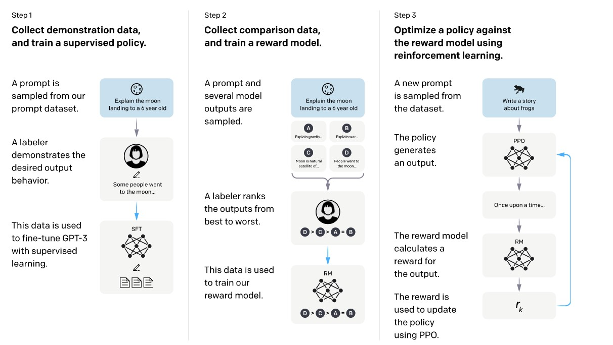
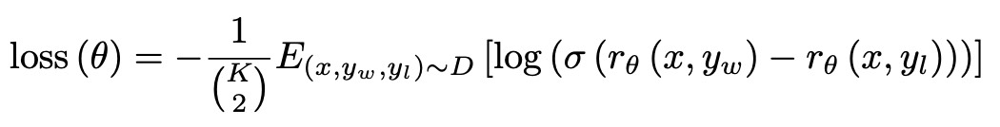
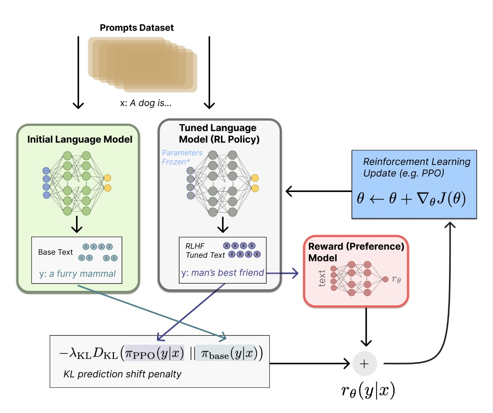
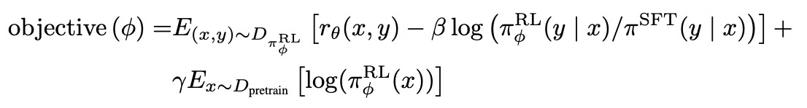
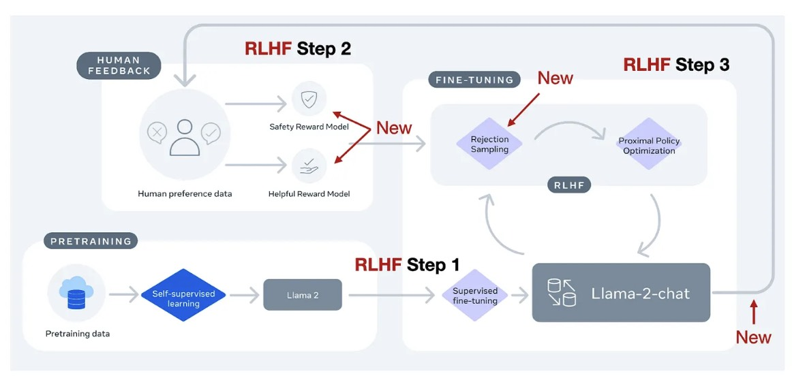
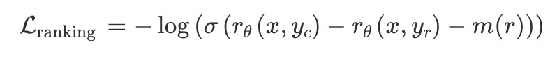

## RLHF详解

RLHF 是一项涉及多个模型和不同训练阶段的复杂概念，这里我们按三个步骤分解：

1. 预训练一个语言模型 (LM) ；
2. 聚合问答数据并训练一个奖励模型 (Reward Model，RM) ；
3. 用强化学习 (RL) 方式微调 LM。

## Step 1.LLM SFT

在预训练好一个语言模型后，使用标注员编写的良好的`prompt` 和 `completion` 数据对进行监督微调（SFT）。`prompt` 和 `completion` 会被拼接成一个完整的序列，然后和预训练模型的训练一样，进行next token的预测。模型训练了16个epoch，在SFT训练完成之后，会保存各个检查点（checkpoints）。

## Step 2.Reward Model

现在需要使用上面的SFT model训练一个Reward Model。这一模型接收一系列文本并返回一个标量奖励，数值上对应人的偏好。

> 关于模型选择方面，RM 可以是另一个经过微调的 LM，也可以是根据偏好数据从头开始训练的 LM。通常这个RM模型大小会偏小，节省计算，大的RM训练不稳定。

关于训练奖励数值方面，这里需要人工对 LM 生成的回答进行排名。在InstructGPT中，标注人员会看到一个给定的提示（prompt），以及该提示对应的 K 个不同的回答（responses），标注人员的任务是对这 K 个回答进行排序，从最好到最差，总共会有$C_k^2$个比较对。如果简单地将所有$C_k^2$个比较对打乱并放入一个大数据集中进行训练，奖励模型会**过拟合**。原因是来自同一个提示的比较对**高度相关**，如果模型在训练时将它们作为独立的样本，会重复看到关于同一个提示的信息，导致模型过于关注某个特定提示的细节，而无法泛化。**将来自同一个提示的所有$C_k^2$个比较对作为一个“单批次元素”（a single batch element）进行训练**。损失函数如下：

* $r_\theta(x,y)$标识给定prompt `x`和response `y`时RM的数值输出
* $y_w$表示标注员标注的ranking更高的输出

## Step 3.RL Fine-Tuning

首先将微调任务表述为 RL 问题。首先，该 **策略** (policy) 是一个接受提示并返回一系列文本 (或文本的概率分布) 的 LM。这个策略的 **行动空间** (action space) 是 LM 的词表对应的所有词元 (一般在 50k 数量级) 。

1. 给模型提供一个随机的客户提示（prompt）
2. 模型根据这个提示生成一个回答（response）
3. 将这个提示和回答一起发送给奖励模型（reward model），根据训练好的评分机制产生一个reward数值$r_\theta$
4. 将两个模型的生成文本进行比较计算差异的惩罚项，即$r=r_\theta-\lambda r_{KL} $，这一项被用于惩罚 RL 策略在每个训练批次中生成大幅偏离初始模型，以确保模型输出合理连贯的文本

我们来看具体的目标函数：

> $\pi_\phi^{RL}$是策略LM，$\pi^{SFT}$可以是我们在16个checkpoint中选取的RM评分最高的SFT模型，$r_\theta(x,y)$是RM的输出奖励。在这里，有两个概率分布：一个是当前RL模型生成下一个词元的概率分布$\pi_\phi^{RL}(y | x)$，另一个是SFT模型生成下一个词元的概率分布$\pi^{SFT}(y|x)$，惩罚项的作用是确保这两个分布之间的差异不会变得太大。它阻止了RL模型为了追求高奖励而走捷径，从而避免了生成不自然的或有偏差的回答。

在进行RL FineTuning的时候，还把pre-training的梯度也混合进来了，这也叫做"PPO-ptx"，。这样，模型在更新参数时，既考虑了RL的反馈，也考虑了原始预训练数据的知识。

在每个训练批次（batch）中，模型会从两个数据源中分别计算梯度：

* RL梯度：从RL数据（提示和奖励模型反馈）中计算梯度，用于更新模型以最大化奖励。
* 预训练梯度：从预训练数据中计算梯度，用于更新模型以最大化这些数据的对数似然。
* 合并梯度：在一次训练迭代中，模型会将这两个梯度进行加权求和，然后用这个合并后的梯度来更新模型参数。

## RLHF in Llama 2

Meta AI在创建Llama 2的时候也用了RLHF，和InstructGPT相比，它主要有几点不同。Llama 2有两个RM（Safety RM和Helpful RM），还有一个拒绝采样的步骤（rejection smpling）。

### Margin Loss

Llama 2引入了一个额外的 **margin参数 m(r)**。这个参数是根据人类标注者对偏好的**程度**（例如，“显著更好”或“稍微更好”）来设定的，**如果人类标注者认为偏好程度很高**（例如，“显著更好”），那么 m(r) 的值就会设置得**更大**。这个边距参数被加到了损失函数中。下面是训练RM的损失函数：

简单来说，**边距损失**不仅仅告诉模型哪个回答更好，还告诉它**好多少**。它迫使模型在打分时，能够将人类偏好的强度体现在分数差距上。

### Rejection Sampling

1. 模型生成多个输出：给定一个提示 (prompt)，模型会生成 K 个不同的回答或输出。

2. 计算奖励 (Calculate rewards)：对于这 K 个输出中的每一个，都会通过一个奖励模型 (reward model) 来计算一个奖励分数 (r1,r2,...,rk)。这个奖励分数代表了该输出的质量，分数越高表示回答越好。
3. 选择奖励最高的样本 (Select the best sample)：在这 K 个输出中，系统会选择那个奖励分数最高的输出作为“最佳”样本。
4. 梯度更新 (Gradient update)：最终，模型会使用这个奖励最高的“最佳”样本来计算梯度，并进行优化更新。

