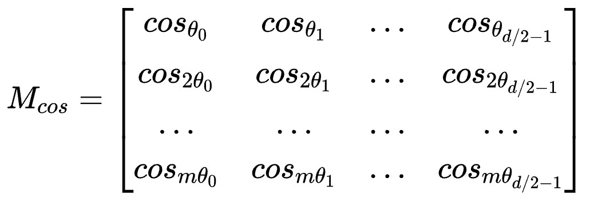
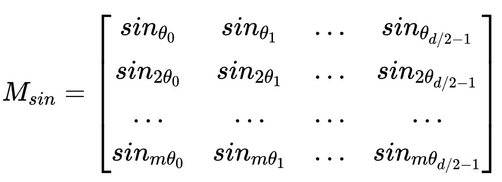

## RoPE基本思想

## RoPE的实现

其中`M[i,j]`表示序列中第`i`个token的向量表示的第`2*j,2*j+1`维度所要旋转的角度。假设某个token的向量为$X=[x_0,x_1,x_2.....x_{d-1}]$（有`d`个维度），然后把$X$拆分为$X_0=[x_0,x_2,....x_{d-2}]$，$X_1=[x_1,x_3,...x_{d-1}]$。实际上考虑序列的长度，我们得到的$X_0,X_1 \in R^{m\times \frac{d}{2}}$，其中`m`是序列的长度。所以$X_0,X_1$和$M_{cos,sin}$矩阵的维度是一样的。（假设$X$是序列中第一个token）
$$
y_0 = x_0 * cos_{\theta_0} + x_1 * (-sin_{\theta_0}) \\
y_1 = x_0 * sin_{\theta_0} + x_1 * cos_{\theta_0}
$$
观察上面的形式，我们可以使用矩阵的元素级乘法（Element-wise Multiplication）计算两个矩阵$Y_0,Y_1$：
$$
Y_0 = X_0 \odot M_{cos} - X_1 \odot M_{sin} \\
Y_1 = X_0 \odot M_{sin} + X_1 \odot M_{cos}
$$
接下来就可以对$Y_0,Y_1$的结果进行合并了。

>其实关于$X_0$和$X_1$的划分有另一种方法：$X_0=[x_0,x_1,....x_{d/2-1}]$，$X_0=[x_{d/2},x_{d/2+1},....x_{d-1}]$。这种分组和计算方式可以更好地利用GPU的并行计算能力。通过将前半部分和后半部分的维度成对读取和写入，可以获得更高的内存带宽和缓存命中率。

