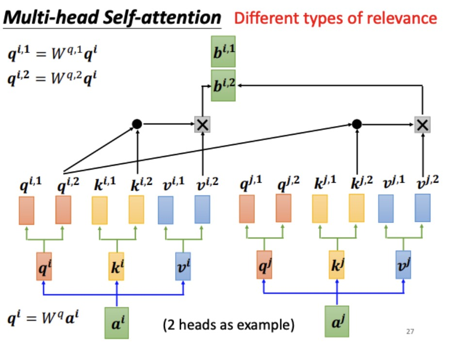

## 图解多头注意力机制

按照下图给予说明

$$
Q_{proj} = [q_1 \quad q_2 \quad...  \quad q_{head}]^T =  [W_q^1 \quad W_q^2 \quad ... \quad W_q^{head}]^T a\\
K_{proj} = [k_1 \quad k_2 \quad...  \quad k_{head}]^T = [W_k^1 \quad W_k^2 \quad ... \quad W_k^{head}]^T a\\
V_{proj} = [v_1 \quad v_2 \quad...  \quad v_{head}]^T = [W_v^1 \quad W_v^2 \quad ... \quad W_v^{head}]^T a\\
$$
其中$q,k,v \in R^{head\_dim}, a \in R^{hidden\_size}$。

也就是说：
$$
W_Q = [W_q^1 \quad W_q^2 \quad ... \quad W_q^{head}]^T \\
W_K = [W_k^1 \quad W_k^2 \quad ... \quad W_k^{head}]^T \\
W_V = [W_v^1 \quad W_v^2 \quad ... \quad W_v^{head}]^T \\
$$
然后再把$Q_{proj}、K_{proj}、V_{proj}$拿去做注意力计算，它们的维度是[batchsize, seqlen, n_heads, head_dim]。但是直接拿去做注意力计算是不够的，因为注意力计算是需要对一个序列中的每一个向量$q,k$（也就是seq_len）做一次内积，再进行softmax。所以需要把seq_len和n_heads这两个维度调换一下位置。

最后需要把所有head的输出concat在一起，所以也就是head_dim * n_heads == hidden_size。多头注意力机制可以理解成不同的语义逻辑子空间，比如说语义逻辑、语法逻辑、上下文逻辑、分类逻辑等等。

## 代码实现

首先看下$query, key, value$这三项输入。它们是[batchsize, seq_len, hidden_dim]。

1. 首先需要先行投影层分别得到$Q_{proj}、K_{proj}、V_{proj}$，维度同样也是[batchsize, seq_len, hidden_dim]。
2. 然后需要把最后一个维度差分成两个部分[num_heads, head_dim]，然后需要把seq_len和num_heads这2个维度调换一下，所以得到$Q_{proj}、K_{proj}、V_{proj}$ 为[batchsize, num_heads, seq_len, head_dim]。

3. 然后再把上面的$Q_{proj}、K_{proj}、V_{proj}$做注意力机制的计算，就可以得到[batch_size, num_heads, seq_len, head_dim]的输出$x$。
4. 这个$x$的输出需要先把第二个维度和第三个维度调换一下，再把num_heads这个维度和head_dim这个维度合并成一个维度，这个也就是最后的输出。

