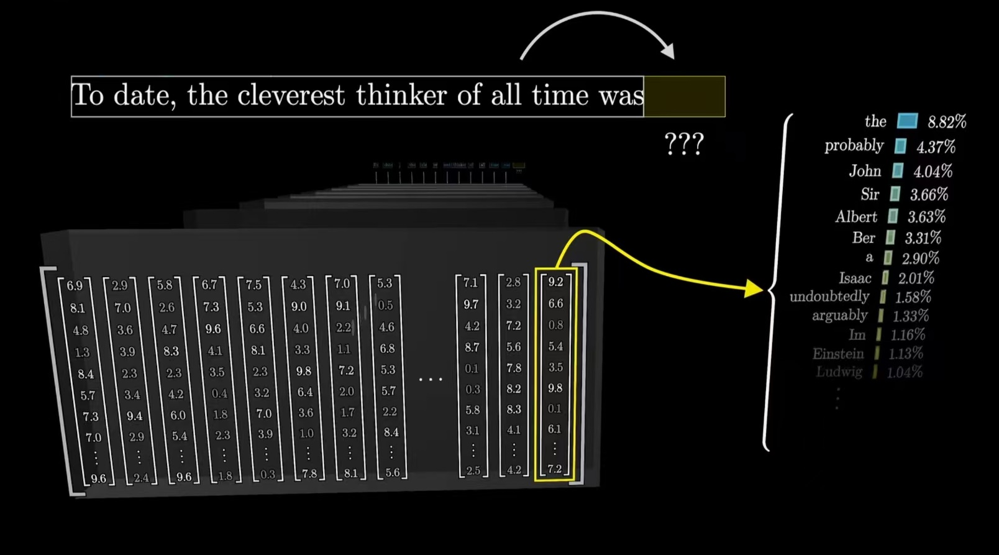
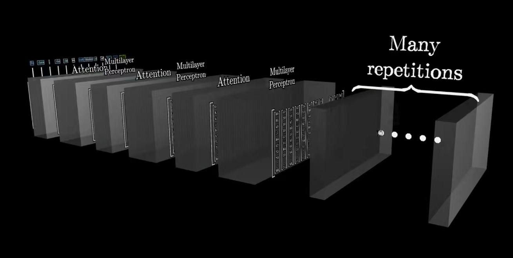
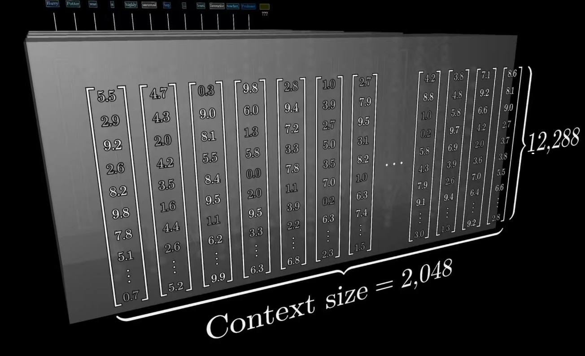
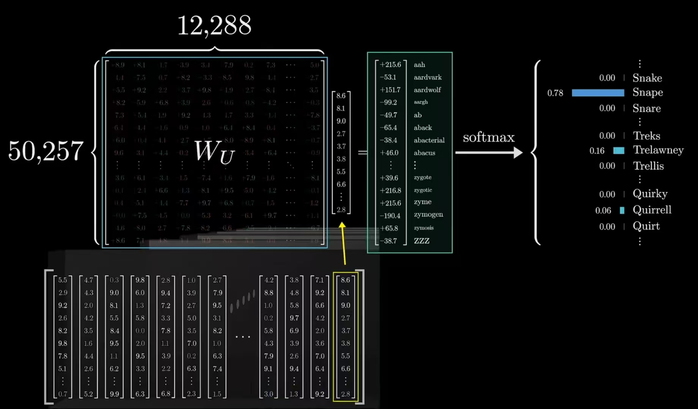
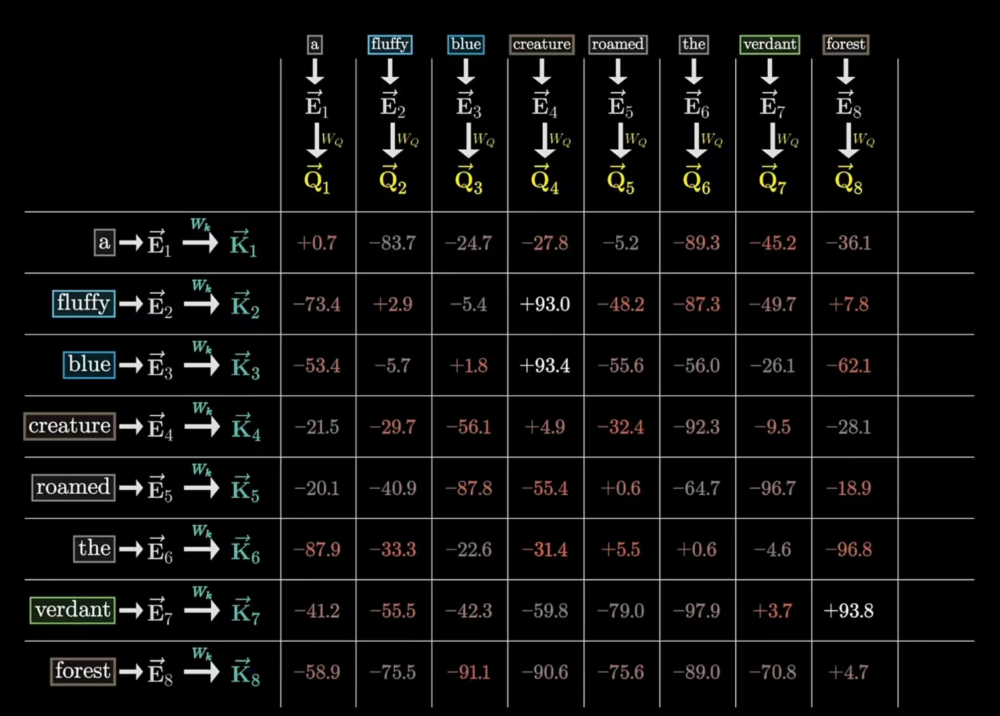
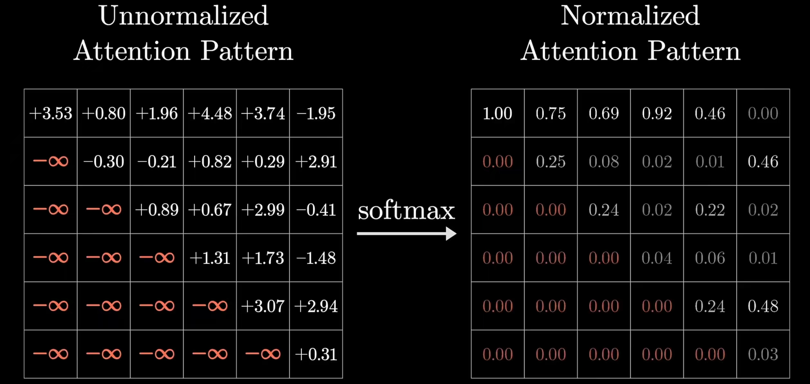
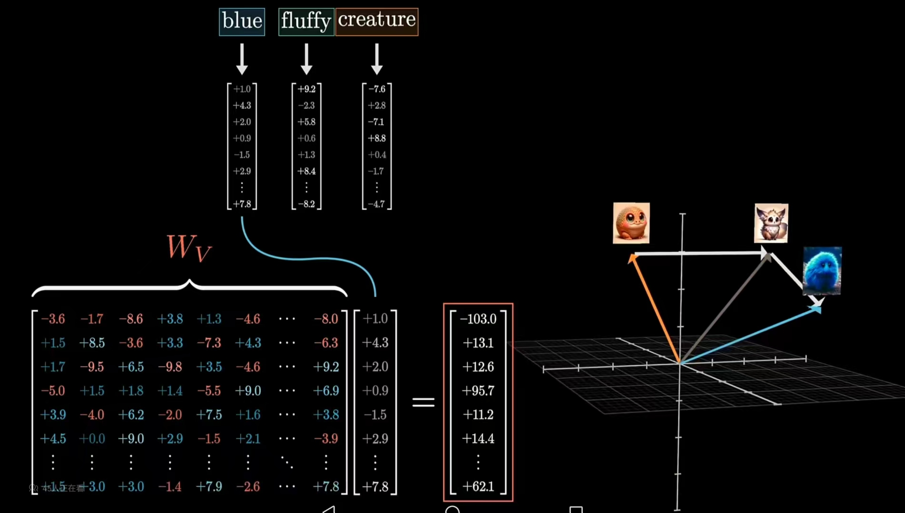
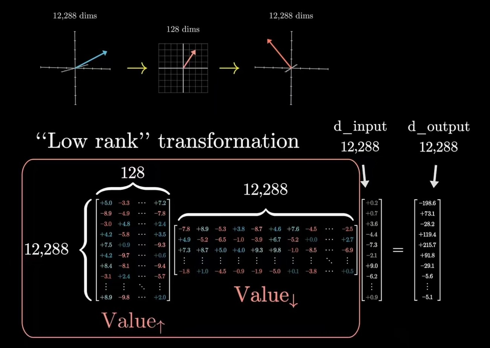

## GPT的工作原理

GPT给定一段文本，设定用户与AI助手互动的场景，这也叫系统提示词，把这个提示词作为第一段对话，然后由AI逐个token地输出接下来的文本，这当然需要大量文本作为训练，这只是一种生成的思路。

它的工作流程如下：Embedding、Attention、MLPs、Unembedding:

1. 当聊天机器人在生成特定单词时，背后实际在做这些事。首先，输入内容会被切分为许多的小片段，称为token(单词或者单词片段)，图像或声音也能被token化。每一个token对应一个向量，意义相近的向量在这个高维空间中也会相近。
2. 然后这些向量随后经过注意力模块处理，向量之间能够互相交流，通过传递信息来更新自己的值。比如英语里面一个单词会有多个意思，那么注意力机制就是找出上下文中哪些词，会改变哪些词的含义，以及这些词应该更新为哪一种含义。
3. 然后这些词向量会经过多层感知机，这里词向量间不会互相交流，而是并行经过同一处理(就好比对每一个向量提出一系列问题，比如词性、属于哪种语言、指的是人是物等等)。这其中略去了一些归一化的过程。

上面就是一个简单的transformer层级，之后基本就是重复该过程，注意力模块和多层感知机模块层层堆叠。最后的目标是，将整段文字的所有关键含义以某种方式融入到序列的最后一个向量中，然后对这个最后的向量进行某种操作，得出所有可能token得概率分布。

GPT3大概有1750亿个参数，我们再简单窥探其一二。

### Embedding Matrix

模型有一个词汇库包含所有的词汇，大概是50k个token。我们遇到的第一个矩阵就是嵌入矩阵，每一个词都有对应的一列，这些列决定了第一步中每个单词对应的向量。我们将这个嵌入矩阵记为$W_E$。一开始是未初始化的，然后基于数据进行学习。词向量的维度大概是12288，所以这里大概有6亿个参数。

### 注意力机制

根据输入文本和嵌入矩阵创建了向量组，但这时，向量只编码了每个单词的客观语义，但是很明显一个单词在文本的含义是与上下文相关的。所以我们就需要一个Attention层级来丰富比单个词更具体的含义。下面会更详细地解释注意力机制。

这种网络一次只能够处理特定数量的向量，我们叫做上下文长度(context size)。GTP3的上下文长度为2048。

### Unembedding Matrix

我们前面提到了，目标输出是下一个可能token的概率分布。

我们有一个矩阵$W_U$作为解嵌入矩阵，这个也是需要训练的。解嵌入矩阵的每一行对应词汇库中的一个单词，每一列对应一个嵌入维度，可以理解为是$W_E$的转置。

为了简化计算，我们把需要预测的下一个token，完全基于序列中最后一个向量(如上)，然后可以得到一个50k个得分的向量，然后使用softmax就可以求得每一个单词出现在此处的概率分布。

## 注意力机制

根据上面讲到的，我们的嵌入空间可能有多个方向，这些方向编码了同一个词的不同含义。而训练的比较好的注意力模块，能计算出，需要给初始的泛型嵌入加一个什么向量，才能把它移动到上下文对应的具体方向上。比如说tower这个单词在嵌入矩阵中指向某个很宽泛的方向(与高大建筑相关联)，但如果这个tower前有一个Eiffel，那就应该通过这个注意力机制更新这个向量，更加具体地指向埃菲尔铁塔的方向，甚至还与巴黎、法国相关联。

注意力模块就是精细化一个词的含义，允许模型传递这些嵌入向量所蕴含的信息。那背后又是如何进行运算的呢？

首先我们引入三个向量$Q,K,V$。

### 查询向量Q

$Q$矩阵，也就是query，相当于提问(比如说**有没有形容词修饰**，这可以理解为一个注意力头)，这样的提问被编码成$Q$向量(这个向量通常只有128维)。我们需要引入一个可以学习的矩阵$W_Q$(一个注意力头)，将这个$W_Q$乘以词向量$E_i$(矩阵乘法)，也就得到这个查询向量$Q$。

$$Q_i = W_Q E_i$$

### 键矩阵K

我们需要引入一个可以学习的矩阵$W_k$，将这个$W_k$乘以词向量$E_i$(矩阵乘法)，也就得到这个键向量$K$。

$$K_i = W_k E_i$$

从概念上讲，可以把键理解为想要回答查询。和查询矩阵一样，它也会讲嵌入向量映射到相同的低维度空间。当键与查询方向比较接近时(内积较大)，就能认为它们比较匹配。比如说"fluffy and blue creature"这个句子中，键矩阵会将形容词fluffy和blue映射到名词creature相对应的查询向量高度对齐的方向上,也就是$K_{fluffy} * Q_{creature}$和$K_{blue} * Q_{creature}$的内积或者说余弦比较大。

当然，我们需要比较衡量每个键与单个查询的所有匹配程度，也就是内积作为分数，这个分数代表的是，每个词与更新其他词含义有多相关。

如上，fluffy和blue对creature的影响比较大。为了使这个相关性介于0-1之间，我们需要对每一列使用softmax函数进行归一化。之后这个表格被称为注意力模式(attention pattern)。

$$ \text{Attention}(Q, K, V) = \text{softmax}\left( \frac{QK^T}{\sqrt{d_k}} \right) V $$

在原论文中，我们看到，首先需要将所有的点积除以键-查询空间维度的平方根，然后再进行softmax。

我们训练的时候，通常是给定前面的token预测后一个token，这也就是说一个sentence可以被训练多次。这意味着，不能让后词影响前词，不然会泄露接下来的答案。所以在上图的的左下方，这些代表后方token对前方token影响的位置，我们希望它们强制变为0。

这一过程称为掩码，也有的注意力机制不适用掩码。在GPT里面，尽管掩码在训练阶段比在运行阶段更重要，但两个阶段里都会采用掩码，以防止后方token影响到前方token。

### 值矩阵V

回到我们的主线任务，我们的目标是计算每一个token与哪些token有关，然后就是去更新嵌入向量，把各个token的信息，传递给与之相关的其他token。我们引入了一个新的矩阵$W_V$。将这个矩阵左乘嵌入矩阵(fluffy)，这就是要给后词(creature)所要加上的向量，然后，这个向量还需要有一个权重，这个权重就是我们上面计算得到的$Q$和$V$的点积！也就是说，$K_{fluffy} * Q_{creature}$和$K_{blue} * Q_{creature}$的内积比较大，说明fluffy和blue对creature的影响比较大，也就是fluffy和blue会有一个比较大的权重。

我们把上面所有的值向量乘以对应的权重然后全部相加起来，得到$\Delta E$，把这个加到原始嵌入向量上，就可以得到一个更具体含有上下文语义的新的向量。

上面就是一整个单头注意力机制的背后原理。我们再来说一下这三个矩阵的大小。

$W_Q$和$W_k$都是[128, 12288]，所以各有150万的参数。

$W_V$是[12288,12288]的方阵，这里大概1.5亿个参数。但我们实际上可以让这个参数变小，也就是大概等于$W_Q$和$W_k$的参数之和。本质上是对矩阵进行低秩分解(先降为低维空间，再由低维映射回高维空间)。所以现在只有大概300万各参数。

也就是说，一个注意力头大概差不多600万个参数。

Transformer内完整的注意力模块由多头注意力组成，大量并行地执行这些操作，每个头都有不同的键、查询、值矩阵。例如GPT3每个模块内使用96个注意力头。

也就是最后token的主观语义变为$E_i + \Delta E_i ^{1} + \Delta E_i ^{2} + \Delta E_i ^{3} ......$

我们可以理解为注意力头是一种根据上下文改变语义的方法。

然后一个Transformer层级还会经过MLP。在GPT3中，有多个layer，越是接近网络的深处，每个嵌入就会从其他嵌入中吸收更多的含义，也就能提炼出更高级更抽象的概念，不仅仅是修饰和语法结构，还会有感情、语气以及科学。

