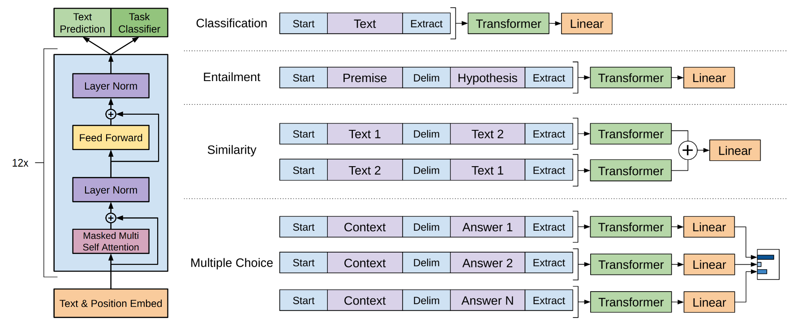

## GPT1

论文名称：Improving Language Understanding by Generative Pre-Training

NLP包含很多类型的任务，包括文本分类、文本匹配等。现在主流的做法是通过人工标注数据，针对某个具体场景训练一个模型，这也使得这种方法在缺乏标注数据的场景下很难奏效。GPT-1通过在不同的未标签文本库上对语言模型进行生成式预训练，然后对每个特定任务进行区分性微调，可以实现这些任务的巨大收益。也就是**不修改模型架构，而是通过设计任务相关的输入格式，让同一模型适配多种任务**。

本文提出一种半监督的方法GPT，用于自然语言理解任务，GPT的整体流程结合了无监督的预训练和有监督的微调。目标旨在学习到一种通用的表征能够以极小的代价用于各种下游任务。

### 无监督预训练

给定一个无监督token序列$\mathcal{U}={u_1,u_2,...,u_n}$，用一个标准的语言模型目标去极大化这个似然函数：

$L_1(\mathcal{U})=\sum_{i}logP(u_i|u_{i-k},...,u_{i-1};\theta) \\$

其中k是上下文滑窗的大小，$\theta$为神经网络模型的参数。

GPT1所谓的神经网络模型其实就是multi-layer transformer decoder，一种对transformer的改进（与原始的Transformer Decoder相比，因为只用到decoder，没用到encoder，所以把decoder中与encoder相关的Encoder-Decoder Attention层删除了，只保留了Masked Multi-Head Attention 层和Feed Forward层）。

$h_0 = UW_e + W_p \\$

$h_l = transformer\_block(h_{l-1}),\forall i \in [1,n] \\$

$P(u) = softmax(h_nW_e^T) \\$

其中$W_e$是词嵌入矩阵，$W_p$是位置编码矩阵。

### 有监督微调

当得到无监督的预训练模型之后，我们将它的值直接应用到有监督任务中。对于一个有标签的数据集$\mathcal{C}$，每个实例有$m$个输入token：$\{x^1, \dots, x^m\}$，它对应的标签$y$。首先将这些token输入到训练好的预训练模型中，得到最终的特征向量，$h_l^m$，然后再通过一个全连接层得到预测结果$y$：

$P(y|x^1, \dots, x^m) = \text{softmax}(h^m_l W_y) $

其中$W_y$为全连接层的参数，然后对于有监督微调还有一个task-specific损失

$L_2(\mathcal{C}) = \sum_{x,y} \log P(y|x^1, \dots, x^m) $

作者还发现，将语言建模作为微调的辅助目标有助于学习提高监督模型的泛化能力，以及加速收敛。所以损失函数如下：

$L_3(\mathcal{C}) = L_2(\mathcal{C}) + \lambda L_1(\mathcal{C}) $

### 任务相关的输入变换

在第1节的时候，我们介绍了GPT-1处理的4个不同的任务，这些任务有的只有一个输入，有的则有多组形式的输入。对于不同的输入，GPT-1有不同的处理方式，具体介绍如下：

- 分类任务：将起始和终止token加入到原始序列两端，输入transformer中得到特征向量，最后经过一个全连接得到预测的概率分布；
- 自然语言推理：将前提（premise）和假设（hypothesis）通过分隔符（Delimiter）隔开，两端加上起始和终止token。再依次通过transformer和全连接得到预测结果；
- 语义相似度：输入的两个句子，正向和反向各拼接一次，然后分别输入给transformer，得到的特征向量拼接后再送给全连接得到预测结果；
- 问答和常识推理：将 $n$ 个选项的问题抽象化为 $n$ 个二分类问题，即每个选项分别和内容进行拼接，然后各送入transformer和全连接中，最后选择置信度最高的作为预测结果。