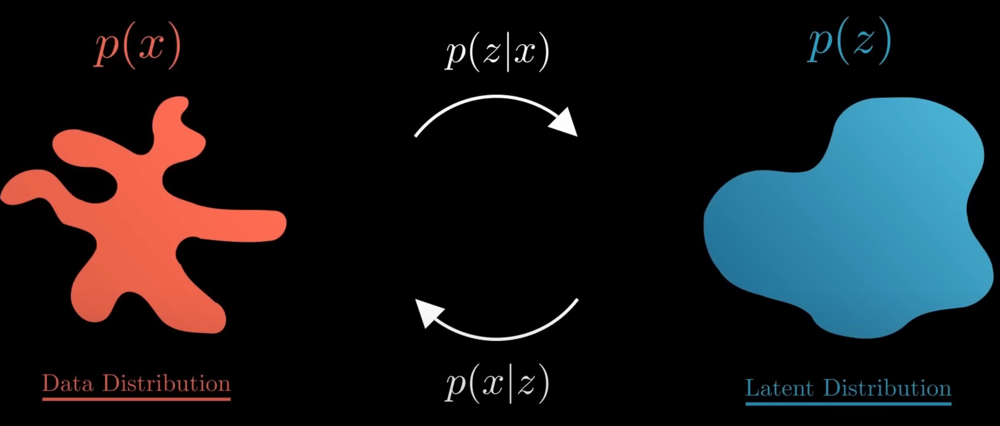

## Motivation

在说VAE之前，先来看一下传统的自编码器。

这个解码器只需要输入某些低维向量$z$，就能够输出高维的图片数据$X$。那我们能否把这个模型直接当做生成模型，在低维空间$\mathbb{R}^d$中随机生成某些向量$z$，再由解码器来生成图片呢？

可以这样做，但是对绝大多数随机生成的$z$，解码器生成的图片都是没有有意义的噪声。这是因为我们没有显性的对$z$的分布$p(z)$进行建模，我们并不知道哪些z能够生成有用的图片。

## VAE

对于自编码器来说，$z$的分布是不确定的，我们生成图片就会有困难。我们为什么不给定$z$一个简单的分布，将采样的空间缩的很小呢？

我们不妨假设$z \sim \mathcal{N}(0, I)$，其中$I$代表一个单位矩阵。也就是说，我们将$z$看作是一个服从标准多元高斯分布的多维随机变量。

在这个架构下，我们可以认为数据集是由某个随机过程生成的，而$z$是这个随机过程中的一个不可观测到的隐变量。这个生成数据的随机过程包含两个步骤：

1. 从先验分布$p(z)$中采样得到一个$z_i$
2. 根据$z_i$，从条件分布$p(X \mid z_i)$中采样得到一个数据点$x_i$

具体的我们的生成模型是这样的，给Decoder输入一个从$\mathcal{N}(0, I)$中采样得到的$z_i$，其实是希望由$\theta$参数化的Decoder能够学会一个映射，输出$z_i$对应的$X$的分布，即$p_{\theta}(X \mid z_i)$。

让我们假设，给定任意$z_i$后，$X$服从某个各维度独立的多元高斯分布，即：

$p_{\theta}(X \mid z_i) = \mathcal{N}(X \mid \mu_i^{\prime}(z_i; \theta), \sigma_i^{\prime2}(z_i; \theta) * I).\\ \\$

这样一来，我们只需要输入$z_i$给Decoder，然后让它拟合出$\mu_i^{\prime}、\sigma_i^{\prime2}，$我们就能知道$X \mid z_i $的具体分布了。事实上，我们的生成模型**Decoder往往不需要进行采样，只取其中的$\mu_i^{\prime}$当给定$z_i$生成的数据点$x_i$**，就可以生成图片了。

那还有一个问题，我们其实完全不清楚：究竟经过重新采样出来的$z_k$,是不是还对应着原来的$X_k$。

具体来说，给定一个真实样本$X_k$，我们假设存在一个专属于$X_k$的分布$p(z \mid X_k)$，这个也叫后验分布。并进一步假设这个分布是（独立的、多元的）正态分布。为什么要强调“专属”呢？因为我们前面说到要训练一个生成器，希望能够把从分布$p(z \mid X_k)$采样出来的一个$z_k$还原为$X_k$。$p(z \mid X_k)$专属于$X_k$，但这样有多少个$X$就有多少个正态分布了。我们知道正态分布有两组参数：均值$\mu$和方差$\sigma^2$,（多元的话，它们都是向量）。

那我怎么找出专属于$X_k$的正态分布$p(z \mid X_k)$，的均值和方差呢？好像并没有什么直接的思路。那好吧，那我就用神经网络来拟合出来吧！这就是神经网络时代的哲学：难算的我们都用神经网络来拟合。

举个例子，比如说对于人，有两个特征可以刻画，比如说身高和微笑程度，我们可以认为，所有的人的身高和微笑都是一个标准且独立的正态分布，这相当于我们对隐变量$z$的刻画。但是对于一个具体的人的图像，他属于人群中的个例，他的身高和微笑当然不一定是符合标准正态分布的。也就是说，给定一个真实样本$X_k$，我们假设存在一个专属于$X_k$的分布$p(z \mid X_k)$，这是我们的Encoder进行计算的（均值和方差）。

虽然说每一个个体的人，它的身高和微笑都不一定是符合标准正态分布，但是对于数据集中所有的人（图片），身高和微笑那会是符合标准正态分布的，所以我们需要最小化所有$p(z \mid X_k)$与标准正态分布的距离，也就是最小化其KL散度。除此之外，我们还需要考虑重建损失（最大化似然函数），我们的目标函数如下：

$\ell\left(p_{\theta}, q_{\phi}\right) = \log p_{\theta}(X) - D_{K L}\left(q_{\phi}, p_{\theta}\right).\\ \\$

总结一下VAE架构：

下图即是VAE的架构示例,其中$x_i^{(j)}$代表第$i$个数据点的第$j$个特征。

1. 我们首先给Encoder输入一个数据点$x_i$，通过神经网络，我们得到隐变量$z$服从的近似后验分布$q_{\phi}(z \mid x_i)$的参数。我们往往认为后验分布是一个各维度独立的高斯分布，因此令Encoder输出$z\mid x_i$服从的高斯分布的参数$\sigma_i^2$和$\mu_i$即可。
2. 有了$z \mid x_i$分布的参数$\sigma_i^2$和$\mu_i$后，我们从对应的高斯分布中采样出一个$z_i$，这个$z_i$应当代表与$x_i$相似的一类样本。
3. 我们令Decoder拟合似然的分布$p_{\theta}(X \mid z_i)$。喂给Decoder一个$z_i$，它应当返回$X \mid z_i$服从的分布的参数。我们往往认为似然也服从一个各维度独立的高斯分布，因此令Decoder输出$X\mid z_i$服从的高斯分布的参数$\sigma^{\prime2}_i$和$\mu^{\prime}_i$即可。
4. 在得到$X\mid z_i$的分布的参数后，理论上我们需要从这个分布中进行采样，来生成可能的数据点$x_i$。事实上，人们往往不进行采样，而是直接将模型输出的$\mu^{\prime}_i$当作是给定$z_i$生成的数据点$x_i$。