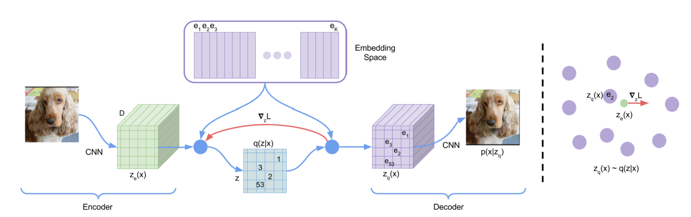

## VQ-VAE

本文主要参考资料：

论文：Neural Discrete Representation Learning

代码：[PyTorch-VAE](https://github.com/AntixK/PyTorch-VAE)

在传统的VAE中，隐变量$z$是一个连续的值。这意味着$z$的每一维可以取任意实数。VQ-VAE的核心特点是将隐变量$z$的每一维量化为离散的整数。具体来说，VQ-VAE引入了一个“码本”（codebook），这个码本包含一组离散的向量。在编码过程中，输入数据被映射到这个码本中的某个离散向量上，而不是一个连续的实数值。例如，假设码本中有 *K* 个离散向量，那么每个$z_i$只能取 *K* 个整数中的一个，比如 0、1、2、...、*K*−1。这种离散化使得隐空间的结构更加清晰，每个离散值都对应码本中的一个特定向量，这个特定向量的维度记为$D$。

输入的图像大小是$C \times H \times W$，codebook是一个$K \times D$的table, 对应上方紫色的$e_1, e_2, ... ,e_K$。

1. 经过encoder的编码，得到的输出是$Z_e(x)$，也就是下图的绿色部分，它的大小是$H' \times W' \times D$，表示的是这个图像编码成$H' \times W'$个小patch，这些可以理解成一些局部特征，如果$H'=W'=16$，那就有256个局部特征，每一个patch的是一个$D$维的向量表示（codebook中的每一个向量也是$D$维）。
2. 接下来我们就需要从codebook中选取$H' \times W'$个向量来替换$Z_e(x)$的每一个patch表示，分别去codebook里找到最近的$e_i$, 用其index表示（中间的蓝色表示），然后再替换成codebook中的向量， 就得到了青色的$Z_q(x)$。
3. 接下来把拿到的$Z_q(x)$放入decoder，然后重建图像，最后再与原始图像做对比，使用的是MSE损失函数。

## VQVAE如何训练

VQ-VAE其实是一个AE，误差函数里应该有原图像和目标图像的重建误差。

$L_{reconstruct} = ||x - decoder(z_q(x))||_2^2 \\$

但直接拿这个误差来训练是不行的。误差中，$z_q(x)$是解码器的输入。从编码器输出$z_e(x)$到$z_q(x)$这一步是不可导的，误差无法从解码器传递到编码器上。要是可以把$z_q(x)$的梯度直接原封不动地复制到$z_e(x)$上就好了。

VQ-VAE使用了一种叫做sg的运算解决这个问题，sg代表stop gradient运算符，也就是说，前向传播时，sg里的值不变；反向传播时，sg按值为0求导，即此次计算无梯度。（反向传播其实不会用到式子的值，只会用到式子的梯度。反向传播用到的loss值是在前向传播中算的）。

$L = \log p(x|z_q(x)) + ||sg[z_e(x)]-e||_2^2 + \beta ||z_e(x)-sg[e]||_2^2$

其中$e$是我们从codebook中选出来的向量，这个公式又可以写成：

$\begin{aligned} L = &||x - decoder(z_e(x) + sg(z_q(x) - z_e(x)))||_2^2 \\ &+ \alpha ||sg(z_e(x)) - z_q(x)||_2^2 + \beta||z_e(x) - sg(z_q(x))||_2^2 \end{aligned} \\$

1. 第一项是重建图像的MSE损失。
2. 第二项是codebook损失，让codebook中的向量离最近的$z_e(x)$靠近
3. 第三项叫commitment loss，只训练encoder，鼓励编码器的输出保持在选定的代码本向量附近，以防止其过于频繁地从一个代码向量波动到另一个，其实有一种聚类的思想。

解码器仅优化第一个损失项，编码器优化第一个和最后一个损失项，嵌入通过中间损失项进行优化。

