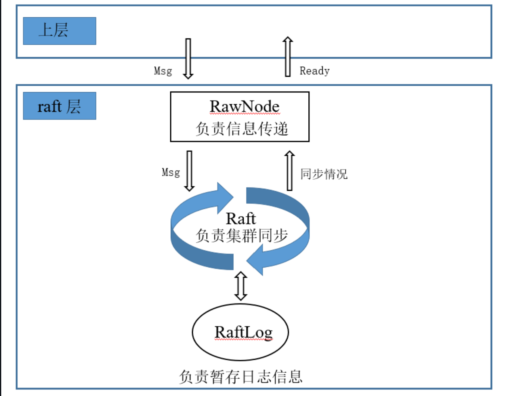

## TinyKV中的Raft

TinyKV中的 Raft 模块是和 Log 模块、RawNode 模块一起配合工作的。



## log模块

```
snapshot/first.....applied....committed....stabled.....last
--------|------------------------------------------------|
	                          log entries
```

TinyKV中的 log 是由 `RaftLog`进行管理的，它可以看成是两部分，其中一部分是 snapshot 部分，这部分已经在磁盘中被删除了；第二部分的话是所有没有被删除的日志的部分，也就是上面的 log entries。其中这部分有一部分是已经持久化在磁盘上，有一部分还驻留在内存上(等待被持久化)，这个`stabled`就是用来区分这两种的。

```go
type RaftLog struct {
	// storage contains all stable entries since the last snapshot.
	storage Storage
	committed uint64   // 需要被持久化，storage.InitialState()
	applied uint64     // 初始时赋值为 firstIndex - 1
	stabled uint64     
	entries []pb.Entry
	pendingSnapshot *pb.Snapshot
}

// RaftLog 的相关接口
func newLog(storage Storage) *RaftLog
func (l *RaftLog) unstableEntries() []pb.Entry
func (l *RaftLog) nextEnts() (ents []pb.Entry)
func (l *RaftLog) LastIndex() uint64
// 调用 storage.FirstIndex() 可以知道当前截断的 index
func (l *RaftLog) FirsIndex() uint64
func (l *RaftLog) Term(i uint64) (uint64, error)
func (l *RaftLog) maybeCompact()
```

`RaftLog`如何初始化呢？

```go
func newLog(storage Storage) *RaftLog {
	...
	firstIndex, _ := storage.FirstIndex()
	lastIndex, _ := storage.LastIndex()
	entries, _ := storage.Entries(firstIndex, lastIndex+1)
	hardState, _, _ := storage.InitialState()

	raftLog := RaftLog{
		storage:         storage,
		committed:       hardState.Commit,
		applied:         firstIndex - 1,
		stabled:         lastIndex,
		entries:         entries,
		pendingSnapshot: nil,
	}

	return &raftLog
}
```

为什么`RaftLog`的初始化中`applied`字段要用`firstIndex - 1`，而不用下面的`RaftApplyState.applied_index`呢？其实这就需要了解Project 2C中的 **Snapshot** 机制，因为有可能该 Raft 收到的是 snapshot 而不是 log 来同步日志的，所以无法确定`applied_index`这条日志存不存在。而我们看到，其实`firstIndex`是被截断后的第一条日志。

```go
message RaftApplyState {
    uint64 applied_index = 1;
    // Record the index and term of the last raft log that have been truncated. (Used in 2C)
    RaftTruncatedState truncated_state = 2; 
}
```

```go
func (ps *PeerStorage) FirstIndex() (uint64, error) {
	return ps.truncatedIndex() + 1, nil
}
func (ps *PeerStorage) truncatedIndex() uint64 {
	return ps.applyState.TruncatedState.Index
}
```


## RawNode模块

RawNode 作为一个信息传递的模块，主要就是上层信息的下传和下层信息的上传。

```go
func (rn *RawNode) Tick()                      // 驱动Raft的计时
func (rn *RawNode) Propose(data []byte) error  // Leader接收到来的 entry,并把它放入日志,向其他成员同步
func (rn *RawNode) Step(m pb.Message) error    // 驱动raft去处理消息
func (rn *RawNode) HasReady() bool
func (rn *RawNode) Advance(rd Ready)
```

主要的是一个`Ready`结构体，RaftGroup在处理请求的时候会产生一些需要进行更新的东西，比如说可能需要向其他 Raft 节点发送心跳、日志，或者 apply 日志等。

```go
type Ready struct {
	// The current volatile state of a Node.
	*SoftState
	// The current state of a Node to be saved to stable storage BEFORE
	// Messages are sent.
	pb.HardState
	// 需要被持久化的日志
	Entries []pb.Entry
	// Snapshot specifies the snapshot to be saved to stable storage.
	Snapshot pb.Snapshot
	// 待应用的日志
	CommittedEntries []pb.Entry
	// 待发送的消息
	Messages []pb.Message
}
```


## 总结

在server这个层次上，TinyKV把每个节点封装成了`Peer`，Raft Message的处理流程如下：

1. 当有Raft Message发送到指定的`Peer`，调用了`RaftGroup.Step()`(`RaftGroup`是`RawNode`类型)函数
2. 节点根据自身身份和消息类型，进入不同的处理流程，更新状态，同步日志，并生成将要发送的消息(放在`Raft.msgs`中)
3. 上层继续处理，也就是传入Raft Message后判断 Raft 状态机有没有输出，调用的是`HasReady`函数

> 是否有消息需要发送
>
> 是否有 snapshot 需要 apply
>
> 是否有需要持久化的日志
>
> 是否有需要进行 apply 的日志
>
> 是否 hardState 发生了变化，比如说 vote，commitIndex

4. 如果有输出，那就要调用`HandleRaftReady`函数处理
5. 最后调用`Advance`函数推进状态机，更新`RawNode`的状态