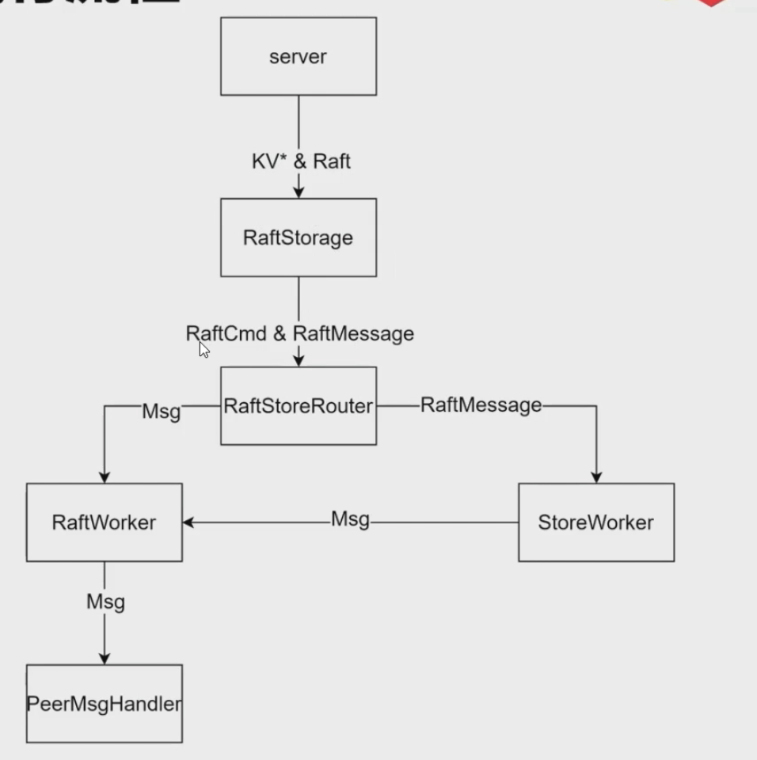
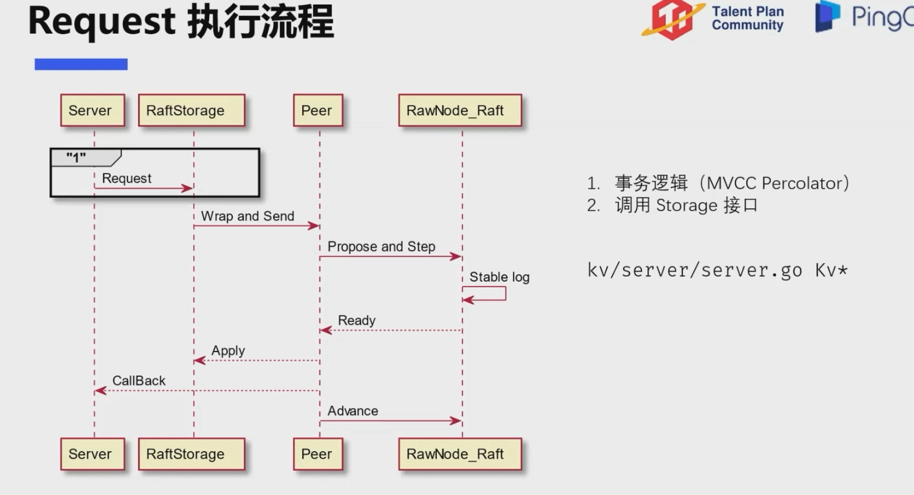

## TinyKV中的 Request 收发

TinyKV中消息分为 TinyKV 与客户端的交互，TinyKV集群中同一个Raft Group之间 Raft 的交互，以及TinyKV与 PD(Scheduler) 之间的交互。

其中TinyKV 与客户端的交互(读写命令)和PD模块的交互(split)都可以看作是 Raftcmd。

```go
// 这两个函数都是接收消息，把消息路由到指定的 Peer
func (r *RaftstoreRouter) SendRaftMessage(msg *raft_serverpb.RaftMessage) error {
	regionID := msg.RegionId
	if r.router.send(regionID, message.NewPeerMsg(message.MsgTypeRaftMessage, regionID, msg)) != nil {
		r.router.sendStore(message.NewPeerMsg(message.MsgTypeStoreRaftMessage, regionID, msg))
	}
	return nil
}

func (r *RaftstoreRouter) SendRaftCommand(req *raft_cmdpb.RaftCmdRequest, cb *message.Callback) error {
	cmd := &message.MsgRaftCmd{
		Request:  req,
		Callback: cb,
	}
	regionID := req.Header.RegionId

	return r.router.send(regionID, message.NewPeerMsg(message.MsgTypeRaftCmd, regionID, cmd))
}
```

这是 TinyKV < - > TinyKV之间发送消息注册的 RPC：

```
{
    StreamName:    "Raft",
    Handler:       _TinyKv_Raft_Handler,
    ClientStreams: true,
},

func _TinyKv_Raft_Handler(srv interface{}, stream grpc.ServerStream) error {
	return srv.(TinyKvServer).Raft(&tinyKvRaftServer{stream})
}

func (rs *RaftStorage) Raft(stream tinykvpb.TinyKv_RaftServer) error {
	for {
		msg, err := stream.Recv()
		if err != nil {
			return err
		}
		rs.raftRouter.SendRaftMessage(msg)
	}
}
```

而 `SendRaftCommand`函数被调用的来源不止一种，它可以是通过 `Storage.Write()`，`SchedulerTaskHandler. sendAdminRequest()`主要是这两个函数来调用。



这里再简单介绍一下 RaftWorker 和 StoreWorker：

我们知道 RaftStore 是 store 中进行消息发送、管理 Peer 的一个重要结构，RaftStore 启动的时候，首先会加载 store 中所有的 Peer，同时在 router 结构中注册 Peer，完成 Region Id 到 Peer 的一个映射。还有，RaftStore 会启动这两个 Worker，RaftWorker 和 StoreWorker。

- **RaftWorker**

这个 Raft Worker 它持有 `peerSender` 的接收端，由 RaftStore 在启动 worker 协程的时候执行 `run()`，这是一个内嵌的 select 循环，阻塞等待接收来自 `raftCh` 中的 msg，如果接收到，就调用 `HandleMsg`处理消息，处理完毕后调用 `HandleRaftReady`处理 `Ready` 信息。直到收到 `CloseCh` 信号，就结束这个过程。


-  **StoreWorker**

Store Worker 持有`storeSender`，来接收与 store 有关的消息。Store Worker 也有独立的handle msg的过程，主要处理的是 store 本身需要处理和汇报的消息，同时处理 Raft Worker 中没有发送成功的 Raft Msg。

比如 store 相关消息：

1. 定期向调度器发送心跳，汇报 store 内的信息，自身的状态
2. 定期清理断线 Peer 留下的 Snapshot

上面说了 StoreWorker 还会处理 Raft Worker 中没有发送成功的消息，Raft Worker 发送 raftmsg 失败后，会转发给 StoreWorker，它会尝试再发一次，如果还是失败，就会对这个消息的目标进行 store 层面的详细检查。比如说有可能 Peer 还没有创建，但这个 msg 确实是要发往一个合法的 Peer，那么 StoreWorker 会尝试创建该 Peer。


下面是 Request 的执行流程：



