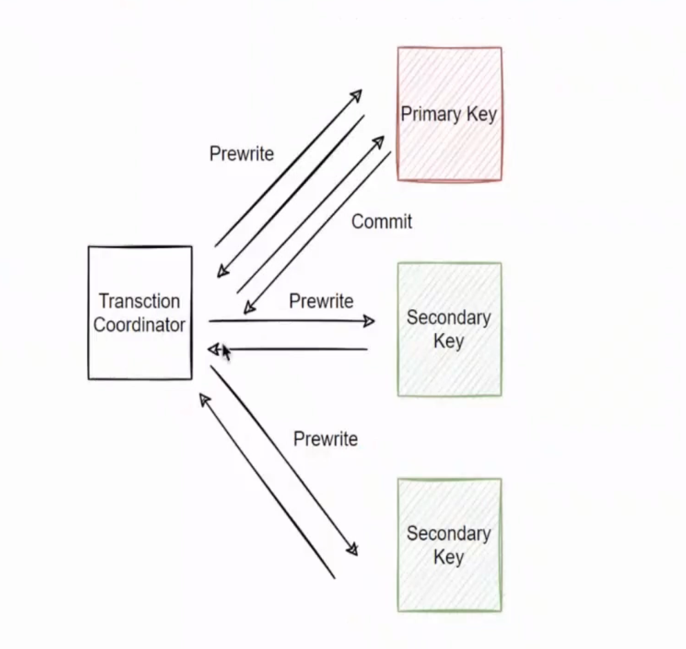
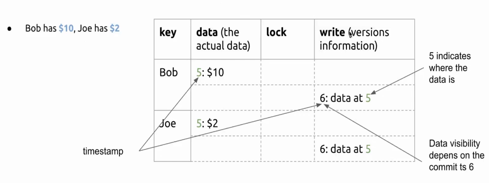
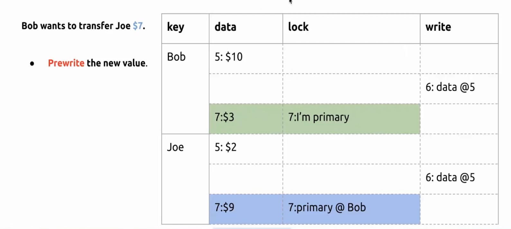
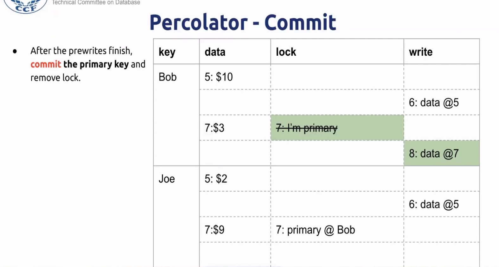
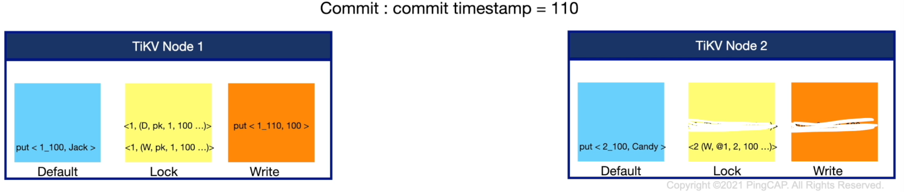

## Percolator事务模型原理

TinyKV中的Percolator实现需要PD模块提供两个时间戳，一个是事务刚开始的时候需要一个时间戳在data列和lock列进行写入，还有一个时间戳是事物的提交时间戳。比如如果我们想实现一个客户端，我们首先需要联系PD模块获取region信息和一个开始时间戳，然后根据region对需要进行修改的KV进行分组，向每一个region所在的leader发送一个`PreWrite`，如果全部返回成功，那么就可以进行提交，此时再获取一个提交时间戳，向每一个region发送一个`KvCommit`信息，只要`Primary Key`的提交信息再次成功写入，整个事务就成功了。

相比于传统的2PC算法，Percolator事务模型有一些创新点，也就是它的协调者是无状态的，可以根据参与者的状态判断整个事务是提交还是失败的。它事务是提交还是失败的状态是放在这个`Primary Key` 中的，而每一个`Secondary Key`都有一个指向，可以知道自己的`Primary Key`是谁

那我们现在就看一看Percolator它的内部实现的一些细节。

首先我们要引入**列族(Column Family)**的概念，类似于KV的一个namespace。我们一行KV会存储三列，分别是是**data列**，**lock列**、**write列**。data列存储真实的数据，write列是提交时间，决定了可见性。

下面我们从一个简单的分布式事务来看一下PreWrite和KvCommit的具体流程，这个分布式事务就是Bob给Joe转账7美元。

## Prewrite

假设事务开始的时间是7，那么会先写data列，然后还需要写lock表示这个key已经被占用了。客户端向每一个region发送`PreWrite`这个过程是**并行**的。

## KvCommit

因为我们的事务成功提交与否是依赖于`Primary Key`的，所以`KvCommit`的过程并**不是完全并发**的，首先是单独地先向`Primary Key`发送提交信息，就是把锁删掉，并在write列添加一个提交时间戳的信息。这个步骤完成后，就可以返回给客户端了，表示事务已经成功提交了。`Secondary Key`则是一个异步的提交，这里可以**并行**。写入write列提交信息的时候也要把事务的开始时间戳写进去。

## 如何读取以及读取中的一些问题

正常情况下的读取(读取时带一个时间戳)

1. 首先从write列读取到小于等于读取时间戳的第一条（最大）提交记录
2. 从提交记录中找到该Key的写入(`PreWrite`)时间
3. 在data列读取这条KV

考虑以下这种情况：当`Primary Key`成功提交的时候，这时候`Secondary Key`所在的节点挂掉了，也就是如下图所示。

那么当客户端读取key=2的时候，它首先看到在lock列有一把没有释放的锁，并且这把锁是`Secondary Key`的写锁，这把锁指向key=1。这时候根据这个key=1到另外一个节点去找，然后看到id=1这把'Primary Key'这把写锁已经被释放了，由此可以知道事务是已经成功提交了的，然后再根据这个读取到的信息为key=2进行解锁和写入提交时间的信息。所以我们看到，Percolator是可以保证事务的原子性的。