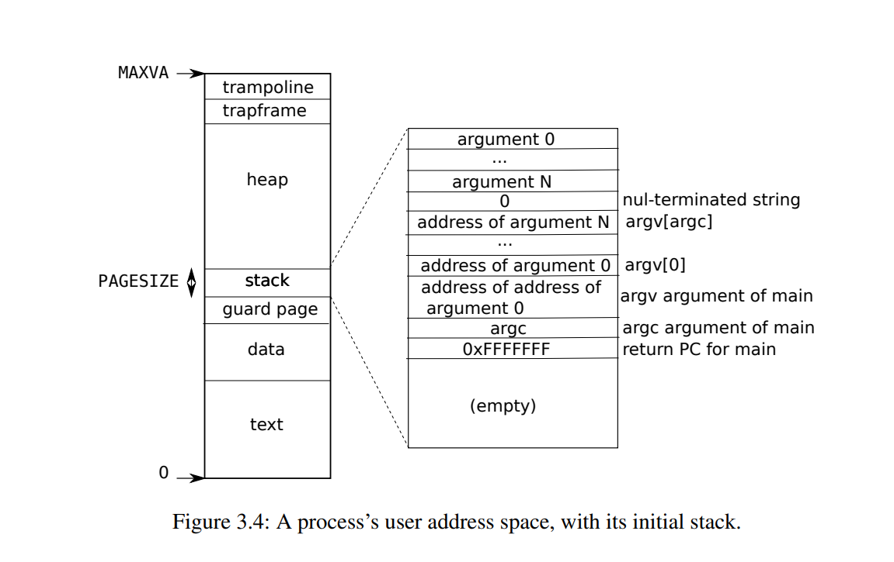

## **mmap lab**

这个实验需要我们完成mmap系统调用：

```c
void *mmap(void *addr, size_t length, int prot, int flags, int fd, off_t offset);
```

意思是映射描述符为 `fd` 的文件，的前 `length` 个字节到 `addr` 开始的位置。并且加上 `offset` 的偏移量（即不从文件的开头映射）    如果 `addr` 参数为 0，系统会自动分配一个空闲的内存区域来映射，并返回这个地址。

在实验中我们只需要支持 `addr` 和 `offset` 都为 0 的情况，也就是完全不用考虑用户指定内存和文件偏移量。


根据实验的hints，我们需要在`struct proc` 中定义一个`vma` 数组:

```c
struct vma vmas[NVMA];
```

这个`struct vma` 如下，每一个`vma` 都表示一个需要进行mmap的文件，里面记录了起始的虚拟地址，映射的大小，权限，以及文件的偏移位置(这里应该默认为0)。

```c 
struct vma{
  int valid;
  uint64 vastart;
  uint64 sz;

  int prot;
  int flags;

  struct file *f;
  uint64 offset;
};
#define NVMA 16
```

在调用mmap系统调用的时候，并不会立马就为进程进行该文件分配真实的物理地址到虚拟地址的映射，只是占用一个`vma` ，将相应的变量设置好，然后就立马返回。等到进程需要访问这段mmap的虚拟地址时，会触发缺页中断，再在缺页中断处理中进行物理内存分配和虚拟地址的映射。

我们再来看一下进程的地址空间:



在mmap映射中，只能在heap中，不能超过trapframe。我们从heap顶端开始进行向下分配，所以我们需要记录一个`vaend` 表示最上面已被占用的地址空间。


### **sys_mmap**

首先我们来看`sys_mmap` 系统调用，主要逻辑就是在`vmas` 数组中找到一个未被占用的`struct vma` 。等到缺页中断发生时就用这个`vma` 进行物理内存的分配和地址的映射。返回文件映射的起始地址`vastart` 。

```c
uint64 sys_mmap(void){
  uint64 addr, sz, offset;
  int prot, flags, fd;
  struct file *f;

  if (argaddr(0, &addr) < 0 || argaddr(1, &sz) < 0 || argint(2, &prot) < 0 || argint(3, &flags) < 0 || argfd(4, &fd, &f) < 0 || argaddr(5, &offset) < 0 || sz == 0)
    return -1;

  if ((!f->readable && (prot & (PROT_READ))) || (!f->writable && (prot & PROT_WRITE) && !(flags & MAP_PRIVATE)))
    return -1;

  sz = PGROUNDUP(sz);

  struct proc *p = myproc();
  struct vma *v = 0;
  uint64 vaend = MMAPEND; // non-inclusive，不能超过trapframe

  // mmaptest never passed a non-zero addr argument.
  // so addr here is ignored and a new unmapped va region is found to
  // map the file
  // our implementation maps file right below where the trapframe is,
  // from high addresses to low addresses.

  // Find a free vma, and calculate where to map the file along the way.
  for (int i = 0; i < NVMA; i++){
    struct vma *vv = &p->vmas[i];
    if (vv->valid == 0){
      if (v == 0){
        v = &p->vmas[i];
        // found free vma;
        v->valid = 1;
      }
    }
    else if (vv->vastart < vaend){
      vaend = PGROUNDDOWN(vv->vastart);
    }
  }

  if (v == 0){
    panic("mmap: no free vma");
  }

  v->vastart = vaend - sz;
  v->sz = sz;
  v->prot = prot;
  v->flags = flags;
  v->f = f; // assume f->type == FD_INODE
  v->offset = offset;

  filedup(v->f);

  return v->vastart;
}
```


### **缺页中断处理**

首先得到引发缺页异常的虚拟地址，再调用`mmap_solve(va)` 函数。

```c
    uint64 va = r_stval();
    if (r_scause() == 13 || r_scause() == 15)
    {
      if (mmap_solve(va) == -1)
      {
        goto error;
      }
    }
```

`mmap_solve` 函数也很明显了。

```c
int mmap_solve(uint64 va)
{
  struct proc *p = myproc();
  struct vma *v = findvma(p, va);
  if (v == 0)
  {
    return 0;
  }

  // printf("vma mapping: %p => %d\n", va, v->offset + PGROUNDDOWN(va - v->vastart));

  // allocate physical page
  void *pa = kalloc();
  if (pa == 0)
  {
    panic("vmalazytouch: kalloc");
  }
  memset(pa, 0, PGSIZE);

  // read data from disk
  begin_op();
  ilock(v->f->ip);
  readi(v->f->ip, 0, (uint64)pa, v->offset + PGROUNDDOWN(va - v->vastart), PGSIZE);
  iunlock(v->f->ip);
  end_op();

  // set appropriate perms, then map it.
  int perm = PTE_U;
  if (v->prot & PROT_READ)
    perm |= PTE_R;
  if (v->prot & PROT_WRITE)
    perm |= PTE_W;
  if (v->prot & PROT_EXEC)
    perm |= PTE_X;

  if (mappages(p->pagetable, va, PGSIZE, (uint64)pa, PTE_R | PTE_W | PTE_U) < 0)
  {
    panic("vmalazytouch: mappages");
  }

  return 1;
}
```


到此好像都结束了，还有什么遗漏的细节吗？

> fork函数也需要把vma数组都复制给子进程！

