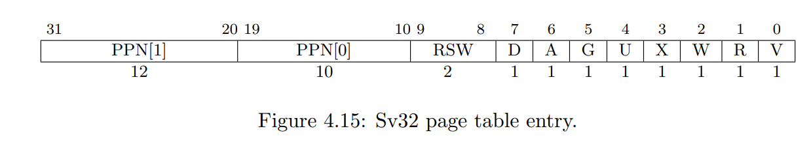

## Speed up system calls (easy)

这个小实验就是要求实现一个不陷入内核的系统调用 `ugetpid`。
当一个进程被创建时，会在进程的地址空间中映射一个只读的内存区域，地址为USYSCALL。这个页面存储的是一个 struct usyscall 的结构体。

```c
// memlayout.h
struct usyscall {
  int pid;  // Process ID
  ....
};
```


首先需要看一下proc.h的改动。
```c
struct proc
{
  struct spinlock lock;

  // p->lock must be held when using these:
  enum procstate state; // Process state
  void *chan;           // If non-zero, sleeping on chan
  int killed;           // If non-zero, have been killed
  int xstate;           // Exit status to be returned to parent's wait
  int pid;              // Process ID

  // wait_lock must be held when using this:
  struct proc *parent; // Parent process

  // these are private to the process, so p->lock need not be held.
  uint64 kstack;               // Virtual address of kernel stack
  uint64 sz;                   // Size of process memory (bytes)
  pagetable_t pagetable;       // User page table
  struct trapframe *trapframe; // data page for trampoline.S
  struct context context;      // swtch() here to run process
  struct file *ofile[NOFILE];  // Open files
  struct inode *cwd;           // Current directory
  char name[16];               // Process name (debugging)
  struct usyscall *ucall;      // 不陷入内核的系统调用
};
```
题外话，这里的`trapframe`结构体和`trampoline`页面是如何进行映射的呢？我们从代码中找到答案。

`trampoline`是陷入内核的代码，操作系统内核在启动的时候就设置了映射，这段代码存在于所有进程的虚拟地址空间中，且虚拟地址都是`TRAMPOLINE`，所有的进程都共享同一个物理页面。所以每一个进程在`proc_pagetable`中都有这么一个调用，可以看到，所有的进程都共享同一个物理页TRAMPOLINE。

```c
// proc_pagetable
if(mappages(pagetable, TRAMPOLINE, PGSIZE,
              (uint64)trampoline, PTE_R | PTE_X) < 0){
    uvmfree(pagetable, 0);
    return 0;
 }
```

而`trapframe`则不一样，它是每一个进程私有的用来保存寄存器现场的，所以它需要先`kalloc`，然后再`mappages`，比如摘取到的代码如下。`porc`结构体中的`trapframe`是操作系统内核中某一个进程`trapframe`的物理地址。

```c
  // allocproc函数
  if((p->trapframe = (struct trapframe *)kalloc()) == 0){
    freeproc(p);
    release(&p->lock);
    return 0;
  }

  //proc_pagetable函数
  if(mappages(pagetable, TRAPFRAME, PGSIZE,
              (uint64)(p->trapframe), PTE_R | PTE_W) < 0){
    uvmunmap(pagetable, TRAMPOLINE, 1, 0);
    uvmfree(pagetable, 0);
    return 0;
  }
```


说了上面这些，那么`usyscall`又应该怎么实现呢，首先，它是每个进程私有的，所以必须在`proc`结构体里面申明它的存在，其次，为了实现不陷入内核的系统调用，也就是说，用户进程可以直接在自己的某个虚拟地址中找到这些信息，也就是这样：

```c
struct usyscall *u = (struct usyscall *)USYSCALL;   
```

其中`USYSCALL`是我们规定好的一个虚拟地址，那么现在的问题是，我们需要在添加`proc->sysycall` (物理地址)到`USYSCALL`(虚拟地址)的映射就可以了。


直接读取USYSCALL处的内存：

```c
// ulib.c
int ugetpid(void){
  // 这个虚拟地址处有一个 usyscall 的结构体指针
  struct usyscall *u = (struct usyscall *)USYSCALL;          // USYSCALL是一个给定的虚拟地址
  return u->pid;
}
```


上面的这些还不够，因为我们还没有建立映射关系，如果直接这样会触发xv6的缺页异常。

首先我们需要在`allocproc`函数申请一个进程的时候，为`usyscall`结构体申请物理内存。并把`ucall->pid`设置成进程的`pid`。

```c
if ((p->ucall = (struct usyscall *)kalloc()) == 0){
    // freeproc(p);
    freeproc(p);
    release(&p->lock);
    return 0;
}
```


有了物理的内存，就可以建立映射关系了。我们在`proc_pagetable`中建立映射。虚拟地址为`USYSCALL`，物理地址为`p->ucall`。

```c
pagetable_t proc_pagetable(struct proc *p){
  .............
      
  // mappages(pagetable_t pagetable, uint64 va, uint64 size, uint64 pa, int perm)
  // 物理地址 p->ucall, 内核已经分配好了
  if (mappages(pagetable, USYSCALL, PGSIZE, (uint64)(p->ucall), PTE_R | PTE_U) < 0){
    uvmunmap(pagetable, TRAMPOLINE, 1, 0);
    uvmfree(pagetable, 0);
    return 0;
  }

  ...........
  return pagetable;
}
```

---


## Print a page table (easy)

首先我们要清楚 xv6 页表中虚拟地址的结构。
- 虚拟地址只有39位，划分为：
> 9(最高级页目录中的偏移) + 9(中级页目录偏移) + 9(最低级页目录偏移) + 12(offset) 
> 

- 一个页表条目 8 字节，物理地址内存是56bit。
> 一个条目中，最低10位为flags。还有44位做物理地址，这44位加上12位低位置零，就是56位的物理内存地址

实现一个 `vmprint()` 函数，该函数接收一个 pagetable_t 的参数，然后打印该页表，具体格式参考图片中的样式。在创建 `init` 进程时，调用这个函数打印页表。

```c
void vmprint(pagetable_t pagetable, uint dep){
  if(dep == 0)
    printf("page table %p\n", pagetable);
  for(int i = 0; i < 512; i++){
    pte_t pte = pagetable[i];
    if(pte & PTE_V){
      for(int j = 0; j < dep; j++)
        printf(".. ");
      uint64 child = PTE2PA(pte);
      printf("..%d: pte %p pa %p\n", i, pte, child);
      if(dep < 2)
        // 如果层数等于 2 就不需要继续递归了，因为这是叶子节点
        vmprint((pagetable_t) child, dep + 1);
    }
  } 
}
```

------


## Detecting which pages have been accessed (hard)

实验背景：一些垃圾回收器会根据页面是否被访问过来回收不需要的页面，我们要实现一个函数`pgaccess`系统调用，记录哪些页面被访问过，并记录在一个`mask`掩码里。


pgaccess系统调用接受3个参数

1. 起始的虚拟地址
2. 虚拟页的页数
3. 一个用户态的掩码存储返回的结果


The A bit indicates the virtual page has been read, written, or fetched from since the last time the A bit was cleared.这个A标志位是riscv处理器自己设置的，并不需要我们在软件上进行实现。实验指导上也说明，这个系统调用会把A标志位给清除。什么时候会把这个标志位置1呢，就是解决TLB缓存一次miss的情况下，会把页面的A置位1，也就是表示访问过。




首先是系统调用的申明。

```c
int sys_pgaccess(void)
```


在这个函数中，先要获取相关的参数。`argaddr(0,&va)`是获取系统调用第一个参数，起始的虚拟地址。这个函数调用`walk`来找到第三级的`pte`，判断并设置`mask`。最后我们需要把`mask`写回到用户的地址空间中，这就需要`copyout`函数。

```c
int sys_pgaccess(void){
  // lab pgtbl: your code here.
  // 获取参数  argaddr() and argint().
  uint64 va;
  int sz;
  uint64 mask_addr;
  if (argaddr(0, &va) < 0){
    return -1;
  }
  if (argint(1, &sz) < 0){
    return -1;
  }
  if (argaddr(2, &mask_addr) < 0){
    return -1;
  }

  if (sz > 32 || sz < 0){
    return -1;
  }

  struct proc *p = myproc();

  int mask = 0;
  // 把这个掩码写入进程 p 用户态的地址 mask_addr 中去。
  if (va > MAXVA){
    return -1;
  }
  // va = PGROUNDDOWN(va);
  for (int i = 0; i < sz; i++){
    // 找到相应的 pte 条目。 walk() in kernel/vm.c is very useful for finding the right PTEs.
    uint vaddr = va + i * PGSIZE;
    pte_t *pte = walk(p->pagetable, vaddr, 0);
    if (vaddr >= MAXVA){
      return -1;
    }

    if (pte == 0){
      return -1;
    }
    if (*pte & PTE_A){
      mask |= (1 << i);
      *pte = *pte & (~PTE_A);
    }
  }
  // int copyout(pagetable_t pagetable, uint64 dstva, char *src, uint64 len)
  if (copyout(p->pagetable, mask_addr, (char *)(&mask), (uint64)(sizeof(int))) < 0)
  {
    return -1;
  }

  return 0;
}
```


最后看看`copyout`函数的实现，`walkaddr`函数返回的是虚拟地址所在的物理地址，然后调用`memmove`函数实现复制。

```c
int copyout(pagetable_t pagetable, uint64 dstva, char *src, uint64 len)
{
  uint64 n, va0, pa0;

  while (len > 0)
  {
    va0 = PGROUNDDOWN(dstva);
    pa0 = walkaddr(pagetable, va0);
    if (pa0 == 0)
      return -1;
    n = PGSIZE - (dstva - va0);
    if (n > len)
      n = len;
    memmove((void *)(pa0 + (dstva - va0)), src, n);

    len -= n;
    src += n;
    dstva = va0 + PGSIZE;
  }
  return 0;
}
```


