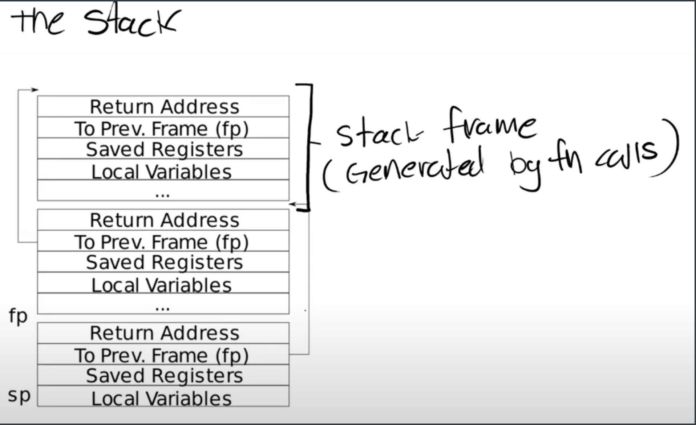

## RISC-V assembly (easy)

首先，做这个实验前，需要先了解gdb如何调试内核。

编译 xv6 操作系统并运行在 QEMU 模拟器中，并启动 GDB 调试器。
```
$make CPUS=1 qemu-gdb
*** Now run 'gdb' in another window.
qemu-system-riscv64 -machine virt -bios none -kernel kernel/kernel -m 128M -smp 1 -nographic -drive file=fs.img,if=none,format=raw,id=x0 -device virtio-blk-device,drive=x0,bus=virtio-mmio-bus.0 -S -gdb tcp::26000

```
> -machine virt：使用virt机器模型
> -bios none：不使用BIOS
> -kernel kernel/kernel：指定内核文件的路径
> -m 128M：设置虚拟机的内存大小为128M
> -smp 1：设置虚拟机的CPU数量为1
> -S：在启动时暂停虚拟机
> -gdb tcp::26000：启动一个GDB服务器，监听端口号为26000，等待GDB客户端连接。

然后再另一个shell终端执行：
```
gdb-multiarch kernel/kernel
set architecture riscv:rv64
target remote localhost:26000
```
> gdb-multiarch 是一个支持多种架构的 GDB 调试器，可以用于调试不同架构的程序。在使用 gdb-multiarch 命令时，您需要指定要调试的可执行文件的架构类型。
>kernel/kernel 是一个可执行文件的路径，它指向了一个操作系统内核的二进制文件。在使用 gdb-multiarch kernel/kernel 命令时，gdb-multiarch 将会以多架构模式启动，并加载 kernel/kernel 文件以进行调试。

如果要调试用户空间的程序
```
(gdb)file user/_call
(gdb)b main
(gdb)c
```

接下来在原来的那个终端上就可以开始输入你想要执行的命令了。
```
blackghost@LAPTOP-6BH4BGNM ~/D/M/xv6-labs-2021 (traps) [1]> 
qemu-system-riscv64 -machine virt -bios none -kernel kernel/kernel -m 128M -smp 1 -nographic -drive file=fs.img,if=none,format=raw,id=x0 -device virtio-blk-device,drive=x0,bus=virtio-mmio-bus.0 -S -gdb tcp::26000

xv6 kernel is booting

init: starting sh
$ 
```
有没有感觉比较熟悉，其实在jyy的操作系统硬件视角的操作系统这一节课上，也谈到了如何用gdb调试内核。

------


## Backtrace (moderate)

这是risc-v的栈帧。riscv的栈帧和x86的栈帧有些许区别。



我们看到上面这张图，上面的栈帧是更早的函数调用，下面的栈帧是最新的函数调用，`sp`寄存器指向当前栈的栈顶，可以发现，在 riscv 中，fp 指向的是当前栈帧返回地址前面的一个位置（地址更高）。`fp-8`就得到当前栈帧的返回地址，`fp-16`记录的是Prev Frame。在 riscv 的定义中，返回地址也是属于当前栈帧的的一部分。

```c
void backtrace(){
  uint64 fp = r_fp();  
  uint64 upper_bound = PGROUNDUP(fp);
  while (fp != upper_bound)
  {
    uint64 ret_addr = *(uint64 *)(fp - 8);
    printf("%p\n", ret_addr);
    fp = *(uint64 *)(fp - 16);
  }
}
```

------


## Alarm (hard)

实验背景：
当一个进程在使用CPU的时候，我们希望每隔一段特定的时间都会使该进程去执行另外一段用户态的代码。时钟中断是一直在触发的，这个问题不需要我们去关心。

实现一个 `sigalarm(interval, handler)` 的系统调用。及每过 interval 个时钟周期，就执行一遍 `handler` 这个函数(进程实现)。此外还要实现一个 `sigreturn()` 系统调用，如果 `handler` 调用了这个系统调用，就应该停止执行 `handler` 这个函数，然后恢复正常的执行顺序。如果说 `sigalarm` 的两个参数都为 0，就代表停止执行 `handler` 函数。`handler`函数结尾需要有一个特殊的系统调用`sigreturn`。


`sigalarm`应该如何实现?
首先，我们应该明确的一点是，这个`handler`函数地址我们是必须保存在`proc`结构体里面的。我们还需要一个域`tick`来表示周期的长短，还需要一个域`ticks_passed`来表示距离最近一次执行了`handler`函数过去了多长时间。
这里官方也给了一个提示，就是我们的这个处理函数`handler`可能执行时间会比较长，它执行的过程中是不允许再次执行`handler`函数的。所以我们就需要一个开关`alarm_on`, 如果这个打开则允许执行，关闭就不会执行直接跳过。也就是说，在进入`alarm_handler`之前，我们应该把`alarm_on`置为0，在`alarm_handler`函数返回前，再把`alarm_on`置为1.
所以proc结构体中应该添加三项：

```c
uint64 alarm_handler; // 函数地址
int ticks;            // 多久少个tick调用一次 alarm_handler
int ticks_passed;     // 最近一次调用alarm_handler是多久之前
int alarm_on;         // 允不允许执行alarm_handler
```

每发生一次时钟中断，都会进入`usertrap`函数，`ticks_passed`也应该加1。如果`ticks_passed`等于`ticks`，就要执行函数的跳转。那么怎么跳转，如果跳转到`handler`，那么应该记录一下`handler`执行完成后原来应该返回的地址呀。而执行完`handler`函数`sigreturn`回去，还应该恢复之前的寄存器现场呀。**我们是不是应该保存整个`trapframe`**。
> 当用户态函数跳转时，应该更改`trapframe`页面的epc,指向`p->alarm_handler`。但还有，我们执行完`alarm_handler`函数再次执行`alarmreturn`系统调用后，不光是pc指针应该指向原来的位置，寄存器现场也应该是原来的数值。
> 所以我们应该创建一个临时页面(proc结构体里)，当需要进行用户函数`alarm_handler`的跳转时，就用这个页面把trapframe页面保存起来。
> 最后在`alarmreturn`系统调用中，再把trapframe页面恢复过来。还要把alarm_on再次打开。
```c
// give up the CPU if this is a timer interrupt.
if (which_dev == 2){
    if (p->ticks > 0 && p->alarm_on == 1 && (p->ticks_passed++) == p->ticks){
      p->alarm_on = 0;
      // 保存好当前的所有寄存器现场
      *(struct trapframe *)(p->alarm_frame) = *(struct trapframe *)(p->trapframe);
      p->ticks_passed = 0;
      p->trapframe->epc = p->alarm_handler;
    }
    yield();
  }
```

```c
uint64 sys_sigreturn(){
  struct proc *p = myproc();
  *(struct trapframe *)(p->trapframe) = *(struct trapframe *)(p->alarm_frame);
  p->alarm_on = 1;
  return 0;
}

```


