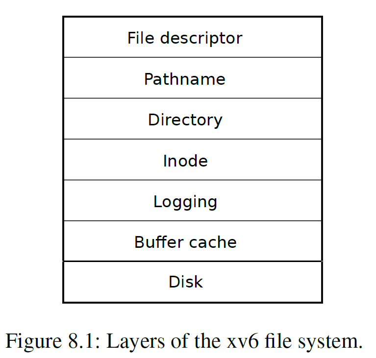
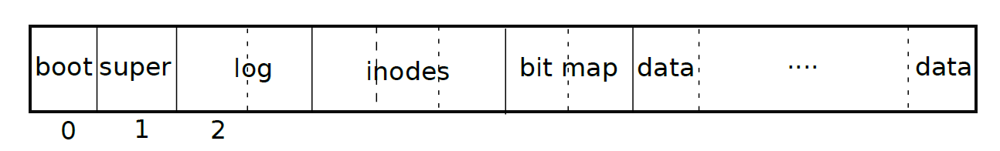

## 1.文件系统组织架构


* `disk`层：对硬盘上的块进行读写操作

* `buffer cache`层：在内存中对磁盘块进行缓存，并确保只有1个内核进程能在一段时间内修改文件块上存储的数据。

* `logging`层：让更高的层级能够将对文件块的所有`update`打包到一个`transaction`中，从而能保证所有文件块能够在将要崩溃时原子地进行`update`

* `inode`层：为每个文件提供独一无二的inode number

* `directory`层：每个文件夹也作为一个特殊的inode结构体，不过内容是一条一条的entry

* `pathname`层：将文件夹组织为层级，解析路径、

* `file descriptor`层：将所有的资源都抽象为`struct file`,如设备，文本文件，管道等

  ------
  
  

## 2.Disk 层
xv6文件系统的磁盘块布局如下：



- `block 0`：启动区域，文件系统不会使用，包含了操作系统启动所需要的代码

- `blcok 1`: `superblock`，存储了文件系统的元数据（block的大小、block的数目、inode的数目等），里面有一个mkfs的程序，用来构建初始的文件系统

- `block 2-31`：`log block`

- `block 32-44`: `inode`，一个`inode`的大小为64字节，一个`block`的大小为1024字节，因此`block32`为`inode 1-16`，block33为`inode 17-32`

- `block 45 bitmap block`，用来跟踪哪些`block`是在使用

- 最后从`block 46`开始是`data block`，要么是在`bitmap`中被标记为空闲状态，要么存储了文件/文件夹的内容

  ------

  

## 3.Buffer cache层
### buffer cache层的作用
1. 将对磁盘块的访问权限进行同步，保证内存中只保存一个该磁盘块的拷贝，且一次只有一个内核线程访问这个拷贝，但同时可以有多个对这个`block`的引用
2. 将被频繁访问的块缓存到内存中(局部性原理)

### 代码解析

`bcache`就是内存中对硬盘`block`的缓冲，`head`的作用是把`bcache`组织为一个链表，缓冲区的使用早晚就是通过`head`来判断的。
```c
struct {
  struct spinlock lock;
  struct buf buf[NBUF];

  // Linked list of all buffers, through prev/next.
  // Sorted by how recently the buffer was used.
  // head.next is most recent, head.prev is least.
  struct buf head;
} bcache;
```

buffer cache有两个接口，分别是`bread()`和`bwrite()`。
`bread`通过`bget`获取一个指定了设备`dev`和`blockno`的`buf *`，这是从硬盘指定的块中获取的一个缓冲数据结构体。`valid`表示的是内存中的某个`block`有无磁盘块的一份拷贝，如果没有就要调用`virtio_disk_rw`函数从磁盘写到内存中。
```c
struct buf*
bread(uint dev, uint blockno)
{
  struct buf *b;

  b = bget(dev, blockno);
  if(!b->valid) {
    virtio_disk_rw(b, 0);
    b->valid = 1;
  }
  return b;
}
```

可以看到，可以允许多个文件指向内存中同一个`buffer`，这里的替换算法也是相当简单。
```c
static struct buf*
bget(uint dev, uint blockno)
{
  struct buf *b;

  acquire(&bcache.lock);

  // Is the block already cached?
  for(b = bcache.head.next; b != &bcache.head; b = b->next){
    if(b->dev == dev && b->blockno == blockno){
      b->refcnt++;
      release(&bcache.lock);
      acquiresleep(&b->lock);
      return b;
    }
  }

  // Not cached.
  // Recycle the least recently used (LRU) unused buffer.
  for(b = bcache.head.prev; b != &bcache.head; b = b->prev){
    if(b->refcnt == 0) {
      b->dev = dev;
      b->blockno = blockno;
      b->valid = 0;
      b->refcnt = 1;
      release(&bcache.lock);
      acquiresleep(&b->lock);
      return b;
    }
  }
  panic("bget: no buffers");
}
```
- 为什么要`acquiresleep`?
> 获取这个锁之后立即让这个进程进入睡眠，一旦这个锁可用，该线程就会立刻被唤醒。
> 

`bwrite`是向硬盘指定块写入数据。

```c
void
bwrite(struct buf *b)
{
  if(!holdingsleep(&b->lock))
    panic("bwrite");
  virtio_disk_rw(b, 1);
}
```

`brelse`是释放操作。

```c
void
brelse(struct buf *b)
{
  if(!holdingsleep(&b->lock))
    panic("brelse");

  releasesleep(&b->lock);

  acquire(&bcache.lock);
  b->refcnt--;
  if (b->refcnt == 0) {
    // no one is waiting for it.
    b->next->prev = b->prev;
    b->prev->next = b->next;
    b->next = bcache.head.next;
    b->prev = &bcache.head;
    bcache.head.next->prev = b;
    bcache.head.next = b;
  }
  
  release(&bcache.lock);
}
```


------


## 4.Block 层

block allocator为磁盘的是否空闲的状态准备了一个bitmap，每一位对应一个磁盘块，0表示空闲1表示正在使用，`mkfs`负责设置这些位。

`sb`是一个super block,它记录了文件系统一些基本信息。
`BBLOCK`宏是判断某个逻辑块号的信息在哪个`bitmap`块中。
一个`bitmap`块中，总共用`BSIZE`个字节，也就是`BPB`个bit。
```c
#define BPB           (BSIZE*8)
#define BBLOCK(b, sb) ((b)/BPB + sb.bmapstart)
```
下面的代码中`bp`是获取到的`bitmap`块，一个`bitmap`的每一个bit都用来标记该`blockno`是不是空闲的。`b`是遍历到的位图的第0个bit表示的逻辑块号。`bi`就是偏移。
```c
static uint
balloc(uint dev)
{
  int b, bi, m;
  struct buf *bp;

  bp = 0;
  for(b = 0; b < sb.size; b += BPB){
    bp = bread(dev, BBLOCK(b, sb));
    for(bi = 0; bi < BPB && b + bi < sb.size; bi++){
      m = 1 << (bi % 8);
      if((bp->data[bi/8] & m) == 0){  // Is block free?
        bp->data[bi/8] |= m;  // Mark block in use.
        log_write(bp);
        brelse(bp);
        bzero(dev, b + bi);
        return b + bi;
      }
    }
    brelse(bp);
  }
  panic("balloc: out of blocks");
}
```

同样还需要`bfree`函数释放硬盘块。

------


## 5.Inode 层
这里就开始涉及文件是如何组织的了。
1. `inode`:内存中的结构，用于文件描述。
2. `dinode`:硬盘中的结构，64字节大小，例如`inode block`中就是存放这些结构体的。它们在硬盘中占据连续的一些块。
```c
struct inode {
  uint dev;           // Device number
  uint inum;          // Inode number
  int ref;            // Reference count
  struct sleeplock lock; // protects everything below here
  int valid;          // inode has been read from disk?

  short type;         // copy of disk inode
  short major;
  short minor;
  short nlink;
  uint size;
  uint addrs[NDIRECT+1];
};
```
```c
struct dinode {
  short type;           // File type
  short major;          // Major device number (T_DEVICE only)
  short minor;          // Minor device number (T_DEVICE only)
  short nlink;          // Number of links to inode in file system
  uint size;            // Size of file (bytes)
  uint addrs[NDIRECT+1];   // Data block addresses
};
```
> 也就是说内存中的inode是active inodes，即内存中有C指针指向这个inode,ref是指向这个inode指针的数量。ref为0时要删除这个inode
> 

`NDIRECT`个`addr`叫做direct blocks，最后一个`addr`给出了indirect block的地址，因此一个文件的前12kB（`NDIRECT` x `BSIZE`）可以从inode中的direct block `addr`直接读取，后256kB（`NINDIRECT` x`BSIZE`）可以通过indirect block addr翻译得到。因此xv6支持的最大的文件大小为268kB。

```c
struct
{
  struct spinlock lock;
  struct inode inode[NINODE];
} itable;
```
内存中的itable也是对`dinode block`的缓存,也就是`inode cache` ,`inode`中的valid就是对这个缓存是否有效的标记。
`iget`函数和`iput`函数在此之上实现对inode指针的获取和释放。
典型用法如下：
```c
ip = iget(dev, inum);
ilock(ip);
...examine and modify ip->xxx
iunlock(ip);
iput(ip);
```
`iget`返回了一个直到调用`iput`都有效的`inode`，任何代码均可同时访问，因此可以有很多指针指向同一个`inode`。

`ialloc`负责从硬盘上的inode blocks中寻找空闲的inode，当找到之后将新的type写入到disk中然后通过调用`iget`返回一个内存中的inode（将这个inode写入到inode cache）中。
```c
struct inode*
ialloc(uint dev, short type)
{
  int inum;
  struct buf *bp;
  struct dinode *dip;

  for(inum = 1; inum < sb.ninodes; inum++){
    bp = bread(dev, IBLOCK(inum, sb));
    dip = (struct dinode*)bp->data + inum%IPB;
    if(dip->type == 0){  // a free inode
      memset(dip, 0, sizeof(*dip));
      dip->type = type;
      log_write(bp);   // mark it allocated on the disk
      brelse(bp);
      return iget(dev, inum);
    }
    brelse(bp);
  }
  panic("ialloc: no inodes");
}
```

`iget`在inode cache中查找和传入的device、inode no相同的active entry，如果找到了这个entry就返回对这个inode的一个新的指针，否则找到一个空的entry将其dev、inum等设置为对应的数值，并设置valid为0待后续从block中读取数据。
```c
static struct inode*
iget(uint dev, uint inum)
{
  struct inode *ip, *empty;

  acquire(&icache.lock);

  // Is the inode already cached?
  empty = 0;
  for(ip = &icache.inode[0]; ip < &icache.inode[NINODE]; ip++){
    if(ip->ref > 0 && ip->dev == dev && ip->inum == inum){
      ip->ref++;
      release(&icache.lock);
      return ip;
    }
    if(empty == 0 && ip->ref == 0)    // Remember empty slot.
      empty = ip;
  }

  // Recycle an inode cache entry.
  if(empty == 0)
    panic("iget: no inodes");

  ip = empty;
  ip->dev = dev;
  ip->inum = inum;
  ip->ref = 1;
  ip->valid = 0;
  release(&icache.lock);

  return ip;
}
```

`bmap()`负责获取inode中的第n块data block的地址。当`bn<NDIRECT`时直接返回`ip->addrs[bn]`，如果没有这个地址就调用`balloc`分配一个data block。当`NDIRECT<bn<NINDIRECT`时先`bread(ip->dev, ip->addrs[NDIRECT])`，然后获取`bp->data[bn-NDIRECT]`

```c
static uint
bmap(struct inode *ip, uint bn)
{
  uint addr, *a;
  struct buf *bp;

  if(bn < NDIRECT){
    if((addr = ip->addrs[bn]) == 0)
      ip->addrs[bn] = addr = balloc(ip->dev);
    return addr;
  }
  bn -= NDIRECT;

  if(bn < NINDIRECT){
    // Load indirect block, allocating if necessary.
    if((addr = ip->addrs[NDIRECT]) == 0)
      ip->addrs[NDIRECT] = addr = balloc(ip->dev);
    bp = bread(ip->dev, addr);
    a = (uint*)bp->data;
    if((addr = a[bn]) == 0){
      a[bn] = addr = balloc(ip->dev);
      log_write(bp);
    }
    brelse(bp);
    return addr;
  }

  panic("bmap: out of range");
}
```

------


## 6.Directory层

和文件类似，只不过这个inode结构体类型为T_DIR,数据部分是`directory entry`,每一个`entry`数据类型为`struct dirent`,因为每一个`entry`仍旧是一个条目，所以还应该包含一个`inode number`.
`dirlookup` 是在directoy中查找名称为`name`的`directoy entry`

```c
struct inode*
dirlookup(struct inode *dp, char *name, uint *poff)
{
  uint off, inum;
  struct dirent de;

  if(dp->type != T_DIR)
    panic("dirlookup not DIR");

  for(off = 0; off < dp->size; off += sizeof(de)){
    if(readi(dp, 0, (uint64)&de, off, sizeof(de)) != sizeof(de))
      panic("dirlookup read");
    if(de.inum == 0)
      continue;
    if(namecmp(name, de.name) == 0){
      // entry matches path element
      if(poff)
        *poff = off;
      inum = de.inum;
      return iget(dp->dev, inum);
    }
  }
  
  return 0;
}
```
`readi`函数就是在`struct inode* ip`的文件读取`off`偏移的内容，这里需要用到`bmap`函数来打开逻辑块号，再把内容复制到内核空间中或者用户空间(根据`user_dst`为1或者为0) 中地址为`dst`的地方去。
```c
int readi(struct inode *ip, int user_dst, uint64 dst, uint off, uint n)
{
  uint tot, m;
  struct buf *bp;

  if (off > ip->size || off + n < off)
    return 0;
  if (off + n > ip->size)
    n = ip->size - off;

  for (tot = 0; tot < n; tot += m, off += m, dst += m)
  {
    bp = bread(ip->dev, bmap(ip, off / BSIZE));
    m = min(n - tot, BSIZE - off % BSIZE);
    if (either_copyout(user_dst, dst, bp->data + (off % BSIZE), m) == -1)
    {
      brelse(bp);
      tot = -1;
      break;
    }
    brelse(bp);
  }
  return tot;
}
```
`dirlink`讲一个新的`directory entry`写入文件夹`dp`中，查找`dp`中尚未分配的`entry`,如果找到就要用`writei`在文件中写入内容。
```c
int
dirlink(struct inode *dp, char *name, uint inum)
{
  int off;
  struct dirent de;
  struct inode *ip;

  // Check that name is not present.
  if((ip = dirlookup(dp, name, 0)) != 0){
    iput(ip);
    return -1;
  }

  // Look for an empty dirent.
  for(off = 0; off < dp->size; off += sizeof(de)){
    if(readi(dp, 0, (uint64)&de, off, sizeof(de)) != sizeof(de))
      panic("dirlink read");
    if(de.inum == 0)
      break;
  }

  strncpy(de.name, name, DIRSIZ);
  de.inum = inum;
  if(writei(dp, 0, (uint64)&de, off, sizeof(de)) != sizeof(de))
    panic("dirlink");

  return 0;
}
```

------


## 7.Pathname 层

`namei`函数对pathname进行解析，返回`inode`。`namei`调用了`namex`函数，`namex`函数传入参数`nameiparent`,当为1是返回的`inode`是传入path的父文件夹。
例如，如果path地第一个字符为/,则表示这是绝对路径，那么首先需要得到`ROOTINO`的`inode`；否则就是相对路径，则要把`myproc->cwd`的引用计数加1,`proc`中的`cwd`类型是`struct inode*`。
然后不断用`skipelem`函数解析path中的/,不断查找下一级的`inode`,最后`namei`返回目标`inode`。
主要内容见代码：

```c
static struct inode*
namex(char *path, int nameiparent, char *name)
{
  struct inode *ip, *next;

  if(*path == '/')
    ip = iget(ROOTDEV, ROOTINO);
  else
    ip = idup(myproc()->cwd);

  while((path = skipelem(path, name)) != 0){
    ilock(ip);
    if(ip->type != T_DIR){
      iunlockput(ip);
      return 0;
    }
    if(nameiparent && *path == '\0'){
      // Stop one level early.
      iunlock(ip);
      return ip;
    }
    if((next = dirlookup(ip, name, 0)) == 0){
      iunlockput(ip);
      return 0;
    }
    iunlockput(ip);
    ip = next;
  }
  if(nameiparent){
    iput(ip);
    return 0;
  }
  return ip;
}
```

------


## 8.File descriptor层

File descriptor层让UNIX中所有的资源，包括设备都可以同一表示为文件。每个打开的文件都可以用`struct file`来表示。
```c
struct file {
  enum { FD_NONE, FD_PIPE, FD_INODE, FD_DEVICE } type;
  int ref; // reference count
  char readable;
  char writable;
  struct pipe *pipe; // FD_PIPE
  struct inode *ip;  // FD_INODE and FD_DEVICE
  uint off;          // FD_INODE
  short major;       // FD_DEVICE
};
```
`open`可以增加文件，一个进程打开的文件都保存在结构体`proc`中的`struct file *ofile[NOFILE]`数组中。
所有打开的文件都保存在global file table，即`ftable`中。
`filealloc`负责在file table中分配一个文件，在`ftable`中扫描`ref==0`的file，增加`ref`后返回这个`file *`。
`filedup`负责对这个file descriptor的`ref++`并返回这个文件的`file *`。
`fileclose`负责对file descriptor的`ref–`，当`ref==0`时根据这个file的类型释放掉`pipe`或者`inode`。

------


## 9.相关系统调用

`sys_link`和`sys_unlink`这两个系统调用实现对`inode`的增加或者删除引用。
`sys_link`传入一个参数`old`和一个参数`new`,`new`是需要链接到`old`的路径。`sys_link`首先增加`struct inode* ip`的`nlink`,然后调用`nameiparent`查找`new`的父文件夹，调用`dirlink`在父文件夹中创建一个名为`new`的`directory entry`。
主要内容见代码：
```c
uint64
sys_link(void)
{
  char name[DIRSIZ], new[MAXPATH], old[MAXPATH];
  struct inode *dp, *ip;

  if(argstr(0, old, MAXPATH) < 0 || argstr(1, new, MAXPATH) < 0)
    return -1;

  begin_op();
  if((ip = namei(old)) == 0){
    end_op();
    return -1;
  }

  ilock(ip);
  if(ip->type == T_DIR){
    iunlockput(ip);
    end_op();
    return -1;
  }

  ip->nlink++;
  iupdate(ip);
  iunlock(ip);

  if((dp = nameiparent(new, name)) == 0)
    goto bad;
  ilock(dp);
  if(dp->dev != ip->dev || dirlink(dp, name, ip->inum) < 0){
    iunlockput(dp);
    goto bad;
  }
  iunlockput(dp);
  iput(ip);

  end_op();

  return 0;

bad:
  ilock(ip);
  ip->nlink--;
  iupdate(ip);
  iunlockput(ip);
  end_op();
  return -1;
}
```

系统调用`open`可能会调用`create`函数。
`create`首先调用`nameiparent`获取父文件夹，然后调用`dirlookup`来查看这个文件夹下是否已经存在同名的inode，如果存在且调用这个`create`的是`open`来创建一个文件的话，那么直接返回这个inode。如果这个名称不存在，则调用ialloc。如果是`mkdir`调用的`create`（即`type==T_DIR`)，则要创建`..`和`.`作为对父级inode和当前inode的引用，最终将当前的`name` `dirlink`到当前inode。

```c
static struct inode*
create(char *path, short type, short major, short minor)
{
  struct inode *ip, *dp;
  char name[DIRSIZ];

  if((dp = nameiparent(path, name)) == 0)
    return 0;

  ilock(dp);

  if((ip = dirlookup(dp, name, 0)) != 0){
    iunlockput(dp);
    ilock(ip);
    if(type == T_FILE && (ip->type == T_FILE || ip->type == T_DEVICE))
      return ip;
    iunlockput(ip);
    return 0;
  }

  if((ip = ialloc(dp->dev, type)) == 0)
    panic("create: ialloc");

  ilock(ip);
  ip->major = major;
  ip->minor = minor;
  ip->nlink = 1;
  iupdate(ip);

  if(type == T_DIR){  // Create . and .. entries.
    dp->nlink++;  // for ".."
    iupdate(dp);
    // No ip->nlink++ for ".": avoid cyclic ref count.
    if(dirlink(ip, ".", ip->inum) < 0 || dirlink(ip, "..", dp->inum) < 0)
      panic("create dots");
  }

  if(dirlink(dp, name, ip->inum) < 0)
    panic("create: dirlink");

  iunlockput(dp);

  return ip;
}
```


