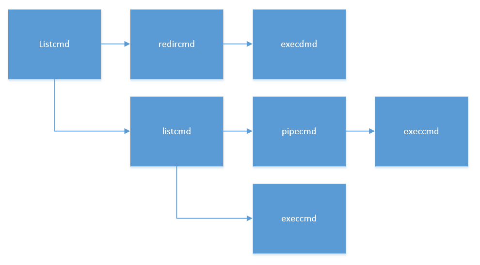

## shell

这部分的笔记主要来源于`user/sh.c`文件，这里面有很多代码的技巧，很值得学习。这部分主要弄清楚xv6中的shell是如何工作的。
1. 一条完整的命令是如何开始运行的
2. **是如何实现重定向的**  （ > 符号)
3. **是如何执行管道命令的**  （ | 符号）
4. 以及List命令，后台执行等。


首先sh程序会打开三次`console` 文件，使得0,1,2三个文件描述符都指向`console` 。然后就可以从终端得到命令不断执行。

1. 判断输入的命令是不是cd。
2. 如果是cd，则用系统调用chdir()切换当前进程的工作目录。
3. 如果不是，则用系统调用fork()，派生一个子进程。

```c
while((fd = open("console", O_RDWR)) >= 0){
    if(fd >= 3){
      close(fd);
      break;
    }
  }

  // Read and run input commands.
  while(getcmd(buf, sizeof(buf)) >= 0){
    if(buf[0] == 'c' && buf[1] == 'd' && buf[2] == ' '){
      // Chdir must be called by the parent, not the child.
      buf[strlen(buf)-1] = 0;  // chop \n
      if(chdir(buf+3) < 0)
        fprintf(2, "cannot cd %s\n", buf+3);
      continue;
    }
    if(fork1() == 0)
      runcmd(parsecmd(buf));
    wait(0);
  }
  exit(0);
```


## 如何解析命令

指令解析函数`parsecmd`执行的核心函数的`parseline`，这个函数是递归执行的，其执行流程如下：

1. 首先执行`parsepipe`的核心函数`parseexec`，调用`execcmd`，生成一个`execcmd`的结构体，然后调用`parseredirs`函数，检查是否有重定向符号"<“或”>"，如果有，则将之前的`execcmd`改为`redircmd`。将命令的入参保存在cmd->argv中；
2. 接着，检查用户输入的命令中是否有管道命令，如果有，递归调用`parsepipe`，则建立管道连接；
3. 返回parseline，执行命令中是否有&（返回命令），如果有，则生成一个新的backcmd；
4. 检查是否有；（多条命令分别要执行），如果有，递归调用`parseline`，将所有的命令分别解析后连接起来。


这里面有一个技巧，在命令构造的过程中，用到了递归的链式连接的形式构造命令。因为一个命令可能非常复杂，例如`ls < y; ls | sort; who`这样的命令，这条命令就可以构造起如下这个链式的命令串：



`parsecmd()`是命令构造函数，它简单地把工作转交给`parseline()`函数。

`parseline`顾名思义就是处理一行的输入字符串，把它转化成命令。这一行的概念有点抽象，实际上应该是可以视作一个命令整体的一行字符串，在这行字符串里可以包含各种命令，也就是`|&<>();`这些字符都可以处理。所有需要处理全部类型字符的工作都可以交给`parseline()`完成。`parseline()`里还可以递归地调用`parseline()`。

```c
struct cmd*
parseline(char **ps, char *es)
{
  struct cmd *cmd;

  cmd = parsepipe(ps, es);
  while(peek(ps, es, "&")){
    gettoken(ps, es, 0, 0);
    cmd = backcmd(cmd);
  }
  if(peek(ps, es, ";")){
    gettoken(ps, es, 0, 0);
    cmd = listcmd(cmd, parseline(ps, es));
  }
  return cmd;
}
```

这里为什么先调用 `parsepipe` 函数呢？这是因为在命令行中，管道操作符 `|` 的优先级高于分号 `;`，而且后台执行符 `&` 的优先级也高于分号。因此，在构建命令树时，首先要确保管道部分正确解析，然后再考虑后台执行和顺序执行。这种先处理高优先级操作符的策略有助于正确构建命令树的结构。


## 执行命令
这部分代码在函数`runcmd`中。

### EXEC类型命令
```c
case EXEC:
    ecmd = (struct execcmd*)cmd;
    if(ecmd->argv[0] == 0)
      exit(1);
    exec(ecmd->argv[0], ecmd->argv);
    fprintf(2, "exec %s failed\n", ecmd->argv[0]);
    break;
```


### REDIR类型命令

```c
// runcmd
case REDIR:
    rcmd = (struct redircmd*)cmd;
    close(rcmd->fd);
    if(open(rcmd->file, rcmd->mode) < 0){
      fprintf(2, "open %s failed\n", rcmd->file);
      exit(1);
    }
    runcmd(rcmd->cmd);
    break;
```

在 shell 编程中，> 和 < 是用于重定向输入和输出的符号，它们之间有以下区别：
1. `>`符号：
`>`符号用于将命令的标准输出重定向到指定文件，即将命令的输出写入到指定文件中。如果指定的文件不存在，则会创建该文件；如果文件已经存在，则会覆盖原有内容。
2. `<` 符号：
`<` 符号用于将文件的内容作为命令的标准输入，即从指定文件中读取数据作为命令的输入。

所以，对于`<`符号，程序要从标准输入也就是文件描述符为0的文件中读取内容，所以在上面的处理中，一次`close`一次`open`，这个`rcmd->file`文件打开后，文件描述符就为0了。所以实现了程序`read(0,...)`从该文件中读取的效果
同理对于`>`符号，程序要往该文件中写入内容，我们知道`printf()`函数默认是往文件描述符为1的文件中写入内容的，同上。
对于`+`追加操作，这里要注意一下文件打开的方式。

```c
struct cmd*
parseredirs(struct cmd *cmd, char **ps, char *es)
{
  int tok;
  char *q, *eq;

  while(peek(ps, es, "<>")){
    tok = gettoken(ps, es, 0, 0);
    if(gettoken(ps, es, &q, &eq) != 'a')
      panic("missing file for redirection");
    switch(tok){
    case '<':
      cmd = redircmd(cmd, q, eq, O_RDONLY, 0);
      break;
    case '>':
      cmd = redircmd(cmd, q, eq, O_WRONLY|O_CREATE|O_TRUNC, 1);
      break;
    case '+':  // >>
      cmd = redircmd(cmd, q, eq, O_WRONLY|O_CREATE, 1);
      break;
    }
  }
  return cmd;
}
```


### LIST类型命令

```c
case LIST:
    lcmd = (struct listcmd*)cmd;
    if(fork1() == 0)
      runcmd(lcmd->left);
    wait(0);
    runcmd(lcmd->right);
    break;
```
比较简单，就是一个链表。


### PIPE类型命令

```c
case PIPE:
    pcmd = (struct pipecmd*)cmd;
    if(pipe(p) < 0)
      panic("pipe");
    if(fork1() == 0){
      close(1);
      dup(p[1]);
      close(p[0]);
      close(p[1]);
      runcmd(pcmd->left);
    }
    if(fork1() == 0){
      close(0);
      dup(p[0]);
      close(p[0]);
      close(p[1]);
      runcmd(pcmd->right);
    }
    close(p[0]);
    close(p[1]);
    wait(0);
    wait(0);
    break;
```
这个也和重定向的思路一样，管道命令就是把left命令的输出当作right命令的输入，left命令把内容输出到文件描述符为0的文件中，right命令往文件描述符为1的文件中读取内容。
所以left程序执行`close(1); dup(p[1]); close(p[0]); close(p[1])`后(`p[1]`是管道的写口)，管道的写口的文件描述符就为1了(查看`dup`系统调用的效果)
同样，right程序也是这一个思路。
这样的设置后，两个进程就可以通过管道进行通信了。


### BACK类型命令

```c
case BACK:
    bcmd = (struct backcmd*)cmd;
    if(fork1() == 0)
      runcmd(bcmd->cmd);
    break;
```
这个命令的实现也很简单，父进程不再等待子进程的结束就可以了。


