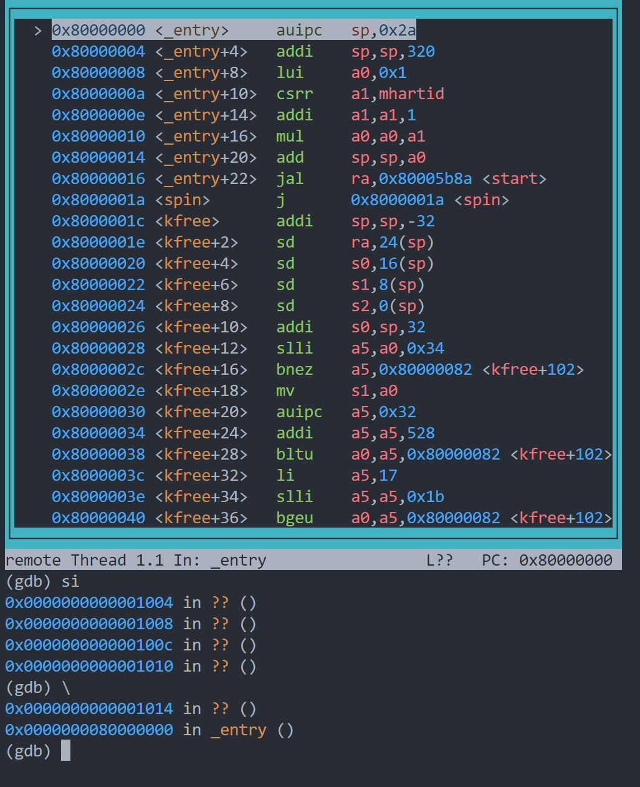

## xv6启动(1)
我们的xv6操作系统是运行在qemu模拟器上的，如果我想要知道究竟是如何启动这个操作系统的，那么我就要知道是如何启动qemu,并传入一些什么参数的。
通过`make -nB`，有如下命令：

```
qemu-system-riscv64 -machine virt -bios none -kernel kernel/kernel -m 128M -smp 3 -nographic -drive file=fs.img,if=none,format=raw,id=x0 -device virtio-blk-device,drive=x0,bus=virtio-mmio-bus.0
```
我们发现`-kernel kernel/kernel`这个选项，这可能是我们目前需要的答案。


- 题外话：如何调试我们的xv6 kernel
1. 打开一个终端。
```
make CPUS=1 qemu-gdb
```
2. 一个终端，输入三条命令。
```
gdb-multiarch kernel/kernel
set architecture riscv:rv64
target remote localhost:26000
```

首先，qemu的第一条指令在`0x1000`处，这里执行四条指令，跳转到地址为`0x80000000`处，这个地址有什么内容呢？这里会执行`_entry.S`出的汇编代码，这是通过什么实现的呢？
>kernel.ld连接脚本
>
```
ENTRY( _entry )

SECTIONS
{
  /*
   * ensure that entry.S / _entry is at 0x80000000,
   * where qemu's -kernel jumps.
   */
  . = 0x80000000;

  .text : {
    *(.text .text.*)
    . = ALIGN(0x1000);
    _trampoline = .;
    *(trampsec)
    . = ALIGN(0x1000);
    ASSERT(. - _trampoline == 0x1000, "error: trampoline larger than one page");
    PROVIDE(etext = .);
  } 
.................
```
这里要确保_entry在地址0x80000000处。
_entry.S为各个cpu设置好栈，现在我们就进入C语言的世界了。

接下来执行`start`函数，这个函数我觉得可以先跳过，这部分内容主要是一些与riscv相关的设置，然后跳转到`main`函数。

`main`函数就开始启动分页，启动trap，启动文件系统等，再执行` userinit()`函数，这是第一个应用程序。
这个应用程序做了一件什么事情？
这个应用程序是用二进制硬编码的，所以很小，做的事情很有限，它只做一件事情，就是
```c
execve("/init")
```

这就是`init.c`，`init.c`做些什么呢？
它开启虚拟终端console,开启三个文件描述符0,1,2指向这个console。
然后它`fork`一份：
子进程执行`execve("sh, argv")`，就是我们的终端了。
父进程`init`不断`wait`等待子进程`sh`的结束。

至此，我们的操作系统算是成功跑起来了。


