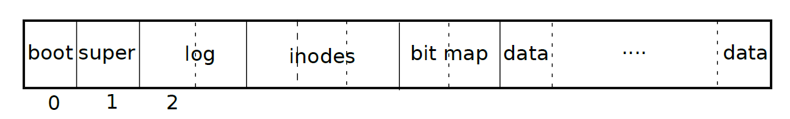

## xv6文件系统的构建

我们再次回到如何通过qemu启动xv6操作系统的问题，qemu的命令是：
```
qemu-system-riscv64 -machine virt -bios none -kernel kernel/kernel -m 128M -smp 3 -nographic -drive file=fs.img,if=none,format=raw,id=x0 -device virtio-blk-device,drive=x0,bus=virtio-mmio-bus.0
```
我们看到有这个选项`-drive file=fs.img,if=none,format=raw,id=x0`
这条命令指定镜像文件为 fs.img。这个文件包含了虚拟机将要访问的文件系统的内容。
指定虚拟磁盘驱动器的镜像文件格式为 raw。这表示 fs.img 文件中的数据将按原始字节顺序存储，而不会进行额外的格式化。

那么引出问题：
这个`fs.img`是怎么来的，他需不需要进行一些基本的设置来满足xv6对文件系统的要求，`fs.img`中一定有一些硬编码的内容，不然，我们刚开始启动xv6的时候输入`ls`，怎么会有那么多的文件？


### Makefle

我们尝试从Makefile中找到答案,Makefile中有这一行：
```
fs.img: mkfs/mkfs README $(UEXTRA) $(UPROGS)
	mkfs/mkfs fs.img README $(UEXTRA) $(UPROGS)
```
`mkfs`是一个C程序，并不在xv6中运行。我们发现，README、$(UEXTRA)、$(UPROGS)都是我们在`ls`得到的文件。那么我们去`mkfs/mkfs.c`文件中一探究竟吧！


### mkfs/mkfs.c

首先来看一下fs.img中block的布局，mkfs.c主要就是构建这个布局。



第一部分，构建superblock。`wsect(uint sec, void *buf)`是往fs.img第sec个扇区写入内容，这个函数很简单，`lseek`函数就可以解决。
>superblock位于扇区1,它保存文件系统最基本的一些信息，例如扇区的总数，data blocks的数量,inode扇区的数量，log山区的数量等
```c
  fsfd = open(argv[1], O_RDWR|O_CREAT|O_TRUNC, 0666);
  if(fsfd < 0)
    die(argv[1]);

  // 1 fs block = 1 disk sector
  nmeta = 2 + nlog + ninodeblocks + nbitmap;
  nblocks = FSSIZE - nmeta;

  sb.magic = FSMAGIC;
  sb.size = xint(FSSIZE);
  sb.nblocks = xint(nblocks);
  sb.ninodes = xint(NINODES);
  sb.nlog = xint(nlog);
  sb.logstart = xint(2);
  sb.inodestart = xint(2+nlog);
  sb.bmapstart = xint(2+nlog+ninodeblocks);

  printf("nmeta %d (boot, super, log blocks %u inode blocks %u, bitmap blocks %u) blocks %d total %d\n",
         nmeta, nlog, ninodeblocks, nbitmap, nblocks, FSSIZE);

  freeblock = nmeta;     // the first free block that we can allocate

  for(i = 0; i < FSSIZE; i++)
    wsect(i, zeroes);

  memset(buf, 0, sizeof(buf));
  memmove(buf, &sb, sizeof(sb));
  wsect(1, buf);

```

构建好基本结构后，就是往文件系统中写入内容了。
首先要创建一个根目录文件，然后在根目录里面写入两个目录，一个是`.`一个是`..`。
>实现也比较简单，就是在inode block中写入一个新的dinode结构体。（ialloc函数）
>再用iappend函数写入一个个dirent结构体表示新的文件。
>

```c
  rootino = ialloc(T_DIR);
  assert(rootino == ROOTINO);

  bzero(&de, sizeof(de));
  de.inum = xshort(rootino);
  strcpy(de.name, ".");
  iappend(rootino, &de, sizeof(de));

  bzero(&de, sizeof(de));
  de.inum = xshort(rootino);
  strcpy(de.name, "..");
  iappend(rootino, &de, sizeof(de));

  for(i = 2; i < argc; i++){
    // get rid of "user/"
    char *shortname;
    if(strncmp(argv[i], "user/", 5) == 0)
      shortname = argv[i] + 5;
    else
      shortname = argv[i];
    
    assert(index(shortname, '/') == 0);

    if((fd = open(argv[i], 0)) < 0)
      die(argv[i]);

    // Skip leading _ in name when writing to file system.
    // The binaries are named _rm, _cat, etc. to keep the
    // build operating system from trying to execute them
    // in place of system binaries like rm and cat.
    if(shortname[0] == '_')
      shortname += 1;

    inum = ialloc(T_FILE);

    bzero(&de, sizeof(de));
    de.inum = xshort(inum);
    strncpy(de.name, shortname, DIRSIZ);
    iappend(rootino, &de, sizeof(de));

    while((cc = read(fd, buf, sizeof(buf))) > 0)
      iappend(inum, buf, cc);

    close(fd);
  }
```
这一步过后，一个well defined，完全按照手册定义的xv6文件系统就诞生了！