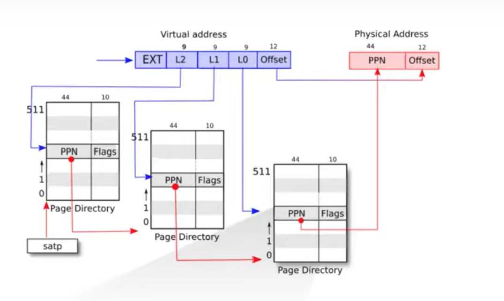

## **Page Table**

xv6是采用了三级页表。每一个`pte`页表条目都是8字节(8*512 = 4096刚好是一个page的大小)，其中低10位表示标志位，还有44位表示PPN，因为xv6中一个页的大小为4096个字节，也就是12位，所以整个页表可以表示的物理地址范围是[0, 2^56-1]。



我们先来看`walk`函数：这个函数给定一个虚拟地址`va`和一个`pagetable`，也就是第一级页表的起始位置，需要返回这个`va`对应的物理地址的位置。

宏`PX(level,va)`就是得到`va`这个虚拟地址在某一级页表下的偏移位置。这里有一个参数为`alloc`，这个参数为1的话，如果遇到某一个`pte`是无效的，还需要分配新的物理页(这个物理页可能是某一级页表的位置或者是最终映射的物理位置)。

```c
pte_t* walk(pagetable_t pagetable, uint64 va, int alloc){
  if(va >= MAXVA)
    panic("walk");

  for(int level = 2; level > 0; level--) {
    pte_t *pte = &pagetable[PX(level, va)];
    if(*pte & PTE_V) {
      pagetable = (pagetable_t)PTE2PA(*pte);
    } else {
      if(!alloc || (pagetable = (pde_t*)kalloc()) == 0)
        return 0;
      memset(pagetable, 0, PGSIZE);
      *pte = PA2PTE(pagetable) | PTE_V;
    }
  }
  return &pagetable[PX(0, va)];
}
```


还有一个很重要的函数是`mappages`，这个函数的作用就是建立起虚拟地址到物理地址的页表映射，虚拟地址从`va`开始，物理地址从`pa`开始，映射大小为`size`。

这个函数的逻辑就是不断使用上面的`walk`函数，从顶往下设置每一级的`pte`。

```c
int mappages(pagetable_t pagetable, uint64 va, uint64 size, uint64 pa, int perm){
  uint64 a, last;
  pte_t *pte;

  if(size == 0)
    panic("mappages: size");
  
  a = PGROUNDDOWN(va);
  last = PGROUNDDOWN(va + size - 1);
  for(;;){
    if((pte = walk(pagetable, a, 1)) == 0)
      return -1;
    if(*pte & PTE_V)
      panic("mappages: remap");
    *pte = PA2PTE(pa) | perm | PTE_V;
    if(a == last)
      break;
    a += PGSIZE;
    pa += PGSIZE;
  }
  return 0;
}
```


## **内核的Page Table**

内核也有一个Page Table，内核会通过一个特殊的函数`pagetable_t kvmmake(void)`来初始化它的页表我们来看一下这个函数：

```pagetable_t
pagetable_t kvmmake(void){
  pagetable_t kpgtbl;

  kpgtbl = (pagetable_t) kalloc();
  memset(kpgtbl, 0, PGSIZE);

  // uart registers
  kvmmap(kpgtbl, UART0, UART0, PGSIZE, PTE_R | PTE_W);

  // virtio mmio disk interface
  kvmmap(kpgtbl, VIRTIO0, VIRTIO0, PGSIZE, PTE_R | PTE_W);

  // PLIC
  kvmmap(kpgtbl, PLIC, PLIC, 0x400000, PTE_R | PTE_W);

  // map kernel text executable and read-only.
  kvmmap(kpgtbl, KERNBASE, KERNBASE, (uint64)etext-KERNBASE, PTE_R | PTE_X);

  // map kernel data and the physical RAM we'll make use of.
  kvmmap(kpgtbl, (uint64)etext, (uint64)etext, PHYSTOP-(uint64)etext, PTE_R | PTE_W);

  // map the trampoline for trap entry/exit to
  // the highest virtual address in the kernel.
  kvmmap(kpgtbl, TRAMPOLINE, (uint64)trampoline, PGSIZE, PTE_R | PTE_X);

  // map kernel stacks
  proc_mapstacks(kpgtbl);
  
  return kpgtbl;
}
```

这里的`kvmmap`函数是这样的：

```c
void
kvmmap(pagetable_t kpgtbl, uint64 va, uint64 pa, uint64 sz, int perm){
  if(mappages(kpgtbl, va, sz, pa, perm) != 0)
    panic("kvmmap");
}

```

所以内核的映射，虚拟地址和物理地址很多都是相等的。