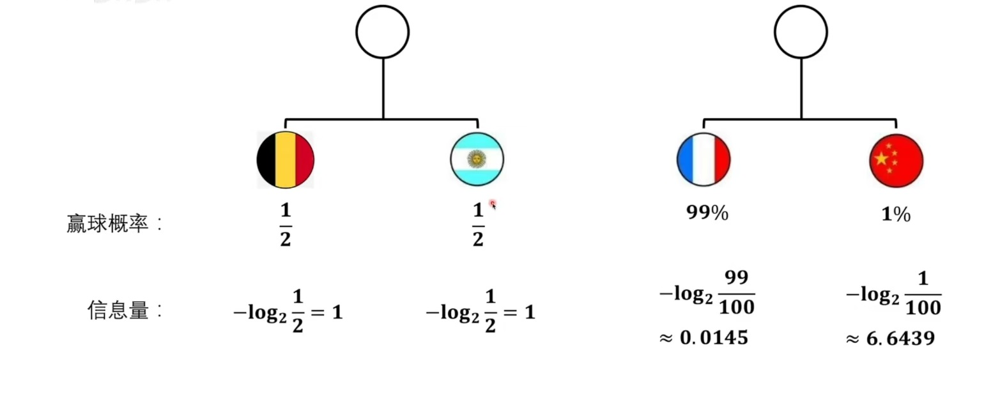
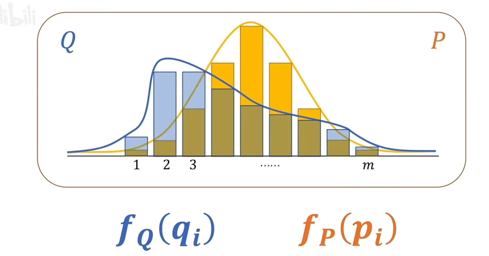
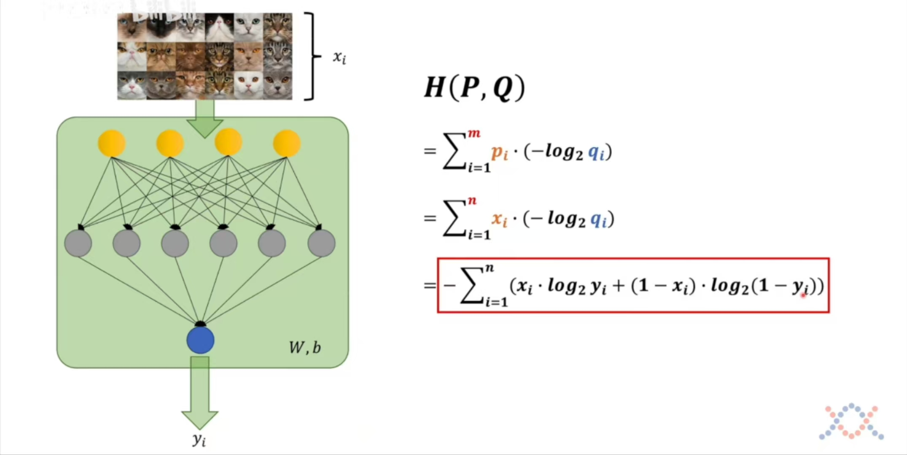

## 什么是信息量

用来衡量一个信息能否给你带来多少确定性。

- 比如说，有8支球队参加世界杯，假设他们的夺冠概率都是1/8。如果说阿根廷夺冠了，这个1/8不确定的事情，就变成了100%，所以说这个"阿根廷夺冠的信息量是很高的"。但我如果说阿根廷进了决赛，那就是从1/8不确定变成了1/2不确定，这也是有信息量的，只不过信息量没有"阿根廷夺冠了"这么大。

**那如何定量计算信息量？**

假设我们有一个函数定义信息量：

```
f(x) := 信息量
```

就我们上面那个例子：

```
f(阿根廷夺冠) = f(阿根廷进决赛) + f(阿根廷赢了决赛)
```

就可以得出下面的式子:

```
f(1/8) = f(1/4) + f(1/2)
P(阿根廷夺冠) = P(阿根廷进决赛) * P(阿根廷赢了决赛)      P是概率
```

所以我没有下面这个式子：
$$
f(x_1 \times x_2) = f(x_1) + f(x_2)
$$
所以我们可以得到:
$$
f(x) = ?\log_? x
$$
由于当`x`越小的时候，信息量越大，所以第一个?应该是一个负数，第二个?就可以以2为底数(可随意)。
$$
f(x) = -log_2 x
$$
**信息量可以理解成一个事件它从原来的不确定变得确定，它的难度有多大**，信息量越大说明难度比较高。


## 什么是熵

而**熵是衡量整个系统里面的所有事件，也就是一个系统从原来的不确定到确定难度有多大**，熵和信息量的单位一样，都可以是比特。

假设有两场球赛：

- A VS B，输赢各50%
- C VS D，C赢的概率为1%，D赢的概率为1%



熵越大，代表的是自己系统的不确定性有多高，肯定不能简单的相加。单个信息量贡献给整个系统，还需要乘以自己的比例。

我们就可以定义熵了，也就是**对信息量求期望**，是对整体的概率模型进行了一个衡量。
$$
H(P) := E(P_f)
$$

$$
H(P) = \sum_{i=1}^{m} p_i*f(pi) = \sum_{i=1}^{m}p_i(-log_2 p_i) = -\sum_{i=1}^{m} p_i*log_2 p_i
$$


## KL散度

如何比较两个概率模型？不同的概率系统可以直接比较吗？我们引入相对熵的概念。



KL散度的定义：
$$
D_{KL}(P||Q) := \sum_{i=1}^{m} p_i * (f_Q(q_i) - f_P(p_i))  \\
= \sum_{i=1}^{m} p_i * ((-log_2 q_i) - (-log_2 p_i))        \\
= \sum_{i=1}^{m} p_i * (-log_2 q_i) - \sum_{i=1}^{m} p_i * (-log_2 p_i)
$$
上面是代表以P为基准，考虑Q与P相差有多少，这个KL散度是恒大于等于0的(证明可见吉布斯不等式)

看上面的式子，我们可以看到后一部分是表示P的熵，而前部分的：
$$
\sum_{i=1}^{m} p_i * (-log_2 q_i)
$$
就是交叉熵，也就是`H(P,Q)`来表达的。

**因为KL散度是恒大于等于0的，为了让Q概率模型尽量的靠近P概率模型，所以我们要找到交叉熵最小的那个值，所以交叉熵这个式子本身就可以作为损失函数**。

交叉熵越小，就代表两个概率模型越接近。

在神经网络里，如何利用交叉熵呢？



在训练上面的神经网络的时候，我们有一些已知的标签，就比如说有n张训练集图片，P就是我们需要进行比较的概率模型。那$q_i$可以直接替换成$y_i$吗，也没这么简单。

$x_i$只有两种情况，非0即1，而$y_i$只是判断这个猫到底有多像猫，他并没有判断相反的这个猫有多不像猫，而这里要对应起来。当$x_i$等于1的时候，是为了判断这个猫有多像猫，当$x_i$等于0的时候，是为了判断这个猫有多不像猫。于是，就最后展开成上面这个式子。