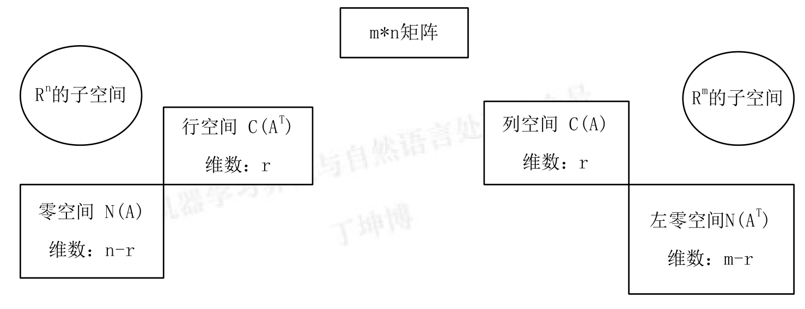

## 列空间$C(A)$

列空间即是矩阵 $A$ 的列向量线性组合构成的空间。对于$m*n$ 的矩阵 $A$ 来说，每个列向量有 $m$ 个分量，即列向量属于$𝑅^𝑚$空间。所以列空间是$𝑅^m$的子空间。

设矩阵 $A$ 的秩为 $r$，则 $A$ 有 $r$ 个主列，这 $r$ 个主列就是列空间 $C(A)$一组基，一组基里有 $r$ 个向量，所以列空间维数为：$r$。

## 零空间$N(A)$

即由 $Ax = 0$ 的解构成的空间。由于 $x$ 本质是对 $A$ 列向量的线性组合，$A$ 一共有 $n$ 个列向量，所以零空间是$𝑅^𝑚$的子空间。

同样，之前介绍过矩阵 $A$ 秩为 $r$ 时，自由列为 $n-r$ 列。这 $n-r$ 列决定了 $x$ 中的 $n-r$ 个自由变元，赋值后就构成了零空间的 $n-r$ 个基向量，故零空间维数为：$n-r$。

## 行空间$C(A^T)$

所谓行空间就是矩阵 $A$ 各行线性组合构成的子空间。也可以理解为 $A$ 转置的列空间，即：$C(𝐴^𝑇)$。 $A$ 的行空间是$𝑅^𝑚$的子空间。最后行空间的维数也是秩数 $r$。

## 左零空间$N(A^T)$

左零空间是$𝑅^𝑚的$子空间。是$A^T x = 0$解集的空间。为什么叫左零空间呢，我们对方程两边同时转置得到$x^T A = 0$。

$𝐴^𝑇$是一个 $n*m$ 的矩阵，$m$ 与 $n$ 位置颠倒，所以$𝐴^𝑇$零空间维数为$m-r$。

如何找到左零空间的一组基呢？

首先明确，左零空间反映的是 $A$ 的行向量的线性组合，最终得到零向量。而上面说过行向量的线性组合是通过左乘一个消元矩阵得到的。

有如下的矩阵$A$和$R$，其中$R$是$A$行变换后得到的最简矩阵:
$$
A = 
\begin{bmatrix}
1 & 2 & 3 & 1 \\
1 & 1 & 2 & 1 \\
1 & 2 & 3 & 1 \\
\end{bmatrix}
\quad
R = 
\begin{bmatrix}
1 & 0 & 1 & 1 \\
0 & 1 & 1 & 0 \\
0 & 0 & 0 & 0 \\
\end{bmatrix}
$$
$R$下面有零行，也就是一种线性组合将 $A$ 行向量组合后得到了零向量。而这个行变换过程可以用一种消元矩阵反映出来：
$$
EA = E 
\begin{bmatrix}
1 & 2 & 3 & 1 \\
1 & 1 & 2 & 1 \\
1 & 2 & 3 & 1 \\
\end{bmatrix}
=
\begin{bmatrix}
1 & 0 & 1 & 1 \\
0 & 1 & 1 & 0 \\
0 & 0 & 0 & 0 \\
\end{bmatrix}
= R
$$
**说明得到 $E$ 矩阵，找到其中对应的第三行向量，就是将 $A$ 各行组合得到零的方式。**

怎样得到 E 矩阵呢？联想高斯-若尔当消元法。
$$
[A \quad I]\overset{\text{初等行变换}}{\rightarrow} [𝑅 \quad 𝐸]
$$
得到:
$$
E =
\begin{bmatrix}
-1 & 2 & 0 \\
1 & -1 & 0 \\
-1 & 0 & 1 \\
\end{bmatrix}
$$
抽出$E$的第三行，也就是说左零空间的一组基是：$[-1 \quad 0 \quad 1]$。也正是 $m-r = 3-2 = 1$ 个向量。所以寻找左零矩阵的基，重点在于找 $A$ 行组合为零的系数。

## 四个基本空间的总结

经过上面的总结，四个基本空间图像如下：

## 矩阵空间

这是一种新的对空间的定义，实际上，线性空间的元素并不一定是实数组成的向量，我们可以将所有 $3*3$ 的矩阵当成一个所谓“向量空间”中的向量，只要满足线性空间的八条规律，对线性运算封闭，就可以将其当做线性空间中的元素。

这里我们将所有的 3*3 矩阵看做了一个线性空间，那么它的子空间有什么呢？

> 上三角矩阵，对称矩阵，对角矩阵。

它们也有基，也有维度。