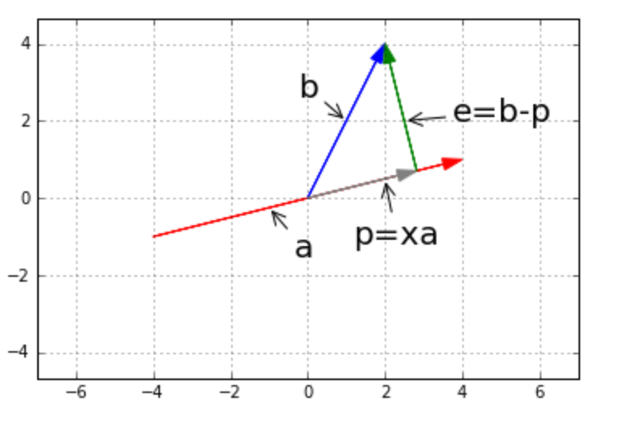
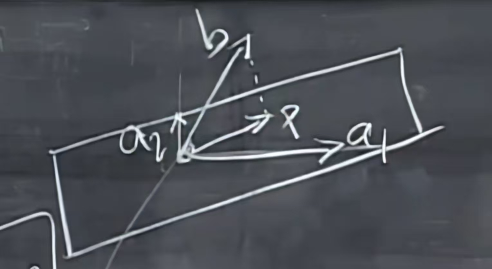

## 子空间投影

我们先来看下面这幅图，$\mathbf{p}$为 $\mathbf{b}$ 在 $\mathbf{a}$ 上的投影，写做$\mathbf{p}$ = x$\mathbf{a}$（x 为倍数）。而这时，它们之间的差值是 $\mathbf{b}-\mathbf{p}$。

由于垂直关系，我们很容易得到：
$$
\mathbf{a}^T \mathbf{e} = \mathbf{a}^T (\mathbf{b} - \mathbf{p}) = \mathbf{a}^T (\mathbf{b} - x\mathbf{a}) = 0
$$
可得：
$$
\mathbf{p} = \mathbf{a}\frac{\mathbf{a^T}\mathbf{b}}{\mathbf{a^T}\mathbf{a}}
$$
p 的形式中含有 b，那么就说明投影是通过前面系数(矩阵形式)来完成的，我们把它称为：投影矩阵。即：
$$
\mathbf{p} = P\mathbf{b}
$$
对比上式，可以得到：
$$
P =\mathbf{a}\frac{\mathbf{a^T}}{\mathbf{a^T}\mathbf{a}}
$$
P矩阵有两条性质：

1. P是对称矩阵

$$
P^T = P
$$

2. 将同一个向量连续投影多次效果是一样的
   $$
   P = P^2 = P^3 = ... = P^n
   $$
   

## 为什么要做投影，从Ax=b方程讲起

我们之前讲过，方程$A\mathbf{x} = \mathbf{b}$可能会无解(方程数量比未知数要多)，**我们只能求解最接近的那个可解问题**，那什么才是最接近的呢？

我们知道$A\mathbf{x}$总在$A$的列空间里面，而$\mathbf{b}$不一定，所以我们想要微调$\mathbf{b}$，将它变为$A$的列空间中最接近它的那个。

所以我们将问题换作求解这个有解的方程:
$$
A\hat{\mathbf{x}} = \mathbf{p}
$$
其中$\mathbf{p}$是$\mathbf{b}$在$A$的列空间上的投影，$\hat{\mathbf{x}}$表示的是不是原来的那个$x$了，而是最接近解的那个$\hat{\mathbf{x}}$。

我们来看上面这幅图，其中平面就是$A$的列空间，$A\mathbf{x}=\mathbf{b}$不存在解，$\mathbf{a_1}，\mathbf{a_2}$是平面的两组基，也就是$A$的列空间。
$$
A = [\mathbf{a_1}\quad \mathbf{a_2}]
$$
有一个error： $\mathbf{e} = \mathbf{b} - \mathbf{p}$，这个$\mathbf{e}$是垂直于平面的，而$\mathbf{p} = A \hat{\mathbf{x}}$。

所以我们有：
$$
\mathbf{a_1^T}(\mathbf{b}-A \hat{\mathbf{x}}) = 0  \\
\mathbf{a_2^T}(\mathbf{b}-A \hat{\mathbf{x}}) = 0
$$
写成矩阵形式：
$$
\begin{bmatrix}
\mathbf{a_1^T} \\
\mathbf{a_2^T}
\end{bmatrix} 
(\mathbf{b} - A \hat{\mathbf{x}}) = 
\begin{bmatrix}
0 \\
0
\end{bmatrix}
$$
也就是：
$$
A^T(\mathbf{b} - A \hat{\mathbf{x}}) = \mathbf{0}
$$
这是平面上的投影方程，前面我们讲到了直线上的投影方程：
$$
\mathbf{a}^T (\mathbf{b} - x\mathbf{a}) = 0
$$
我们可以看到本质上是一样的。

通过上面的方程，我们可以知道$\mathbf{e}$，也就是$(\mathbf{b} - A \hat{\mathbf{x}})$位于$A^T$的零空间中，也就是说$\mathbf{e} \perp C(A)$(垂直于$A$的列空间)。

我们整理一下形式：
$$
A^T A \hat{\mathbf{x}} = A^T\mathbf{b}
$$
我们根据上面的方程得到：
$$
\hat{\mathbf{x}} = (A^T A)^{-1} A^T \mathbf{b} \\
\mathbf{p} = A \hat{\mathbf{x}} = A (A^T A)^{-1} A^T \mathbf{b}
$$
也就是可以说明投影矩阵$P=A \hat{\mathbf{x}} = A (A^T A)^{-1} A^T$

如果$A$是一个可逆的方阵的话，$P = A A^{-1}(A^T)^{-1}A^T = I$，投影矩阵就是单位矩阵，因为$A$的列空间可以张成整个$n$维空间。

我们再来看看这个投影矩阵$P = A (A^T A)^{-1} A^T$，它也有两条性质：

1. $P^T = P$
2. $P = P^2 = P^3 = ... = P^n$

## 最小二乘法拟合直线

假设有三个点，需要拟合一条直线：$(1,1),(2,2),(3,2)$，我们设这条直线是$b = C+Dt$

我们可以得到三个方程：
$$
C+D=1 \\
C+2D=2 \\
C+3D=2
$$
这显然可以用矩阵表示：
$$
A = 
\begin{bmatrix}
1 & 1 \\
1 & 2 \\
1 & 3 \\
\end{bmatrix}
\quad 
\mathbf{x} = 
\begin{bmatrix}
C \\
D
\end{bmatrix}
\quad 
\mathbf{b} = 
\begin{bmatrix}
1 \\
2 \\
2 \\
\end{bmatrix}
$$
然后我们可以用到上面的推导给出求解！