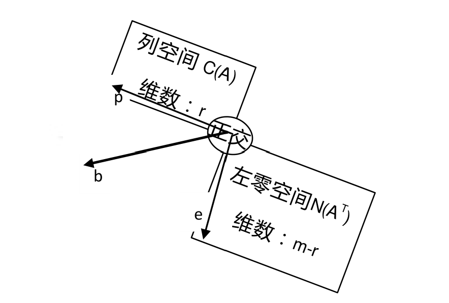
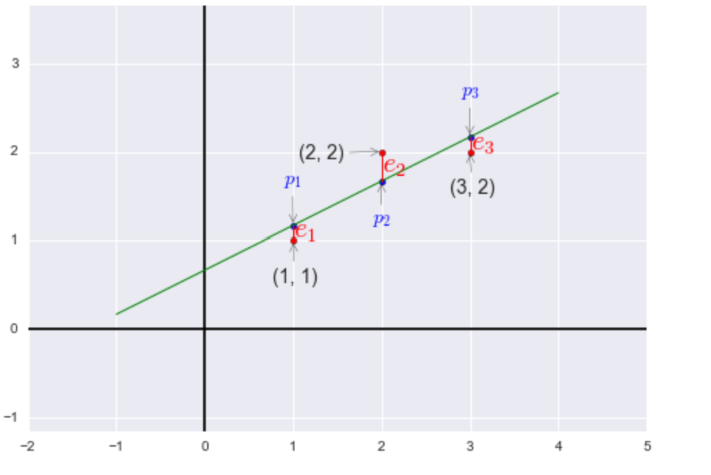
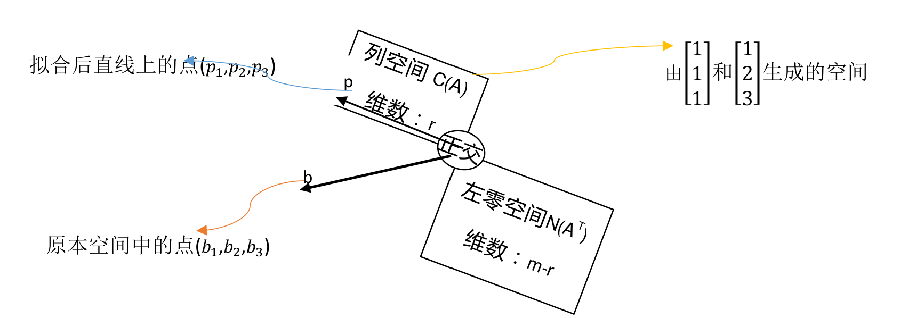

## 回顾一下投影矩阵

我们简单地回顾一下上节课讲的这个公式：
$$
P = A A^{-1}(A^T)^{-1}A^T
$$
它能产生一个投影，如果左乘$\mathbf{b}$，我们将会把向量$\mathbf{b}$投影到$A$列空间的最近点。

考虑两种极端情况：

1. $\mathbf{b}$在$A$的列空间中，这种情况讲过了，$P = I$。这也很符合常理，当$\mathbf{b}$在$A$的列空间中时，那么$\mathbf{b}$可以由$A$的列向量线性组合得到，也就是说明$\mathbf{b} = A \mathbf{x}$，那么$P\mathbf{b} =  A A^{-1}(A^T)^{-1}A^T A \mathbf{x} =A \mathbf{x} = \mathbf{b}$
2. $\mathbf{b} \perp C(A)$，$\mathbf{b}$垂直于$A$的列空间，可容易得到$\mathbf{p} = \mathbf{0}$，而因为$\mathbf{b}$垂直于$A$的列空间，所以有$A^T\mathbf{b} = \mathbf{0}$，也就是$P\mathbf{b} = A A^{-1}(A^T)^{-1}A^T \mathbf{b} = A^{-1}(A^T)^{-1} \mathbf{0} = \mathbf{0}$ 

通过上面两个问题，我们可以看出来，一个向量$\mathbf{b}$总有两个分量，一个分量在$A$的列空间中，另一个分量垂直于$A$的列空间。如图所示:$\mathbf{b} = \mathbf{p} + \mathbf{e}$

也就是$\mathbf{b} = P\mathbf{b} + \mathbf{e}$，$\mathbf{e}$也是一个投影向量，那么由$\mathbf{b}$投影到$A^T$的列空间的投影矩阵是$I - P$

我们看到$I - P$同样也是对称矩阵，同样$(I - P)^n = I - P$

## 如何求解最小二乘法

在上一节中，我们引入了最小二乘法用矩阵表示的一个问题，方程是没有解的，那如何找到最优解呢？

假设有三个点，需要拟合一条直线：$(1,1),(2,2),(3,2)$，我们设这条直线是$b = C+Dt$
$$
A = 
\begin{bmatrix}
1 & 1 \\
1 & 2 \\
1 & 3 \\
\end{bmatrix}
\quad 
\mathbf{x} = 
\begin{bmatrix}
C \\
D
\end{bmatrix}
\quad 
\mathbf{b} = 
\begin{bmatrix}
1 \\
2 \\
2 \\
\end{bmatrix}
$$
我们想要最小化误差，也就是：
$$
Minimize {\left\| A \mathbf{x} - \mathbf{b}\right\|}^2 = {\left\|  \mathbf{e} \right\|}^2 = e_1^2 + e_2^2 + e_3^2
$$

拟合后的直线上图所示，$p_1,p_2,p_3$这三个点分别是$b_1,b_2,b_3$对应在直线上的点，那么$\mathbf{p} = [p_1 \quad p_2 \quad p_3]^T$是$\mathbf{b}$的分量，正好落在线上，也就是$\mathbf{p}$在$A$的列空间中(因为有解)。所以接下来我们就是要求出$\mathbf{p}$具体的值，再代入方程求解直线方程。

接下来开始求解：
$$
Find \quad \hat{\mathbf{x}} = 
\begin{bmatrix}
\hat{C} \\
\hat{D}
\end{bmatrix}， \mathbf{p}  \\
A^T A \hat{\mathbf{x}} = A^T \mathbf{b}
\\
\mathbf{p} = A\hat{\mathbf{x}}
$$
带入计算：
$$
A^T A = 
\begin{bmatrix}
1 & 1 & 1 \\
1 & 2 & 3
\end{bmatrix} 
\begin{bmatrix}
1 & 1 \\
1 & 2 \\
1 & 3 
\end{bmatrix} 
=
\begin{bmatrix}
3 & 6 \\
6 & 14
\end{bmatrix} 
\\
A^T \mathbf{b} = 
\begin{bmatrix}
1 & 1 & 1 \\
1 & 2 & 3
\end{bmatrix} 
\begin{bmatrix}
1 \\
2 \\
2
\end{bmatrix} 
=
\begin{bmatrix}
5 \\
11
\end{bmatrix}
$$
也就是:
$$
3\hat{C} + 6\hat{D} = 5 \\
6\hat{C} + 14\hat{D} = 11
$$
其实上面的这个方程通过求以下$y(C,D)$的偏导也可以得到：
$$
{\left\| A \mathbf{x} - \mathbf{b}\right\|}^2 = {\left\|  \mathbf{e} \right\|}^2 = e_1^2 + e_2^2 + e_3^2 =  (C+D-1)^2 + (C+2D-2)^2 + (C+3D-2)^2
$$
不得不感叹数学的精彩与美妙！

解得：
$$
\hat{C} = \frac{2}{3} \\
\hat{D} = \frac{1}{2}
$$
所以最优的直线方程就是$b =  \frac{2}{3} +  \frac{1}{2} t$

解得：
$$
\mathbf{p} = 
\begin{bmatrix}
\frac{7}{6} \\
\frac{10}{6} \\
\frac{13}{6} \\
\end{bmatrix}
\quad
\mathbf{e} = \mathbf{b} - \mathbf{p} = 
\begin{bmatrix}
-\frac{1}{6} \\
\frac{2}{6} \\
-\frac{1}{6} \\
\end{bmatrix}
$$
得到如下性质：

1. 误差向量与投影向量垂直($\mathbf{p}^T \mathbf{e} = 0$)
2. 误差向量垂直于列空间中的每一个向量。

## 一个小的证明

在我们解方程的过程中，用到了这样一个结论：如果矩阵$A$各列线性无关，则矩阵$A^T A$可逆。矩阵$A$各列线性无关，是最小二乘法成立的大前提。

**证明1**:

假设$A^T A \mathbf{x} = \mathbf{0}$

也就是$\mathbf{x}^T A^T A \mathbf{x} = (A\mathbf{x})^T A\mathbf{x} = \mathbf{0}$

也就是说明$A \mathbf{x} = \mathbf{0}$，因$A$的列向量是线性无关的，所以$A \mathbf{x} = \mathbf{0}$只有零解，也就是$\mathbf{x} = \mathbf{0}$

这也就说明了矩阵$A^T A$列向量是线性无关的，也就是可逆的。