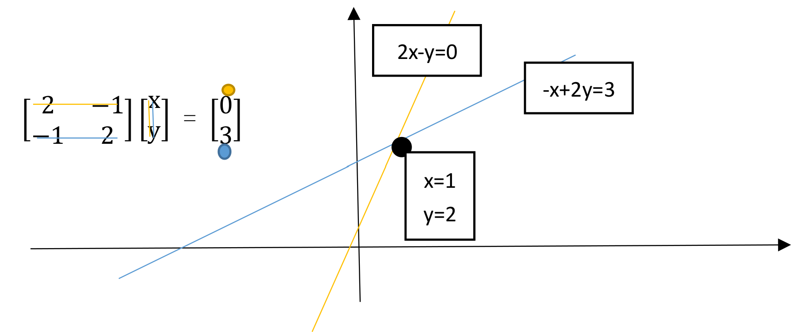

##  方程组的几何解释-行图像

如果我们要求解下面这个方程：
$$
   2x - y = 0 \\
   -x + 2y = 3
$$
我们写成矩阵形式：
$$
\begin{bmatrix}
2 & -1 \\
-1 & 2
\end{bmatrix}
\begin{bmatrix}
x \\
y
\end{bmatrix}
=
\begin{bmatrix}
0 \\
3
\end{bmatrix}
$$
我们通过行图像来求解这个方程，所谓行图像，就是在系数矩阵上，一次取一行构成方程，在坐标系上作图，交点即为解。

## 方程组的几何解释-列图像

同样上面的方程，我们将方程按列提取：
$$
x
\begin{bmatrix}
2 \\
-1
\end{bmatrix}
+
y
\begin{bmatrix}
-1 \\
2
\end{bmatrix}
=
\begin{bmatrix}
0 \\
3
\end{bmatrix}
$$
问题化为：将向量$\begin{bmatrix} 2 \\ -1 \end{bmatrix}$和$\begin{bmatrix} -1 \\ 2 \end{bmatrix}$正确组合，使其结果构成$\begin{bmatrix} 0 \\ 3 \end{bmatrix}$

## 几何解释推广

如果我们解一个$[x,y,z]^T$的三元一次方程，如果我们使用行图像，那么我们要在三维空间中画出三个平面，然后求这三个平面的交点，这是相当困难的，当维数更高时，这种行图像受到的限制也越来越多。而列图像则提供了一种更好的理解方向。

另外，还要注意的一点是对任意的 $b$ 是不是都能求解 $Ax = b$ 这个矩阵方程呢？
也就是对 3*3 的系数矩阵 $A$，其列的线性组合是不是都可以覆盖整个三维空间呢？有些矩阵可以，但是有一些矩阵就是不行的，比如三个列向量本身就构成了一个平面，那么这样的三个向量组合成的向量只能活动在这个平面上，肯定无法覆盖一个三维空间。

现在我们可以根据规则看看矩阵乘法的运算规律。

例如$Ax$ ，如果我们已知一个矩阵 $A$ 和一个向量 $x$

1. 将矩阵 $A$ 看做列向量的组合
2. 将矩阵 $A$ 看做行向量的组合(就是上面的方程形式)，矩阵乘法的规则。

