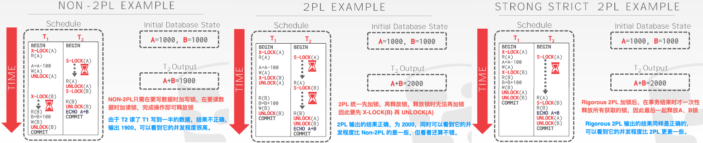
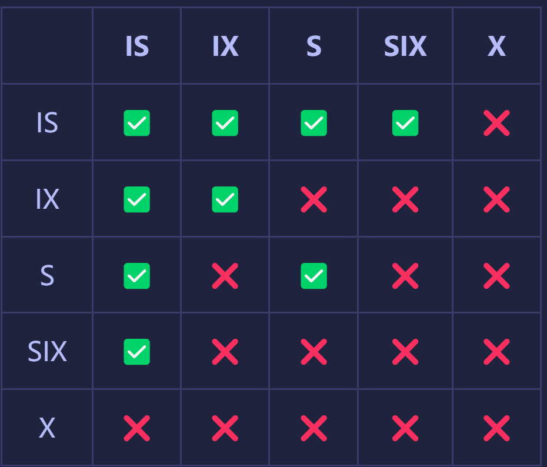
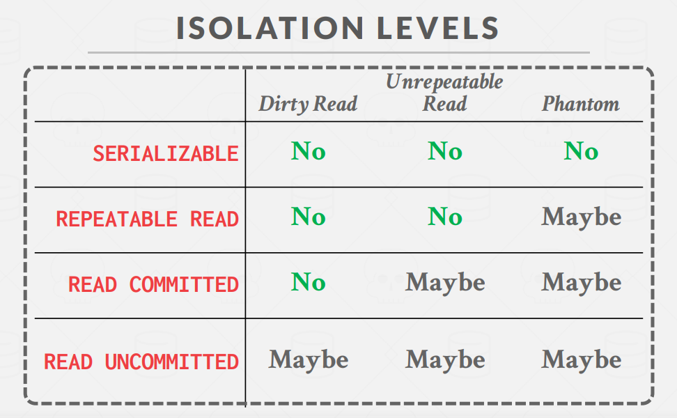

## **可串行化**

在数据库系统中，事务是并发的，那么应该如何保证事务并发的正确性。比如说事务T1从A账户转账50到B账户，事务T2计算A账户和B账户的和，T1和T2是并发执行的，那么可能会存在事务T2计算的结果并不等于A+B的原本的和。

最容易理解的正确性保证就是串行调度，即不允许事务并发，所有事务排队，一个接着一个串行执行，其正确性是显然的，同时，执行效率低也是显然的。

为了提高数据库的执行效率，显然我们需要并发的执行各个事务，如果存在调度S，对于数据库的任何状态，其执行结果完全等价于另一个串行调度S’，称这样的调度S为可串行化调度。


## **两阶段锁**

我们再以上面的转账为例。

```CQL
-- T1: 从 A 向 B 转账 100 元--
BEGIN
A = A - 100
B = B + 100
COMMIT
-- T2: 计算并输出 A、B 账户的总和 --
BEGIN
ECHO A + B
COMMIT
```



我们先来看最左边的调度，我们看到事务二出现了不正确的结果，并且我们看到了出现了不正确结果的原因是由于事务T1过早地释放了A的独占锁。

如果我们采用二阶段锁协议，要求每个事务分两个阶段提出加锁和解锁申请就不会出现这种结果。

1. **增长阶段**：一个事务可以获得锁，但不能解锁
2. **缩减阶段**：一个事务可以释放锁，但不能获得新锁

我们希望调度不仅是可串行化的，还希望调度是无级联的。但普通的二阶段锁有导致级**联回滚**的问题，我们来看下面的例子：

```
T1                   T2                  T3
-----------------------------------------------
lock-X(A) 
read(A)
lock-S(B)
read(B)
write(A)
unlock(A)
                 lock-X(A)
                 read(A)
                 write(A)
                 unlock(A)
                                      lock-S(A)
                                      read(A)
```

上面的调度遵循二阶段锁协议，假如T3`read(A)`后T1发生了故障后abort，那么T2、T3都读取到了T1写的无效的数据，那么除了T1要回滚之外，T2、T3也要级联回滚。这就严重降低了效率了。

级联回滚可以通过**严格的二阶段锁协议**来避免，这种协议不但要求封锁是两阶段的，还要求事务持有的**所有排他模式锁必须在事务提交之后才可以释放**。

**缺点**:二阶段锁并不保证不会发生死锁，所以需要进行死锁检测，人为地abort某一个事务，使数据库系统继续运行。


我们回顾一下，二阶段锁的主要任务就是解决可串行化的问题(证明略)，还有更进一步，如果使用强二阶段锁，还可以避免级联回滚(由脏读引起)。


## **锁兼容矩阵**

如果一个事务需要更新十亿条数据，那么 lock manager 中的 lock table 就要撑爆了。为了避免这种开销，DBMS 可以使用一个锁的层次结构，允许事务在系统中获取更多的粗粒度的锁。

Database Lock Hierarchy:

1. Database level (Slightly Rare)
2. Table level (Very Common)
3. Page level (Common)
4. Tuple level (Very Common)
5. Attribute level (Rare)

在多粒度封锁中，若对一个节点加锁（X、S），意味着这个点的后裔节点也被加以同样的锁。若对一个节点加意向锁，则说明**正在**对其子节点加（对应的）锁（可理解为一个事务中的先后次序）。


### **为什么需要意向锁**

考虑这个例子：

事务A锁住了表中的**一行**，让这一行只能读，不能写。之后，事务B申请**整个表**的写锁。如果事务B申请成功，那么理论上它就能修改表中的任意一行，这与A持有的行锁是冲突的。

数据库需要避免这种冲突，就是说要让B的申请被阻塞，直到A释放了行锁。那么数据库要怎么判断这个冲突呢？

step1：判断表是否已被其他事务用表锁锁表。

step2：判断表中的每一行是否已被行锁锁住(但这个需要遍历这一张表呀，效率会很低)。

于是就有了意向锁。

在意向锁存在的情况下，事务A必须先申请表的意向共享锁，成功后再申请一行的行锁。在意向锁存在的情况下，上面的判断可以改成

step1：不变

step2：发现表上有意向共享锁，说明表中有些行被共享行锁被锁住了，因此，事务B申请表的写锁会被阻塞。

也就是说，意向锁是在存在行锁场景下的表锁快速失败机制。


**意向锁** (Intention Lock)：意向锁允许将更高级别的节点锁定为共享或独占模式，而**无需检查所有后代节点**。如果节点处于意向模式，则显式锁定在树中的较低级别完成。

- **意向共享锁** Intention-Shared (IS)：若一个节点被加上 IS 锁，则将在树的较低层使用 S 锁进行显式锁定。
- **意向排他锁** Intention-Exclusive (IX)：若一个节点被加上 IX 锁，则将在树的较低层使用 X 或 S 锁进行显示锁定。
- **意向共享排他锁** Shared+Intention-Exclusive (SIX)：若一个节点被加上 SIX 锁，则对以该节点为 root 的树使用 S 锁显示锁定，且将在树的较低层使用 X 锁进行显示锁定。**SIX 锁可理解为 S + IX**


### **一些应用场景**

比如事务T想要读取表A中的所有tuple，那么需要给A加S锁，表示表A和它所有的子节点都加了S锁。如果事务T只需要读取表A中的一些tuple，那只需要对表A加IS锁，再向下对需要读的tuple加S锁。对于X和IX也类似。

- 那为什么还需要SIX锁呢？

如果有一个事务，读取了一张表的所有 record，然后只更新一小部分 record，我们应该加什么锁？

如果没有 SIX 锁，有两个方案：

1. 对目标表（或者一些更大的锁定对象，例如 database）加 X 锁。
2. 对目标表加 IX 锁，然后对它的所有 record 加 S 锁，最后对更新的 record 加 X 锁。

显然方案1的并发度很低，方案 2 除了目标表以外，对每个 record 加锁都会有一次加锁请求，并且需要在内存中为每个 record 维护一个锁对象。这就有了SIX锁，我们可以通过对目标表加 SIX 锁，然后对更新的 record 加 X 锁来解决。

> SIX 锁 = S 锁 + IX 锁。对目标表加上 SIX 锁后，S 锁这一属性保证了别的事务能知道我们要读取目标表的所有 record，它们就不会去并发地更新任意的 record；IX 锁这一属性保证了别的事务能知道我们要更新目标表的一部分 record，它们就不会去并发地读取所有的 record。


## **锁兼容矩阵**

锁的兼容矩阵如下：



我在这里尝试解释一下这个兼容矩阵。

对于IS锁，它读取某一张表下的某一些tuple，对需要读取的才加S锁，所以IS锁与IS，S兼容，这是显而易见的；IS还与IX兼容，因为我们不确定哪些tuple需要加相应类型的锁(S或X)，这里在粗粒度上还是可以并发的，不冲突，下面是否冲突就交给tuple级别进行兼容矩阵的判断(tuple级别只能加S或X型锁)。

对于IX，它与IS和IX兼容上面说过；所以在S或X锁下，表中的所有数据都被锁定了，所以IX和S并不兼容；而SIX也有S的属性，所以IX和SIX也不兼容。


## **Bustub中的隔离级别**

Bustub中实现了三种隔离级别，分别是**可重复读、读已提交、读未提交**。

1. **脏读**: 脏读指的是读到了其他事务未提交的数据，未提交意味着这些数据可能会回滚，也就是可能最终不会存到数据库中，也就是不存在的数据。读到了并不一定最终存在的数据，这就是脏读。

2. **不可重复读**:对比可重复读，不可重复读指的是在同一事务内，不同的时刻读到的同一批数据可能是不一样的。

3. **幻读**：幻读是针对数据**插入（INSERT）**操作来说的。假设事务A对某些行的内容作了更改，但是还未提交，此时事务B插入了与事务A更改前的记录相同的记录行，并且在事务A提交之前先提交了，而这时，在事务A中查询，会发现好像刚刚的更改对于某些数据未起作用，但其实是事务B刚插入进来的，让用户感觉很魔幻，感觉出现了幻觉，这就叫幻读。




Bustub实现三种隔离级别的机制：

在Bustub中，就是通过魔改的二阶段锁，加上特定的加解锁规则来实现不同隔离级别的。下面分别来讲讲这几种隔离级别和相应的加解锁规则。

### **读已提交**

读已提交可以解决脏读的问题，但不能解决可重复读和幻读的问题。

```
READ_COMMITTED:
   * The transaction is required to take all locks.
   * All locks are allowed in the GROWING state
   * Only IS, S locks are allowed in the SHRINKING state
   * Unlocking X locks should set the transaction state to SHRINKING.
   * Unlocking S locks does not affect transaction state.
```

- 如何解决脏读问题的?

  在Bustub中，不支持Update操作，对于数据更改，只支持Insert和Delete操作。并且这两个操作首先是在高层节点获取IX锁，再对tuple获取X锁。**这两种锁锁在 Commit/Abort 时统一释放，不能手动释放**(每一种隔离机制都一样)。这也就保证了如果需要更改的事务先拿到了某条tuple的写锁，那么要等到该事务提交或者终止后其他事务才能够读取这条tuple。

- 为什么不可重复读?

  因为上面有一条规则，只有解X型锁才会把状态设置为`SHRINKING`，解S型锁并不改变状态。所以一个事务如果是读已提交的，那么可能会出现下面的加解锁顺序: `Lock-S(A)，Read(A)，UnLock(A) ...... Lock-S(A)，Read(A)，UnLock(A)`，这样就可能读到不一样的数据。


### **读未提交**

```
READ_UNCOMMITTED:
   * The transaction is required to take only IX, X locks.
   * X, IX locks are allowed in the GROWING state.
   * S, IS, SIX locks are never allowed
   * Unlocking X locks should set the transaction state to SHRINKING.
   * S locks are not permitted under READ_UNCOMMITTED.
   * The behaviour upon unlocking an S lock under this isolation level is undefined.
```

对于读未提交，这种隔离机制只允许加IX和X类型的锁(对于写而言)，不允许加S类型的锁，也就是说读取的时候是不加锁直接在数据中读取的，而其他事务可能已经对该数据进行了更改，但还没有提交，所以就会出现脏读。


### **可重复复读**

```
REPEATABLE_READ:
   * The transaction is required to take all locks.
   * All locks are allowed in the GROWING state
   * No locks are allowed in the SHRINKING state
   * Unlocking S/X locks should set the transaction state to SHRINKING
```

可重复读相比于读已提交解决了不可重复读的问题。那么它又是如何解决这个问题的呢?

上面有一条规则是，解S型锁或者是X型锁都会把把状态设置为`SHRINKING`，也就是说，所有的读取操作只能夹在单词的Lock和UnLock之间，并且只要解锁了，就不能再进行加锁(也就不能再次读取了，因为读取前就要加读锁)。


