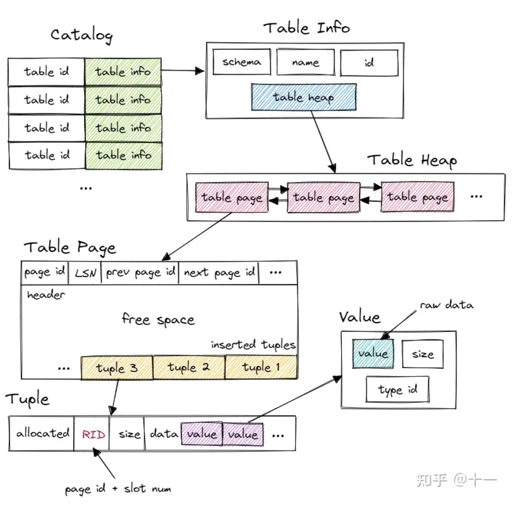
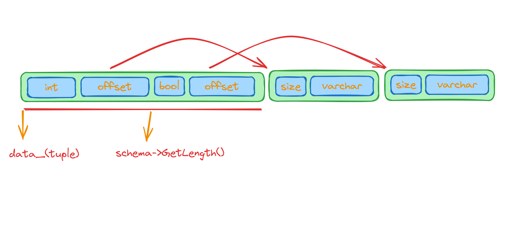
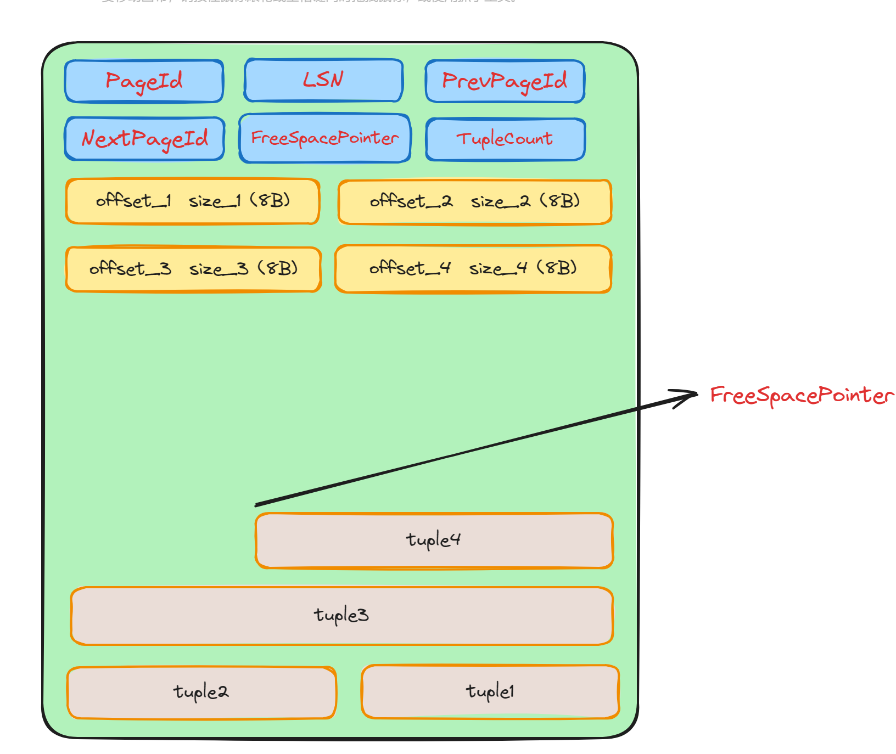

## **Bustub中的Table**

首先，我们先来看一下Bustub数据库中表的设计的结构图：

首先，Bustub 有一个 Catalog。Catalog 提供了一系列 API，例如 `CreateTable()`、`GetTable()` 等等。Catalog 维护了几张 hashmap，保存了 table id 和 table name 到 table info 的映射关系。table id 由 Catalog 在新建 table 时自动分配，table name 则由用户指定。

这里的 table info 包含了一张 table 的 metadata，有 schema、name、id 和指向 table heap 的指针。系统的其他部分想要访问一张 table 时，先使用 name 或 id 从 Catalog 得到 table info，再访问 table info 中的 table heap。

table heap 是管理 table 数据的结构，包含 `InsertTuple()`、`MarkDelete()` 一系列 table 相关操作。table heap 本身并不直接存储 tuple 数据，tuple 数据都存放在 table page 中。table heap 可能由多个 table page 组成，仅保存其第一个 table page 的 page id。需要访问某个 table page 时，通过 page id 经由 buffer pool 访问。

table page 是实际存储 table 数据的结构，父类是 page。相较于 page，table page 多了一些新的方法。table page 在 data 的开头存放了 next page id、prev page id 等信息，将多个 table page 连成一个双向链表，便于整张 table 的遍历操作。当需要新增 tuple 时，table heap 会找到当前属于自己的最后一张 table page，尝试插入，若最后一张 table page 已满，则新建一张 table page 插入 tuple。table page 低地址存放 header，tuple 从高地址也就是 table page 尾部开始插入。

tuple 对应数据表中的一行数据。每个 tuple 都由 RID 唯一标识。RID 由 page id + slot num 构成。tuple 由 value 组成，value 的个数和类型由 table info 中的 schema 指定。

value 则是某个字段具体的值，value 本身还保存了类型信息。




## **Tuple**

上面给出了一条`Tuple` 的结构，如果我们想解析一条`Tuple` ，例如知道`Tuple` 的每一个`Value` ，包括类型，我们就需要另外一个叫做`Schema` 的类了。所以说`Tuple` 需要和`Schema` 配合使用。

`Schema` 定义好了一个表的表模式，即一个table由哪些列组成的，列的名称，占用的大小等。`Tuple` 中有一些列是由Varchar组成的字符串，由于这些字符串长度的不确定，我们又该如何在`Tuple`中进行存储呢？

我们可以先计算`Schema`中固定的长度，也就是比如一些int、bool等类型的column，这些存储的位置都可以固定下来，并且可以用这些加起来得到`schema`的长度，而对于变长的字符串，我们留一个`offset` ，再在整个`shema` 固定部分的长度后面加进去。这也就是`Column` 中函数`IsInlined()`的作用，就是判断`data_`的 `column->GetOffset()`处 存储的是真实的Value，还是二级的offset。这样就解决了Varchar的可边长问题：

我们再来看一下`Tuple` 的结构，`data_` 字符数组就是这样组织的，主要还是看代码



`Tuple`除了`data_`来存储各个column外，还有

```c
bool allocated_{false};  // is allocated?
RID rid_{};              // if pointing to the table heap, the rid is valid
uint32_t size_{0};
```

这三个成员。


## **TablePage**

bustub中存储table表的页叫做`TablePage` ，它的结构如下：

```c
/**
 * Slotted page format:
 *  ---------------------------------------------------------
 *  | HEADER | ... FREE SPACE ... | ... INSERTED TUPLES ... |
 *  ---------------------------------------------------------
 *                                ^
 *                                free space pointer
 *
 *  Header format (size in bytes):
 *  ----------------------------------------------------------------------------
 *  | PageId (4)| LSN (4)| PrevPageId (4)| NextPageId (4)| FreeSpacePointer(4) |
 *  ----------------------------------------------------------------------------
 *  ----------------------------------------------------------------
 *  | TupleCount (4) | Tuple_1 offset (4) | Tuple_1 size (4) | ... |
 *  ----------------------------------------------------------------
 */
```

下面就是`TablePage`的结构，前面有24个字节的头部，分别存储了Page的基本信息以及`FreeSpacePointer`和`TupleCount`，通过这两个就可以实现对`TablePage`的解析。每一个`offset`就是Page中`Tuple`的`data_`在页的起始位置的偏移，至于`RID`就是`offset size`数组的下标。



在Bustub中是如何删除某一条`Tuple`的呢，首先先对`Tuple`进行删除的标记，也就是调用`MarkDelete`函数。

> 事务首先调用MarkDelete，然后如果提交成功，使用ApplyDelete函数从物理上删除。如果事务异常终止了则调用RollbackDelete函数再把每个tuple的size的第32位1给抹去。

```c
auto TableHeap::MarkDelete(const RID &rid, Transaction *txn)
```

这个函数做一些判断后调用`SetTupleSize`。这个标志就相当于把`tuple_size`的第32位置1，根据这一位判断是否是需要被`Delete`的。同样`UnsetDeletedFlag`函数就是获取设为`Delete`标志位前`tuple`的长度。

```c
SetTupleSize(slot_num, SetDeletedFlag(tuple_size));

// DELETE_MASK  (0b)  100000.....000(31个0)
static constexpr uint64_t DELETE_MASK = (1U << (8 * sizeof(uint32_t) - 1));
static auto SetDeletedFlag(uint32_t tuple_size) -> uint32_t {
    return static_cast<uint32_t>(tuple_size | DELETE_MASK);
}
static auto UnsetDeletedFlag(uint32_t tuple_size) -> uint32_t {
    return static_cast<uint32_t>(tuple_size & (~DELETE_MASK));
}
```


### **ApplyDelete**

接下来我们可以直接看`ApplyDelete`函数，这个函数是把`tuple`的内容从`TablePage`中进行物理删除。

这个函数的行为是把`rid`这个`tuple`给删除了，首先利用`UnsetDeletedFlag`函数得到原来的`tuple_size`，然后把使用`memmove`函数直接把需要删除的`tuple`给覆盖掉。然后再把移动了的`tuple`(`offset`小于被删除`tuple`的`offset`)的偏移加上删除`tuple`的`tuple_size`。还需要把相应位置的`offset`和`size`都置为0。

```c
void TablePage::ApplyDelete(const RID &rid, Transaction *txn, LogManager *log_manager) {
  uint32_t slot_num = rid.GetSlotNum();
  BUSTUB_ASSERT(slot_num < GetTupleCount(), "Cannot have more slots than tuples.");

  uint32_t tuple_offset = GetTupleOffsetAtSlot(slot_num);
  uint32_t tuple_size = GetTupleSize(slot_num);
  // Check if this is a delete operation, i.e. commit a delete.
  if (IsDeleted(tuple_size)) {
    tuple_size = UnsetDeletedFlag(tuple_size);
  }
    
  // Otherwise we are rolling back an insert.
  uint32_t free_space_pointer = GetFreeSpacePointer();
  BUSTUB_ASSERT(tuple_offset >= free_space_pointer, "Free space appears before tuples.");

  memmove(GetData() + free_space_pointer + tuple_size, GetData() + free_space_pointer,
          tuple_offset - free_space_pointer);
  SetFreeSpacePointer(free_space_pointer + tuple_size);
  SetTupleSize(slot_num, 0);
  SetTupleOffsetAtSlot(slot_num, 0);

  // Update all tuple offsets.
  for (uint32_t i = 0; i < GetTupleCount(); ++i) {
    uint32_t tuple_offset_i = GetTupleOffsetAtSlot(i);
    if (GetTupleSize(i) != 0 && tuple_offset_i < tuple_offset) {
      SetTupleOffsetAtSlot(i, tuple_offset_i + tuple_size);
    }
  }
}
```


### **InsertTuple**

`InsertTuple`函数负责把`tuple`中的`data_`部分插入到`TablePage`中，再把插入的位置记录在指针`rid`中。

首先判断是否插入得下，如果没有足够的空间插入就返回`false`。

然后开始遍历所有的`tuple`(从0到`TupleCount()`，这里的`i`就是`RID`中的`slot_num`)，。如果某个`tuple`的`size`为0，说明这个位置是空闲的(之前`ApplyDelete`的时候`offset`和`size`数组在page中的的位置并没有改变，删除了只是把它们都置为0。

然后我们把`FreeSpacePointer`减去`tuple.size_`，并把`tuple.data_`搬运到这个位置上，最后设置`rid`，`rid->Set(GetTablePageId(), i)`。

```c
auto TablePage::InsertTuple(const Tuple &tuple, RID *rid, Transaction *txn, LockManager *lock_manager,
                            LogManager *log_manager) -> bool {
  BUSTUB_ASSERT(tuple.size_ > 0, "Cannot have empty tuples.");
  // If there is not enough space, then return false.
  if (GetFreeSpaceRemaining() < tuple.size_ + SIZE_TUPLE) {
    return false;
  }

  // Try to find a free slot to reuse.
  uint32_t i;
  for (i = 0; i < GetTupleCount(); i++) {
    // If the slot is empty, i.e. its tuple has size 0,
    if (GetTupleSize(i) == 0) {
      // Then we break out of the loop at index i.
      break;
    }
  }

  // If there was no free slot left, and we cannot claim it from the free space, then we give up.
  if (i == GetTupleCount() && GetFreeSpaceRemaining() < tuple.size_ + SIZE_TUPLE) {
    return false;
  }

  // Otherwise we claim available free space..
  SetFreeSpacePointer(GetFreeSpacePointer() - tuple.size_);
  memcpy(GetData() + GetFreeSpacePointer(), tuple.data_, tuple.size_);

  // Set the tuple.
  SetTupleOffsetAtSlot(i, GetFreeSpacePointer());
  SetTupleSize(i, tuple.size_);

  rid->Set(GetTablePageId(), i);
  if (i == GetTupleCount()) {
    SetTupleCount(GetTupleCount() + 1);
  }

  return true;
}

```


