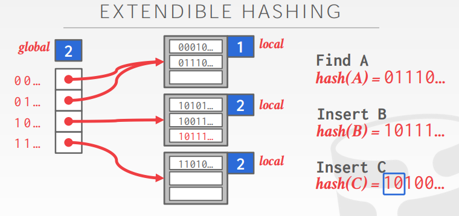
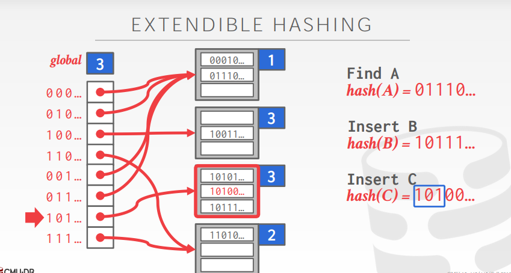

## **Extendible Hash Table**

我们先来了解一下什么是Extendible Hash Table。Extendible Hashing 有两个主要的部分

1. 目录(Directories): 即我们的哈希数组,目录的一个slot(即一个元素,下标)存储一个指向叶的地址的指针。还有一个id被分配给每个目录项,当目录扩张的时候,id就会发生改变。
2. 叶(bucket): 桶用来存储散列后的数据(hash(key)和对应的value)
   

我们来看一下相关的类实现。

```c
class Bucket {
   public:
    explicit Bucket(size_t size, int depth = 0);
    ....
        
   private:
    // TODO(student): You may add additional private members and helper functions
    size_t size_;
    int depth_;
    std::list<std::pair<K, V>> list_;
  };
```

```c
class ExtendibleHashTable : public HashTable<K, V> {
private:
  int global_depth_ = -1;   // The global depth of the directory
  size_t bucket_size_ = 0;  // The size of a bucket
  int num_buckets_ = 0;     // The number of buckets in the hash table
  mutable std::mutex latch_;
  std::vector<std::shared_ptr<Bucket>> dir_;  // The directory of the hash table
}
```

我们来看一下ExtendibleHashTable的主要思路

这是当前的ExtendibleHashTable的状态。左边的数据结构是`std::vector<std::shared_ptr<Bucket>> dir_` ，也就是directory。它的有一个`global_depth_`深度为2，表示`dir_`有4项。



接下来我们想要插入C，`hash(C)`进行位运算，二进制前两位(因为这里的`global_depth_`为2，所以只看前2位)为`10`，表示要插入进`dir_`下标为2的`Bucket`里。但现在由于这个`Bucket`的`local_depth_`为2，表示这个`Bucket`最大的存储大小为2(`Bucket`的最大容量和它的`local_depth_`有关，`Bucket`已经满了，那么就需要进行扩容。下面分几种情况：

1. 如果`Bucket`的`local_depth_`等于`global_depth_`：这就需要把`dir_`扩容一倍(`global_depth_`需要加1)，然后再把当前`Bucket`的`local_depth_`加1，最后把元素直接插进这个`Bucket`中。
2. 如果`Bucket`的`local_depth_`小于`global_depth_`，那么这个`Bucket`需要进行扩容(`local_depth_`加1)，还有需要对`Bucket`里面的元素进行再分配，这需要申请新的`Bucket`结构体。主要的思路看这两幅图大概就能看明白了。




## **LRU-K Replacement Policy**

在 LRU-K 中，我们需要记录 page 最近 K 次被引用的时间。假如 list 中所有 page 都被引用了大于等于 K 次，则比较最近第 K 次被引用的时间，驱逐最早的。假如 list 中存在引用次数少于 K 次的 page，则将这些 page 挑选出来，用普通的 LRU 来比较这些 page 第一次被引用的时间，驱逐最早的。

先介绍一下 frame 的概念。page 放置在 buffer pool 的 frame 中，frame 的数量是固定的，即 buffer pool 的大小。如果 buffer pool 中的一个 frame 没有用来放置任何 page，则说该 frame 是空闲的。如果所有 frame 都不是空闲的，则表明 buffer pool 已满。

Replacer 里有一张哈希表，用于存储不同 frame 的信息。将 frame 的信息封装成 `FrameInfo` 类。哈希表的 key 为 frame id，value 为 FrameInfo。

FrameInfo 里用链表保存 page 最近 K 次被引用的时间戳。这里的时间戳不适合也不需要用真正的 Unix 时间戳，直接用一个从 0 递增的 `size_t` 变量 `curr_timestamp` 来表示即可，每次引用 Replacer 中的任一 page 时，记录该次引用的时间戳为 `curr_timestamp`，并将其加 1。`size_t` 的大小也保证了这个变量不会溢出。


## **Buffer Pool Manager**

这是`buffer_pool_manager_`类成员

```c
  /** Number of pages in the buffer pool. */
  const size_t pool_size_;
  /** The next page id to be allocated  */
  std::atomic<page_id_t> next_page_id_ = 0;
  /** Bucket size for the extendible hash table */
  const size_t bucket_size_ = 4;

  /** Array of buffer pool pages. */
  Page *pages_;
  /** Pointer to the disk manager. */
  DiskManager *disk_manager_
      __attribute__((__unused__));  // 这通常用于避免编译器警告，同时保留该变量以备将来使用的可能性。
  /** Pointer to the log manager. Please ignore this for P1. */
  LogManager *log_manager_ __attribute__((__unused__));
  /** Page table for keeping track of buffer pool pages. */
  ExtendibleHashTable<page_id_t, frame_id_t> *page_table_;
  /** Replacer to find unpinned pages for replacement. */
  LRUKReplacer *replacer_;
  /** List of free frames that don't have any pages on them. */
  std::list<frame_id_t> free_list_;
  /** This latch protects shared data structures. We recommend updating this comment to describe what it protects. */
  std::mutex latch_;

```

- pages：buffer pool 中缓存 pages 的指针数组
- disk_manager：框架提供，可以用来读取 disk 上指定 page id 的 page 数据，或者向 disk 上给定 page id 对应的 page 里写入数据
- page_table：刚才实现的 Extendible Hash Table，用来将 page id 映射到 frame id，即 page 在 buffer pool 中的位置
- replacer：刚才实现的 LRU-K Replacer，在需要驱逐 page 腾出空间时，告诉我们应该驱逐哪个 page
- free_list：空闲的 frame 列表

`buffer_pool_manager_`有几个重要的函数。

- **`FetchPgImp(page_id_t page_id)`**:寻找Buffer Pool里面是否存在某一个page，如果存在并返回这个Page在指针(根据Extendible Hash Table判断)；如果不存在，就需要寻找在free list中存在没有被使用的frame，再使用LRU驱逐策略看能不能驱逐某个frame，但前提必须是这个buffer page的引用计数等于0。这里还需要判断是否要把内容写回磁盘。

  获取后，需要将evictable设置为false,在哈希表中建立映射，page的引用计数要加1.

- **`UnpinPgImp(page_id_t page_id, bool is_dirty)`**:访问完一个页面结束后就要进行Unpin，如果对页面进行了修改还需要把把`is_dirty`置为`true`以后写回磁盘。这个函数需要对page的引用计数减1，如果引用计数为0，还需要把这个frame设置成可以驱逐的(`is_evictable`)，这一步并不需要加入free list。

  `pin_count_`为0的时候这一步也不需要把内容写会磁盘，等到之后Fetch或者New的时候再根据`is_dirty_`位写回磁盘。

- **`NewPgImp(page_id_t *page_id)`**：上层调用者希望新建一个 page。如果当前 buffer pool 已满并且所有 page 都是 unevictable 的，直接返回。如果当前 buffer pool 里没有空闲的 frame，但有 evitable 的 page，利用 LRU-K Replacer 获取可以驱逐的 frame id，将 frame 中原 page 驱逐，并创建新的 page 放在此 frame 中。

  使用 `AllocatePage` 分配一个新的 page id(从0递增)，这相当于数据库文件的偏移，建立映射，增加引用计数。

  如果被驱逐的页面还是`dirty`的，那么还需要把内容写回磁盘。


