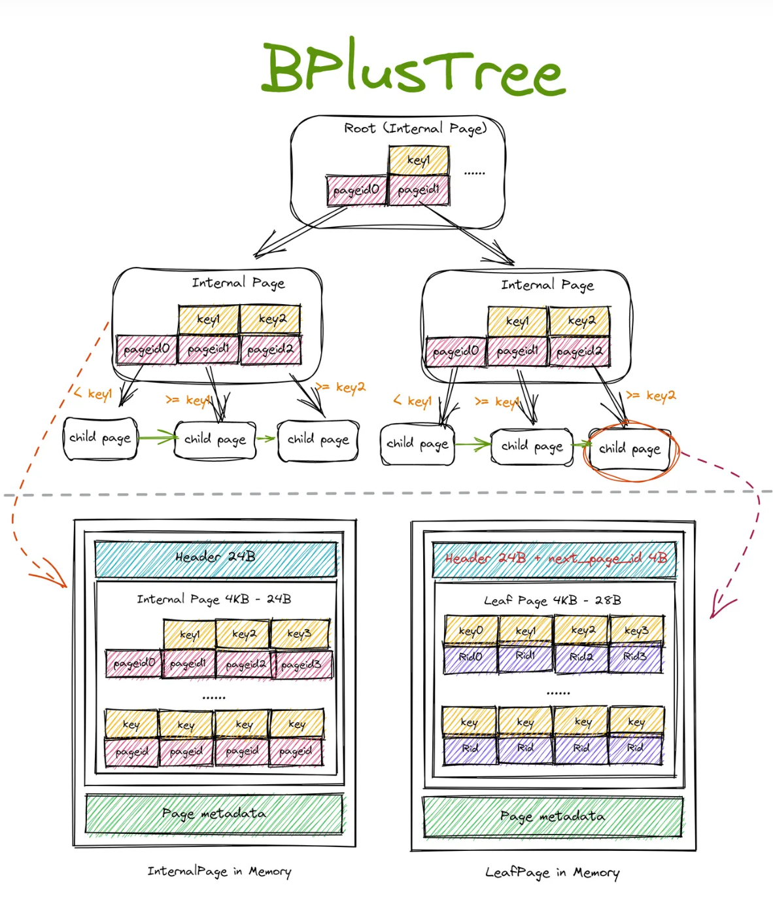
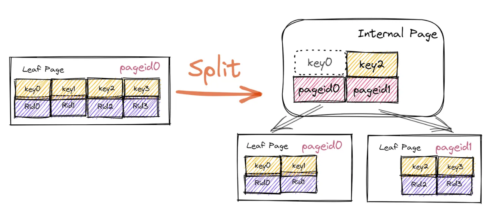
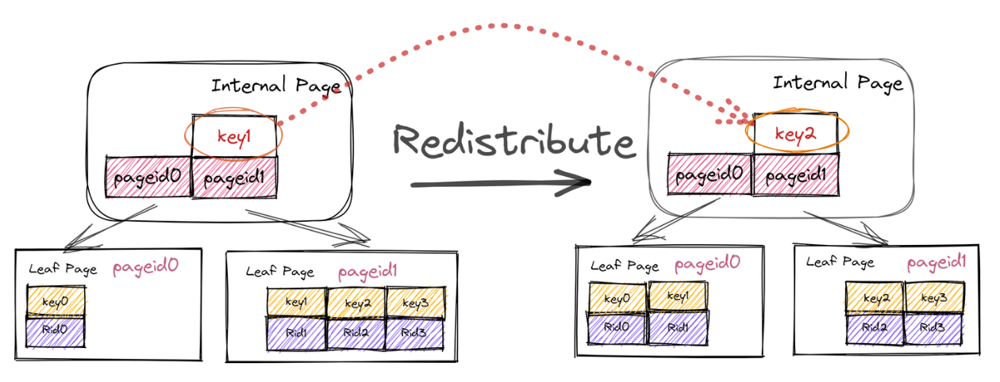

## **Overview**

写这篇文章的目的主要用于B+树实现过程中的一些总结，不会太多涉及代码的实现，主要介绍思路和结构。个人感觉这是整个课程实验中最难的一个实验了。早就听说数据库中常用B+树来做索引，现在终于有机会直观地了解这一部分了。

这篇文章主要介绍CheckPoint1的内容。下一篇文章介绍B+树中的并发。


## **B+树的结构**

B+树中有两种节点，一种是`InternalPage`，另一种是`LeafPage`。这两种page可以抽象成`BPlusTreePage`。

```c
class BPlusTreePage {
 public:
 private:
  // member variable, attributes that both internal and leaf page share
  IndexPageType page_type_;   // leaf or internal. 4 Byte
  lsn_t lsn_  				  // temporarily unused. 4 Byte
  int size_;  				  // tree page data size(not in byte, in count). 4 Byte
  int max_size_;  			  // tree page data max size(not in byte, in count). 4 Byte
  page_id_t parent_page_id_;  // 4 Byte
  page_id_t page_id_; 		  // 4 Byte
  // Header data 24 Byte in total 
};
```

```c
class BPlusTreeInternalPage : public BPlusTreePage {
 public:
 private:
  // Flexible array member for page data.
  #define MappingType std::pair<KeyType, ValueType>
  MappingType array_[1];
};
```

```c
class BPlusTreeLeafPage : public BPlusTreePage {
 public:
 private:
  page_id_t next_page_id_;
  // Flexible array member for page data.
  MappingType array_[1];
```

可以看到`LeafePage`相较于`InternalPage`，它的元数据还多了一个`next_page_id`，这个字段在设计B+树的迭代器的时候作用十分大。

那么该如何获取这些B+树的节点呢? 答案就在下面。**reinterpret_cast 运算符并不会改变括号中运算对象的值，而是对该对象从位模式上进行重新解释**，有了前面的铺垫很容易理解这个函数，即原先该内存解读为 `Page`，现在解读为 `BPlusTreePage`。

```c
Page *page = buffer_pool_manager->FetchPage(page_id);
// 强制类型转化 page->GetData()
BPlusTreePage *page_node = reinterpret_cast<BPlusTreePage *>(page->GetData());
```


我们现在再来看一下Bustub中的B+树的视图:



对于B+树里面的`InternalPage`，它的key字段是索引，而它的value则是子节点的`PageId`。对于B+树里面的`LeafPage`，它的key字段也是建立的索引字段，而value部分则是数据条目对应的位置`RID`。

所以对于`InternalPage`，它的key是需要比value少1个的，Project 中要求，第一个 Key 为空。主要是因为在 internal page 中，n 个 key 可以将数轴划分为 n+1 个区域，也就对应着 n+1 个 value。

熟悉了B+树的基本结构后，我们简单介绍一下三种操作(`Insert` `Delete` `LookUp`)的实现思路。


## **LookUp**

```c
bool GetValue(const KeyType &key, std::vector<ValueType> *result, Transaction *transaction)
```

当拿到一个 key 需要查找对应的 value 时，首先需要经由 internal page 递归地向下查找，最终找到 key 所在的 leaf page。这个过程可以简化为一个函数 `Findleaf()`。

`FindLeaf`只需要找到可能存在`key`的leaf page，如果是internal page，根据 key 在当前 internal page 中找到对应的 child page id(我们在拿到 page id 后，调用 buffer pool 的 `FetchPage()` 函数来获取对应的 page 指针。要注意的是，在使用完 page 之后，需要将 page unpin 掉，否则最终会导致 buffer pool 中的所有 page 都被 pin 住，无法从 disk 读取其他的 page。然后再在下层 page 寻找)，最后在返回的 leaf page 里进行`LookUp`查找。


## **Insert**

```c
bool Insert(const KeyType &key, const ValueType &value, Transaction *transaction = nullptr)
```

与 Search 相同，第一步是根据 key 找到需要插入的 leaf page。同样是调用 `Findleaf()`。得到 leaf page 后，将 key 插入 leaf page。要注意的是，插入时仍需保证 key 的有序性。同样可以二分搜索找到合适的位置插入。

在把KV插入叶子节点后，需要判断 leaf page 是否是等于`max_size_`的，如果是，则需要进行一次分裂操作，叶子节点的分裂过程如下：

1. 新建一个空的 page
2. 将原 page 的一半转移到新 page 中，（假如选择将新 page 放在原 page 右侧，则转移原 page 的右半部分）
3. 更新原 page 和新 page 的 next page id
4. 获取 parent page
5. 将用于区分原 page 和新 page 的 key 插入 parent page 中
6. 更新 parent page 所有 child page 的父节点指针

往parent page里插入新的KV后，还需要判断parent page是否是满的状态，则还需要对parent page进行分裂，parent page的分裂过程如下：

1. 新建一个空的 page， 
2. 将原 page 的一半转移到新 page 中，需要注意原 page 和新 page 的第一个 key 都是无效的， 
3. 更新新 page 所有 child page 的父节点指针，指向新 page 
4. 获取 parent page
5. 将用于区分原 page 和新 page 的 key 插入 parent page 中， 6. 更新 parent page 所有 child page 的父节点指针。



对于root page内KV已满的情况，初始化就比一般情况下复杂一点，如上图所示，它需要设置两个KV，`array_[0].Value`设置为 left page的PageId，`array_[0].Key`不需要进行设置，`array_[1].Value`设置成 right page的PageId，`array_[1].Key`需要设置成 right page的一条元素的Key。


## **Deletion**

将一个 KV 在 B+树删除，最终需要在叶子节点的 Leaf Page 删除 KV ，并同时进行适当的调整使得 B+树始终满足它的性质，具体的：

1. 首先找到叶子结点(`FindLeaf`)
2. 如果叶子结点内存在KV，并且删除后叶子结点内的元素个数仍满足 ≥ min_size，直接删除
3. 否则，需要进行 `CoalesceOrRedistribute`
4. 向父亲递归操作

函数`CoalesceOrRedistribute`是对删除某个元素后的 page 进行的调整，看这个 page 是需要与它的左邻居(或是右邻居)进行合并(Coalesce)还是简单地从左邻居(右邻居)中借走一个KV(Redistribute)。


### **Redistribute**

尝试从两侧的兄弟节点中借一个 KV 对（父节点相同的节点中选取）假如存在一侧节点有富余的 KV 对，则成功，结束操作。



除了需要进行左右节点之间KV的移动，还需要调整parent page中的某一个KV，只需要在原来基础上更改，并不需要添加或删除。对于重分配，并不需要继续对parent page进行其他操作。


### **Coalesce**

如果左右邻居的节点都没有富足的节点外借，那么就可以进行将当前page与左(右)邻居进行合并，合并之后，parent page 也需要删除对应的KV，这一步继续对应函数`CoalesceOrRedistribute`，也就是递归向上。


另外不要忘记了设置字段`NextPageId`。


