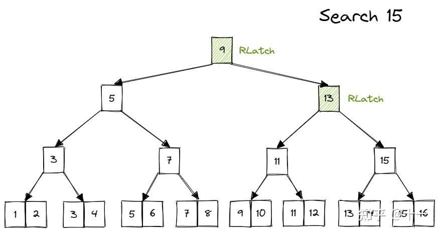
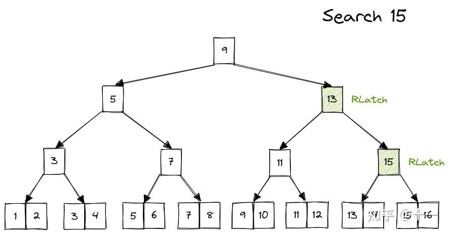
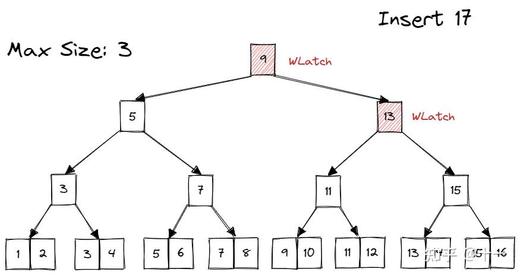
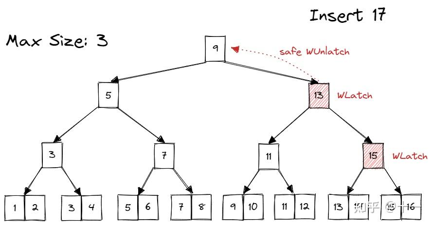

## **Overview**

第一部分是设计好遍历B+树的迭代器，第二部分是实现B+树的并发。

## **B+树中的并发控制**

我们会使用一种特殊的加锁方式，叫做 latch crabbing。顾名思义，就像螃蟹一样，移动一只脚，放下，移动另一只脚，再放下。基本思想是： 1. 先锁住 parent page， 2. 再锁住 child page， 3. 假设 child page 是*安全*的，则释放 parent page 的锁。*安全*指当前 page 在当前操作下一定不会发生 split/steal/merge。同时，*安全*对不同操作的定义是不同的，Search 时，任何节点都安全；Insert 时，判断 max size；Delete 时，判断 min size。

### **Search**

Search 时，从 root page 开始，先给 parent 上读锁，然后获取到child page，再给 child page 上读锁，随后就可以释放 parent page 的锁。如此向下递归。

### **Insert**

Insert 时，从 root page 开始，先给 parent 上写锁，再给 child page 上写锁。假如 child page 安全，则释放所有祖先的锁；否则不释放锁，继续向下递归。

> 这里的child page安全判断就是上面说的，这次操作最多只会影响child page的的自身结构，并不会波及其 parent page，这样一来我们就可以对 parent page进行解锁。
>
> 比如说，假设这是一个Insert，该page即使加上一条数据后仍然不会发生溢出，我们就可以认为这个page的parent page是安全的(包括所有的以上的祖先也都是安全的)，但这个page的写锁我们现在还不能释放。

在 child page 不安全时，需要持续持有祖先的写锁。并在出现安全的 child page 后，释放所有祖先写锁。如何记录哪些 page 当前持有锁？这里就要用到在 Checkpoint1 里一直没有提到的一个参数，`transaction`。

transaction 就是 Bustub 里的事务。调用 transaction 的 `AddIntoPageSet()` 方法，来跟踪当前线程获取的 page 锁。在发现一个安全的 child page 后，将 transaction 中记录的 page 锁全部释放掉。

### **Delete**

和 Insert 基本一样。仅是判断是否安全的方法不同（检测 min size）。需要另外注意的是，当需要 steal/merge sibling 时，也需要对 sibling 加锁。并在完成 steal/merge 后马上释放。这里是为了避免其他线程正在对 sibling 进行 Search/Insert 操作，从而发生 data race。这里的加锁就不需要在 transaction 里记录了，只是临时使用。

还有一些需要注意的细节，下面是某位大佬的总结，[链接我放在这里](https://zhuanlan.zhihu.com/p/593214033)