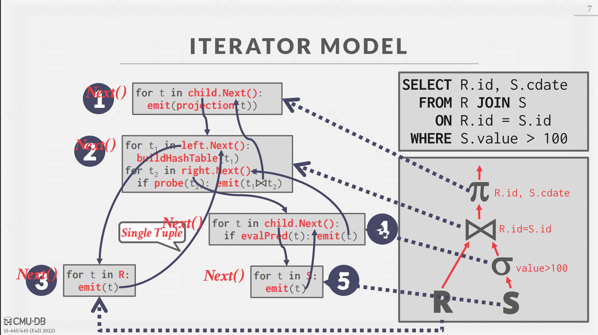
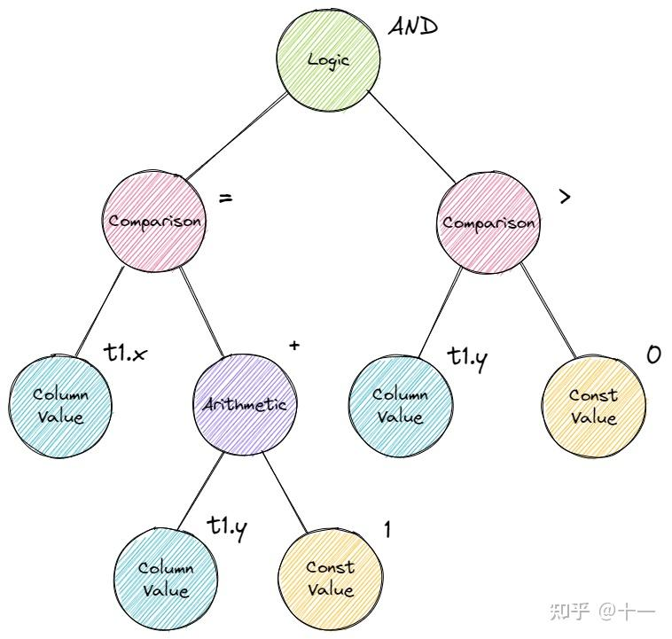

## **Query Execution**

从这一个实验开始，我们就正式进入了Bustub数据库的底层实现部分。这个实验完成后，我们利用我们实现的算子，可以在本机进行SQL语句的查询。


### **SQL语句的执行**

**Parser**

一条 sql 语句，首先经过 Parser 生成一棵抽象语法树 AST。Bustub 中采用了 libpg_query 库将 sql 语句 parse 为 AST。这个地方主要运用的是编译原理的内容。

**Binder**

在得到 AST 后，还需要将这些词语绑定到数据库实体上，这就是 Binder 的工作。例如有这样一条 sql：

```
SELECT colA FROM table1;
```

其中 `SELECT` 和 `FROM` 是关键字，`colA` 和 `table1` 是标识符。Binder 遍历 AST，将这些词语绑定到相应的实体上。实体是 Bustub 可以理解的各种 c++ 类。绑定完成后，得到的结果是一棵 Bustub 可以直接理解的树。把它叫做 Bustub AST。

**Planner**

得到 Bustub AST 后，Planner 遍历这棵树，生成初步的查询计划。

**Optimizer**

由 Planner 得到初步的查询计划后，再将查询计划交给 Optimizer 进行修改优化，生成优化过后的最终查询计划。

**Executor**

拿到查询计划后，就可以生成真正的执行查询计划的一系列算子了。这也是我们在这次实验需要完成的。算子有3种执行模型：

1. Iterator Model，Pipeline Model，也就是火山模型。每个算子都有 `Init()` 和 `Next()` 两个方法。`Init()` 对算子进行初始化工作。`Next()` 则是向下层算子请求下一条数据。当 `Next()` 返回 false 时，则代表下层算子已经没有剩余数据，迭代结束。可以看到，火山模型一次调用请求一条数据，占用内存较小，但函数调用开销大，特别是虚函数调用造成 cache miss 等问题。在bustub中选用了这种火山模型。我们将在下面的实验中对火山模型有进一步的了解和体会
2. Materialization Model. 所有算子立即计算出所有结果并返回。和 Iterator Model 相反。这种模型的弊端显而易见，当数据量较大时，内存占用很高。但减少了函数调用的开销。
3. Vectorization Model. 对上面两种模型的中和，一次调用返回一批数据。

此外，算子的执行方向也有两种：

1. Top-to-Bottom. 从根节点算子开始，不断地 pull 下层算子的数据。
2. Bottom-to-Top. 从叶子节点算子开始，向上层算子 push 自己的数据。


我们来看一个具体的例子，理解一下火山模型：



右下是我们的执行算子，最顶层的是1个projection的算子，它不断调用`Next` 方法获取它的每一条记录，它有1个`child_executor_` 的子算子为它不断提供它需要进行projection的数据，这个算子在这里是一个Join类型的算子，它的每一条数据是怎么来的呢，当然也是通过不断调用`Next` 方法从它的左儿子和右儿子执行算子中获取的，左儿子和右儿子也是通过`Next` 方法获得数据条目的。可以看到，叶子节点的算子肯定要从数据库中的表中获取数据，也就是叶子算子一定是SeqScan算子。中间的算子对获取到的`Tuple` 进行加工，获得中间结果，再把中间结果传递给上层算子。整个火山模型就是这样的一个工作流程。

我们可以看到，这种火山模型获取一条数据都需要一条很长的`Next` 调用函数链，函数的花销是很大的。


## **SeqScan**

为什么每一个执行算子都需要`ExecutorContext` 和 `PlanNode` ？

```c
SeqScanExecutor::SeqScanExecutor(ExecutorContext *exec_ctx, const SeqScanPlanNode *plan)
```

生成的具体的查询计划后，就可以生成真正执行查询计划的一系列算子。每种查询计划都有与之对应的算子，将查询计划替换成相应的Executor。`PlanNode` 中有该查询计划所需要的表的名称，而`ExecutorContext` 中有支持查询的相关资源，比如`catalog` 、`buffer_pool_manager_` 以及事务相关的。

我们来看SeqScan这个算子，正如我们上面说的，SeqScan算子是最底层的算子，它是在TablePage中把一条条`Tuple` 给读取出来。

这里我们需要阅读一下`TablePage` 迭代器的实现部分，通过迭代器就可以实现了。


## **Insert && Delete**

这两个算子的实现也不难，但记得要更新与 table 相关的所有 index。index 与 table 类似，同样由 Catalog 管理。需要注意的是，由于可以对不同的字段建立 index，一个 table 可能对应多个 index，所有的 index 都需要更新。

主要调用`table_info_->table_->InsertTuple` 和 ` indexinfo->index_->InsertEntry` 函数。这里还需要注意，这里的插入和删除都有一个`GetOutputSchema()` 的表格式。


## **NestedLoopJoin**

这个Join算子有两个子执行器，`left_executor_`和`right_executor_`，在`NestedLoopJoinPlanNode *plan`有一个 `JoinType`表示是Left Join还是Right Join。

在这里有一个细节，就是我们很容易写成这样的伪代码:

```
while (left_child->Next(&left_tuple)){
    while (right_child->Next(&right_tuple)){
        if (left_tuple matches right_tuple){
            *tuple = ...;   // assemble left & right together
            return true;
        }
    }
}
return false;
```

仔细一看，这种实现是错误的，在火山模型中，right child 在 left child 的第一次循环中就被消耗完了，之后只会返回 false。所以我们需要用一个数组把right child的tuple事先获取到并存起来(实验指导上也说了，直接放在内存里面就够了)。

现在还有一个问题，如何判断两个tuple是否是匹配的呢，这里就需要遇到另一个很重要的类`AbstractExpression`了。

`AbstractExpression` 抽象了 sql 中的各种表达式，包括 `ArithmeticExpression`、`ColumnValueExpression`、`ComparisonExpression`、`ConstantValueExpression` 和 `LogicExpression`。这都是什么？看下面这条 sql：

```
SELECT * FROM t1 WHERE t1.x = t1.y + 1 AND t1.y > 0;
```

重点关注 `WHERE` 后的表达式 `t1.x = t1.y + 1 AND t1.y > 0`。看这下面这张图，这其实就是一棵表达式树，sql中所有的表达式都会被parse成表达式树，再进行绑定。



在NestedLoopJoin里，调用的是`EvaluateJoin`,返回是true表示匹配成功。

 我们来看里匹配的判断逻辑：

在`Next`函数中，得到的这个`value`是bool类型的，也就是说顶层的表达式是一个逻辑表达式。

```c
// Next()函数
auto value = plan_->Predicate().EvaluateJoin(&left_tuple_, left_executor_->GetOutputSchema(), &right_tuple,
                                                   right_executor_->GetOutputSchema());
```

我们看这个`EvaluateJoin`函数：

```c
// LogicExpression 类
auto EvaluateJoin(const Tuple *left_tuple, const Schema &left_schema, const Tuple *right_tuple,
                    const Schema &right_schema) const -> Value override {
    Value lhs = GetChildAt(0)->EvaluateJoin(left_tuple, left_schema, right_tuple, right_schema);
    Value rhs = GetChildAt(1)->EvaluateJoin(left_tuple, left_schema, right_tuple, right_schema);
    return ValueFactory::GetBooleanValue(PerformComputation(lhs, rhs));
}

```

这里我举一个例子，下面这个sql语句可以抽象成一棵表达式树.

```
Select * From t1 INNER JOIN t2 where t1.x + t2.y = t1.y + 100
```

表达式树的root节点是一个`LogicExpression`，它有两个子节点，这两个子节点都是一个`ArithmaticExpression`，`ArithmaticExpression`中值的获取仍需要调用函数`EvaluateJoin(left_tuple, left_schema, right_tuple, right_schema)`，因为表达式都需要用到tuple1和tuple2，再在最底层的是`ColumnValueExpression`(如上面的`t1.x`)或者是`ConstantValueExpression`（如上面的100），这两个的`EvaluateJoin`函数如下：

```c
// ConstantValueExpression
auto EvaluateJoin(const Tuple *left_tuple, const Schema &left_schema, const Tuple *right_tuple,
                    const Schema &right_schema) const -> Value override {
    return val_;
}

// ColumnValueExpression
auto EvaluateJoin(const Tuple *left_tuple, const Schema &left_schema, const Tuple *right_tuple,
                    const Schema &right_schema) const -> Value override {
    return tuple_idx_ == 0 ? left_tuple->GetValue(&left_schema, col_idx_)
                           : right_tuple->GetValue(&right_schema, col_idx_);
}
```


 ## **Aggregation**

在实现这个算子的时候，由于我对Aggregation的理解不深入，导致很困难。我们先来简单介绍一下这个算子到底是如何使用的。首先，这个算子并不是严格的火山模型，它需要在`Init`函数中把所有的数据条目都计算出来，再在`Next`函数中不断获取`Tuple`。

例如有下面这个SQL语句：

```CQL
select min(colA-colB),max(colA+colB) from table_1 group by (colC-colD) (colE+colF);
```

在Aggregation中，有一个`AggregateKey`，它只有一个成员`std::vector<Value> group_bys_;`，还有一个`AggregateValue`，它也只有一个成员`std::vector<Value> aggregates_;`。

`AggregationExecutor`中有两个函数，它们都根据`expr`表达式计算出相应的结果。

我们再来看上面的SQL语句，也就不难理解这里面的设计了。在这里`colC-colD`和`colE+colF`是一个`AggregateKey`，`colC-colD`和`colE+colF`分别是`group_bys_[0]`和`group_bys_[1]`。

同样`colA-colB`和`colA+colB`是一个`AggregateValue`，`colA-colB`和`colA+colB`分别是`aggregates_[0]`和`aggregates_[1]`。

```c
auto MakeAggregateKey(const Tuple *tuple) -> AggregateKey {
    std::vector<Value> keys;
    for (const auto &expr : plan_->GetGroupBys()) {
      keys.emplace_back(expr->Evaluate(tuple, child_->GetOutputSchema()));
    }
    return {keys};
  }

  /** @return The tuple as an AggregateValue */
  auto MakeAggregateValue(const Tuple *tuple) -> AggregateValue {
    std::vector<Value> vals;
    for (const auto &expr : plan_->GetAggregates()) {
      vals.emplace_back(expr->Evaluate(tuple, child_->GetOutputSchema()));
    }
    return {vals};
  }
```


Aggregation就是我们所说的聚合，我们要把同一个`AggregateKey`的所有数据作为一组，聚合函数可以计算某一组里面的最小值，最大值或者某一个字段的总和。所需要的数据结构不就是一个`unordered_map`吗？

`AggregationExecutor`中有一个`SimpleAggregationHashTable aht_`，我们来看一下这个`SimpleAggregationHashTable`。它最主要的数据结构如下：

`ht_`每一个不同的`AggregateKey`都`AggregateValue`，`agg_types_`就是聚合函数的类型，例如在上面的SQL语句中，`agg_types_[0]`是`MIN`，`agg_types_[1]`是`MAX`，它们分别存在`AggregateValue`中的`vals[0]`和`vals[1]`中。

```c
  /** The hash table is just a map from aggregate keys to aggregate values */  
  std::unordered_map<AggregateKey, AggregateValue> ht_{};
  /** The aggregate expressions that we have */
  const std::vector<AbstractExpressionRef> &agg_exprs_;
  /** The types of aggregations that we have */
  const std::vector<AggregationType> &agg_types_;
```


在`Init`函数中，首先需要把数据都准备好，把相应的`{MakeAggregateKey(&tuple), MakeAggregateValue(&tuple)}`添加到`map`中，如果不存在这个`AggregateKey`，`map`首先要`Insert`一个初始值，然后调用`CombineAggregateValues(&ht_[agg_key], agg_val);`。

```c
void AggregationExecutor::Init() {
  ........
  while (child_->Next(&tuple, &rid)) {
    aht_.InsertCombine(MakeAggregateKey(&tuple), MakeAggregateValue(&tuple));
  }
  ........
}
void InsertCombine(const AggregateKey &agg_key, const AggregateValue &agg_val) {
    if (ht_.count(agg_key) == 0) {
      ht_.insert({agg_key, GenerateInitialAggregateValue()});
    }
    CombineAggregateValues(&ht_[agg_key], agg_val);
}
```

这个`CombineAggregateValues`就是更新这个group聚合的信息，例如`agg_types_[i]`如果是`CountStarAggregate`类型(计算某个Group内`Tuple`的条目数)，就需要对相应的`result[i]`进行加1即可。

```c
    // CombineAggregateValues(AggregateValue *result, const AggregateValue &input)
    switch (agg_types_[i]) {
        case AggregationType::CountStarAggregate:
          result->aggregates_[i] = result->aggregates_[i].Add(ValueFactory::GetIntegerValue(1));
          break;
        case AggregationType::CountAggregate:
          if (result->aggregates_[i].IsNull()) {
            result->aggregates_[i] = ValueFactory::GetIntegerValue(0);
          }
          if (!input.aggregates_[i].IsNull()) {
            result->aggregates_[i] = result->aggregates_[i].Add(ValueFactory::GetIntegerValue(1));
          }
          break;
        case AggregationType::SumAggregate:
          if (result->aggregates_[i].IsNull()) {
            result->aggregates_[i] = input.aggregates_[i];
          } else if (!input.aggregates_[i].IsNull()) {
            result->aggregates_[i] = result->aggregates_[i].Add(input.aggregates_[i]);
          }
          break;
        ......
```


## **TopN**

这个算子就是找到最大或者最小的N个`Tuple`，很显然这个TopN也不满足火山模型，它也是在`Init`函数中把所有的N条数据条目准备好，然后再在`Next`函数中不断从内存中获取出来。那么该如何实现呢，我们可以使用`std::priority_queue`来实现，当然，还要给这个优先队列写一个比较器函数。


## **Sort + Limit As TopN**

接下来是实现一个优化了。

如果一个执行算子的类型是Limit，而它的子执行算子的类型则是Sort,(Limit算子只有唯一的一个子执行器)，这样就可以进行优化了。我们可以把这两个算子合并成一个TopN算子。那么Bustub是如何进行优化的呢?

```c
auto Optimizer::Optimize(const AbstractPlanNodeRef &plan) -> AbstractPlanNodeRef {
  if (force_starter_rule_) {
    // Use starter rules when `force_starter_rule_` is set to true.
    auto p = plan;
    p = OptimizeMergeProjection(p);
    p = OptimizeMergeFilterNLJ(p);
    p = OptimizeNLJAsIndexJoin(p);
    p = OptimizeOrderByAsIndexScan(p);
    p = OptimizeSortLimitAsTopN(p);
    return p;
  }
  // By default, use user-defined rules.
  return OptimizeCustom(plan);
}
```

我们先来看一下另一个优化OrderByAsIndexScan是怎么实现的。这个优化的条件是父执行器是一个Sort执行器，子节点是一个Seqscan执行器，并且父节点参与排序的字段只有一个，这样就可以优化这两个为一个IndexScan算子。下面是这个优化的具体实现。

我们发现`children.emplace_back(OptimizeOrderByAsIndexScan(child));`这里就是一个递归，也就是说，对这棵Plan Tree进行后序遍历，自顶而上替换可以优化的节点为IndexScan。

```c
auto Optimizer::OptimizeOrderByAsIndexScan(const AbstractPlanNodeRef &plan) -> AbstractPlanNodeRef {
  std::vector<AbstractPlanNodeRef> children;
  for (const auto &child : plan->GetChildren()) {
    children.emplace_back(OptimizeOrderByAsIndexScan(child));
  }
  auto optimized_plan = plan->CloneWithChildren(std::move(children));

  if (optimized_plan->GetType() == PlanType::Sort) {
    const auto &sort_plan = dynamic_cast<const SortPlanNode &>(*optimized_plan);
    const auto &order_bys = sort_plan.GetOrderBy();

    // Has exactly one order by column
    if (order_bys.size() != 1) {
      return optimized_plan;
    }

    // Order type is asc or default
    const auto &[order_type, expr] = order_bys[0];
    if (!(order_type == OrderByType::ASC || order_type == OrderByType::DEFAULT)) {
      return optimized_plan;
    }

    // Order expression is a column value expression
    const auto *column_value_expr = dynamic_cast<ColumnValueExpression *>(expr.get());
    if (column_value_expr == nullptr) {
      return optimized_plan;
    }

    auto order_by_column_id = column_value_expr->GetColIdx();

    // Has exactly one child
    BUSTUB_ENSURE(optimized_plan->children_.size() == 1, "Sort with multiple children?? Impossible!");
    const auto &child_plan = optimized_plan->children_[0];

    if (child_plan->GetType() == PlanType::SeqScan) {
      const auto &seq_scan = dynamic_cast<const SeqScanPlanNode &>(*child_plan);
      const auto *table_info = catalog_.GetTable(seq_scan.GetTableOid());
      const auto indices = catalog_.GetTableIndexes(table_info->name_);

      for (const auto *index : indices) {
        const auto &columns = index->key_schema_.GetColumns();
        if (columns.size() == 1 &&
            columns[0].GetName() == table_info->schema_.GetColumn(order_by_column_id).GetName()) {
          // Index matched, return index scan instead
          return std::make_shared<IndexScanPlanNode>(optimized_plan->output_schema_, index->index_oid_);
        }
      }
    }
  }

  return optimized_plan;
}
```


有了上面的提示，我们不难写出SortLimitAsTopN的优化了。

```c
auto Optimizer::OptimizeSortLimitAsTopN(const AbstractPlanNodeRef &plan) -> AbstractPlanNodeRef {
  std::vector<AbstractPlanNodeRef> children;
  for (const auto &child : plan->GetChildren()) {
    children.emplace_back(OptimizeSortLimitAsTopN(child));
  }
  auto optimized_plan = plan->CloneWithChildren(std::move(children));

  if (optimized_plan->GetType() == PlanType::Limit) {
    const auto &limit_plan = dynamic_cast<const LimitPlanNode &>(*optimized_plan);

    // limit 就只有一个 子执行器
    BUSTUB_ASSERT(limit_plan.children_.size() == 1, "Limit plan must have one and only one child");
    if (limit_plan.children_[0]->GetType() == PlanType::Sort) {
      const auto &sort_plan = dynamic_cast<const SortPlanNode &>(*optimized_plan->GetChildAt(0));
      const auto &order_bys = sort_plan.GetOrderBy();

      BUSTUB_ENSURE(sort_plan.children_.size() == 1, "Sort Plan should have exactly 1 child.");

      return std::make_shared<TopNPlanNode>(limit_plan.output_schema_, sort_plan.GetChildAt(0), order_bys,
                                            limit_plan.limit_);
    }
  }

  return optimized_plan;
}
```


