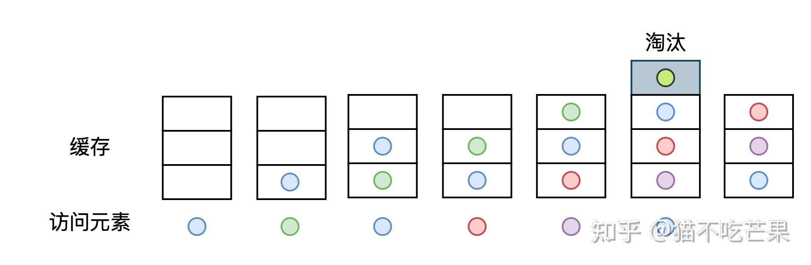
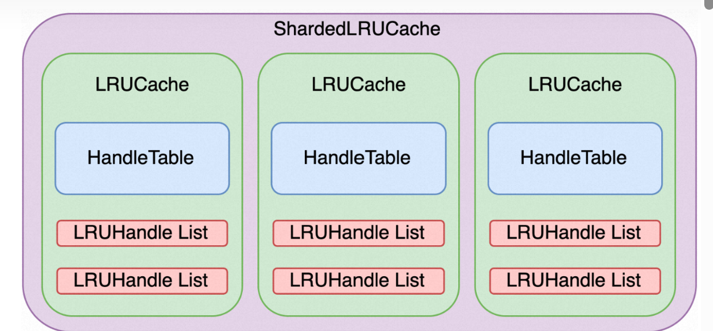

## ** Leveldb中的缓存机制**

这篇文章将讲解LevelDB缓存模块的相关内容，本文内容比较简单，读者只需按照顺序阅读即可。

leveldb中的缓存分为两种:

1. sstable的`table_cache_` (类`DBImpl` 中)
2. Block的`block_cache_` (可选，在`options` 中)

sstable的Cache就是缓存(Key:`file_number`    Value:`TableAndFile` )，其中`TableAndFile` 是关于sstable的元数据，记录的是sst在内存中的`table` 结构体信息和`RandomAccessFile` 的文件描述符的信息。所以`table_cache_` 缓存的不是sst文件的内容，而是sst文件的信息。

Block的Cache缓存(Key:table的cache_id和Block的offset拼接而成   Value：Block结构体)，所以`block_cache` 缓存的是真正的内容。

我们在LevelDB的源代码中分别看一下这两种Cache.


## **Table Cache**

首先我们从`Version::Get`方法出发，这里调用了一个`table_cache_` 的Get方法，这个Get方法会调用`FindTable` 的函数。

``` 
state->s = state->vset->table_cache_->Get(*state->options, f->number,
                                                f->file_size, state->ikey,
                                                &state->saver, SaveValue);
```

```c
Status TableCache::Get(const ReadOptions& options, uint64_t file_number,
                       uint64_t file_size, const Slice& k, void* arg,
                       void (*handle_result)(void*, const Slice&,
                                             const Slice&)) {
  Cache::Handle* handle = nullptr;
  Status s = FindTable(file_number, file_size, &handle);
  if (s.ok()) {
    Table* t = reinterpret_cast<TableAndFile*>(cache_->Value(handle))->table;
    s = t->InternalGet(options, k, arg, handle_result);
    cache_->Release(handle);
  }
  return s;
}
```

我们再来看一下这个`FindTable` 函数里面是什么：

这里面，首先会在`cache_` 里面寻找是否存在这个`file_number` 的缓存信息。如果不存在，那么就要新建一个`TableAndFile` ，把(`file_number` ，`TableAndFile`)插入进`table_cache_` 的缓存中。这样下次命中的时候，就可以利用缓存知道sst的元数据信息，不需要重新解析sstable文件了。

```c
Status TableCache::FindTable(uint64_t file_number, uint64_t file_size,
                             Cache::Handle** handle) {
  Status s;
  char buf[sizeof(file_number)];
  EncodeFixed64(buf, file_number);
  Slice key(buf, sizeof(buf));
  *handle = cache_->Lookup(key);
  if (*handle == nullptr) {
    std::string fname = TableFileName(dbname_, file_number);
    RandomAccessFile* file = nullptr;
    Table* table = nullptr;
    s = env_->NewRandomAccessFile(fname, &file);
    if (!s.ok()) {
      std::string old_fname = SSTTableFileName(dbname_, file_number);
      if (env_->NewRandomAccessFile(old_fname, &file).ok()) {
        s = Status::OK();
      }
    }
    if (s.ok()) {
      s = Table::Open(options_, file, file_size, &table);
    }

    if (!s.ok()) {
      assert(table == nullptr);
      delete file;
      // We do not cache error results so that if the error is transient,
      // or somebody repairs the file, we recover automatically.
    } else {
      TableAndFile* tf = new TableAndFile;
      tf->file = file;
      tf->table = table;
      *handle = cache_->Insert(key, tf, 1, &DeleteEntry);
    }
  }
  return s;
}
```


## **Block Cache**

同样是`TableCache::Get` 函数，里面有这样一个函数`s = t->InternalGet(options, k, arg, handle_result);` `InternalGet` 中又调用了`BlockReader` 函数：

```c
    BlockContents contents;
    if (block_cache != nullptr) {
      char cache_key_buffer[16];
      EncodeFixed64(cache_key_buffer, table->rep_->cache_id);
      EncodeFixed64(cache_key_buffer + 8, handle.offset());
      Slice key(cache_key_buffer, sizeof(cache_key_buffer));
      cache_handle = block_cache->Lookup(key);
      if (cache_handle != nullptr) {
        block = reinterpret_cast<Block*>(block_cache->Value(cache_handle));
      } else {
        s = ReadBlock(table->rep_->file, options, handle, &contents);
        if (s.ok()) {
          block = new Block(contents);
          if (contents.cachable && options.fill_cache) {
            cache_handle = block_cache->Insert(key, block, block->size(),
                                               &DeleteCachedBlock);
          }
        }
      }
    } else {
      s = ReadBlock(table->rep_->file, options, handle, &contents);
      if (s.ok()) {
        block = new Block(contents);
      }
    }
```

`BlockReader` 函数会判断`options` 里面是否开起来block层级的缓存，如果开起来，它就会把sst的cache_id(构建sst的时候单独递增的一个成员)和block的offset作为Key，把Block作为Value插入到缓存中。


## **LRU缓存的实现**

LRU（Least recently used）是一种资源淘汰策略，中文解释为最近最少使用，通俗理解就是**当缓存容量达到阈值时，淘汰掉缓存中最长时间没有被访问的资源**。



下图展示了LevelDB中缓存模块的结构，最外层ShardedLRUCache由多个LRUCache组成，LRUCache是一个LRU缓存单元，它由一个哈希表HandleTable和两个双向环形链表LRUHandle List组成。



下面我们从内至外剖析上述缓存模块的各个单元。


### **LRUHandle**

LRUHandle是LRU缓存中的基本数据单元，存储了数据的基本信息。LRUHandle中的键存储(`key_dada` )的是文件序号，与SSTable文件对象一一对应，引用计数refs表示节点被引用数，初使时为1，表示被缓存引用，用户访问节点时refs加1，释放时refs减1，当节点被缓存淘汰且无用户引用时将被销毁。其余属性含义请看下列注释。

```c
struct LRUHandle {
  void* value; //缓存数据
  void (*deleter)(const Slice&, void* value); //缓存数据析构器
  LRUHandle* next_hash; //后继节点指针，哈希表中使用
  LRUHandle* next; //后继节点，双向环形链表中使用
  LRUHandle* prev; //前序节点，双向环形链表中使用
  size_t charge;  //占用的存储容量，一般设置为1
  size_t key_length; //键长
  bool in_cache;     // 标识节点是否被缓存引用
  uint32_t refs;     // 引用计数
  uint32_t hash;     // 键的哈希值，哈希表中计算哈希桶
  char key_data[1];  // 键值，动态内存分配
};
```

LRUHandle List就是以LRUHandle为节点的双向环形链表。


###  **HandleTable**

HandleTable是链表存储式的哈希表，其存储节点为LRUHandle。每次节点查询时先根据目标键的哈希值找到对应的哈希桶，再沿着哈希桶中的链表查找目标哈希值的节点。

```c
LRUHandle** FindPointer(const Slice& key, uint32_t hash) {
    //找到哈希桶
    LRUHandle** ptr = &list_[hash & (length_ - 1)];
    //链表遍历
    while (*ptr != nullptr && ((*ptr)->hash != hash || key != (*ptr)->key())) {
      ptr = &(*ptr)->next_hash;
    }
    return ptr;
}
```

HandleTable的**装填因子为1**，当存储的数据量大于哈表表长度时就会进行扩容。

```c
void Resize() {
    uint32_t new_length = 4;
    //2倍扩容
    while (new_length < elems_) {
      new_length *= 2;
    }
    
    //构造新容量的哈希表
    LRUHandle** new_list = new LRUHandle*[new_length];
    memset(new_list, 0, sizeof(new_list[0]) * new_length);
    uint32_t count = 0;

    //将原哈希表中数据分配到新的哈希桶中
    for (uint32_t i = 0; i < length_; i++) {
      LRUHandle* h = list_[i];
      while (h != nullptr) {
        LRUHandle* next = h->next_hash;
        uint32_t hash = h->hash;
        LRUHandle** ptr = &new_list[hash & (new_length - 1)]; //重新分配哈希桶
        h->next_hash = *ptr; //头插
        *ptr = h;
        h = next;
        count++;
      }
    }
        
    delete[] list_;
    list_ = new_list;
    length_ = new_length;
  }
};
```


### **LRUCache**

LRUCache由一个哈希表和两个双向环形链表组成，是对LRU资源淘汰机制的实现。

```c
class LRUCache {
  // 总容量
  size_t capacity_;
  // 互斥锁
  mutable port::Mutex mutex_;
  // 已使用容量
  size_t usage_ GUARDED_BY(mutex_);
  //未使用节点环形链表，
  LRUHandle lru_ GUARDED_BY(mutex_);
  //正在被引用的节点环形链表
  LRUHandle in_use_ GUARDED_BY(mutex_);
  //哈希表，存储所有缓存节点
  HandleTable table_ GUARDED_BY(mutex_);
};
```

LRUCache中哈希表table_用于存储了所有缓存数据，这些缓存数据被两个双向环形链表分为正在被访问的缓存数据（in_use_）和未被访问的缓存数据（lru_），当缓存容量满后lru_中数据可能会被淘汰。lru_和in_use_都有一个**空的头节点**，越靠近头节点的元素越早被添加进链表中，所以当需要淘汰lru_中的数据时，靠近头节点的元素将优先被淘汰掉。

- **（1）缓存数据的插入**

数据查询时，若缓存数据未命中，从原始数据中获取的数据将被插入缓存中，此时这个数据是被用户引用的，所以初始化数据节点LRUHandle时引用计数为1，随后将节点插入哈希表table_和使用链表in_use_中。若新数据插入后缓存空间已满，将从in_use_中**移除溢出的数据**，因为越靠近头节点的元素越早添加进链表中，**对于in_use_链表而言就是越靠近头节点的数据越长时间没有被使用到**，因此将从头节点开始遍历后继节点将**溢出部分**的数据节点移除。

```c
//哈希表 + 两个双向环形链表
Cache::Handle* LRUCache::Insert(const Slice& key, uint32_t hash, void* value,
                                size_t charge,
                                void (*deleter)(const Slice& key,
                                                void* value)) {
  MutexLock l(&mutex_);
//初始化LRUHandle节点
  LRUHandle* e =
      reinterpret_cast<LRUHandle*>(malloc(sizeof(LRUHandle) - 1 + key.size()));
  e->value = value;
  e->deleter = deleter;
  e->charge = charge;
  e->key_length = key.size();
  e->hash = hash;
  e->in_cache = false;
  e->refs = 1; //通过insert接口插入的缓存节点肯定是当前正在被使用的，初始化引用计数为1
  std::memcpy(e->key_data, key.data(), key.size()); //internal key

  if (capacity_ > 0) {
    e->refs++;  // 被缓存引用，当refs为0时表示被缓存淘汰了
    e->in_cache = true; 
    LRU_Append(&in_use_, e); //插入in_use_链表中
    usage_ += charge;
    FinishErase(table_.Insert(e));
  } else {  
    // capacity_ < 0说明不需要缓存
    e->next = nullptr;
  }
   // 当缓存数据量超出容量时，根据 LRU 策略将未被引用的数据中溢出部分淘汰
  while (usage_ > capacity_ && lru_.next != &lru_) {
    LRUHandle* old = lru_.next;
    assert(old->refs == 1);
    bool erased = FinishErase(table_.Remove(old->key(), old->hash)); //资源淘汰
    if (!erased) {  // to avoid unused variable when compiled NDEBUG
      assert(erased);
    }
  }

  return reinterpret_cast<Cache::Handle*>(e);
}
```

- **（2）缓存数据淘汰**

缓存数据淘汰时依次从哈希表和链表中将数据移除，缓存中不再持有该数据，数据节点引用计数减1，此时节点可能存在两种状态：

- 该节点未被用户引用，引用计数为0，节点将被销毁
- 该节点正在被用户引用，引用计数不为0，节点等待用户释放后再进行销毁

```c
//哈希表中移除节点
bool erased = FinishErase(table_.Remove(old->key(), old->hash));

bool LRUCache::FinishErase(LRUHandle* e) {
  if (e != nullptr) {
    LRU_Remove(e); //链表中移除节点
    e->in_cache = false;
    usage_ -= e->charge;
    Unref(e); //引用计数减1，但此时资源不一定被销毁
  }
  return e != nullptr;
}
```

- **(3）缓存数据节点引用与释放**

当用户从缓存中查询数据时，将从哈希表中查询出对应数据节点，若命中则该节点可能存在以下两种状态：

- 该节点未被其他用户引用，此时节点引用计数为1，节点添加至使用链表in_use_中，引用计数加1
- 该节点正在被其他用户引用，此时节点引用计数大于1，说明节点已经在使用链表in_use_中了，只需要将引用计数加1即可

```c
Cache::Handle* LRUCache::Lookup(const Slice& key, uint32_t hash) {
  MutexLock l(&mutex_);
  LRUHandle* e = table_.Lookup(key, hash);
  if (e != nullptr) {
    Ref(e);
  }
  return reinterpret_cast<Cache::Handle*>(e);
}

void LRUCache::Ref(LRUHandle* e) {
  if (e->refs == 1 && e->in_cache) {  
    LRU_Remove(e);
    LRU_Append(&in_use_, e);
  }
  e->refs++;
}
```

当用户进行节点释放后，引用计数减1，此时节点可能存在以下几种状态：

- 该节点已经被缓存淘汰，用户释放后节点引用计数为0，在淘汰时节点已经从哈希表和相应链表中移除了，此时只需要进行节点销毁
- 该节点已经被缓存淘汰，但是正在被其他用户引用，引用计数仍然大于0，不做任何处理，当所有用户都释放后将命中上一条状态
- 该节点未被淘汰，且没有被其他用户引用，此时引用计数为1（缓存引用），节点将从使用链表in_use_中移除并添加至未使用链表lru_中
- 该节点未被淘汰，但是正在被其他用户引用，此时引用计数大于1，不做任何处理


### **ShardedLRUCache**

ShardedLRUCache中包含多个LRUCache，它的主要功能是将缓存数据通过哈希分片存储到不同的LRU缓存模块中。哈希分片经常用于集群系统的横向扩容场景，这里主要为了避免将缓存数据存储在一个缓存模块中以降低资源竞态，提高数据访问的并发度。

```c
//分片数 1 << 4
static const int kNumShardBits = 4;
static const int kNumShards = 1 << kNumShardBits;

class ShardedLRUCache : public Cache {
private:
	LRUCache shard_[kNumShards];
    //取出哈希值的前4位进行分片
	static uint32_t Shard(uint32_t hash) { return hash >> (32 - kNumShardBits); }
public:
    Handle* Insert(const Slice& key, void* value, size_t charge,
                     void (*deleter)(const Slice& key, void* value)) override {
        //计算哈希值
        const uint32_t hash = HashSlice(key);
        //根据分片找到对应的LRUCache
        return shard_[Shard(hash)].Insert(key, hash, value, charge, deleter);
    }
}
```

