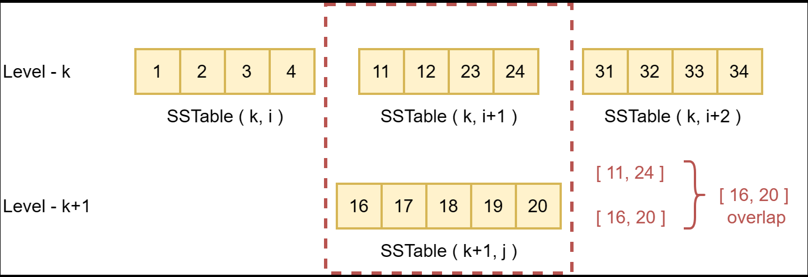

## **Compaction 的作用**

因为 LevelDB 的增删改都是通过追加写来实现的，所以需要通过后台线程的 compaction 来：

1. 清理过期（旧版本或者已删除）的数据。
2. 维护数据的有序性。


## **Compaction 的触发**

除了从外部调用 CompactRange，LevelDB 有几种情况会自动触发 compaction：

1. 当 MemTable 的大小达到阈值时，进行 MemTable 切换，然后需要将 Immutable MemTable 刷到外存上 —— 一般称之为 Minor Compaction。

2. 当 level-n 的 SSTable 超过限制，level-n 和 level-n+1 的 SSTable 会进行 compaction —— 一般称之为 Major Compaction。

3. 1. level-0 是通过 SSTable 的数量来判断是否需要 compaction。
   2. level-n(n > 0) 是通过 SSTable 的大小来判断是否需要 compaction。

- level0中的sst文件之间可能会存在key的重叠，但level大于0的sst文件之间的key是不存在重叠的。

- 每次版本更新后，都会调用`Finalize()` 函数计算各level的分数，分数大于1的会发生compaction。


算分的`Finalize()` 函数非常简单，但对于level0的算分就有一点特殊，它是以文件的个数作为标准，而其他level的算分都是以文件的总字节数除以阈值作为参考。

```c
void VersionSet::Finalize(Version* v) {
  // Precomputed best level for next compaction
  int best_level = -1;
  double best_score = -1;

  for (int level = 0; level < config::kNumLevels - 1; level++) {
    double score;
    if (level == 0) {
      score = v->files_[level].size() /
              static_cast<double>(config::kL0_CompactionTrigger);
    } else {
      // Compute the ratio of current size to size limit.
      const uint64_t level_bytes = TotalFileSize(v->files_[level]);
      score =
          static_cast<double>(level_bytes) / MaxBytesForLevel(options_, level);
    }

    if (score > best_score) {
      best_level = level;
      best_score = score;
    }
  }

  v->compaction_level_ = best_level;
  v->compaction_score_ = best_score;
}   
```


## **Minor Compaction**

Minor Compaction在MemTable大小超过限制时（默认为4MB）触发，LevelDB在写入变更前，首先会通过`DBImpl::MakeRoomForWrite`方法来在MemTable过大时将其转为Immutable MemTable，在该方法中，我们也能够找到尝试触发Compcation调度的调用。这里我们完整地看一下。

```c
// REQUIRES: mutex_ is held
// REQUIRES: this thread is currently at the front of the writer queue
Status DBImpl::MakeRoomForWrite(bool force) {
  mutex_.AssertHeld();
  assert(!writers_.empty());
  bool allow_delay = !force;
  Status s;
  while (true) {
    if (!bg_error_.ok()) {
      // Yield previous error
      s = bg_error_;
      break;
    } else if (allow_delay && versions_->NumLevelFiles(0) >=
                                  config::kL0_SlowdownWritesTrigger) {
      mutex_.Unlock();
      env_->SleepForMicroseconds(1000);
      allow_delay = false;  // Do not delay a single write more than once
      mutex_.Lock();
    } else if (!force &&
               (mem_->ApproximateMemoryUsage() <= options_.write_buffer_size)) {
      // There is room in current memtable
      break;
    } else if (imm_ != nullptr) {
      // We have filled up the current memtable, but the previous
      // one is still being compacted, so we wait.
      Log(options_.info_log, "Current memtable full; waiting...\n");
      background_work_finished_signal_.Wait();
    } else if (versions_->NumLevelFiles(0) >= config::kL0_StopWritesTrigger) {
      // There are too many level-0 files.
      Log(options_.info_log, "Too many L0 files; waiting...\n");
      background_work_finished_signal_.Wait();
    } else {
      // Attempt to switch to a new memtable and trigger compaction of old
      assert(versions_->PrevLogNumber() == 0);
      uint64_t new_log_number = versions_->NewFileNumber();
      WritableFile* lfile = nullptr;
      s = env_->NewWritableFile(LogFileName(dbname_, new_log_number), &lfile);
      if (!s.ok()) {
        // Avoid chewing through file number space in a tight loop.
        versions_->ReuseFileNumber(new_log_number);
        break;
      }
      delete log_;
      delete logfile_;
      logfile_ = lfile;
      logfile_number_ = new_log_number;
      log_ = new log::Writer(lfile);
      imm_ = mem_;
      has_imm_.store(true, std::memory_order_release);
      mem_ = new MemTable(internal_comparator_);
      mem_->Ref();
      force = false;  // Do not force another compaction if have room
      MaybeScheduleCompaction();
    }
  }
  return s;
}

```

1. 如果当前level-0中的SSTable数即将超过最大限制（默认为8，而当level-0的SSTable数达到4时即可触发Minor Compaction），这可能是写入过快导致的。此时会开启流控，将每条写入都推迟1ms，以给Minor Compaction留出时间。如果调用该方法时参数`force`为true，则不会触发流控。
2. 如果`force`为false且MemTable估算的大小没有超过限制（默认为4MB），则直接退出，不需要进行Minor Compaction。
3. 如果此时有未完成Minor Compaction的Immutable MemTable，此时循环等待Minor Compaction执行完成再执行。
4. 如果当前level-0层的SSTable数过多（默认为8），此时循环等待level-0层SSTable数低于该上限，以避免level-0层SSTable过多

`DBImpl::MakeRoomForWrite`方法在判断是否需要进行Minor Compaction时，LevelDB通过流控与等待的方式，避免level-0层SSTable数过多。这是因为level-0层的key之间是有重叠的，因此当查询level-0层SSTable时，需要查找level-0层的所有SSTable。如果level-0层SSTable太多，会严重拖慢查询效率。


## **Size Compaction**

对于Size Compaction，level-i层的SSTable输入根据该level的Compaction Pointer（记录在Version中），选取上次Compaction后的第一个SSTable（如果该层还没发生过Compaction）。这是为了尽可能公平地为Size Compaction选取SSTable，避免某些SSTable永远不会被Compact。

Size Compaction在非level-0层是根据该层的总SSTable大小触发的，而在level-0层是根据该层SSTable数触发的。也就是说，只有发生了Compaction，才有可能触发Size Compaction。因为Compaction的执行会导致Version的更新，因此LevelDB在`VersionSet::LogAndApply`方法更新Version后，让其调用`VersionSet::Finalize`方法来计算每层SSTable是否需要Size Compaction，并选出最需要进行Size Compaction的层作为下次Size Compaction的目标。


## **Seek Compaction**

在介绍Seek Compaction触发条件前，我们先来看为什么需要Seek Compaction。

在LSM-Tree中，除了level-0外，虽然每个level的SSTable间相互没有overlap，但是level与level间的SSTable是可以有overlap的，如下图中的实例所示。



在本例中，如果查找键`18`时在level-k前都没有命中，则查询会下推到level-k。在level-k层中，因为SSTable(k, i + 1)的key范围覆盖了`18`，LevelDB会在该SSTable中查找是否存在要查找的key `18`（实际上查找的是该SSTable在TableCache中的filter），该操作被称为“seek”。当LevelDB在level-k中没有找到要查找的key时，才会继续在level-(k+1)中查找。


在上图的示例中，每当LevelDB要查找key `18`时，因为SSTable(k, i)的key范围覆盖了`18`，所以其每次都必须在该SSTable中seek，这一不必要的seek操作会导致性能下降。因此，在FileMetaData结构体中引入了`allowed_seeks`字段，该字段初始为文件大小与16KB的比值，不足100则取100；每次无效seek发生时LevelDB都会将该字段值减1。当某SSTable的`allowed_seeks`减为0时，会触发seek compaction，该SSTable会与下层部分SSTable合并。合并后的SSTable如下图所示。


